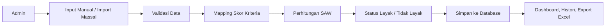

# Sistem Klasifikasi Bansos Berbasis Metode SAW

Proyek ini adalah aplikasi web untuk membantu proses penilaian kelayakan penerima bantuan sosial di Kecamatan Pondok Aren. Sistem dibangun untuk mengurangi penilaian manual yang cenderung lambat dan subjektif, lalu menggantinya dengan proses yang lebih terstruktur, terukur, dan terdokumentasi menggunakan metode `SAW (Simple Additive Weighting)`.

Aplikasi ini dikembangkan sebagai proyek kerja praktek dengan fokus pada:

- digitalisasi proses seleksi calon penerima bansos
- perhitungan kelayakan yang lebih objektif
- pengelolaan histori data yang rapi
- pelaporan hasil klasifikasi yang mudah dicari dan diekspor

## Gambaran Proyek

Dalam proses manual, petugas biasanya harus memeriksa data warga satu per satu, membandingkan kondisi ekonomi dan sosial, lalu menyimpulkan kelayakan secara subjektif. Sistem ini mengubah proses tersebut menjadi alur berbasis data:

1. Admin memasukkan data warga secara manual atau import massal.
2. Sistem membaca nilai setiap kriteria.
3. Metode SAW menghitung skor preferensi akhir.
4. Sistem menetapkan status `Layak` atau `Tidak Layak`.
5. Hasil disimpan ke histori dan dapat diedit, dicari, difilter, atau diekspor.

## Tujuan Sistem

- Membantu admin kecamatan melakukan klasifikasi penerima bansos secara lebih konsisten.
- Menyediakan dasar keputusan yang lebih transparan melalui kriteria, bobot, dan skor.
- Mempermudah pengelolaan data warga dan histori klasifikasi.
- Menyediakan dashboard statistik untuk memantau hasil klasifikasi.

## Fitur Utama

- Login admin dengan pencatatan riwayat login.
- Dashboard statistik jumlah warga, status layak, status tidak layak, dan grafik per kelurahan.
- Klasifikasi data warga secara manual.
- Import data massal dari file `CSV`, `XLS`, atau `XLSX`.
- Perhitungan otomatis menggunakan metode SAW.
- Manajemen kriteria dan bobot penilaian.
- Manajemen sub-kriteria beserta skor masing-masing.
- Halaman informasi SPK untuk menjelaskan algoritma, kriteria, dan ambang batas.
- Manajemen histori hasil klasifikasi.
- Pencarian histori berdasarkan `NIK`, `Nama`, atau `Kelurahan`.
- Filter histori berdasarkan kelurahan.
- Edit data histori dan hitung ulang skor SAW.
- Override status hasil klasifikasi saat edit data.
- Hapus satu data atau hapus seluruh histori.
- Export hasil histori ke file Excel.
- Pengelolaan profil admin dan ganti password.

## Cakupan Penilaian

Sistem ini menggunakan daftar kelurahan di Kecamatan Pondok Aren sebagai acuan input wilayah:

- Pondok Aren
- Jurang Mangu Barat
- Jurang Mangu Timur
- Pondok Jaya
- Pondok Kacang Barat
- Pondok Kacang Timur
- Perigi Baru
- Perigi Lama
- Pondok Pucung
- Pondok Karya
- Pondok Betung

## Kriteria Penilaian SAW

Sistem menggunakan 7 kriteria utama. Nilai bobot awal disimpan di database saat inisialisasi aplikasi dan dapat dikelola kembali dari menu manajemen kriteria.

| Kode | Kriteria | Tipe | Bobot Awal |
|---|---|---|---|
| C1 | Penghasilan | Cost | 0.25 |
| C2 | Jumlah Tanggungan | Benefit | 0.20 |
| C3 | Kepemilikan Aset | Cost | 0.15 |
| C4 | Status Rumah | Cost | 0.10 |
| C5 | Kondisi Bangunan | Cost | 0.10 |
| C6 | Daya Listrik | Cost | 0.10 |
| C7 | Sumber Air | Cost | 0.10 |

Catatan implementasi:

- Kriteria bertipe `Cost` memakai pembalikan skor pada level sub-kriteria.
- Artinya, kondisi yang semakin membutuhkan diberi skor lebih tinggi.
- Karena itu, pada saat normalisasi sistem cukup memakai `nilai / max_skor` untuk semua kriteria.

## Cara Kerja Metode SAW di Sistem Ini

Metode `Simple Additive Weighting (SAW)` digunakan untuk menghasilkan skor akhir setiap warga berdasarkan kombinasi seluruh kriteria.

### 1. Pemberian skor sub-kriteria

Setiap pilihan pada kriteria memiliki skor numerik, umumnya dari `1` sampai `5`.

Contoh:

- Penghasilan sangat tinggi diberi skor rendah.
- Penghasilan sangat rendah atau tidak tetap diberi skor tinggi.
- Jumlah tanggungan semakin besar diberi skor semakin tinggi.

### 2. Normalisasi

Implementasi di aplikasi menghitung nilai normalisasi dengan rumus:

```text
r_ij = x_ij / max(x_j)
```

Keterangan:

- `x_ij` = skor warga pada kriteria ke-j
- `max(x_j)` = skor maksimum pada kriteria ke-j
- `r_ij` = nilai hasil normalisasi

Karena skor `Cost` sudah dibalik saat pendefinisian sub-kriteria, rumus normalisasi tidak dibedakan lagi antara `Cost` dan `Benefit`.

### 3. Perhitungan nilai preferensi

Setelah normalisasi, sistem menghitung skor akhir:

```text
V_i = sum(w_j * r_ij)
```

Keterangan:

- `V_i` = nilai preferensi akhir alternatif ke-i
- `w_j` = bobot kriteria ke-j
- `r_ij` = nilai normalisasi alternatif ke-i pada kriteria ke-j

### 4. Penentuan status kelayakan

Sistem membandingkan skor akhir dengan ambang batas:

- `Layak` jika `skor_saw >= 0.50`
- `Tidak Layak` jika `skor_saw < 0.50`

Ambang batas ini saat ini disimpan di `backend/config.py` melalui variabel `THRESHOLD_LAYAK`.

## Contoh Sederhana Perhitungan

Misalkan satu warga memiliki skor:

- C1 = 5
- C2 = 4
- C3 = 4
- C4 = 3
- C5 = 4
- C6 = 4
- C7 = 3

Jika skor maksimum tiap kriteria adalah `5`, maka:

```text
C1 = 5/5 = 1.00
C2 = 4/5 = 0.80
C3 = 4/5 = 0.80
C4 = 3/5 = 0.60
C5 = 4/5 = 0.80
C6 = 4/5 = 0.80
C7 = 3/5 = 0.60
```

Skor akhir:

```text
V = (1.00 x 0.25) + (0.80 x 0.20) + (0.80 x 0.15) + (0.60 x 0.10) + (0.80 x 0.10) + (0.80 x 0.10) + (0.60 x 0.10)
V = 0.81
```

Karena `0.81 >= 0.50`, maka hasilnya `Layak`.

## Alur Sistem



## Arsitektur Singkat

Proyek ini menggunakan pendekatan aplikasi web monolitik:

- `Flask` sebagai backend dan routing utama
- `SQLAlchemy` sebagai ORM database
- `SQLite` sebagai database default lokal
- `HTML + Tailwind CSS + JavaScript` untuk antarmuka admin
- `Pandas` untuk proses import dan export data Excel/CSV

Struktur folder utama:

- `backend/` berisi aplikasi Flask, model database, konfigurasi, dan logika SAW
- `frontend/` berisi template HTML, CSS, JavaScript, dan aset tampilan
- `docs/` berisi dokumentasi metodologi proyek
- `uploads/` berisi file unggahan saat aplikasi berjalan

## Modul Penting

- [backend/app.py](backend/app.py)
  Menangani routing, autentikasi, CRUD data, import/export, dashboard, dan histori.

- [backend/spk.py](backend/spk.py)
  Berisi logika inti perhitungan SAW, penentuan kelayakan, dan pembuatan alasan hasil.

- [backend/config.py](backend/config.py)
  Menyimpan konfigurasi aplikasi, ambang batas, daftar kelurahan, dan opsi form.

- [frontend/templates/](frontend/templates/)
  Berisi halaman login, dashboard, klasifikasi, kriteria, informasi, histori, profil, dan lain-lain.

- [frontend/static/js/main.js](frontend/static/js/main.js)
  Menangani interaksi frontend seperti sidebar, chart, drag-and-drop upload, pencarian, dan histori AJAX.

## Halaman dalam Aplikasi

### 1. Login

Admin masuk ke sistem menggunakan akun yang tersimpan di database.

### 2. Dashboard

Menampilkan ringkasan data:

- total data warga
- jumlah status layak
- jumlah status tidak layak
- grafik distribusi status
- grafik jumlah data per kelurahan

### 3. Klasifikasi Data

Terdiri dari dua mode:

- input manual untuk satu data warga
- import massal untuk banyak data sekaligus

### 4. Informasi SPK

Menjelaskan konsep SAW, daftar kriteria, jenis kriteria, bobot, dan ambang batas kelayakan.

### 5. Manajemen Kriteria

Admin dapat:

- menambah kriteria
- mengubah bobot
- mengedit nama atau tipe kriteria
- menghapus kriteria
- mengelola sub-kriteria

### 6. Manajemen Histori

Admin dapat:

- melihat seluruh hasil klasifikasi
- mencari data berdasarkan NIK, nama, atau kelurahan
- memfilter data per kelurahan
- mengedit data dan menghitung ulang SAW
- menghapus data
- menghapus seluruh histori
- export ke Excel

## Teknologi yang Digunakan

- Python
- Flask
- Flask-SQLAlchemy
- SQLite
- Pandas
- OpenPyXL
- HTML
- Tailwind CSS
- JavaScript
- Chart.js

## Menjalankan Proyek Secara Lokal

### 1. Instal dependensi

```bash
pip install -r requirements.txt
```

### 2. Siapkan file environment

Gunakan `.env` lokal. Jika belum ada, salin dari `.env.example` lalu sesuaikan nilainya.

Contoh isi:

```env
SPK_SECRET_KEY=ganti-dengan-secret-random
SPK_DEFAULT_ADMIN_USERNAME=admin
SPK_DEFAULT_ADMIN_PASSWORD=password-admin-awal
FLASK_DEBUG=0
```

Jika `DATABASE_URL` tidak diisi, aplikasi otomatis memakai `SQLite` lokal.

### 3. Jalankan aplikasi

```bash
cd backend
python app.py
```

### 4. Akses dari browser

```text
http://127.0.0.1:5000
```

## Keunggulan Sistem

- Perhitungan lebih objektif dibanding penilaian manual.
- Data tersimpan terpusat dan mudah ditelusuri kembali.
- Mendukung pengolahan data satuan maupun batch.
- Memiliki histori keputusan yang bisa diedit dan diaudit.
- Mendukung export hasil untuk kebutuhan laporan.
- Struktur kriteria cukup fleksibel karena disimpan di database.

## Keterbatasan Saat Ini

- Sistem masih berfokus pada penggunaan admin internal, belum multi-role.
- Database default masih `SQLite`, sehingga untuk skala besar sebaiknya diganti ke database server.
- Hasil klasifikasi sangat bergantung pada kualitas input data dan bobot kriteria.
- Belum ada workflow persetujuan berlapis atau audit trail keputusan yang kompleks.

## Keamanan Repository

Repository ini sudah dipisahkan dari file sensitif. Hal-hal berikut sebaiknya tetap tidak ikut diunggah ke repo publik:

- `.env`
- folder database lokal
- folder upload runtime
- file data pribadi warga

Jika repository akan dipublikasikan, pastikan seluruh data riil warga tidak ikut terunggah.

## Dokumentasi Tambahan

- [docs/METODOLOGI_FINAL_LENGKAP.md](docs/METODOLOGI_FINAL_LENGKAP.md)
- [pythonanywhere_wsgi.py](pythonanywhere_wsgi.py)

## Ringkasan

Sistem ini dirancang untuk membantu proses seleksi bansos menjadi lebih cepat, terdokumentasi, dan terukur. Dengan metode SAW, keputusan tidak hanya berdasarkan intuisi, tetapi berdasarkan skor terstruktur dari beberapa kriteria sosial-ekonomi yang relevan.
