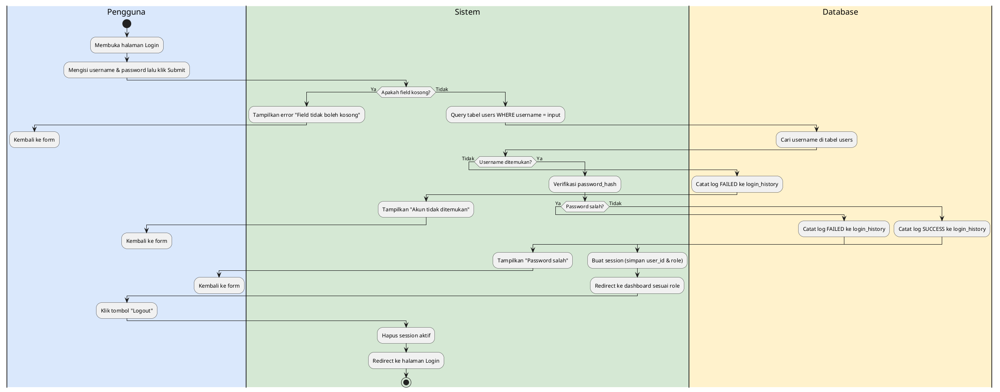
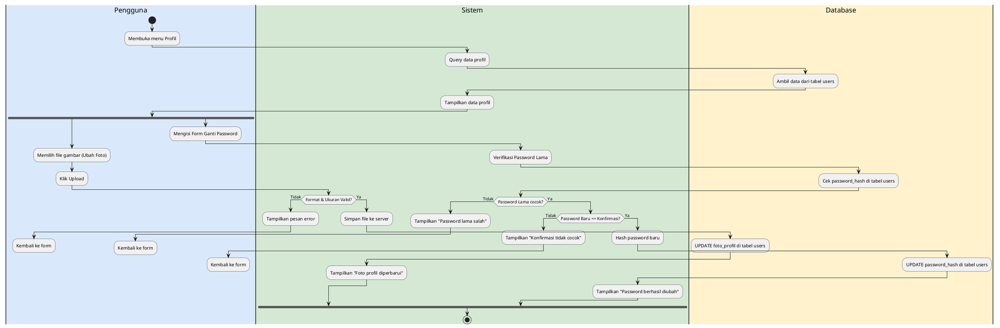
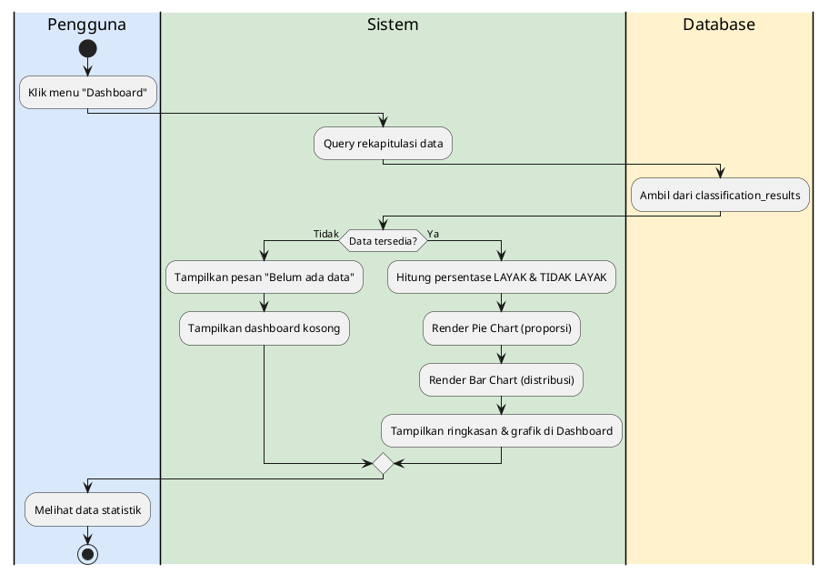
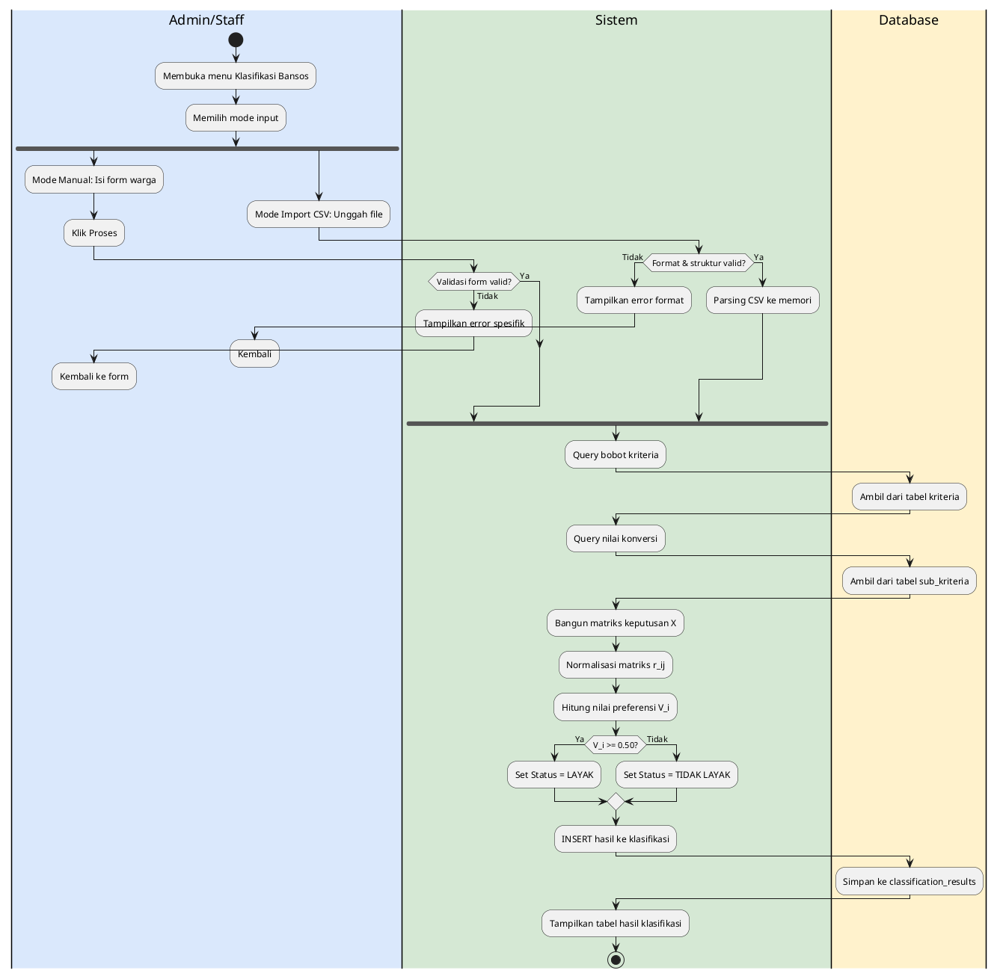
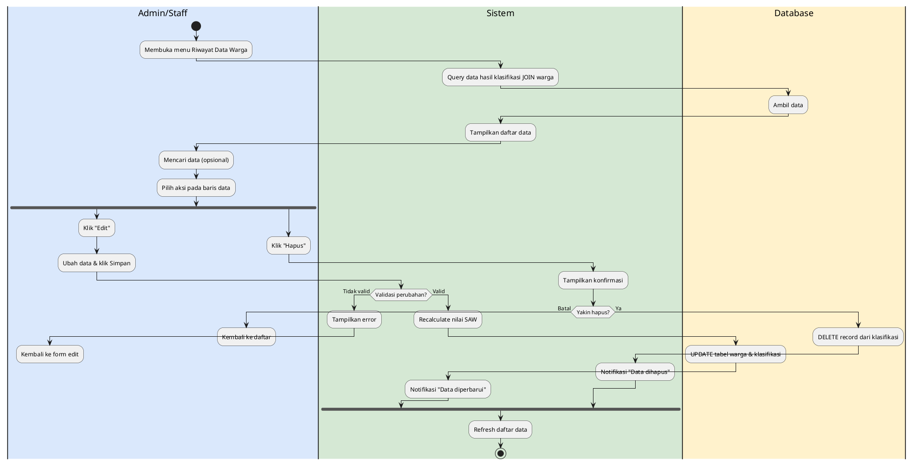
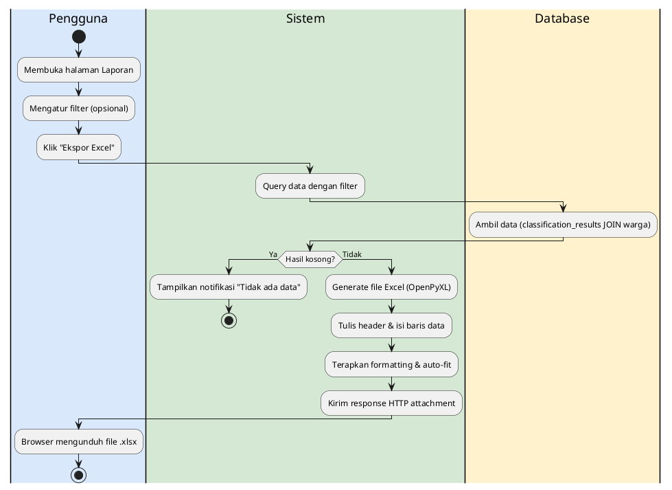
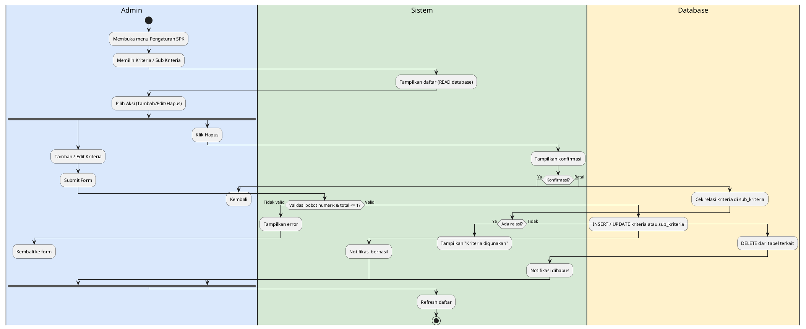
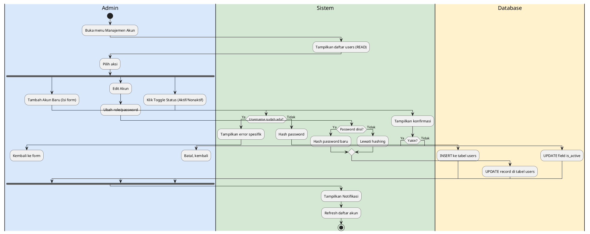

### ALUR 1 — Autentikasi (Login & Logout)

**Narasi:**
Proses autentikasi dimulai ketika pengguna (Admin, Staff, atau Camat) membuka halaman Login. Pengguna kemudian mengisi username dan password pada form yang disediakan lalu menekan tombol Submit. Sistem pertama-tama akan melakukan validasi untuk memastikan tidak ada field yang kosong; jika ada yang kosong, sistem akan menampilkan pesan error dan mengembalikan pengguna ke form. Selanjutnya, sistem melakukan pencarian pada tabel `users` di database berdasarkan username. Jika username tidak ditemukan, sistem mencatat status FAILED pada tabel `login_history` dan menampilkan pesan "Akun tidak ditemukan". Jika username ditemukan, sistem memverifikasi kesesuaian `password_hash`. Apabila password salah, kegagalan dicatat kembali ke `login_history` beserta pesan "Password salah". Jika berhasil, sistem mencatat status SUCCESS, membuat session aktif yang menyimpan ID dan role pengguna, kemudian mengarahkan pengguna ke halaman dashboard yang sesuai dengan rolenya (Admin, Staff, atau Camat). Saat pengguna ingin keluar, mereka mengklik tombol Logout, yang memicu sistem untuk menghapus session aktif dan mengembalikan pengguna ke halaman Login.

**Format A — PlantUML:**


**Format B — XML draw.io:**
```xml
<mxGraphModel dx="1422" dy="762" grid="1" gridSize="10" guides="1" tooltips="1" connect="1" arrows="1" fold="1" page="1" pageScale="1" pageWidth="1654" pageHeight="1169" math="0" shadow="0">
  <root>
    <mxCell id="0"/>
    <mxCell id="1" parent="0"/>
    <mxCell id="A1_container" value="" style="swimlane;startSize=0;childLayout=stackLayout;horizontal=1;horizontalStack=1;resizeParent=1;resizeParentMax=0;resizeLast=0;collapsible=0;marginBottom=0;" vertex="1" parent="1">
      <mxGeometry x="0" y="0" width="780" height="2000" as="geometry"/>
    </mxCell>
    <mxCell id="A1_col1" value="Pengguna/Aktor" style="swimlane;whiteSpace=wrap;html=1;" vertex="1" parent="A1_container">
      <mxGeometry x="0" y="0" width="260" height="2000" as="geometry"/>
    </mxCell>
    <mxCell id="A1_col2" value="Sistem" style="swimlane;whiteSpace=wrap;html=1;" vertex="1" parent="A1_container">
      <mxGeometry x="260" y="0" width="260" height="2000" as="geometry"/>
    </mxCell>
    <mxCell id="A1_col3" value="Database" style="swimlane;whiteSpace=wrap;html=1;" vertex="1" parent="A1_container">
      <mxGeometry x="520" y="0" width="260" height="2000" as="geometry"/>
    </mxCell>
    <mxCell id="A1_start" value="" style="ellipse;aspect=fixed;fillColor=#000000;strokeColor=#000000;" vertex="1" parent="A1_col1">
      <mxGeometry x="115" y="100" width="30" height="30" as="geometry"/>
    </mxCell>
    <mxCell id="A1_a1" value="Membuka halaman Login" style="rounded=1;whiteSpace=wrap;html=1;arcSize=50;" vertex="1" parent="A1_col1">
      <mxGeometry x="40" y="200" width="180" height="50" as="geometry"/>
    </mxCell>
    <mxCell id="A1_a2" value="Mengisi username &amp; password
klik Submit" style="rounded=1;whiteSpace=wrap;html=1;arcSize=50;" vertex="1" parent="A1_col1">
      <mxGeometry x="40" y="300" width="180" height="50" as="geometry"/>
    </mxCell>
    <mxCell id="A1_d1" value="Field
kosong?" style="rhombus;whiteSpace=wrap;html=1;" vertex="1" parent="A1_col2">
      <mxGeometry x="90" y="400" width="80" height="80" as="geometry"/>
    </mxCell>
    <mxCell id="A1_a3" value="Tampilkan error" style="rounded=1;whiteSpace=wrap;html=1;arcSize=50;" vertex="1" parent="A1_col2">
      <mxGeometry x="40" y="500" width="180" height="50" as="geometry"/>
    </mxCell>
    <mxCell id="A1_a4" value="Query tabel users" style="rounded=1;whiteSpace=wrap;html=1;arcSize=50;" vertex="1" parent="A1_col2">
      <mxGeometry x="40" y="600" width="180" height="50" as="geometry"/>
    </mxCell>
    <mxCell id="A1_a5" value="Cari username" style="rounded=1;whiteSpace=wrap;html=1;arcSize=50;" vertex="1" parent="A1_col3">
      <mxGeometry x="40" y="700" width="180" height="50" as="geometry"/>
    </mxCell>
    <mxCell id="A1_d2" value="Ditemukan?" style="rhombus;whiteSpace=wrap;html=1;" vertex="1" parent="A1_col2">
      <mxGeometry x="90" y="800" width="80" height="80" as="geometry"/>
    </mxCell>
    <mxCell id="A1_a6" value="Catat log FAILED" style="rounded=1;whiteSpace=wrap;html=1;arcSize=50;" vertex="1" parent="A1_col3">
      <mxGeometry x="40" y="900" width="180" height="50" as="geometry"/>
    </mxCell>
    <mxCell id="A1_a7" value="Tampilkan Akun tidak ditemukan" style="rounded=1;whiteSpace=wrap;html=1;arcSize=50;" vertex="1" parent="A1_col2">
      <mxGeometry x="40" y="1000" width="180" height="50" as="geometry"/>
    </mxCell>
    <mxCell id="A1_a8" value="Verifikasi password_hash" style="rounded=1;whiteSpace=wrap;html=1;arcSize=50;" vertex="1" parent="A1_col2">
      <mxGeometry x="40" y="1100" width="180" height="50" as="geometry"/>
    </mxCell>
    <mxCell id="A1_d3" value="Password
salah?" style="rhombus;whiteSpace=wrap;html=1;" vertex="1" parent="A1_col2">
      <mxGeometry x="90" y="1200" width="80" height="80" as="geometry"/>
    </mxCell>
    <mxCell id="A1_a9" value="Catat log FAILED" style="rounded=1;whiteSpace=wrap;html=1;arcSize=50;" vertex="1" parent="A1_col3">
      <mxGeometry x="40" y="1300" width="180" height="50" as="geometry"/>
    </mxCell>
    <mxCell id="A1_a10" value="Tampilkan Password salah" style="rounded=1;whiteSpace=wrap;html=1;arcSize=50;" vertex="1" parent="A1_col2">
      <mxGeometry x="40" y="1400" width="180" height="50" as="geometry"/>
    </mxCell>
    <mxCell id="A1_a11" value="Catat log SUCCESS" style="rounded=1;whiteSpace=wrap;html=1;arcSize=50;" vertex="1" parent="A1_col3">
      <mxGeometry x="40" y="1500" width="180" height="50" as="geometry"/>
    </mxCell>
    <mxCell id="A1_a12" value="Buat session &amp; Redirect" style="rounded=1;whiteSpace=wrap;html=1;arcSize=50;" vertex="1" parent="A1_col2">
      <mxGeometry x="40" y="1600" width="180" height="50" as="geometry"/>
    </mxCell>
    <mxCell id="A1_a13" value="Klik tombol Logout" style="rounded=1;whiteSpace=wrap;html=1;arcSize=50;" vertex="1" parent="A1_col1">
      <mxGeometry x="40" y="1700" width="180" height="50" as="geometry"/>
    </mxCell>
    <mxCell id="A1_a14" value="Hapus session aktif" style="rounded=1;whiteSpace=wrap;html=1;arcSize=50;" vertex="1" parent="A1_col2">
      <mxGeometry x="40" y="1800" width="180" height="50" as="geometry"/>
    </mxCell>
    <mxCell id="A1_a15" value="Redirect ke halaman Login" style="rounded=1;whiteSpace=wrap;html=1;arcSize=50;" vertex="1" parent="A1_col2">
      <mxGeometry x="40" y="1900" width="180" height="50" as="geometry"/>
    </mxCell>
    <mxCell id="A1_end" value="" style="ellipse;aspect=fixed;fillColor=#000000;strokeColor=#000000;double=1;" vertex="1" parent="A1_col2">
      <mxGeometry x="115" y="2000" width="30" height="30" as="geometry"/>
    </mxCell>
    <mxCell id="A1_edge_0" value="" style="edgeStyle=orthogonalEdgeStyle;rounded=0;orthogonalLoop=1;jettySize=auto;html=1;exitX=0.5;exitY=1;entryX=0.5;entryY=0;" edge="1" parent="1" source="A1_start" target="A1_a1">
      <mxGeometry relative="1" as="geometry"/>
    </mxCell>
    <mxCell id="A1_edge_1" value="" style="edgeStyle=orthogonalEdgeStyle;rounded=0;orthogonalLoop=1;jettySize=auto;html=1;exitX=0.5;exitY=1;entryX=0.5;entryY=0;" edge="1" parent="1" source="A1_a1" target="A1_a2">
      <mxGeometry relative="1" as="geometry"/>
    </mxCell>
    <mxCell id="A1_edge_2" value="" style="edgeStyle=orthogonalEdgeStyle;rounded=0;orthogonalLoop=1;jettySize=auto;html=1;exitX=1;exitY=0.5;entryX=0;entryY=0.5;" edge="1" parent="1" source="A1_a2" target="A1_d1">
      <mxGeometry relative="1" as="geometry"/>
    </mxCell>
    <mxCell id="A1_edge_3" value="Ya" style="edgeStyle=orthogonalEdgeStyle;rounded=0;orthogonalLoop=1;jettySize=auto;html=1;exitX=0.5;exitY=1;entryX=0.5;entryY=0;" edge="1" parent="1" source="A1_d1" target="A1_a3">
      <mxGeometry relative="1" as="geometry"/>
    </mxCell>
    <mxCell id="A1_edge_4" value="" style="edgeStyle=orthogonalEdgeStyle;rounded=0;orthogonalLoop=1;jettySize=auto;html=1;exitX=0;exitY=0.5;entryX=1;entryY=0.5;" edge="1" parent="1" source="A1_a3" target="A1_a2">
      <mxGeometry relative="1" as="geometry"/>
    </mxCell>
    <mxCell id="A1_edge_5" value="Tidak" style="edgeStyle=orthogonalEdgeStyle;rounded=0;orthogonalLoop=1;jettySize=auto;html=1;exitX=0.5;exitY=1;entryX=0.5;entryY=0;" edge="1" parent="1" source="A1_d1" target="A1_a4">
      <mxGeometry relative="1" as="geometry"/>
    </mxCell>
    <mxCell id="A1_edge_6" value="" style="edgeStyle=orthogonalEdgeStyle;rounded=0;orthogonalLoop=1;jettySize=auto;html=1;exitX=1;exitY=0.5;entryX=0;entryY=0.5;" edge="1" parent="1" source="A1_a4" target="A1_a5">
      <mxGeometry relative="1" as="geometry"/>
    </mxCell>
    <mxCell id="A1_edge_7" value="" style="edgeStyle=orthogonalEdgeStyle;rounded=0;orthogonalLoop=1;jettySize=auto;html=1;exitX=0;exitY=0.5;entryX=1;entryY=0.5;" edge="1" parent="1" source="A1_a5" target="A1_d2">
      <mxGeometry relative="1" as="geometry"/>
    </mxCell>
    <mxCell id="A1_edge_8" value="Tidak" style="edgeStyle=orthogonalEdgeStyle;rounded=0;orthogonalLoop=1;jettySize=auto;html=1;exitX=1;exitY=0.5;entryX=0;entryY=0.5;" edge="1" parent="1" source="A1_d2" target="A1_a6">
      <mxGeometry relative="1" as="geometry"/>
    </mxCell>
    <mxCell id="A1_edge_9" value="" style="edgeStyle=orthogonalEdgeStyle;rounded=0;orthogonalLoop=1;jettySize=auto;html=1;exitX=0;exitY=0.5;entryX=1;entryY=0.5;" edge="1" parent="1" source="A1_a6" target="A1_a7">
      <mxGeometry relative="1" as="geometry"/>
    </mxCell>
    <mxCell id="A1_edge_10" value="" style="edgeStyle=orthogonalEdgeStyle;rounded=0;orthogonalLoop=1;jettySize=auto;html=1;exitX=0;exitY=0.5;entryX=1;entryY=0.5;" edge="1" parent="1" source="A1_a7" target="A1_a2">
      <mxGeometry relative="1" as="geometry"/>
    </mxCell>
    <mxCell id="A1_edge_11" value="Ya" style="edgeStyle=orthogonalEdgeStyle;rounded=0;orthogonalLoop=1;jettySize=auto;html=1;exitX=0.5;exitY=1;entryX=0.5;entryY=0;" edge="1" parent="1" source="A1_d2" target="A1_a8">
      <mxGeometry relative="1" as="geometry"/>
    </mxCell>
    <mxCell id="A1_edge_12" value="" style="edgeStyle=orthogonalEdgeStyle;rounded=0;orthogonalLoop=1;jettySize=auto;html=1;exitX=0.5;exitY=1;entryX=0.5;entryY=0;" edge="1" parent="1" source="A1_a8" target="A1_d3">
      <mxGeometry relative="1" as="geometry"/>
    </mxCell>
    <mxCell id="A1_edge_13" value="Ya" style="edgeStyle=orthogonalEdgeStyle;rounded=0;orthogonalLoop=1;jettySize=auto;html=1;exitX=1;exitY=0.5;entryX=0;entryY=0.5;" edge="1" parent="1" source="A1_d3" target="A1_a9">
      <mxGeometry relative="1" as="geometry"/>
    </mxCell>
    <mxCell id="A1_edge_14" value="" style="edgeStyle=orthogonalEdgeStyle;rounded=0;orthogonalLoop=1;jettySize=auto;html=1;exitX=0;exitY=0.5;entryX=1;entryY=0.5;" edge="1" parent="1" source="A1_a9" target="A1_a10">
      <mxGeometry relative="1" as="geometry"/>
    </mxCell>
    <mxCell id="A1_edge_15" value="" style="edgeStyle=orthogonalEdgeStyle;rounded=0;orthogonalLoop=1;jettySize=auto;html=1;exitX=0;exitY=0.5;entryX=1;entryY=0.5;" edge="1" parent="1" source="A1_a10" target="A1_a2">
      <mxGeometry relative="1" as="geometry"/>
    </mxCell>
    <mxCell id="A1_edge_16" value="Tidak" style="edgeStyle=orthogonalEdgeStyle;rounded=0;orthogonalLoop=1;jettySize=auto;html=1;exitX=1;exitY=0.5;entryX=0;entryY=0.5;" edge="1" parent="1" source="A1_d3" target="A1_a11">
      <mxGeometry relative="1" as="geometry"/>
    </mxCell>
    <mxCell id="A1_edge_17" value="" style="edgeStyle=orthogonalEdgeStyle;rounded=0;orthogonalLoop=1;jettySize=auto;html=1;exitX=0;exitY=0.5;entryX=1;entryY=0.5;" edge="1" parent="1" source="A1_a11" target="A1_a12">
      <mxGeometry relative="1" as="geometry"/>
    </mxCell>
    <mxCell id="A1_edge_18" value="" style="edgeStyle=orthogonalEdgeStyle;rounded=0;orthogonalLoop=1;jettySize=auto;html=1;exitX=0;exitY=0.5;entryX=1;entryY=0.5;" edge="1" parent="1" source="A1_a12" target="A1_a13">
      <mxGeometry relative="1" as="geometry"/>
    </mxCell>
    <mxCell id="A1_edge_19" value="" style="edgeStyle=orthogonalEdgeStyle;rounded=0;orthogonalLoop=1;jettySize=auto;html=1;exitX=1;exitY=0.5;entryX=0;entryY=0.5;" edge="1" parent="1" source="A1_a13" target="A1_a14">
      <mxGeometry relative="1" as="geometry"/>
    </mxCell>
    <mxCell id="A1_edge_20" value="" style="edgeStyle=orthogonalEdgeStyle;rounded=0;orthogonalLoop=1;jettySize=auto;html=1;exitX=0.5;exitY=1;entryX=0.5;entryY=0;" edge="1" parent="1" source="A1_a14" target="A1_a15">
      <mxGeometry relative="1" as="geometry"/>
    </mxCell>
    <mxCell id="A1_edge_21" value="" style="edgeStyle=orthogonalEdgeStyle;rounded=0;orthogonalLoop=1;jettySize=auto;html=1;exitX=0.5;exitY=1;entryX=0.5;entryY=0;" edge="1" parent="1" source="A1_a15" target="A1_end">
      <mxGeometry relative="1" as="geometry"/>
    </mxCell>
  </root>
</mxGraphModel>
```

---

### ALUR 2 — Manajemen Profil & Keamanan

**Narasi:**
Alur manajemen profil dimulai saat pengguna mengakses menu Profil. Sistem melakukan query ke tabel `users` di database dan menampilkan data profil terkini. Pengguna memiliki dua opsi aksi: mengubah foto profil atau mengganti password. Jika memilih mengubah foto profil, pengguna mengunggah file gambar. Sistem kemudian memvalidasi format (harus .jpg atau .png) dan ukuran (maksimal 2MB). Jika tidak valid, muncul pesan error; jika valid, sistem menyimpan file, memperbarui field `foto_profil` di database, dan menampilkan notifikasi sukses. Di sisi lain, jika pengguna memilih mengganti password, mereka harus mengisi password lama, password baru, dan konfirmasi. Sistem pertama-tama memverifikasi kecocokan password lama dengan hash di database. Apabila cocok, sistem memvalidasi apakah password baru dan konfirmasi sama. Jika semua validasi terpenuhi, sistem akan melakukan hashing pada password baru, memperbarui field `password_hash` di database, dan memberikan notifikasi bahwa password berhasil diubah.

**Format A — PlantUML:**


**Format B — XML draw.io:**
```xml
<mxGraphModel dx="1422" dy="762" grid="1" gridSize="10" guides="1" tooltips="1" connect="1" arrows="1" fold="1" page="1" pageScale="1" pageWidth="1654" pageHeight="1169" math="0" shadow="0">
  <root>
    <mxCell id="0"/>
    <mxCell id="1" parent="0"/>
    <mxCell id="A2_container" value="" style="swimlane;startSize=0;childLayout=stackLayout;horizontal=1;horizontalStack=1;resizeParent=1;resizeParentMax=0;resizeLast=0;collapsible=0;marginBottom=0;" vertex="1" parent="1">
      <mxGeometry x="0" y="0" width="780" height="2200" as="geometry"/>
    </mxCell>
    <mxCell id="A2_col1" value="Pengguna/Aktor" style="swimlane;whiteSpace=wrap;html=1;" vertex="1" parent="A2_container">
      <mxGeometry x="0" y="0" width="260" height="2200" as="geometry"/>
    </mxCell>
    <mxCell id="A2_col2" value="Sistem" style="swimlane;whiteSpace=wrap;html=1;" vertex="1" parent="A2_container">
      <mxGeometry x="260" y="0" width="260" height="2200" as="geometry"/>
    </mxCell>
    <mxCell id="A2_col3" value="Database" style="swimlane;whiteSpace=wrap;html=1;" vertex="1" parent="A2_container">
      <mxGeometry x="520" y="0" width="260" height="2200" as="geometry"/>
    </mxCell>
    <mxCell id="A2_start" value="" style="ellipse;aspect=fixed;fillColor=#000000;strokeColor=#000000;" vertex="1" parent="A2_col1">
      <mxGeometry x="115" y="100" width="30" height="30" as="geometry"/>
    </mxCell>
    <mxCell id="A2_a1" value="Membuka menu Profil" style="rounded=1;whiteSpace=wrap;html=1;arcSize=50;" vertex="1" parent="A2_col1">
      <mxGeometry x="40" y="200" width="180" height="50" as="geometry"/>
    </mxCell>
    <mxCell id="A2_a2" value="Query data profil" style="rounded=1;whiteSpace=wrap;html=1;arcSize=50;" vertex="1" parent="A2_col2">
      <mxGeometry x="40" y="300" width="180" height="50" as="geometry"/>
    </mxCell>
    <mxCell id="A2_a3" value="Ambil data users" style="rounded=1;whiteSpace=wrap;html=1;arcSize=50;" vertex="1" parent="A2_col3">
      <mxGeometry x="40" y="400" width="180" height="50" as="geometry"/>
    </mxCell>
    <mxCell id="A2_a4" value="Tampilkan data profil" style="rounded=1;whiteSpace=wrap;html=1;arcSize=50;" vertex="1" parent="A2_col2">
      <mxGeometry x="40" y="500" width="180" height="50" as="geometry"/>
    </mxCell>
    <mxCell id="A2_f1" value="Ubah Foto Profil" style="rounded=1;whiteSpace=wrap;html=1;arcSize=50;" vertex="1" parent="A2_col1">
      <mxGeometry x="40" y="600" width="180" height="50" as="geometry"/>
    </mxCell>
    <mxCell id="A2_d1" value="File
Valid?" style="rhombus;whiteSpace=wrap;html=1;" vertex="1" parent="A2_col2">
      <mxGeometry x="90" y="700" width="80" height="80" as="geometry"/>
    </mxCell>
    <mxCell id="A2_a5" value="Tampilkan error file" style="rounded=1;whiteSpace=wrap;html=1;arcSize=50;" vertex="1" parent="A2_col2">
      <mxGeometry x="40" y="800" width="180" height="50" as="geometry"/>
    </mxCell>
    <mxCell id="A2_a6" value="Simpan file ke server" style="rounded=1;whiteSpace=wrap;html=1;arcSize=50;" vertex="1" parent="A2_col2">
      <mxGeometry x="40" y="900" width="180" height="50" as="geometry"/>
    </mxCell>
    <mxCell id="A2_a7" value="UPDATE foto_profil" style="rounded=1;whiteSpace=wrap;html=1;arcSize=50;" vertex="1" parent="A2_col3">
      <mxGeometry x="40" y="1000" width="180" height="50" as="geometry"/>
    </mxCell>
    <mxCell id="A2_a8" value="Tampilkan sukses foto" style="rounded=1;whiteSpace=wrap;html=1;arcSize=50;" vertex="1" parent="A2_col2">
      <mxGeometry x="40" y="1100" width="180" height="50" as="geometry"/>
    </mxCell>
    <mxCell id="A2_f2" value="Ganti Password" style="rounded=1;whiteSpace=wrap;html=1;arcSize=50;" vertex="1" parent="A2_col1">
      <mxGeometry x="40" y="1200" width="180" height="50" as="geometry"/>
    </mxCell>
    <mxCell id="A2_a9" value="Verifikasi Pass Lama" style="rounded=1;whiteSpace=wrap;html=1;arcSize=50;" vertex="1" parent="A2_col2">
      <mxGeometry x="40" y="1300" width="180" height="50" as="geometry"/>
    </mxCell>
    <mxCell id="A2_a10" value="Cek password_hash" style="rounded=1;whiteSpace=wrap;html=1;arcSize=50;" vertex="1" parent="A2_col3">
      <mxGeometry x="40" y="1400" width="180" height="50" as="geometry"/>
    </mxCell>
    <mxCell id="A2_d2" value="Pass
Cocok?" style="rhombus;whiteSpace=wrap;html=1;" vertex="1" parent="A2_col2">
      <mxGeometry x="90" y="1500" width="80" height="80" as="geometry"/>
    </mxCell>
    <mxCell id="A2_a11" value="Tampilkan Pass salah" style="rounded=1;whiteSpace=wrap;html=1;arcSize=50;" vertex="1" parent="A2_col2">
      <mxGeometry x="40" y="1600" width="180" height="50" as="geometry"/>
    </mxCell>
    <mxCell id="A2_d3" value="Konfirm
Sama?" style="rhombus;whiteSpace=wrap;html=1;" vertex="1" parent="A2_col2">
      <mxGeometry x="90" y="1700" width="80" height="80" as="geometry"/>
    </mxCell>
    <mxCell id="A2_a12" value="Tampilkan Konfirm beda" style="rounded=1;whiteSpace=wrap;html=1;arcSize=50;" vertex="1" parent="A2_col2">
      <mxGeometry x="40" y="1800" width="180" height="50" as="geometry"/>
    </mxCell>
    <mxCell id="A2_a13" value="Hash password baru" style="rounded=1;whiteSpace=wrap;html=1;arcSize=50;" vertex="1" parent="A2_col2">
      <mxGeometry x="40" y="1900" width="180" height="50" as="geometry"/>
    </mxCell>
    <mxCell id="A2_a14" value="UPDATE password_hash" style="rounded=1;whiteSpace=wrap;html=1;arcSize=50;" vertex="1" parent="A2_col3">
      <mxGeometry x="40" y="2000" width="180" height="50" as="geometry"/>
    </mxCell>
    <mxCell id="A2_a15" value="Tampilkan sukses pass" style="rounded=1;whiteSpace=wrap;html=1;arcSize=50;" vertex="1" parent="A2_col2">
      <mxGeometry x="40" y="2100" width="180" height="50" as="geometry"/>
    </mxCell>
    <mxCell id="A2_end" value="" style="ellipse;aspect=fixed;fillColor=#000000;strokeColor=#000000;double=1;" vertex="1" parent="A2_col2">
      <mxGeometry x="115" y="2200" width="30" height="30" as="geometry"/>
    </mxCell>
    <mxCell id="A2_edge_0" value="" style="edgeStyle=orthogonalEdgeStyle;rounded=0;orthogonalLoop=1;jettySize=auto;html=1;exitX=0.5;exitY=1;entryX=0.5;entryY=0;" edge="1" parent="1" source="A2_start" target="A2_a1">
      <mxGeometry relative="1" as="geometry"/>
    </mxCell>
    <mxCell id="A2_edge_1" value="" style="edgeStyle=orthogonalEdgeStyle;rounded=0;orthogonalLoop=1;jettySize=auto;html=1;exitX=1;exitY=0.5;entryX=0;entryY=0.5;" edge="1" parent="1" source="A2_a1" target="A2_a2">
      <mxGeometry relative="1" as="geometry"/>
    </mxCell>
    <mxCell id="A2_edge_2" value="" style="edgeStyle=orthogonalEdgeStyle;rounded=0;orthogonalLoop=1;jettySize=auto;html=1;exitX=1;exitY=0.5;entryX=0;entryY=0.5;" edge="1" parent="1" source="A2_a2" target="A2_a3">
      <mxGeometry relative="1" as="geometry"/>
    </mxCell>
    <mxCell id="A2_edge_3" value="" style="edgeStyle=orthogonalEdgeStyle;rounded=0;orthogonalLoop=1;jettySize=auto;html=1;exitX=0;exitY=0.5;entryX=1;entryY=0.5;" edge="1" parent="1" source="A2_a3" target="A2_a4">
      <mxGeometry relative="1" as="geometry"/>
    </mxCell>
    <mxCell id="A2_edge_4" value="Opsi 1" style="edgeStyle=orthogonalEdgeStyle;rounded=0;orthogonalLoop=1;jettySize=auto;html=1;exitX=0;exitY=0.5;entryX=1;entryY=0.5;" edge="1" parent="1" source="A2_a4" target="A2_f1">
      <mxGeometry relative="1" as="geometry"/>
    </mxCell>
    <mxCell id="A2_edge_5" value="Opsi 2" style="edgeStyle=orthogonalEdgeStyle;rounded=0;orthogonalLoop=1;jettySize=auto;html=1;exitX=0;exitY=0.5;entryX=1;entryY=0.5;" edge="1" parent="1" source="A2_a4" target="A2_f2">
      <mxGeometry relative="1" as="geometry"/>
    </mxCell>
    <mxCell id="A2_edge_6" value="" style="edgeStyle=orthogonalEdgeStyle;rounded=0;orthogonalLoop=1;jettySize=auto;html=1;exitX=1;exitY=0.5;entryX=0;entryY=0.5;" edge="1" parent="1" source="A2_f1" target="A2_d1">
      <mxGeometry relative="1" as="geometry"/>
    </mxCell>
    <mxCell id="A2_edge_7" value="Tidak" style="edgeStyle=orthogonalEdgeStyle;rounded=0;orthogonalLoop=1;jettySize=auto;html=1;exitX=0.5;exitY=1;entryX=0.5;entryY=0;" edge="1" parent="1" source="A2_d1" target="A2_a5">
      <mxGeometry relative="1" as="geometry"/>
    </mxCell>
    <mxCell id="A2_edge_8" value="" style="edgeStyle=orthogonalEdgeStyle;rounded=0;orthogonalLoop=1;jettySize=auto;html=1;exitX=0;exitY=0.5;entryX=1;entryY=0.5;" edge="1" parent="1" source="A2_a5" target="A2_f1">
      <mxGeometry relative="1" as="geometry"/>
    </mxCell>
    <mxCell id="A2_edge_9" value="Ya" style="edgeStyle=orthogonalEdgeStyle;rounded=0;orthogonalLoop=1;jettySize=auto;html=1;exitX=0.5;exitY=1;entryX=0.5;entryY=0;" edge="1" parent="1" source="A2_d1" target="A2_a6">
      <mxGeometry relative="1" as="geometry"/>
    </mxCell>
    <mxCell id="A2_edge_10" value="" style="edgeStyle=orthogonalEdgeStyle;rounded=0;orthogonalLoop=1;jettySize=auto;html=1;exitX=1;exitY=0.5;entryX=0;entryY=0.5;" edge="1" parent="1" source="A2_a6" target="A2_a7">
      <mxGeometry relative="1" as="geometry"/>
    </mxCell>
    <mxCell id="A2_edge_11" value="" style="edgeStyle=orthogonalEdgeStyle;rounded=0;orthogonalLoop=1;jettySize=auto;html=1;exitX=0;exitY=0.5;entryX=1;entryY=0.5;" edge="1" parent="1" source="A2_a7" target="A2_a8">
      <mxGeometry relative="1" as="geometry"/>
    </mxCell>
    <mxCell id="A2_edge_12" value="" style="edgeStyle=orthogonalEdgeStyle;rounded=0;orthogonalLoop=1;jettySize=auto;html=1;exitX=0.5;exitY=1;entryX=0.5;entryY=0;" edge="1" parent="1" source="A2_a8" target="A2_end">
      <mxGeometry relative="1" as="geometry"/>
    </mxCell>
    <mxCell id="A2_edge_13" value="" style="edgeStyle=orthogonalEdgeStyle;rounded=0;orthogonalLoop=1;jettySize=auto;html=1;exitX=1;exitY=0.5;entryX=0;entryY=0.5;" edge="1" parent="1" source="A2_f2" target="A2_a9">
      <mxGeometry relative="1" as="geometry"/>
    </mxCell>
    <mxCell id="A2_edge_14" value="" style="edgeStyle=orthogonalEdgeStyle;rounded=0;orthogonalLoop=1;jettySize=auto;html=1;exitX=1;exitY=0.5;entryX=0;entryY=0.5;" edge="1" parent="1" source="A2_a9" target="A2_a10">
      <mxGeometry relative="1" as="geometry"/>
    </mxCell>
    <mxCell id="A2_edge_15" value="" style="edgeStyle=orthogonalEdgeStyle;rounded=0;orthogonalLoop=1;jettySize=auto;html=1;exitX=0;exitY=0.5;entryX=1;entryY=0.5;" edge="1" parent="1" source="A2_a10" target="A2_d2">
      <mxGeometry relative="1" as="geometry"/>
    </mxCell>
    <mxCell id="A2_edge_16" value="Tidak" style="edgeStyle=orthogonalEdgeStyle;rounded=0;orthogonalLoop=1;jettySize=auto;html=1;exitX=0.5;exitY=1;entryX=0.5;entryY=0;" edge="1" parent="1" source="A2_d2" target="A2_a11">
      <mxGeometry relative="1" as="geometry"/>
    </mxCell>
    <mxCell id="A2_edge_17" value="" style="edgeStyle=orthogonalEdgeStyle;rounded=0;orthogonalLoop=1;jettySize=auto;html=1;exitX=0;exitY=0.5;entryX=1;entryY=0.5;" edge="1" parent="1" source="A2_a11" target="A2_f2">
      <mxGeometry relative="1" as="geometry"/>
    </mxCell>
    <mxCell id="A2_edge_18" value="Ya" style="edgeStyle=orthogonalEdgeStyle;rounded=0;orthogonalLoop=1;jettySize=auto;html=1;exitX=0.5;exitY=1;entryX=0.5;entryY=0;" edge="1" parent="1" source="A2_d2" target="A2_d3">
      <mxGeometry relative="1" as="geometry"/>
    </mxCell>
    <mxCell id="A2_edge_19" value="Tidak" style="edgeStyle=orthogonalEdgeStyle;rounded=0;orthogonalLoop=1;jettySize=auto;html=1;exitX=0.5;exitY=1;entryX=0.5;entryY=0;" edge="1" parent="1" source="A2_d3" target="A2_a12">
      <mxGeometry relative="1" as="geometry"/>
    </mxCell>
    <mxCell id="A2_edge_20" value="" style="edgeStyle=orthogonalEdgeStyle;rounded=0;orthogonalLoop=1;jettySize=auto;html=1;exitX=0;exitY=0.5;entryX=1;entryY=0.5;" edge="1" parent="1" source="A2_a12" target="A2_f2">
      <mxGeometry relative="1" as="geometry"/>
    </mxCell>
    <mxCell id="A2_edge_21" value="Ya" style="edgeStyle=orthogonalEdgeStyle;rounded=0;orthogonalLoop=1;jettySize=auto;html=1;exitX=0.5;exitY=1;entryX=0.5;entryY=0;" edge="1" parent="1" source="A2_d3" target="A2_a13">
      <mxGeometry relative="1" as="geometry"/>
    </mxCell>
    <mxCell id="A2_edge_22" value="" style="edgeStyle=orthogonalEdgeStyle;rounded=0;orthogonalLoop=1;jettySize=auto;html=1;exitX=1;exitY=0.5;entryX=0;entryY=0.5;" edge="1" parent="1" source="A2_a13" target="A2_a14">
      <mxGeometry relative="1" as="geometry"/>
    </mxCell>
    <mxCell id="A2_edge_23" value="" style="edgeStyle=orthogonalEdgeStyle;rounded=0;orthogonalLoop=1;jettySize=auto;html=1;exitX=0;exitY=0.5;entryX=1;entryY=0.5;" edge="1" parent="1" source="A2_a14" target="A2_a15">
      <mxGeometry relative="1" as="geometry"/>
    </mxCell>
    <mxCell id="A2_edge_24" value="" style="edgeStyle=orthogonalEdgeStyle;rounded=0;orthogonalLoop=1;jettySize=auto;html=1;exitX=0.5;exitY=1;entryX=0.5;entryY=0;" edge="1" parent="1" source="A2_a15" target="A2_end">
      <mxGeometry relative="1" as="geometry"/>
    </mxCell>
  </root>
</mxGraphModel>
```

---

### ALUR 3 — Akses Dashboard & Statistik

**Narasi:**
Alur akses dashboard dimulai saat pengguna (Admin, Staff, atau Camat) mengklik menu Dashboard. Sistem secara otomatis melakukan query ke database, khususnya pada tabel `classification_results`, untuk mengambil rekapitulasi data. Data yang dicari meliputi total warga yang telah terklasifikasi, jumlah yang memiliki status LAYAK, dan jumlah yang berstatus TIDAK LAYAK. Sistem lalu mengecek ketersediaan data tersebut. Jika belum ada data sama sekali, sistem akan menampilkan pesan "Belum ada data klasifikasi" dan menampilkan dashboard dalam keadaan kosong. Namun, jika data tersedia, sistem melanjutkan dengan menghitung persentase warga yang LAYAK dan TIDAK LAYAK. Berdasarkan perhitungan ini, sistem me-render komponen visual berupa Pie Chart untuk menunjukkan proporsi kelayakan, serta Bar Chart untuk melihat distribusi klasifikasi per periode atau kriteria. Ringkasan statistik dan grafik tersebut kemudian ditampilkan secara komprehensif di halaman Dashboard untuk dianalisis oleh pengguna.

**Format A — PlantUML:**


**Format B — XML draw.io:**
```xml
<mxGraphModel dx="1422" dy="762" grid="1" gridSize="10" guides="1" tooltips="1" connect="1" arrows="1" fold="1" page="1" pageScale="1" pageWidth="1654" pageHeight="1169" math="0" shadow="0">
  <root>
    <mxCell id="0"/>
    <mxCell id="1" parent="0"/>
    <mxCell id="A3_container" value="" style="swimlane;startSize=0;childLayout=stackLayout;horizontal=1;horizontalStack=1;resizeParent=1;resizeParentMax=0;resizeLast=0;collapsible=0;marginBottom=0;" vertex="1" parent="1">
      <mxGeometry x="0" y="0" width="780" height="1200" as="geometry"/>
    </mxCell>
    <mxCell id="A3_col1" value="Pengguna/Aktor" style="swimlane;whiteSpace=wrap;html=1;" vertex="1" parent="A3_container">
      <mxGeometry x="0" y="0" width="260" height="1200" as="geometry"/>
    </mxCell>
    <mxCell id="A3_col2" value="Sistem" style="swimlane;whiteSpace=wrap;html=1;" vertex="1" parent="A3_container">
      <mxGeometry x="260" y="0" width="260" height="1200" as="geometry"/>
    </mxCell>
    <mxCell id="A3_col3" value="Database" style="swimlane;whiteSpace=wrap;html=1;" vertex="1" parent="A3_container">
      <mxGeometry x="520" y="0" width="260" height="1200" as="geometry"/>
    </mxCell>
    <mxCell id="A3_start" value="" style="ellipse;aspect=fixed;fillColor=#000000;strokeColor=#000000;" vertex="1" parent="A3_col1">
      <mxGeometry x="115" y="100" width="30" height="30" as="geometry"/>
    </mxCell>
    <mxCell id="A3_a1" value="Klik menu Dashboard" style="rounded=1;whiteSpace=wrap;html=1;arcSize=50;" vertex="1" parent="A3_col1">
      <mxGeometry x="40" y="200" width="180" height="50" as="geometry"/>
    </mxCell>
    <mxCell id="A3_a2" value="Query rekapitulasi" style="rounded=1;whiteSpace=wrap;html=1;arcSize=50;" vertex="1" parent="A3_col2">
      <mxGeometry x="40" y="300" width="180" height="50" as="geometry"/>
    </mxCell>
    <mxCell id="A3_a3" value="Ambil data klasifikasi" style="rounded=1;whiteSpace=wrap;html=1;arcSize=50;" vertex="1" parent="A3_col3">
      <mxGeometry x="40" y="400" width="180" height="50" as="geometry"/>
    </mxCell>
    <mxCell id="A3_d1" value="Data
ada?" style="rhombus;whiteSpace=wrap;html=1;" vertex="1" parent="A3_col2">
      <mxGeometry x="90" y="500" width="80" height="80" as="geometry"/>
    </mxCell>
    <mxCell id="A3_a4" value="Tampilkan belum ada data" style="rounded=1;whiteSpace=wrap;html=1;arcSize=50;" vertex="1" parent="A3_col2">
      <mxGeometry x="40" y="600" width="180" height="50" as="geometry"/>
    </mxCell>
    <mxCell id="A3_a5" value="Hitung persentase" style="rounded=1;whiteSpace=wrap;html=1;arcSize=50;" vertex="1" parent="A3_col2">
      <mxGeometry x="40" y="700" width="180" height="50" as="geometry"/>
    </mxCell>
    <mxCell id="A3_a6" value="Render Pie Chart" style="rounded=1;whiteSpace=wrap;html=1;arcSize=50;" vertex="1" parent="A3_col2">
      <mxGeometry x="40" y="800" width="180" height="50" as="geometry"/>
    </mxCell>
    <mxCell id="A3_a7" value="Render Bar Chart" style="rounded=1;whiteSpace=wrap;html=1;arcSize=50;" vertex="1" parent="A3_col2">
      <mxGeometry x="40" y="900" width="180" height="50" as="geometry"/>
    </mxCell>
    <mxCell id="A3_a8" value="Tampilkan Dashboard" style="rounded=1;whiteSpace=wrap;html=1;arcSize=50;" vertex="1" parent="A3_col2">
      <mxGeometry x="40" y="1000" width="180" height="50" as="geometry"/>
    </mxCell>
    <mxCell id="A3_a9" value="Melihat data statistik" style="rounded=1;whiteSpace=wrap;html=1;arcSize=50;" vertex="1" parent="A3_col1">
      <mxGeometry x="40" y="1100" width="180" height="50" as="geometry"/>
    </mxCell>
    <mxCell id="A3_end" value="" style="ellipse;aspect=fixed;fillColor=#000000;strokeColor=#000000;double=1;" vertex="1" parent="A3_col1">
      <mxGeometry x="115" y="1200" width="30" height="30" as="geometry"/>
    </mxCell>
    <mxCell id="A3_edge_0" value="" style="edgeStyle=orthogonalEdgeStyle;rounded=0;orthogonalLoop=1;jettySize=auto;html=1;exitX=0.5;exitY=1;entryX=0.5;entryY=0;" edge="1" parent="1" source="A3_start" target="A3_a1">
      <mxGeometry relative="1" as="geometry"/>
    </mxCell>
    <mxCell id="A3_edge_1" value="" style="edgeStyle=orthogonalEdgeStyle;rounded=0;orthogonalLoop=1;jettySize=auto;html=1;exitX=1;exitY=0.5;entryX=0;entryY=0.5;" edge="1" parent="1" source="A3_a1" target="A3_a2">
      <mxGeometry relative="1" as="geometry"/>
    </mxCell>
    <mxCell id="A3_edge_2" value="" style="edgeStyle=orthogonalEdgeStyle;rounded=0;orthogonalLoop=1;jettySize=auto;html=1;exitX=1;exitY=0.5;entryX=0;entryY=0.5;" edge="1" parent="1" source="A3_a2" target="A3_a3">
      <mxGeometry relative="1" as="geometry"/>
    </mxCell>
    <mxCell id="A3_edge_3" value="" style="edgeStyle=orthogonalEdgeStyle;rounded=0;orthogonalLoop=1;jettySize=auto;html=1;exitX=0;exitY=0.5;entryX=1;entryY=0.5;" edge="1" parent="1" source="A3_a3" target="A3_d1">
      <mxGeometry relative="1" as="geometry"/>
    </mxCell>
    <mxCell id="A3_edge_4" value="Tidak" style="edgeStyle=orthogonalEdgeStyle;rounded=0;orthogonalLoop=1;jettySize=auto;html=1;exitX=0.5;exitY=1;entryX=0.5;entryY=0;" edge="1" parent="1" source="A3_d1" target="A3_a4">
      <mxGeometry relative="1" as="geometry"/>
    </mxCell>
    <mxCell id="A3_edge_5" value="" style="edgeStyle=orthogonalEdgeStyle;rounded=0;orthogonalLoop=1;jettySize=auto;html=1;exitX=0;exitY=0.5;entryX=1;entryY=0.5;" edge="1" parent="1" source="A3_a4" target="A3_a9">
      <mxGeometry relative="1" as="geometry"/>
    </mxCell>
    <mxCell id="A3_edge_6" value="Ya" style="edgeStyle=orthogonalEdgeStyle;rounded=0;orthogonalLoop=1;jettySize=auto;html=1;exitX=0.5;exitY=1;entryX=0.5;entryY=0;" edge="1" parent="1" source="A3_d1" target="A3_a5">
      <mxGeometry relative="1" as="geometry"/>
    </mxCell>
    <mxCell id="A3_edge_7" value="" style="edgeStyle=orthogonalEdgeStyle;rounded=0;orthogonalLoop=1;jettySize=auto;html=1;exitX=0.5;exitY=1;entryX=0.5;entryY=0;" edge="1" parent="1" source="A3_a5" target="A3_a6">
      <mxGeometry relative="1" as="geometry"/>
    </mxCell>
    <mxCell id="A3_edge_8" value="" style="edgeStyle=orthogonalEdgeStyle;rounded=0;orthogonalLoop=1;jettySize=auto;html=1;exitX=0.5;exitY=1;entryX=0.5;entryY=0;" edge="1" parent="1" source="A3_a6" target="A3_a7">
      <mxGeometry relative="1" as="geometry"/>
    </mxCell>
    <mxCell id="A3_edge_9" value="" style="edgeStyle=orthogonalEdgeStyle;rounded=0;orthogonalLoop=1;jettySize=auto;html=1;exitX=0.5;exitY=1;entryX=0.5;entryY=0;" edge="1" parent="1" source="A3_a7" target="A3_a8">
      <mxGeometry relative="1" as="geometry"/>
    </mxCell>
    <mxCell id="A3_edge_10" value="" style="edgeStyle=orthogonalEdgeStyle;rounded=0;orthogonalLoop=1;jettySize=auto;html=1;exitX=0;exitY=0.5;entryX=1;entryY=0.5;" edge="1" parent="1" source="A3_a8" target="A3_a9">
      <mxGeometry relative="1" as="geometry"/>
    </mxCell>
    <mxCell id="A3_edge_11" value="" style="edgeStyle=orthogonalEdgeStyle;rounded=0;orthogonalLoop=1;jettySize=auto;html=1;exitX=0.5;exitY=1;entryX=0.5;entryY=0;" edge="1" parent="1" source="A3_a9" target="A3_end">
      <mxGeometry relative="1" as="geometry"/>
    </mxCell>
  </root>
</mxGraphModel>
```

---

### ALUR 4 — Klasifikasi Bansos (Metode SAW) [ALUR UTAMA]

**Narasi:**
Proses klasifikasi Bansos diawali oleh Admin atau Staff yang membuka menu Klasifikasi Bansos dan memilih mode input data. Pada mode manual, pengguna mengisi form data warga dan melakukan validasi kelengkapan. Jika terdapat field kosong atau tipe tidak valid, sistem mengembalikan error. Pada mode import CSV, file CSV divalidasi struktur dan formatnya, kemudian diparsing ke memori. Setelah data tersedia, sistem mengambil bobot dari tabel `kriteria` dan nilai konversi dari `sub_kriteria`. Sistem lalu membangun matriks keputusan X untuk seluruh data. Matriks tersebut dinormalisasi (nilai benefit dibagi nilai maksimal, sedangkan nilai minimal dibagi cost). Nilai preferensi dihitung dengan mengalikan matriks ternormalisasi dengan bobot kriteria. Sistem mengevaluasi nilai preferensi terhadap threshold 0.50; jika lebih besar atau sama, status warga ditetapkan LAYAK, dan sebaliknya TIDAK LAYAK. Terakhir, sistem menyimpan hasil ke tabel `classification_results` dan menampilkan tabel daftar hasil klasifikasi beserta nilai dan status kelayakannya.

**Format A — PlantUML:**


**Format B — XML draw.io:**
```xml
<mxGraphModel dx="1422" dy="762" grid="1" gridSize="10" guides="1" tooltips="1" connect="1" arrows="1" fold="1" page="1" pageScale="1" pageWidth="1654" pageHeight="1169" math="0" shadow="0">
  <root>
    <mxCell id="0"/>
    <mxCell id="1" parent="0"/>
    <mxCell id="A4_container" value="" style="swimlane;startSize=0;childLayout=stackLayout;horizontal=1;horizontalStack=1;resizeParent=1;resizeParentMax=0;resizeLast=0;collapsible=0;marginBottom=0;" vertex="1" parent="1">
      <mxGeometry x="0" y="0" width="780" height="2000" as="geometry"/>
    </mxCell>
    <mxCell id="A4_col1" value="Pengguna/Aktor" style="swimlane;whiteSpace=wrap;html=1;" vertex="1" parent="A4_container">
      <mxGeometry x="0" y="0" width="260" height="2000" as="geometry"/>
    </mxCell>
    <mxCell id="A4_col2" value="Sistem" style="swimlane;whiteSpace=wrap;html=1;" vertex="1" parent="A4_container">
      <mxGeometry x="260" y="0" width="260" height="2000" as="geometry"/>
    </mxCell>
    <mxCell id="A4_col3" value="Database" style="swimlane;whiteSpace=wrap;html=1;" vertex="1" parent="A4_container">
      <mxGeometry x="520" y="0" width="260" height="2000" as="geometry"/>
    </mxCell>
    <mxCell id="A4_start" value="" style="ellipse;aspect=fixed;fillColor=#000000;strokeColor=#000000;" vertex="1" parent="A4_col1">
      <mxGeometry x="115" y="100" width="30" height="30" as="geometry"/>
    </mxCell>
    <mxCell id="A4_a1" value="Buka Klasifikasi Bansos" style="rounded=1;whiteSpace=wrap;html=1;arcSize=50;" vertex="1" parent="A4_col1">
      <mxGeometry x="40" y="200" width="180" height="50" as="geometry"/>
    </mxCell>
    <mxCell id="A4_a2" value="Pilih mode input" style="rounded=1;whiteSpace=wrap;html=1;arcSize=50;" vertex="1" parent="A4_col1">
      <mxGeometry x="40" y="300" width="180" height="50" as="geometry"/>
    </mxCell>
    <mxCell id="A4_f1" value="Mode Manual (Isi form)" style="rounded=1;whiteSpace=wrap;html=1;arcSize=50;" vertex="1" parent="A4_col1">
      <mxGeometry x="40" y="400" width="180" height="50" as="geometry"/>
    </mxCell>
    <mxCell id="A4_d1" value="Form
Valid?" style="rhombus;whiteSpace=wrap;html=1;" vertex="1" parent="A4_col2">
      <mxGeometry x="90" y="500" width="80" height="80" as="geometry"/>
    </mxCell>
    <mxCell id="A4_a3" value="Tampilkan error form" style="rounded=1;whiteSpace=wrap;html=1;arcSize=50;" vertex="1" parent="A4_col2">
      <mxGeometry x="40" y="600" width="180" height="50" as="geometry"/>
    </mxCell>
    <mxCell id="A4_f2" value="Mode Import CSV" style="rounded=1;whiteSpace=wrap;html=1;arcSize=50;" vertex="1" parent="A4_col1">
      <mxGeometry x="40" y="700" width="180" height="50" as="geometry"/>
    </mxCell>
    <mxCell id="A4_d2" value="Format
Valid?" style="rhombus;whiteSpace=wrap;html=1;" vertex="1" parent="A4_col2">
      <mxGeometry x="90" y="800" width="80" height="80" as="geometry"/>
    </mxCell>
    <mxCell id="A4_a4" value="Tampilkan error CSV" style="rounded=1;whiteSpace=wrap;html=1;arcSize=50;" vertex="1" parent="A4_col2">
      <mxGeometry x="40" y="900" width="180" height="50" as="geometry"/>
    </mxCell>
    <mxCell id="A4_a5" value="Parsing CSV" style="rounded=1;whiteSpace=wrap;html=1;arcSize=50;" vertex="1" parent="A4_col2">
      <mxGeometry x="40" y="1000" width="180" height="50" as="geometry"/>
    </mxCell>
    <mxCell id="A4_a6" value="Query kriteria &amp; sub" style="rounded=1;whiteSpace=wrap;html=1;arcSize=50;" vertex="1" parent="A4_col2">
      <mxGeometry x="40" y="1100" width="180" height="50" as="geometry"/>
    </mxCell>
    <mxCell id="A4_a7" value="Ambil data kriteria" style="rounded=1;whiteSpace=wrap;html=1;arcSize=50;" vertex="1" parent="A4_col3">
      <mxGeometry x="40" y="1200" width="180" height="50" as="geometry"/>
    </mxCell>
    <mxCell id="A4_a8" value="Bangun &amp; Normalisasi Matriks" style="rounded=1;whiteSpace=wrap;html=1;arcSize=50;" vertex="1" parent="A4_col2">
      <mxGeometry x="40" y="1300" width="180" height="50" as="geometry"/>
    </mxCell>
    <mxCell id="A4_a9" value="Hitung Preferensi (V)" style="rounded=1;whiteSpace=wrap;html=1;arcSize=50;" vertex="1" parent="A4_col2">
      <mxGeometry x="40" y="1400" width="180" height="50" as="geometry"/>
    </mxCell>
    <mxCell id="A4_d3" value="V &gt;= 0.50?" style="rhombus;whiteSpace=wrap;html=1;" vertex="1" parent="A4_col2">
      <mxGeometry x="90" y="1500" width="80" height="80" as="geometry"/>
    </mxCell>
    <mxCell id="A4_a10" value="Status: LAYAK" style="rounded=1;whiteSpace=wrap;html=1;arcSize=50;" vertex="1" parent="A4_col2">
      <mxGeometry x="40" y="1600" width="180" height="50" as="geometry"/>
    </mxCell>
    <mxCell id="A4_a11" value="Status: TIDAK LAYAK" style="rounded=1;whiteSpace=wrap;html=1;arcSize=50;" vertex="1" parent="A4_col2">
      <mxGeometry x="40" y="1700" width="180" height="50" as="geometry"/>
    </mxCell>
    <mxCell id="A4_a12" value="INSERT classification_results" style="rounded=1;whiteSpace=wrap;html=1;arcSize=50;" vertex="1" parent="A4_col3">
      <mxGeometry x="40" y="1800" width="180" height="50" as="geometry"/>
    </mxCell>
    <mxCell id="A4_a13" value="Tampilkan hasil" style="rounded=1;whiteSpace=wrap;html=1;arcSize=50;" vertex="1" parent="A4_col2">
      <mxGeometry x="40" y="1900" width="180" height="50" as="geometry"/>
    </mxCell>
    <mxCell id="A4_end" value="" style="ellipse;aspect=fixed;fillColor=#000000;strokeColor=#000000;double=1;" vertex="1" parent="A4_col2">
      <mxGeometry x="115" y="2000" width="30" height="30" as="geometry"/>
    </mxCell>
    <mxCell id="A4_edge_0" value="" style="edgeStyle=orthogonalEdgeStyle;rounded=0;orthogonalLoop=1;jettySize=auto;html=1;exitX=0.5;exitY=1;entryX=0.5;entryY=0;" edge="1" parent="1" source="A4_start" target="A4_a1">
      <mxGeometry relative="1" as="geometry"/>
    </mxCell>
    <mxCell id="A4_edge_1" value="" style="edgeStyle=orthogonalEdgeStyle;rounded=0;orthogonalLoop=1;jettySize=auto;html=1;exitX=0.5;exitY=1;entryX=0.5;entryY=0;" edge="1" parent="1" source="A4_a1" target="A4_a2">
      <mxGeometry relative="1" as="geometry"/>
    </mxCell>
    <mxCell id="A4_edge_2" value="Manual" style="edgeStyle=orthogonalEdgeStyle;rounded=0;orthogonalLoop=1;jettySize=auto;html=1;exitX=0.5;exitY=1;entryX=0.5;entryY=0;" edge="1" parent="1" source="A4_a2" target="A4_f1">
      <mxGeometry relative="1" as="geometry"/>
    </mxCell>
    <mxCell id="A4_edge_3" value="Import" style="edgeStyle=orthogonalEdgeStyle;rounded=0;orthogonalLoop=1;jettySize=auto;html=1;exitX=0.5;exitY=1;entryX=0.5;entryY=0;" edge="1" parent="1" source="A4_a2" target="A4_f2">
      <mxGeometry relative="1" as="geometry"/>
    </mxCell>
    <mxCell id="A4_edge_4" value="" style="edgeStyle=orthogonalEdgeStyle;rounded=0;orthogonalLoop=1;jettySize=auto;html=1;exitX=1;exitY=0.5;entryX=0;entryY=0.5;" edge="1" parent="1" source="A4_f1" target="A4_d1">
      <mxGeometry relative="1" as="geometry"/>
    </mxCell>
    <mxCell id="A4_edge_5" value="Tidak" style="edgeStyle=orthogonalEdgeStyle;rounded=0;orthogonalLoop=1;jettySize=auto;html=1;exitX=0.5;exitY=1;entryX=0.5;entryY=0;" edge="1" parent="1" source="A4_d1" target="A4_a3">
      <mxGeometry relative="1" as="geometry"/>
    </mxCell>
    <mxCell id="A4_edge_6" value="" style="edgeStyle=orthogonalEdgeStyle;rounded=0;orthogonalLoop=1;jettySize=auto;html=1;exitX=0;exitY=0.5;entryX=1;entryY=0.5;" edge="1" parent="1" source="A4_a3" target="A4_f1">
      <mxGeometry relative="1" as="geometry"/>
    </mxCell>
    <mxCell id="A4_edge_7" value="Ya" style="edgeStyle=orthogonalEdgeStyle;rounded=0;orthogonalLoop=1;jettySize=auto;html=1;exitX=0.5;exitY=1;entryX=0.5;entryY=0;" edge="1" parent="1" source="A4_d1" target="A4_a6">
      <mxGeometry relative="1" as="geometry"/>
    </mxCell>
    <mxCell id="A4_edge_8" value="" style="edgeStyle=orthogonalEdgeStyle;rounded=0;orthogonalLoop=1;jettySize=auto;html=1;exitX=1;exitY=0.5;entryX=0;entryY=0.5;" edge="1" parent="1" source="A4_f2" target="A4_d2">
      <mxGeometry relative="1" as="geometry"/>
    </mxCell>
    <mxCell id="A4_edge_9" value="Tidak" style="edgeStyle=orthogonalEdgeStyle;rounded=0;orthogonalLoop=1;jettySize=auto;html=1;exitX=0.5;exitY=1;entryX=0.5;entryY=0;" edge="1" parent="1" source="A4_d2" target="A4_a4">
      <mxGeometry relative="1" as="geometry"/>
    </mxCell>
    <mxCell id="A4_edge_10" value="" style="edgeStyle=orthogonalEdgeStyle;rounded=0;orthogonalLoop=1;jettySize=auto;html=1;exitX=0;exitY=0.5;entryX=1;entryY=0.5;" edge="1" parent="1" source="A4_a4" target="A4_f2">
      <mxGeometry relative="1" as="geometry"/>
    </mxCell>
    <mxCell id="A4_edge_11" value="Ya" style="edgeStyle=orthogonalEdgeStyle;rounded=0;orthogonalLoop=1;jettySize=auto;html=1;exitX=0.5;exitY=1;entryX=0.5;entryY=0;" edge="1" parent="1" source="A4_d2" target="A4_a5">
      <mxGeometry relative="1" as="geometry"/>
    </mxCell>
    <mxCell id="A4_edge_12" value="" style="edgeStyle=orthogonalEdgeStyle;rounded=0;orthogonalLoop=1;jettySize=auto;html=1;exitX=0.5;exitY=1;entryX=0.5;entryY=0;" edge="1" parent="1" source="A4_a5" target="A4_a6">
      <mxGeometry relative="1" as="geometry"/>
    </mxCell>
    <mxCell id="A4_edge_13" value="" style="edgeStyle=orthogonalEdgeStyle;rounded=0;orthogonalLoop=1;jettySize=auto;html=1;exitX=1;exitY=0.5;entryX=0;entryY=0.5;" edge="1" parent="1" source="A4_a6" target="A4_a7">
      <mxGeometry relative="1" as="geometry"/>
    </mxCell>
    <mxCell id="A4_edge_14" value="" style="edgeStyle=orthogonalEdgeStyle;rounded=0;orthogonalLoop=1;jettySize=auto;html=1;exitX=0;exitY=0.5;entryX=1;entryY=0.5;" edge="1" parent="1" source="A4_a7" target="A4_a8">
      <mxGeometry relative="1" as="geometry"/>
    </mxCell>
    <mxCell id="A4_edge_15" value="" style="edgeStyle=orthogonalEdgeStyle;rounded=0;orthogonalLoop=1;jettySize=auto;html=1;exitX=0.5;exitY=1;entryX=0.5;entryY=0;" edge="1" parent="1" source="A4_a8" target="A4_a9">
      <mxGeometry relative="1" as="geometry"/>
    </mxCell>
    <mxCell id="A4_edge_16" value="" style="edgeStyle=orthogonalEdgeStyle;rounded=0;orthogonalLoop=1;jettySize=auto;html=1;exitX=0.5;exitY=1;entryX=0.5;entryY=0;" edge="1" parent="1" source="A4_a9" target="A4_d3">
      <mxGeometry relative="1" as="geometry"/>
    </mxCell>
    <mxCell id="A4_edge_17" value="Ya" style="edgeStyle=orthogonalEdgeStyle;rounded=0;orthogonalLoop=1;jettySize=auto;html=1;exitX=0.5;exitY=1;entryX=0.5;entryY=0;" edge="1" parent="1" source="A4_d3" target="A4_a10">
      <mxGeometry relative="1" as="geometry"/>
    </mxCell>
    <mxCell id="A4_edge_18" value="Tidak" style="edgeStyle=orthogonalEdgeStyle;rounded=0;orthogonalLoop=1;jettySize=auto;html=1;exitX=0.5;exitY=1;entryX=0.5;entryY=0;" edge="1" parent="1" source="A4_d3" target="A4_a11">
      <mxGeometry relative="1" as="geometry"/>
    </mxCell>
    <mxCell id="A4_edge_19" value="" style="edgeStyle=orthogonalEdgeStyle;rounded=0;orthogonalLoop=1;jettySize=auto;html=1;exitX=1;exitY=0.5;entryX=0;entryY=0.5;" edge="1" parent="1" source="A4_a10" target="A4_a12">
      <mxGeometry relative="1" as="geometry"/>
    </mxCell>
    <mxCell id="A4_edge_20" value="" style="edgeStyle=orthogonalEdgeStyle;rounded=0;orthogonalLoop=1;jettySize=auto;html=1;exitX=1;exitY=0.5;entryX=0;entryY=0.5;" edge="1" parent="1" source="A4_a11" target="A4_a12">
      <mxGeometry relative="1" as="geometry"/>
    </mxCell>
    <mxCell id="A4_edge_21" value="" style="edgeStyle=orthogonalEdgeStyle;rounded=0;orthogonalLoop=1;jettySize=auto;html=1;exitX=0;exitY=0.5;entryX=1;entryY=0.5;" edge="1" parent="1" source="A4_a12" target="A4_a13">
      <mxGeometry relative="1" as="geometry"/>
    </mxCell>
    <mxCell id="A4_edge_22" value="" style="edgeStyle=orthogonalEdgeStyle;rounded=0;orthogonalLoop=1;jettySize=auto;html=1;exitX=0.5;exitY=1;entryX=0.5;entryY=0;" edge="1" parent="1" source="A4_a13" target="A4_end">
      <mxGeometry relative="1" as="geometry"/>
    </mxCell>
  </root>
</mxGraphModel>
```

---

### ALUR 5 — Manajemen Data Warga (Edit & Hapus)

**Narasi:**
Proses manajemen data warga dimulai saat Admin atau Staff membuka menu Riwayat Data Warga. Sistem menampilkan daftar data dengan menggabungkan tabel `classification_results` dan `warga`. Pengguna dapat memfilter data dengan fungsi pencarian. Setelah data tampil, pengguna dapat memilih aksi Edit atau Hapus. Jika memilih Edit, form akan terisi dengan data lama warga. Pengguna mengubah data lalu menyimpannya; sistem memvalidasi perubahan tersebut, dan bila valid, sistem meng-update tabel `warga`, menghitung ulang nilai SAW, meng-update tabel `classification_results`, dan menampilkan notifikasi sukses. Jika pengguna memilih aksi Hapus, sistem akan menampilkan dialog konfirmasi terlebih dahulu. Apabila dikonfirmasi, sistem menghapus rekaman terkait pada tabel `classification_results` (dan bergantung pada aturan cascade, menghapus data di tabel warga jika diatur demikian). Setelah aksi selesai, daftar data akan di-refresh beserta kemunculan notifikasi kesuksesan proses.

**Format A — PlantUML:**


**Format B — XML draw.io:**
```xml
<mxGraphModel dx="1422" dy="762" grid="1" gridSize="10" guides="1" tooltips="1" connect="1" arrows="1" fold="1" page="1" pageScale="1" pageWidth="1654" pageHeight="1169" math="0" shadow="0">
  <root>
    <mxCell id="0"/>
    <mxCell id="1" parent="0"/>
    <mxCell id="A5_container" value="" style="swimlane;startSize=0;childLayout=stackLayout;horizontal=1;horizontalStack=1;resizeParent=1;resizeParentMax=0;resizeLast=0;collapsible=0;marginBottom=0;" vertex="1" parent="1">
      <mxGeometry x="0" y="0" width="780" height="1700" as="geometry"/>
    </mxCell>
    <mxCell id="A5_col1" value="Pengguna/Aktor" style="swimlane;whiteSpace=wrap;html=1;" vertex="1" parent="A5_container">
      <mxGeometry x="0" y="0" width="260" height="1700" as="geometry"/>
    </mxCell>
    <mxCell id="A5_col2" value="Sistem" style="swimlane;whiteSpace=wrap;html=1;" vertex="1" parent="A5_container">
      <mxGeometry x="260" y="0" width="260" height="1700" as="geometry"/>
    </mxCell>
    <mxCell id="A5_col3" value="Database" style="swimlane;whiteSpace=wrap;html=1;" vertex="1" parent="A5_container">
      <mxGeometry x="520" y="0" width="260" height="1700" as="geometry"/>
    </mxCell>
    <mxCell id="A5_start" value="" style="ellipse;aspect=fixed;fillColor=#000000;strokeColor=#000000;" vertex="1" parent="A5_col1">
      <mxGeometry x="115" y="100" width="30" height="30" as="geometry"/>
    </mxCell>
    <mxCell id="A5_a1" value="Membuka Riwayat Warga" style="rounded=1;whiteSpace=wrap;html=1;arcSize=50;" vertex="1" parent="A5_col1">
      <mxGeometry x="40" y="200" width="180" height="50" as="geometry"/>
    </mxCell>
    <mxCell id="A5_a2" value="Query data" style="rounded=1;whiteSpace=wrap;html=1;arcSize=50;" vertex="1" parent="A5_col2">
      <mxGeometry x="40" y="300" width="180" height="50" as="geometry"/>
    </mxCell>
    <mxCell id="A5_a3" value="Ambil data JOIN" style="rounded=1;whiteSpace=wrap;html=1;arcSize=50;" vertex="1" parent="A5_col3">
      <mxGeometry x="40" y="400" width="180" height="50" as="geometry"/>
    </mxCell>
    <mxCell id="A5_a4" value="Tampilkan daftar" style="rounded=1;whiteSpace=wrap;html=1;arcSize=50;" vertex="1" parent="A5_col2">
      <mxGeometry x="40" y="500" width="180" height="50" as="geometry"/>
    </mxCell>
    <mxCell id="A5_a5" value="Pilih aksi baris" style="rounded=1;whiteSpace=wrap;html=1;arcSize=50;" vertex="1" parent="A5_col1">
      <mxGeometry x="40" y="600" width="180" height="50" as="geometry"/>
    </mxCell>
    <mxCell id="A5_f1" value="Aksi Edit: Ubah &amp; Simpan" style="rounded=1;whiteSpace=wrap;html=1;arcSize=50;" vertex="1" parent="A5_col1">
      <mxGeometry x="40" y="700" width="180" height="50" as="geometry"/>
    </mxCell>
    <mxCell id="A5_d1" value="Valid?" style="rhombus;whiteSpace=wrap;html=1;" vertex="1" parent="A5_col2">
      <mxGeometry x="90" y="800" width="80" height="80" as="geometry"/>
    </mxCell>
    <mxCell id="A5_a6" value="Tampilkan error edit" style="rounded=1;whiteSpace=wrap;html=1;arcSize=50;" vertex="1" parent="A5_col2">
      <mxGeometry x="40" y="900" width="180" height="50" as="geometry"/>
    </mxCell>
    <mxCell id="A5_a7" value="Recalculate SAW" style="rounded=1;whiteSpace=wrap;html=1;arcSize=50;" vertex="1" parent="A5_col2">
      <mxGeometry x="40" y="1000" width="180" height="50" as="geometry"/>
    </mxCell>
    <mxCell id="A5_a8" value="UPDATE warga &amp; klasifikasi" style="rounded=1;whiteSpace=wrap;html=1;arcSize=50;" vertex="1" parent="A5_col3">
      <mxGeometry x="40" y="1100" width="180" height="50" as="geometry"/>
    </mxCell>
    <mxCell id="A5_f2" value="Aksi Hapus: Klik Hapus" style="rounded=1;whiteSpace=wrap;html=1;arcSize=50;" vertex="1" parent="A5_col1">
      <mxGeometry x="40" y="1200" width="180" height="50" as="geometry"/>
    </mxCell>
    <mxCell id="A5_d2" value="Konfirmasi?" style="rhombus;whiteSpace=wrap;html=1;" vertex="1" parent="A5_col2">
      <mxGeometry x="90" y="1300" width="80" height="80" as="geometry"/>
    </mxCell>
    <mxCell id="A5_a9" value="DELETE dari klasifikasi" style="rounded=1;whiteSpace=wrap;html=1;arcSize=50;" vertex="1" parent="A5_col3">
      <mxGeometry x="40" y="1400" width="180" height="50" as="geometry"/>
    </mxCell>
    <mxCell id="A5_a10" value="Tampilkan Notifikasi" style="rounded=1;whiteSpace=wrap;html=1;arcSize=50;" vertex="1" parent="A5_col2">
      <mxGeometry x="40" y="1500" width="180" height="50" as="geometry"/>
    </mxCell>
    <mxCell id="A5_a11" value="Refresh daftar" style="rounded=1;whiteSpace=wrap;html=1;arcSize=50;" vertex="1" parent="A5_col2">
      <mxGeometry x="40" y="1600" width="180" height="50" as="geometry"/>
    </mxCell>
    <mxCell id="A5_end" value="" style="ellipse;aspect=fixed;fillColor=#000000;strokeColor=#000000;double=1;" vertex="1" parent="A5_col2">
      <mxGeometry x="115" y="1700" width="30" height="30" as="geometry"/>
    </mxCell>
    <mxCell id="A5_edge_0" value="" style="edgeStyle=orthogonalEdgeStyle;rounded=0;orthogonalLoop=1;jettySize=auto;html=1;exitX=0.5;exitY=1;entryX=0.5;entryY=0;" edge="1" parent="1" source="A5_start" target="A5_a1">
      <mxGeometry relative="1" as="geometry"/>
    </mxCell>
    <mxCell id="A5_edge_1" value="" style="edgeStyle=orthogonalEdgeStyle;rounded=0;orthogonalLoop=1;jettySize=auto;html=1;exitX=1;exitY=0.5;entryX=0;entryY=0.5;" edge="1" parent="1" source="A5_a1" target="A5_a2">
      <mxGeometry relative="1" as="geometry"/>
    </mxCell>
    <mxCell id="A5_edge_2" value="" style="edgeStyle=orthogonalEdgeStyle;rounded=0;orthogonalLoop=1;jettySize=auto;html=1;exitX=1;exitY=0.5;entryX=0;entryY=0.5;" edge="1" parent="1" source="A5_a2" target="A5_a3">
      <mxGeometry relative="1" as="geometry"/>
    </mxCell>
    <mxCell id="A5_edge_3" value="" style="edgeStyle=orthogonalEdgeStyle;rounded=0;orthogonalLoop=1;jettySize=auto;html=1;exitX=0;exitY=0.5;entryX=1;entryY=0.5;" edge="1" parent="1" source="A5_a3" target="A5_a4">
      <mxGeometry relative="1" as="geometry"/>
    </mxCell>
    <mxCell id="A5_edge_4" value="" style="edgeStyle=orthogonalEdgeStyle;rounded=0;orthogonalLoop=1;jettySize=auto;html=1;exitX=0;exitY=0.5;entryX=1;entryY=0.5;" edge="1" parent="1" source="A5_a4" target="A5_a5">
      <mxGeometry relative="1" as="geometry"/>
    </mxCell>
    <mxCell id="A5_edge_5" value="Edit" style="edgeStyle=orthogonalEdgeStyle;rounded=0;orthogonalLoop=1;jettySize=auto;html=1;exitX=0.5;exitY=1;entryX=0.5;entryY=0;" edge="1" parent="1" source="A5_a5" target="A5_f1">
      <mxGeometry relative="1" as="geometry"/>
    </mxCell>
    <mxCell id="A5_edge_6" value="Hapus" style="edgeStyle=orthogonalEdgeStyle;rounded=0;orthogonalLoop=1;jettySize=auto;html=1;exitX=0.5;exitY=1;entryX=0.5;entryY=0;" edge="1" parent="1" source="A5_a5" target="A5_f2">
      <mxGeometry relative="1" as="geometry"/>
    </mxCell>
    <mxCell id="A5_edge_7" value="" style="edgeStyle=orthogonalEdgeStyle;rounded=0;orthogonalLoop=1;jettySize=auto;html=1;exitX=1;exitY=0.5;entryX=0;entryY=0.5;" edge="1" parent="1" source="A5_f1" target="A5_d1">
      <mxGeometry relative="1" as="geometry"/>
    </mxCell>
    <mxCell id="A5_edge_8" value="Tidak" style="edgeStyle=orthogonalEdgeStyle;rounded=0;orthogonalLoop=1;jettySize=auto;html=1;exitX=0.5;exitY=1;entryX=0.5;entryY=0;" edge="1" parent="1" source="A5_d1" target="A5_a6">
      <mxGeometry relative="1" as="geometry"/>
    </mxCell>
    <mxCell id="A5_edge_9" value="" style="edgeStyle=orthogonalEdgeStyle;rounded=0;orthogonalLoop=1;jettySize=auto;html=1;exitX=0;exitY=0.5;entryX=1;entryY=0.5;" edge="1" parent="1" source="A5_a6" target="A5_f1">
      <mxGeometry relative="1" as="geometry"/>
    </mxCell>
    <mxCell id="A5_edge_10" value="Ya" style="edgeStyle=orthogonalEdgeStyle;rounded=0;orthogonalLoop=1;jettySize=auto;html=1;exitX=0.5;exitY=1;entryX=0.5;entryY=0;" edge="1" parent="1" source="A5_d1" target="A5_a7">
      <mxGeometry relative="1" as="geometry"/>
    </mxCell>
    <mxCell id="A5_edge_11" value="" style="edgeStyle=orthogonalEdgeStyle;rounded=0;orthogonalLoop=1;jettySize=auto;html=1;exitX=1;exitY=0.5;entryX=0;entryY=0.5;" edge="1" parent="1" source="A5_a7" target="A5_a8">
      <mxGeometry relative="1" as="geometry"/>
    </mxCell>
    <mxCell id="A5_edge_12" value="" style="edgeStyle=orthogonalEdgeStyle;rounded=0;orthogonalLoop=1;jettySize=auto;html=1;exitX=0;exitY=0.5;entryX=1;entryY=0.5;" edge="1" parent="1" source="A5_a8" target="A5_a10">
      <mxGeometry relative="1" as="geometry"/>
    </mxCell>
    <mxCell id="A5_edge_13" value="" style="edgeStyle=orthogonalEdgeStyle;rounded=0;orthogonalLoop=1;jettySize=auto;html=1;exitX=1;exitY=0.5;entryX=0;entryY=0.5;" edge="1" parent="1" source="A5_f2" target="A5_d2">
      <mxGeometry relative="1" as="geometry"/>
    </mxCell>
    <mxCell id="A5_edge_14" value="Batal" style="edgeStyle=orthogonalEdgeStyle;rounded=0;orthogonalLoop=1;jettySize=auto;html=1;exitX=0;exitY=0.5;entryX=1;entryY=0.5;" edge="1" parent="1" source="A5_d2" target="A5_a5">
      <mxGeometry relative="1" as="geometry"/>
    </mxCell>
    <mxCell id="A5_edge_15" value="Ya" style="edgeStyle=orthogonalEdgeStyle;rounded=0;orthogonalLoop=1;jettySize=auto;html=1;exitX=1;exitY=0.5;entryX=0;entryY=0.5;" edge="1" parent="1" source="A5_d2" target="A5_a9">
      <mxGeometry relative="1" as="geometry"/>
    </mxCell>
    <mxCell id="A5_edge_16" value="" style="edgeStyle=orthogonalEdgeStyle;rounded=0;orthogonalLoop=1;jettySize=auto;html=1;exitX=0;exitY=0.5;entryX=1;entryY=0.5;" edge="1" parent="1" source="A5_a9" target="A5_a10">
      <mxGeometry relative="1" as="geometry"/>
    </mxCell>
    <mxCell id="A5_edge_17" value="" style="edgeStyle=orthogonalEdgeStyle;rounded=0;orthogonalLoop=1;jettySize=auto;html=1;exitX=0.5;exitY=1;entryX=0.5;entryY=0;" edge="1" parent="1" source="A5_a10" target="A5_a11">
      <mxGeometry relative="1" as="geometry"/>
    </mxCell>
    <mxCell id="A5_edge_18" value="" style="edgeStyle=orthogonalEdgeStyle;rounded=0;orthogonalLoop=1;jettySize=auto;html=1;exitX=0.5;exitY=1;entryX=0.5;entryY=0;" edge="1" parent="1" source="A5_a11" target="A5_end">
      <mxGeometry relative="1" as="geometry"/>
    </mxCell>
  </root>
</mxGraphModel>
```

---

### ALUR 6 — Ekspor Laporan Excel

**Narasi:**
Alur pengeksporan laporan diinisiasi oleh pengguna (Admin, Staff, atau Camat) melalui halaman Laporan atau Riwayat data. Pengguna dapat secara opsional mengatur filter berdasarkan rentang tanggal atau status kelayakan, kemudian menekan tombol Ekspor Excel. Sistem menanggapi dengan melakukan query ke database pada tabel `classification_results` dan `warga` sesuai filter yang diterapkan. Jika hasil pencarian tidak menemukan data (kosong), sistem akan menampilkan peringatan bahwa tidak ada data untuk diekspor dan alur berhenti. Apabila data tersedia, sistem memproses pembuatan file Excel menggunakan pustaka OpenPyXL. Prosesnya meliputi pembuatan worksheet baru, penulisan baris header (No, NIK, Nama, Nilai V, Status, Tanggal), dan pengisian baris data secara iteratif. Sistem juga menerapkan pengaturan formatting dasar seperti huruf tebal untuk header, penambahan border, serta penyesuaian lebar kolom otomatis. File Excel yang telah selesai di-generate kemudian dikirimkan sebagai HTTP response, sehingga browser pengguna secara otomatis mengunduhnya.

**Format A — PlantUML:**


**Format B — XML draw.io:**
```xml
<mxGraphModel dx="1422" dy="762" grid="1" gridSize="10" guides="1" tooltips="1" connect="1" arrows="1" fold="1" page="1" pageScale="1" pageWidth="1654" pageHeight="1169" math="0" shadow="0">
  <root>
    <mxCell id="0"/>
    <mxCell id="1" parent="0"/>
    <mxCell id="A6_container" value="" style="swimlane;startSize=0;childLayout=stackLayout;horizontal=1;horizontalStack=1;resizeParent=1;resizeParentMax=0;resizeLast=0;collapsible=0;marginBottom=0;" vertex="1" parent="1">
      <mxGeometry x="0" y="0" width="780" height="1200" as="geometry"/>
    </mxCell>
    <mxCell id="A6_col1" value="Pengguna/Aktor" style="swimlane;whiteSpace=wrap;html=1;" vertex="1" parent="A6_container">
      <mxGeometry x="0" y="0" width="260" height="1200" as="geometry"/>
    </mxCell>
    <mxCell id="A6_col2" value="Sistem" style="swimlane;whiteSpace=wrap;html=1;" vertex="1" parent="A6_container">
      <mxGeometry x="260" y="0" width="260" height="1200" as="geometry"/>
    </mxCell>
    <mxCell id="A6_col3" value="Database" style="swimlane;whiteSpace=wrap;html=1;" vertex="1" parent="A6_container">
      <mxGeometry x="520" y="0" width="260" height="1200" as="geometry"/>
    </mxCell>
    <mxCell id="A6_start" value="" style="ellipse;aspect=fixed;fillColor=#000000;strokeColor=#000000;" vertex="1" parent="A6_col1">
      <mxGeometry x="115" y="100" width="30" height="30" as="geometry"/>
    </mxCell>
    <mxCell id="A6_a1" value="Buka Laporan &amp; Atur Filter" style="rounded=1;whiteSpace=wrap;html=1;arcSize=50;" vertex="1" parent="A6_col1">
      <mxGeometry x="40" y="200" width="180" height="50" as="geometry"/>
    </mxCell>
    <mxCell id="A6_a2" value="Klik Ekspor Excel" style="rounded=1;whiteSpace=wrap;html=1;arcSize=50;" vertex="1" parent="A6_col1">
      <mxGeometry x="40" y="300" width="180" height="50" as="geometry"/>
    </mxCell>
    <mxCell id="A6_a3" value="Query data berfilter" style="rounded=1;whiteSpace=wrap;html=1;arcSize=50;" vertex="1" parent="A6_col2">
      <mxGeometry x="40" y="400" width="180" height="50" as="geometry"/>
    </mxCell>
    <mxCell id="A6_a4" value="Ambil data DB" style="rounded=1;whiteSpace=wrap;html=1;arcSize=50;" vertex="1" parent="A6_col3">
      <mxGeometry x="40" y="500" width="180" height="50" as="geometry"/>
    </mxCell>
    <mxCell id="A6_d1" value="Kosong?" style="rhombus;whiteSpace=wrap;html=1;" vertex="1" parent="A6_col2">
      <mxGeometry x="90" y="600" width="80" height="80" as="geometry"/>
    </mxCell>
    <mxCell id="A6_a5" value="Tampilkan &quot;Tidak ada data&quot;" style="rounded=1;whiteSpace=wrap;html=1;arcSize=50;" vertex="1" parent="A6_col2">
      <mxGeometry x="40" y="700" width="180" height="50" as="geometry"/>
    </mxCell>
    <mxCell id="A6_a6" value="Generate Excel (OpenPyXL)" style="rounded=1;whiteSpace=wrap;html=1;arcSize=50;" vertex="1" parent="A6_col2">
      <mxGeometry x="40" y="800" width="180" height="50" as="geometry"/>
    </mxCell>
    <mxCell id="A6_a7" value="Formatting Data" style="rounded=1;whiteSpace=wrap;html=1;arcSize=50;" vertex="1" parent="A6_col2">
      <mxGeometry x="40" y="900" width="180" height="50" as="geometry"/>
    </mxCell>
    <mxCell id="A6_a8" value="Kirim HTTP Response" style="rounded=1;whiteSpace=wrap;html=1;arcSize=50;" vertex="1" parent="A6_col2">
      <mxGeometry x="40" y="1000" width="180" height="50" as="geometry"/>
    </mxCell>
    <mxCell id="A6_a9" value="Browser unduh file .xlsx" style="rounded=1;whiteSpace=wrap;html=1;arcSize=50;" vertex="1" parent="A6_col1">
      <mxGeometry x="40" y="1100" width="180" height="50" as="geometry"/>
    </mxCell>
    <mxCell id="A6_end" value="" style="ellipse;aspect=fixed;fillColor=#000000;strokeColor=#000000;double=1;" vertex="1" parent="A6_col1">
      <mxGeometry x="115" y="1200" width="30" height="30" as="geometry"/>
    </mxCell>
    <mxCell id="A6_edge_0" value="" style="edgeStyle=orthogonalEdgeStyle;rounded=0;orthogonalLoop=1;jettySize=auto;html=1;exitX=0.5;exitY=1;entryX=0.5;entryY=0;" edge="1" parent="1" source="A6_start" target="A6_a1">
      <mxGeometry relative="1" as="geometry"/>
    </mxCell>
    <mxCell id="A6_edge_1" value="" style="edgeStyle=orthogonalEdgeStyle;rounded=0;orthogonalLoop=1;jettySize=auto;html=1;exitX=0.5;exitY=1;entryX=0.5;entryY=0;" edge="1" parent="1" source="A6_a1" target="A6_a2">
      <mxGeometry relative="1" as="geometry"/>
    </mxCell>
    <mxCell id="A6_edge_2" value="" style="edgeStyle=orthogonalEdgeStyle;rounded=0;orthogonalLoop=1;jettySize=auto;html=1;exitX=1;exitY=0.5;entryX=0;entryY=0.5;" edge="1" parent="1" source="A6_a2" target="A6_a3">
      <mxGeometry relative="1" as="geometry"/>
    </mxCell>
    <mxCell id="A6_edge_3" value="" style="edgeStyle=orthogonalEdgeStyle;rounded=0;orthogonalLoop=1;jettySize=auto;html=1;exitX=1;exitY=0.5;entryX=0;entryY=0.5;" edge="1" parent="1" source="A6_a3" target="A6_a4">
      <mxGeometry relative="1" as="geometry"/>
    </mxCell>
    <mxCell id="A6_edge_4" value="" style="edgeStyle=orthogonalEdgeStyle;rounded=0;orthogonalLoop=1;jettySize=auto;html=1;exitX=0;exitY=0.5;entryX=1;entryY=0.5;" edge="1" parent="1" source="A6_a4" target="A6_d1">
      <mxGeometry relative="1" as="geometry"/>
    </mxCell>
    <mxCell id="A6_edge_5" value="Ya" style="edgeStyle=orthogonalEdgeStyle;rounded=0;orthogonalLoop=1;jettySize=auto;html=1;exitX=0.5;exitY=1;entryX=0.5;entryY=0;" edge="1" parent="1" source="A6_d1" target="A6_a5">
      <mxGeometry relative="1" as="geometry"/>
    </mxCell>
    <mxCell id="A6_edge_6" value="" style="edgeStyle=orthogonalEdgeStyle;rounded=0;orthogonalLoop=1;jettySize=auto;html=1;exitX=0;exitY=0.5;entryX=1;entryY=0.5;" edge="1" parent="1" source="A6_a5" target="A6_end">
      <mxGeometry relative="1" as="geometry"/>
    </mxCell>
    <mxCell id="A6_edge_7" value="Tidak" style="edgeStyle=orthogonalEdgeStyle;rounded=0;orthogonalLoop=1;jettySize=auto;html=1;exitX=0.5;exitY=1;entryX=0.5;entryY=0;" edge="1" parent="1" source="A6_d1" target="A6_a6">
      <mxGeometry relative="1" as="geometry"/>
    </mxCell>
    <mxCell id="A6_edge_8" value="" style="edgeStyle=orthogonalEdgeStyle;rounded=0;orthogonalLoop=1;jettySize=auto;html=1;exitX=0.5;exitY=1;entryX=0.5;entryY=0;" edge="1" parent="1" source="A6_a6" target="A6_a7">
      <mxGeometry relative="1" as="geometry"/>
    </mxCell>
    <mxCell id="A6_edge_9" value="" style="edgeStyle=orthogonalEdgeStyle;rounded=0;orthogonalLoop=1;jettySize=auto;html=1;exitX=0.5;exitY=1;entryX=0.5;entryY=0;" edge="1" parent="1" source="A6_a7" target="A6_a8">
      <mxGeometry relative="1" as="geometry"/>
    </mxCell>
    <mxCell id="A6_edge_10" value="" style="edgeStyle=orthogonalEdgeStyle;rounded=0;orthogonalLoop=1;jettySize=auto;html=1;exitX=0;exitY=0.5;entryX=1;entryY=0.5;" edge="1" parent="1" source="A6_a8" target="A6_a9">
      <mxGeometry relative="1" as="geometry"/>
    </mxCell>
    <mxCell id="A6_edge_11" value="" style="edgeStyle=orthogonalEdgeStyle;rounded=0;orthogonalLoop=1;jettySize=auto;html=1;exitX=0.5;exitY=1;entryX=0.5;entryY=0;" edge="1" parent="1" source="A6_a9" target="A6_end">
      <mxGeometry relative="1" as="geometry"/>
    </mxCell>
  </root>
</mxGraphModel>
```

---

### ALUR 7 — Pengaturan SPK (Kriteria & Sub Kriteria)

**Narasi:**
Alur pengaturan SPK merupakan hak eksklusif Admin, dimulai dengan mengakses menu Pengaturan SPK. Admin dapat memilih antara sub-menu Manajemen Kriteria atau Manajemen Sub Kriteria. Pada Manajemen Kriteria, sistem menampilkan daftar kriteria dari database. Jika Admin ingin menambah atau mengedit kriteria, ia akan mengisi form (nama, bobot, tipe). Sistem kemudian memvalidasi bahwa nilai bobot bersifat numerik, di antara 0.0 sampai 1.0, dan total keseluruhan bobot kriteria tidak melebihi 1.0. Bila validasi gagal, muncul peringatan spesifik. Bila sukses, record akan dimasukkan atau diperbarui di tabel `kriteria`. Jika memilih Hapus, sistem terlebih dahulu memastikan tidak ada relasi di tabel `sub_kriteria`; jika kriteria masih digunakan, penghapusan ditolak. Proses serupa diterapkan pada Manajemen Sub Kriteria, di mana Admin mengelola data konversi nilai sub kriteria berdasarkan parent kriteria_id yang divalidasi keamanannya sebelum disimpan atau dihapus pada tabel `sub_kriteria`.

**Format A — PlantUML:**


**Format B — XML draw.io:**
```xml
<mxGraphModel dx="1422" dy="762" grid="1" gridSize="10" guides="1" tooltips="1" connect="1" arrows="1" fold="1" page="1" pageScale="1" pageWidth="1654" pageHeight="1169" math="0" shadow="0">
  <root>
    <mxCell id="0"/>
    <mxCell id="1" parent="0"/>
    <mxCell id="A7_container" value="" style="swimlane;startSize=0;childLayout=stackLayout;horizontal=1;horizontalStack=1;resizeParent=1;resizeParentMax=0;resizeLast=0;collapsible=0;marginBottom=0;" vertex="1" parent="1">
      <mxGeometry x="0" y="0" width="780" height="1700" as="geometry"/>
    </mxCell>
    <mxCell id="A7_col1" value="Pengguna/Aktor" style="swimlane;whiteSpace=wrap;html=1;" vertex="1" parent="A7_container">
      <mxGeometry x="0" y="0" width="260" height="1700" as="geometry"/>
    </mxCell>
    <mxCell id="A7_col2" value="Sistem" style="swimlane;whiteSpace=wrap;html=1;" vertex="1" parent="A7_container">
      <mxGeometry x="260" y="0" width="260" height="1700" as="geometry"/>
    </mxCell>
    <mxCell id="A7_col3" value="Database" style="swimlane;whiteSpace=wrap;html=1;" vertex="1" parent="A7_container">
      <mxGeometry x="520" y="0" width="260" height="1700" as="geometry"/>
    </mxCell>
    <mxCell id="A7_start" value="" style="ellipse;aspect=fixed;fillColor=#000000;strokeColor=#000000;" vertex="1" parent="A7_col1">
      <mxGeometry x="115" y="100" width="30" height="30" as="geometry"/>
    </mxCell>
    <mxCell id="A7_a1" value="Buka Pengaturan SPK" style="rounded=1;whiteSpace=wrap;html=1;arcSize=50;" vertex="1" parent="A7_col1">
      <mxGeometry x="40" y="200" width="180" height="50" as="geometry"/>
    </mxCell>
    <mxCell id="A7_a2" value="Tampilkan daftar (READ DB)" style="rounded=1;whiteSpace=wrap;html=1;arcSize=50;" vertex="1" parent="A7_col2">
      <mxGeometry x="40" y="300" width="180" height="50" as="geometry"/>
    </mxCell>
    <mxCell id="A7_a3" value="Pilih Aksi Kriteria" style="rounded=1;whiteSpace=wrap;html=1;arcSize=50;" vertex="1" parent="A7_col1">
      <mxGeometry x="40" y="400" width="180" height="50" as="geometry"/>
    </mxCell>
    <mxCell id="A7_f1" value="Submit Tambah/Edit" style="rounded=1;whiteSpace=wrap;html=1;arcSize=50;" vertex="1" parent="A7_col1">
      <mxGeometry x="40" y="500" width="180" height="50" as="geometry"/>
    </mxCell>
    <mxCell id="A7_d1" value="Valid
Bobot?" style="rhombus;whiteSpace=wrap;html=1;" vertex="1" parent="A7_col2">
      <mxGeometry x="90" y="600" width="80" height="80" as="geometry"/>
    </mxCell>
    <mxCell id="A7_a4" value="Tampilkan error form" style="rounded=1;whiteSpace=wrap;html=1;arcSize=50;" vertex="1" parent="A7_col2">
      <mxGeometry x="40" y="700" width="180" height="50" as="geometry"/>
    </mxCell>
    <mxCell id="A7_a5" value="INSERT/UPDATE DB" style="rounded=1;whiteSpace=wrap;html=1;arcSize=50;" vertex="1" parent="A7_col3">
      <mxGeometry x="40" y="800" width="180" height="50" as="geometry"/>
    </mxCell>
    <mxCell id="A7_f2" value="Klik Hapus" style="rounded=1;whiteSpace=wrap;html=1;arcSize=50;" vertex="1" parent="A7_col1">
      <mxGeometry x="40" y="900" width="180" height="50" as="geometry"/>
    </mxCell>
    <mxCell id="A7_d2" value="Yakin?" style="rhombus;whiteSpace=wrap;html=1;" vertex="1" parent="A7_col2">
      <mxGeometry x="90" y="1000" width="80" height="80" as="geometry"/>
    </mxCell>
    <mxCell id="A7_a6" value="Cek relasi child" style="rounded=1;whiteSpace=wrap;html=1;arcSize=50;" vertex="1" parent="A7_col3">
      <mxGeometry x="40" y="1100" width="180" height="50" as="geometry"/>
    </mxCell>
    <mxCell id="A7_d3" value="Ada
Relasi?" style="rhombus;whiteSpace=wrap;html=1;" vertex="1" parent="A7_col2">
      <mxGeometry x="90" y="1200" width="80" height="80" as="geometry"/>
    </mxCell>
    <mxCell id="A7_a7" value="Tolak hapus (Digunakan)" style="rounded=1;whiteSpace=wrap;html=1;arcSize=50;" vertex="1" parent="A7_col2">
      <mxGeometry x="40" y="1300" width="180" height="50" as="geometry"/>
    </mxCell>
    <mxCell id="A7_a8" value="DELETE dari DB" style="rounded=1;whiteSpace=wrap;html=1;arcSize=50;" vertex="1" parent="A7_col3">
      <mxGeometry x="40" y="1400" width="180" height="50" as="geometry"/>
    </mxCell>
    <mxCell id="A7_a9" value="Notifikasi Sukses" style="rounded=1;whiteSpace=wrap;html=1;arcSize=50;" vertex="1" parent="A7_col2">
      <mxGeometry x="40" y="1500" width="180" height="50" as="geometry"/>
    </mxCell>
    <mxCell id="A7_a10" value="Refresh daftar" style="rounded=1;whiteSpace=wrap;html=1;arcSize=50;" vertex="1" parent="A7_col2">
      <mxGeometry x="40" y="1600" width="180" height="50" as="geometry"/>
    </mxCell>
    <mxCell id="A7_end" value="" style="ellipse;aspect=fixed;fillColor=#000000;strokeColor=#000000;double=1;" vertex="1" parent="A7_col2">
      <mxGeometry x="115" y="1700" width="30" height="30" as="geometry"/>
    </mxCell>
    <mxCell id="A7_edge_0" value="" style="edgeStyle=orthogonalEdgeStyle;rounded=0;orthogonalLoop=1;jettySize=auto;html=1;exitX=0.5;exitY=1;entryX=0.5;entryY=0;" edge="1" parent="1" source="A7_start" target="A7_a1">
      <mxGeometry relative="1" as="geometry"/>
    </mxCell>
    <mxCell id="A7_edge_1" value="" style="edgeStyle=orthogonalEdgeStyle;rounded=0;orthogonalLoop=1;jettySize=auto;html=1;exitX=1;exitY=0.5;entryX=0;entryY=0.5;" edge="1" parent="1" source="A7_a1" target="A7_a2">
      <mxGeometry relative="1" as="geometry"/>
    </mxCell>
    <mxCell id="A7_edge_2" value="" style="edgeStyle=orthogonalEdgeStyle;rounded=0;orthogonalLoop=1;jettySize=auto;html=1;exitX=0;exitY=0.5;entryX=1;entryY=0.5;" edge="1" parent="1" source="A7_a2" target="A7_a3">
      <mxGeometry relative="1" as="geometry"/>
    </mxCell>
    <mxCell id="A7_edge_3" value="Simpan" style="edgeStyle=orthogonalEdgeStyle;rounded=0;orthogonalLoop=1;jettySize=auto;html=1;exitX=0.5;exitY=1;entryX=0.5;entryY=0;" edge="1" parent="1" source="A7_a3" target="A7_f1">
      <mxGeometry relative="1" as="geometry"/>
    </mxCell>
    <mxCell id="A7_edge_4" value="Hapus" style="edgeStyle=orthogonalEdgeStyle;rounded=0;orthogonalLoop=1;jettySize=auto;html=1;exitX=0.5;exitY=1;entryX=0.5;entryY=0;" edge="1" parent="1" source="A7_a3" target="A7_f2">
      <mxGeometry relative="1" as="geometry"/>
    </mxCell>
    <mxCell id="A7_edge_5" value="" style="edgeStyle=orthogonalEdgeStyle;rounded=0;orthogonalLoop=1;jettySize=auto;html=1;exitX=1;exitY=0.5;entryX=0;entryY=0.5;" edge="1" parent="1" source="A7_f1" target="A7_d1">
      <mxGeometry relative="1" as="geometry"/>
    </mxCell>
    <mxCell id="A7_edge_6" value="Tidak" style="edgeStyle=orthogonalEdgeStyle;rounded=0;orthogonalLoop=1;jettySize=auto;html=1;exitX=0.5;exitY=1;entryX=0.5;entryY=0;" edge="1" parent="1" source="A7_d1" target="A7_a4">
      <mxGeometry relative="1" as="geometry"/>
    </mxCell>
    <mxCell id="A7_edge_7" value="" style="edgeStyle=orthogonalEdgeStyle;rounded=0;orthogonalLoop=1;jettySize=auto;html=1;exitX=0;exitY=0.5;entryX=1;entryY=0.5;" edge="1" parent="1" source="A7_a4" target="A7_f1">
      <mxGeometry relative="1" as="geometry"/>
    </mxCell>
    <mxCell id="A7_edge_8" value="Ya" style="edgeStyle=orthogonalEdgeStyle;rounded=0;orthogonalLoop=1;jettySize=auto;html=1;exitX=1;exitY=0.5;entryX=0;entryY=0.5;" edge="1" parent="1" source="A7_d1" target="A7_a5">
      <mxGeometry relative="1" as="geometry"/>
    </mxCell>
    <mxCell id="A7_edge_9" value="" style="edgeStyle=orthogonalEdgeStyle;rounded=0;orthogonalLoop=1;jettySize=auto;html=1;exitX=0;exitY=0.5;entryX=1;entryY=0.5;" edge="1" parent="1" source="A7_a5" target="A7_a9">
      <mxGeometry relative="1" as="geometry"/>
    </mxCell>
    <mxCell id="A7_edge_10" value="" style="edgeStyle=orthogonalEdgeStyle;rounded=0;orthogonalLoop=1;jettySize=auto;html=1;exitX=1;exitY=0.5;entryX=0;entryY=0.5;" edge="1" parent="1" source="A7_f2" target="A7_d2">
      <mxGeometry relative="1" as="geometry"/>
    </mxCell>
    <mxCell id="A7_edge_11" value="Batal" style="edgeStyle=orthogonalEdgeStyle;rounded=0;orthogonalLoop=1;jettySize=auto;html=1;exitX=0;exitY=0.5;entryX=1;entryY=0.5;" edge="1" parent="1" source="A7_d2" target="A7_a3">
      <mxGeometry relative="1" as="geometry"/>
    </mxCell>
    <mxCell id="A7_edge_12" value="Ya" style="edgeStyle=orthogonalEdgeStyle;rounded=0;orthogonalLoop=1;jettySize=auto;html=1;exitX=1;exitY=0.5;entryX=0;entryY=0.5;" edge="1" parent="1" source="A7_d2" target="A7_a6">
      <mxGeometry relative="1" as="geometry"/>
    </mxCell>
    <mxCell id="A7_edge_13" value="" style="edgeStyle=orthogonalEdgeStyle;rounded=0;orthogonalLoop=1;jettySize=auto;html=1;exitX=0;exitY=0.5;entryX=1;entryY=0.5;" edge="1" parent="1" source="A7_a6" target="A7_d3">
      <mxGeometry relative="1" as="geometry"/>
    </mxCell>
    <mxCell id="A7_edge_14" value="Ya" style="edgeStyle=orthogonalEdgeStyle;rounded=0;orthogonalLoop=1;jettySize=auto;html=1;exitX=0.5;exitY=1;entryX=0.5;entryY=0;" edge="1" parent="1" source="A7_d3" target="A7_a7">
      <mxGeometry relative="1" as="geometry"/>
    </mxCell>
    <mxCell id="A7_edge_15" value="Tidak" style="edgeStyle=orthogonalEdgeStyle;rounded=0;orthogonalLoop=1;jettySize=auto;html=1;exitX=1;exitY=0.5;entryX=0;entryY=0.5;" edge="1" parent="1" source="A7_d3" target="A7_a8">
      <mxGeometry relative="1" as="geometry"/>
    </mxCell>
    <mxCell id="A7_edge_16" value="" style="edgeStyle=orthogonalEdgeStyle;rounded=0;orthogonalLoop=1;jettySize=auto;html=1;exitX=0;exitY=0.5;entryX=1;entryY=0.5;" edge="1" parent="1" source="A7_a7" target="A7_a3">
      <mxGeometry relative="1" as="geometry"/>
    </mxCell>
    <mxCell id="A7_edge_17" value="" style="edgeStyle=orthogonalEdgeStyle;rounded=0;orthogonalLoop=1;jettySize=auto;html=1;exitX=0;exitY=0.5;entryX=1;entryY=0.5;" edge="1" parent="1" source="A7_a8" target="A7_a9">
      <mxGeometry relative="1" as="geometry"/>
    </mxCell>
    <mxCell id="A7_edge_18" value="" style="edgeStyle=orthogonalEdgeStyle;rounded=0;orthogonalLoop=1;jettySize=auto;html=1;exitX=0.5;exitY=1;entryX=0.5;entryY=0;" edge="1" parent="1" source="A7_a9" target="A7_a10">
      <mxGeometry relative="1" as="geometry"/>
    </mxCell>
    <mxCell id="A7_edge_19" value="" style="edgeStyle=orthogonalEdgeStyle;rounded=0;orthogonalLoop=1;jettySize=auto;html=1;exitX=0.5;exitY=1;entryX=0.5;entryY=0;" edge="1" parent="1" source="A7_a10" target="A7_end">
      <mxGeometry relative="1" as="geometry"/>
    </mxCell>
  </root>
</mxGraphModel>
```

---

### ALUR 8 — Manajemen Akun (Khusus Admin)

**Narasi:**
Fitur manajemen pengguna hanya diakses oleh Admin. Admin memulai dengan membuka menu Manajemen Akun. Sistem menarik data akun terkini dari tabel `users` untuk ditampilkan. Saat Admin menambah akun baru, ia mengisi detail seperti username, role, dan password. Sistem akan memvalidasi apakah username tersebut belum digunakan. Jika lolos validasi, password diamankan dengan hashing (menggunakan bcrypt/Werkzeug) sebelum dieksekusi INSERT ke database dengan status `is_active` secara default adalah True. Saat Admin melakukan edit pada akun yang sudah ada, ia bisa merubah nama atau role. Jika field password baru diisi, sistem me-hash password tersebut dan memperbaruinya; jika dibiarkan kosong, password lama tetap dipertahankan sebelum UPDATE dilakukan pada tabel `users`. Fitur terakhir adalah menonaktifkan atau mengaktifkan akun melalui tombol toggle. Admin akan diminta memberikan konfirmasi pada dialog; jika menyetujui, sistem melakukan UPDATE untuk membalik nilai boolean `is_active` pada database, lalu me-refresh tabel data akun secara otomatis.

**Format A — PlantUML:**


**Format B — XML draw.io:**
```xml
<mxGraphModel dx="1422" dy="762" grid="1" gridSize="10" guides="1" tooltips="1" connect="1" arrows="1" fold="1" page="1" pageScale="1" pageWidth="1654" pageHeight="1169" math="0" shadow="0">
  <root>
    <mxCell id="0"/>
    <mxCell id="1" parent="0"/>
    <mxCell id="A8_container" value="" style="swimlane;startSize=0;childLayout=stackLayout;horizontal=1;horizontalStack=1;resizeParent=1;resizeParentMax=0;resizeLast=0;collapsible=0;marginBottom=0;" vertex="1" parent="1">
      <mxGeometry x="0" y="0" width="780" height="1900" as="geometry"/>
    </mxCell>
    <mxCell id="A8_col1" value="Pengguna/Aktor" style="swimlane;whiteSpace=wrap;html=1;" vertex="1" parent="A8_container">
      <mxGeometry x="0" y="0" width="260" height="1900" as="geometry"/>
    </mxCell>
    <mxCell id="A8_col2" value="Sistem" style="swimlane;whiteSpace=wrap;html=1;" vertex="1" parent="A8_container">
      <mxGeometry x="260" y="0" width="260" height="1900" as="geometry"/>
    </mxCell>
    <mxCell id="A8_col3" value="Database" style="swimlane;whiteSpace=wrap;html=1;" vertex="1" parent="A8_container">
      <mxGeometry x="520" y="0" width="260" height="1900" as="geometry"/>
    </mxCell>
    <mxCell id="A8_start" value="" style="ellipse;aspect=fixed;fillColor=#000000;strokeColor=#000000;" vertex="1" parent="A8_col1">
      <mxGeometry x="115" y="100" width="30" height="30" as="geometry"/>
    </mxCell>
    <mxCell id="A8_a1" value="Buka Manajemen Akun" style="rounded=1;whiteSpace=wrap;html=1;arcSize=50;" vertex="1" parent="A8_col1">
      <mxGeometry x="40" y="200" width="180" height="50" as="geometry"/>
    </mxCell>
    <mxCell id="A8_a2" value="Tampilkan daftar (READ DB)" style="rounded=1;whiteSpace=wrap;html=1;arcSize=50;" vertex="1" parent="A8_col2">
      <mxGeometry x="40" y="300" width="180" height="50" as="geometry"/>
    </mxCell>
    <mxCell id="A8_a3" value="Pilih Aksi Akun" style="rounded=1;whiteSpace=wrap;html=1;arcSize=50;" vertex="1" parent="A8_col1">
      <mxGeometry x="40" y="400" width="180" height="50" as="geometry"/>
    </mxCell>
    <mxCell id="A8_f1" value="Tambah Akun Baru" style="rounded=1;whiteSpace=wrap;html=1;arcSize=50;" vertex="1" parent="A8_col1">
      <mxGeometry x="40" y="500" width="180" height="50" as="geometry"/>
    </mxCell>
    <mxCell id="A8_d1" value="Username
Ada?" style="rhombus;whiteSpace=wrap;html=1;" vertex="1" parent="A8_col2">
      <mxGeometry x="90" y="600" width="80" height="80" as="geometry"/>
    </mxCell>
    <mxCell id="A8_a4" value="Tampilkan error username" style="rounded=1;whiteSpace=wrap;html=1;arcSize=50;" vertex="1" parent="A8_col2">
      <mxGeometry x="40" y="700" width="180" height="50" as="geometry"/>
    </mxCell>
    <mxCell id="A8_a5" value="Hash password" style="rounded=1;whiteSpace=wrap;html=1;arcSize=50;" vertex="1" parent="A8_col2">
      <mxGeometry x="40" y="800" width="180" height="50" as="geometry"/>
    </mxCell>
    <mxCell id="A8_a6" value="INSERT ke tabel users" style="rounded=1;whiteSpace=wrap;html=1;arcSize=50;" vertex="1" parent="A8_col3">
      <mxGeometry x="40" y="900" width="180" height="50" as="geometry"/>
    </mxCell>
    <mxCell id="A8_f2" value="Edit Akun" style="rounded=1;whiteSpace=wrap;html=1;arcSize=50;" vertex="1" parent="A8_col1">
      <mxGeometry x="40" y="1000" width="180" height="50" as="geometry"/>
    </mxCell>
    <mxCell id="A8_d2" value="Pass
Diisi?" style="rhombus;whiteSpace=wrap;html=1;" vertex="1" parent="A8_col2">
      <mxGeometry x="90" y="1100" width="80" height="80" as="geometry"/>
    </mxCell>
    <mxCell id="A8_a7" value="Hash pass baru" style="rounded=1;whiteSpace=wrap;html=1;arcSize=50;" vertex="1" parent="A8_col2">
      <mxGeometry x="40" y="1200" width="180" height="50" as="geometry"/>
    </mxCell>
    <mxCell id="A8_a8" value="UPDATE tabel users" style="rounded=1;whiteSpace=wrap;html=1;arcSize=50;" vertex="1" parent="A8_col3">
      <mxGeometry x="40" y="1300" width="180" height="50" as="geometry"/>
    </mxCell>
    <mxCell id="A8_f3" value="Toggle Aktif/Nonaktif" style="rounded=1;whiteSpace=wrap;html=1;arcSize=50;" vertex="1" parent="A8_col1">
      <mxGeometry x="40" y="1400" width="180" height="50" as="geometry"/>
    </mxCell>
    <mxCell id="A8_d3" value="Yakin?" style="rhombus;whiteSpace=wrap;html=1;" vertex="1" parent="A8_col2">
      <mxGeometry x="90" y="1500" width="80" height="80" as="geometry"/>
    </mxCell>
    <mxCell id="A8_a9" value="UPDATE is_active" style="rounded=1;whiteSpace=wrap;html=1;arcSize=50;" vertex="1" parent="A8_col3">
      <mxGeometry x="40" y="1600" width="180" height="50" as="geometry"/>
    </mxCell>
    <mxCell id="A8_a10" value="Tampilkan Notifikasi" style="rounded=1;whiteSpace=wrap;html=1;arcSize=50;" vertex="1" parent="A8_col2">
      <mxGeometry x="40" y="1700" width="180" height="50" as="geometry"/>
    </mxCell>
    <mxCell id="A8_a11" value="Refresh daftar akun" style="rounded=1;whiteSpace=wrap;html=1;arcSize=50;" vertex="1" parent="A8_col2">
      <mxGeometry x="40" y="1800" width="180" height="50" as="geometry"/>
    </mxCell>
    <mxCell id="A8_end" value="" style="ellipse;aspect=fixed;fillColor=#000000;strokeColor=#000000;double=1;" vertex="1" parent="A8_col2">
      <mxGeometry x="115" y="1900" width="30" height="30" as="geometry"/>
    </mxCell>
    <mxCell id="A8_edge_0" value="" style="edgeStyle=orthogonalEdgeStyle;rounded=0;orthogonalLoop=1;jettySize=auto;html=1;exitX=0.5;exitY=1;entryX=0.5;entryY=0;" edge="1" parent="1" source="A8_start" target="A8_a1">
      <mxGeometry relative="1" as="geometry"/>
    </mxCell>
    <mxCell id="A8_edge_1" value="" style="edgeStyle=orthogonalEdgeStyle;rounded=0;orthogonalLoop=1;jettySize=auto;html=1;exitX=1;exitY=0.5;entryX=0;entryY=0.5;" edge="1" parent="1" source="A8_a1" target="A8_a2">
      <mxGeometry relative="1" as="geometry"/>
    </mxCell>
    <mxCell id="A8_edge_2" value="" style="edgeStyle=orthogonalEdgeStyle;rounded=0;orthogonalLoop=1;jettySize=auto;html=1;exitX=0;exitY=0.5;entryX=1;entryY=0.5;" edge="1" parent="1" source="A8_a2" target="A8_a3">
      <mxGeometry relative="1" as="geometry"/>
    </mxCell>
    <mxCell id="A8_edge_3" value="Tambah" style="edgeStyle=orthogonalEdgeStyle;rounded=0;orthogonalLoop=1;jettySize=auto;html=1;exitX=0.5;exitY=1;entryX=0.5;entryY=0;" edge="1" parent="1" source="A8_a3" target="A8_f1">
      <mxGeometry relative="1" as="geometry"/>
    </mxCell>
    <mxCell id="A8_edge_4" value="Edit" style="edgeStyle=orthogonalEdgeStyle;rounded=0;orthogonalLoop=1;jettySize=auto;html=1;exitX=0.5;exitY=1;entryX=0.5;entryY=0;" edge="1" parent="1" source="A8_a3" target="A8_f2">
      <mxGeometry relative="1" as="geometry"/>
    </mxCell>
    <mxCell id="A8_edge_5" value="Toggle" style="edgeStyle=orthogonalEdgeStyle;rounded=0;orthogonalLoop=1;jettySize=auto;html=1;exitX=0.5;exitY=1;entryX=0.5;entryY=0;" edge="1" parent="1" source="A8_a3" target="A8_f3">
      <mxGeometry relative="1" as="geometry"/>
    </mxCell>
    <mxCell id="A8_edge_6" value="" style="edgeStyle=orthogonalEdgeStyle;rounded=0;orthogonalLoop=1;jettySize=auto;html=1;exitX=1;exitY=0.5;entryX=0;entryY=0.5;" edge="1" parent="1" source="A8_f1" target="A8_d1">
      <mxGeometry relative="1" as="geometry"/>
    </mxCell>
    <mxCell id="A8_edge_7" value="Ya" style="edgeStyle=orthogonalEdgeStyle;rounded=0;orthogonalLoop=1;jettySize=auto;html=1;exitX=0.5;exitY=1;entryX=0.5;entryY=0;" edge="1" parent="1" source="A8_d1" target="A8_a4">
      <mxGeometry relative="1" as="geometry"/>
    </mxCell>
    <mxCell id="A8_edge_8" value="" style="edgeStyle=orthogonalEdgeStyle;rounded=0;orthogonalLoop=1;jettySize=auto;html=1;exitX=0;exitY=0.5;entryX=1;entryY=0.5;" edge="1" parent="1" source="A8_a4" target="A8_f1">
      <mxGeometry relative="1" as="geometry"/>
    </mxCell>
    <mxCell id="A8_edge_9" value="Tidak" style="edgeStyle=orthogonalEdgeStyle;rounded=0;orthogonalLoop=1;jettySize=auto;html=1;exitX=0.5;exitY=1;entryX=0.5;entryY=0;" edge="1" parent="1" source="A8_d1" target="A8_a5">
      <mxGeometry relative="1" as="geometry"/>
    </mxCell>
    <mxCell id="A8_edge_10" value="" style="edgeStyle=orthogonalEdgeStyle;rounded=0;orthogonalLoop=1;jettySize=auto;html=1;exitX=1;exitY=0.5;entryX=0;entryY=0.5;" edge="1" parent="1" source="A8_a5" target="A8_a6">
      <mxGeometry relative="1" as="geometry"/>
    </mxCell>
    <mxCell id="A8_edge_11" value="" style="edgeStyle=orthogonalEdgeStyle;rounded=0;orthogonalLoop=1;jettySize=auto;html=1;exitX=0;exitY=0.5;entryX=1;entryY=0.5;" edge="1" parent="1" source="A8_a6" target="A8_a10">
      <mxGeometry relative="1" as="geometry"/>
    </mxCell>
    <mxCell id="A8_edge_12" value="" style="edgeStyle=orthogonalEdgeStyle;rounded=0;orthogonalLoop=1;jettySize=auto;html=1;exitX=1;exitY=0.5;entryX=0;entryY=0.5;" edge="1" parent="1" source="A8_f2" target="A8_d2">
      <mxGeometry relative="1" as="geometry"/>
    </mxCell>
    <mxCell id="A8_edge_13" value="Ya" style="edgeStyle=orthogonalEdgeStyle;rounded=0;orthogonalLoop=1;jettySize=auto;html=1;exitX=0.5;exitY=1;entryX=0.5;entryY=0;" edge="1" parent="1" source="A8_d2" target="A8_a7">
      <mxGeometry relative="1" as="geometry"/>
    </mxCell>
    <mxCell id="A8_edge_14" value="Tidak" style="edgeStyle=orthogonalEdgeStyle;rounded=0;orthogonalLoop=1;jettySize=auto;html=1;exitX=1;exitY=0.5;entryX=0;entryY=0.5;" edge="1" parent="1" source="A8_d2" target="A8_a8">
      <mxGeometry relative="1" as="geometry"/>
    </mxCell>
    <mxCell id="A8_edge_15" value="" style="edgeStyle=orthogonalEdgeStyle;rounded=0;orthogonalLoop=1;jettySize=auto;html=1;exitX=1;exitY=0.5;entryX=0;entryY=0.5;" edge="1" parent="1" source="A8_a7" target="A8_a8">
      <mxGeometry relative="1" as="geometry"/>
    </mxCell>
    <mxCell id="A8_edge_16" value="" style="edgeStyle=orthogonalEdgeStyle;rounded=0;orthogonalLoop=1;jettySize=auto;html=1;exitX=0;exitY=0.5;entryX=1;entryY=0.5;" edge="1" parent="1" source="A8_a8" target="A8_a10">
      <mxGeometry relative="1" as="geometry"/>
    </mxCell>
    <mxCell id="A8_edge_17" value="" style="edgeStyle=orthogonalEdgeStyle;rounded=0;orthogonalLoop=1;jettySize=auto;html=1;exitX=1;exitY=0.5;entryX=0;entryY=0.5;" edge="1" parent="1" source="A8_f3" target="A8_d3">
      <mxGeometry relative="1" as="geometry"/>
    </mxCell>
    <mxCell id="A8_edge_18" value="Batal" style="edgeStyle=orthogonalEdgeStyle;rounded=0;orthogonalLoop=1;jettySize=auto;html=1;exitX=0;exitY=0.5;entryX=1;entryY=0.5;" edge="1" parent="1" source="A8_d3" target="A8_a3">
      <mxGeometry relative="1" as="geometry"/>
    </mxCell>
    <mxCell id="A8_edge_19" value="Ya" style="edgeStyle=orthogonalEdgeStyle;rounded=0;orthogonalLoop=1;jettySize=auto;html=1;exitX=1;exitY=0.5;entryX=0;entryY=0.5;" edge="1" parent="1" source="A8_d3" target="A8_a9">
      <mxGeometry relative="1" as="geometry"/>
    </mxCell>
    <mxCell id="A8_edge_20" value="" style="edgeStyle=orthogonalEdgeStyle;rounded=0;orthogonalLoop=1;jettySize=auto;html=1;exitX=0;exitY=0.5;entryX=1;entryY=0.5;" edge="1" parent="1" source="A8_a9" target="A8_a10">
      <mxGeometry relative="1" as="geometry"/>
    </mxCell>
    <mxCell id="A8_edge_21" value="" style="edgeStyle=orthogonalEdgeStyle;rounded=0;orthogonalLoop=1;jettySize=auto;html=1;exitX=0.5;exitY=1;entryX=0.5;entryY=0;" edge="1" parent="1" source="A8_a10" target="A8_a11">
      <mxGeometry relative="1" as="geometry"/>
    </mxCell>
    <mxCell id="A8_edge_22" value="" style="edgeStyle=orthogonalEdgeStyle;rounded=0;orthogonalLoop=1;jettySize=auto;html=1;exitX=0.5;exitY=1;entryX=0.5;entryY=0;" edge="1" parent="1" source="A8_a11" target="A8_end">
      <mxGeometry relative="1" as="geometry"/>
    </mxCell>
  </root>
</mxGraphModel>
```

---

