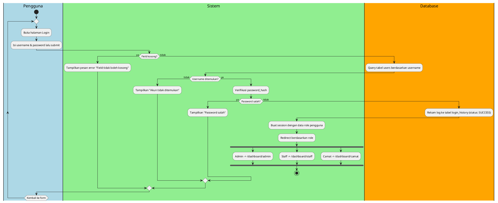
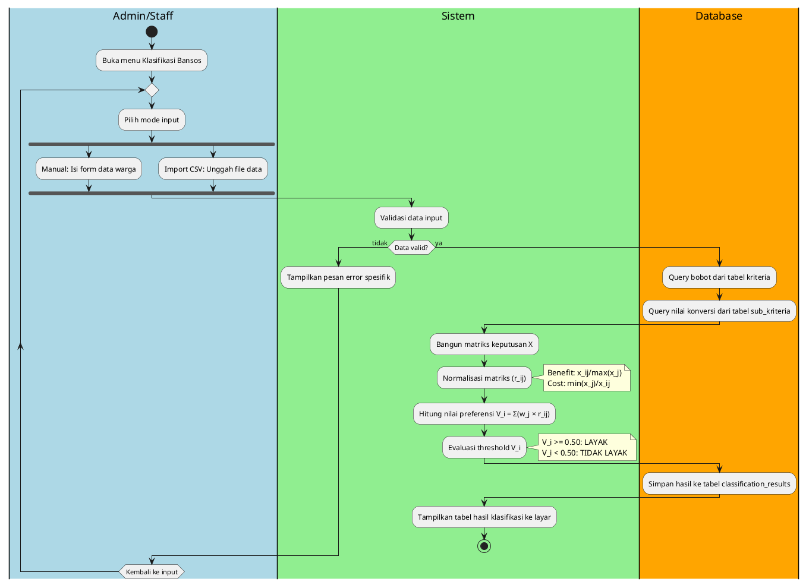
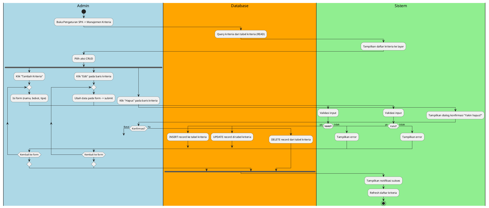
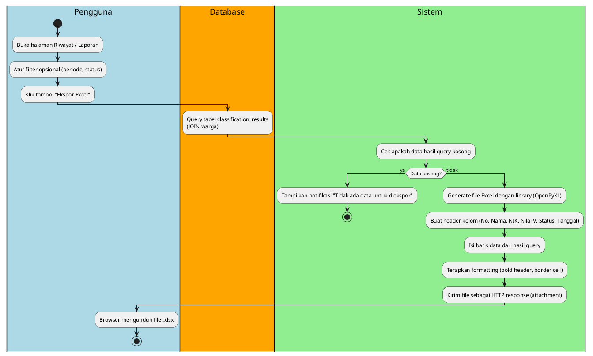

# OUTPUT: Activity Diagram — 4 Alur Esensial

Sesuai dengan pedoman laporan KP yang diminta, berikut adalah dokumentasi pemodelan **Activity Diagram** untuk 4 alur esensial pada Sistem Pendukung Keputusan (SPK) Klasifikasi Bansos dengan metode SAW. Setiap alur disajikan dalam format **Narasi Step-by-Step**, **Kode PlantUML**, dan **Struktur XML draw.io**.

---

## ALUR 1 — Login & Autentikasi

### Narasi:
Alur dimulai ketika Pengguna (Admin, Staff, atau Camat) membuka halaman Login pada sistem. Pengguna kemudian memasukkan *username* dan *password* ke dalam form yang tersedia, lalu menekan tombol submit. Sistem akan melakukan validasi pertama untuk memastikan tidak ada *field* yang kosong. Jika terdapat *field* kosong, sistem akan menampilkan pesan error "Field tidak boleh kosong" dan pengguna dikembalikan ke form login untuk memperbaiki input. Jika validasi form berhasil, sistem akan melakukan query ke tabel `users` di dalam database berdasarkan *username* yang diinput. Apabila *username* tidak ditemukan, sistem menampilkan pesan "Akun tidak ditemukan" dan mengembalikan pengguna ke form. Jika *username* ditemukan, sistem melanjutkan dengan memverifikasi `password_hash`. Jika password salah, pesan "Password salah" ditampilkan dan pengguna kembali ke form. Jika verifikasi sukses, sistem akan merekam log aktivitas autentikasi ke dalam tabel `login_history` dengan status SUCCESS. Setelah itu, sistem membuat *session* yang memuat data *role* pengguna dan melakukan redirect ke halaman dashboard yang sesuai: Admin diarahkan ke `/dashboard/admin`, Staff ke `/dashboard/staff`, dan Camat ke `/dashboard/camat`. Alur login selesai.

### Format A — PlantUML:


### Format B — XML draw.io:
```xml
<mxGraphModel dx="1422" dy="762" grid="1" gridSize="10" guides="1" tooltips="1" connect="1" arrows="1" fold="1" page="1" pageScale="1" pageWidth="1654" pageHeight="1169" math="0" shadow="0">
<root>
<mxCell id="0"/>
<mxCell id="1" parent="0"/>

<!-- Swimlanes Container -->
<mxCell id="A1_pool1" value="Pengguna" style="swimlane;" vertex="1" parent="1">
    <mxGeometry x="0" y="0" width="250" height="1200" as="geometry"/>
</mxCell>
<mxCell id="A1_pool2" value="Sistem" style="swimlane;" vertex="1" parent="1">
    <mxGeometry x="250" y="0" width="250" height="1200" as="geometry"/>
</mxCell>
<mxCell id="A1_pool3" value="Database" style="swimlane;" vertex="1" parent="1">
    <mxGeometry x="500" y="0" width="250" height="1200" as="geometry"/>
</mxCell>

<!-- Nodes -->
<mxCell id="A1_start" value="" style="ellipse;fillColor=#000000;strokeColor=none;" vertex="1" parent="A1_pool1">
    <mxGeometry x="110" y="40" width="30" height="30" as="geometry"/>
</mxCell>
<mxCell id="A1_act1" value="Membuka halaman Login" style="rounded=1;whiteSpace=wrap;html=1;" vertex="1" parent="A1_pool1">
    <mxGeometry x="35" y="100" width="180" height="50" as="geometry"/>
</mxCell>
<mxCell id="A1_act2" value="Mengisi form &amp; submit" style="rounded=1;whiteSpace=wrap;html=1;" vertex="1" parent="A1_pool1">
    <mxGeometry x="35" y="180" width="180" height="50" as="geometry"/>
</mxCell>
<mxCell id="A1_dec1" value="Field kosong?" style="rhombus;whiteSpace=wrap;html=1;" vertex="1" parent="A1_pool2">
    <mxGeometry x="85" y="260" width="80" height="80" as="geometry"/>
</mxCell>
<mxCell id="A1_err1" value="Tampilkan error &quot;Field kosong&quot;" style="rounded=1;whiteSpace=wrap;html=1;" vertex="1" parent="A1_pool2">
    <mxGeometry x="35" y="370" width="180" height="50" as="geometry"/>
</mxCell>
<mxCell id="A1_db1" value="Query tabel users by username" style="rounded=1;whiteSpace=wrap;html=1;" vertex="1" parent="A1_pool3">
    <mxGeometry x="35" y="370" width="180" height="50" as="geometry"/>
</mxCell>
<mxCell id="A1_dec2" value="User ditemukan?" style="rhombus;whiteSpace=wrap;html=1;" vertex="1" parent="A1_pool2">
    <mxGeometry x="85" y="450" width="80" height="80" as="geometry"/>
</mxCell>
<mxCell id="A1_err2" value="Tampilkan &quot;Akun tak ditemukan&quot;" style="rounded=1;whiteSpace=wrap;html=1;" vertex="1" parent="A1_pool2">
    <mxGeometry x="35" y="560" width="180" height="50" as="geometry"/>
</mxCell>
<mxCell id="A1_act3" value="Verifikasi password_hash" style="rounded=1;whiteSpace=wrap;html=1;" vertex="1" parent="A1_pool2">
    <mxGeometry x="35" y="640" width="180" height="50" as="geometry"/>
</mxCell>
<mxCell id="A1_dec3" value="Password salah?" style="rhombus;whiteSpace=wrap;html=1;" vertex="1" parent="A1_pool2">
    <mxGeometry x="85" y="720" width="80" height="80" as="geometry"/>
</mxCell>
<mxCell id="A1_err3" value="Tampilkan &quot;Password salah&quot;" style="rounded=1;whiteSpace=wrap;html=1;" vertex="1" parent="A1_pool2">
    <mxGeometry x="35" y="830" width="180" height="50" as="geometry"/>
</mxCell>
<mxCell id="A1_db2" value="Rekam log login_history" style="rounded=1;whiteSpace=wrap;html=1;" vertex="1" parent="A1_pool3">
    <mxGeometry x="35" y="830" width="180" height="50" as="geometry"/>
</mxCell>
<mxCell id="A1_act4" value="Buat session data role" style="rounded=1;whiteSpace=wrap;html=1;" vertex="1" parent="A1_pool2">
    <mxGeometry x="35" y="910" width="180" height="50" as="geometry"/>
</mxCell>
<mxCell id="A1_act5" value="Redirect ke /dashboard/..." style="rounded=1;whiteSpace=wrap;html=1;" vertex="1" parent="A1_pool2">
    <mxGeometry x="35" y="990" width="180" height="50" as="geometry"/>
</mxCell>
<mxCell id="A1_end" value="" style="ellipse;shape=doubleEllipse;fillColor=#000000;strokeColor=none;" vertex="1" parent="A1_pool2">
    <mxGeometry x="110" y="1080" width="30" height="30" as="geometry"/>
</mxCell>

<!-- Edges -->
<mxCell id="A1_e1" edge="1" parent="1" source="A1_start" target="A1_act1" style="edgeStyle=orthogonalEdgeStyle;rounded=0;"><mxGeometry relative="1" as="geometry"/></mxCell>
<mxCell id="A1_e2" edge="1" parent="1" source="A1_act1" target="A1_act2" style="edgeStyle=orthogonalEdgeStyle;rounded=0;"><mxGeometry relative="1" as="geometry"/></mxCell>
<mxCell id="A1_e3" edge="1" parent="1" source="A1_act2" target="A1_dec1" style="edgeStyle=orthogonalEdgeStyle;rounded=0;"><mxGeometry relative="1" as="geometry"/></mxCell>
<mxCell id="A1_e4" value="Ya" edge="1" parent="1" source="A1_dec1" target="A1_err1" style="edgeStyle=orthogonalEdgeStyle;rounded=0;"><mxGeometry relative="1" as="geometry"/></mxCell>
<mxCell id="A1_e5" value="Tidak" edge="1" parent="1" source="A1_dec1" target="A1_db1" style="edgeStyle=orthogonalEdgeStyle;rounded=0;"><mxGeometry relative="1" as="geometry"/></mxCell>
<mxCell id="A1_e6" edge="1" parent="1" source="A1_db1" target="A1_dec2" style="edgeStyle=orthogonalEdgeStyle;rounded=0;"><mxGeometry relative="1" as="geometry"/></mxCell>
<mxCell id="A1_e7" value="Tidak" edge="1" parent="1" source="A1_dec2" target="A1_err2" style="edgeStyle=orthogonalEdgeStyle;rounded=0;"><mxGeometry relative="1" as="geometry"/></mxCell>
<mxCell id="A1_e8" value="Ya" edge="1" parent="1" source="A1_dec2" target="A1_act3" style="edgeStyle=orthogonalEdgeStyle;rounded=0;"><mxGeometry relative="1" as="geometry"/></mxCell>
<mxCell id="A1_e9" edge="1" parent="1" source="A1_act3" target="A1_dec3" style="edgeStyle=orthogonalEdgeStyle;rounded=0;"><mxGeometry relative="1" as="geometry"/></mxCell>
<mxCell id="A1_e10" value="Ya" edge="1" parent="1" source="A1_dec3" target="A1_err3" style="edgeStyle=orthogonalEdgeStyle;rounded=0;"><mxGeometry relative="1" as="geometry"/></mxCell>
<mxCell id="A1_e11" value="Tidak" edge="1" parent="1" source="A1_dec3" target="A1_db2" style="edgeStyle=orthogonalEdgeStyle;rounded=0;"><mxGeometry relative="1" as="geometry"/></mxCell>
<mxCell id="A1_e12" edge="1" parent="1" source="A1_db2" target="A1_act4" style="edgeStyle=orthogonalEdgeStyle;rounded=0;"><mxGeometry relative="1" as="geometry"/></mxCell>
<mxCell id="A1_e13" edge="1" parent="1" source="A1_act4" target="A1_act5" style="edgeStyle=orthogonalEdgeStyle;rounded=0;"><mxGeometry relative="1" as="geometry"/></mxCell>
<mxCell id="A1_e14" edge="1" parent="1" source="A1_act5" target="A1_end" style="edgeStyle=orthogonalEdgeStyle;rounded=0;"><mxGeometry relative="1" as="geometry"/></mxCell>

<!-- Feedback/Loop Edges -->
<mxCell id="A1_e_err1" edge="1" parent="1" source="A1_err1" target="A1_act2" style="edgeStyle=orthogonalEdgeStyle;rounded=0;entryX=0;entryY=0.5;exitX=0;exitY=0.5;"><mxGeometry relative="1" as="geometry"><Array as="points"><mxPoint x="10" y="395"/><mxPoint x="10" y="205"/></Array></mxGeometry></mxCell>
<mxCell id="A1_e_err2" edge="1" parent="1" source="A1_err2" target="A1_act2" style="edgeStyle=orthogonalEdgeStyle;rounded=0;entryX=0;entryY=0.5;exitX=0;exitY=0.5;"><mxGeometry relative="1" as="geometry"><Array as="points"><mxPoint x="10" y="585"/><mxPoint x="10" y="205"/></Array></mxGeometry></mxCell>
<mxCell id="A1_e_err3" edge="1" parent="1" source="A1_err3" target="A1_act2" style="edgeStyle=orthogonalEdgeStyle;rounded=0;entryX=0;entryY=0.5;exitX=0;exitY=0.5;"><mxGeometry relative="1" as="geometry"><Array as="points"><mxPoint x="10" y="855"/><mxPoint x="10" y="205"/></Array></mxGeometry></mxCell>

</root>
</mxGraphModel>
```

---

## ALUR 2 — Klasifikasi Bansos (Metode SAW)

### Narasi:
Alur klasifikasi bansos dengan metode SAW dimulai saat Admin atau Staff membuka menu Klasifikasi Bansos. Pengguna kemudian memilih mode input data, yaitu secara manual dengan mengisi form data warga satu per satu, atau melalui import CSV dengan mengunggah file berisi data warga. Sistem kemudian melakukan validasi terhadap data yang diinput. Jika data tidak valid, sistem akan menampilkan pesan error spesifik dan mengembalikan pengguna ke halaman input untuk memperbaikinya. Jika data valid, sistem akan melakukan query ke tabel `kriteria` untuk mengambil bobot kriteria yang tersimpan, dilanjutkan dengan query ke tabel `sub_kriteria` untuk mendapatkan nilai konversi kriteria dari setiap warga. Berdasarkan data tersebut, sistem membangun matriks keputusan X. Selanjutnya, sistem melakukan normalisasi matriks (r_ij), di mana atribut bertipe benefit dibagi dengan nilai maksimal dan atribut bertipe cost membagi nilai minimal. Sistem kemudian menghitung nilai preferensi (V_i) dengan mengalikan bobot dengan nilai normalisasi lalu menjumlahkannya. Hasil V_i dievaluasi terhadap *threshold* 0.50; jika nilai V_i ≥ 0.50 maka berstatus LAYAK, sebaliknya jika < 0.50 berstatus TIDAK LAYAK. Terakhir, sistem menyimpan hasil tersebut ke tabel `classification_results` dan menampilkannya dalam bentuk tabel di layar pengguna.

### Format A — PlantUML:


### Format B — XML draw.io:
```xml
<mxGraphModel dx="1422" dy="762" grid="1" gridSize="10" guides="1" tooltips="1" connect="1" arrows="1" fold="1" page="1" pageScale="1" pageWidth="1654" pageHeight="1169" math="0" shadow="0">
<root>
<mxCell id="0"/>
<mxCell id="1" parent="0"/>

<!-- Swimlanes Container -->
<mxCell id="A2_pool1" value="Admin/Staff" style="swimlane;" vertex="1" parent="1">
    <mxGeometry x="0" y="0" width="250" height="1200" as="geometry"/>
</mxCell>
<mxCell id="A2_pool2" value="Sistem" style="swimlane;" vertex="1" parent="1">
    <mxGeometry x="250" y="0" width="250" height="1200" as="geometry"/>
</mxCell>
<mxCell id="A2_pool3" value="Database" style="swimlane;" vertex="1" parent="1">
    <mxGeometry x="500" y="0" width="250" height="1200" as="geometry"/>
</mxCell>

<!-- Nodes -->
<mxCell id="A2_start" value="" style="ellipse;fillColor=#000000;strokeColor=none;" vertex="1" parent="A2_pool1">
    <mxGeometry x="110" y="40" width="30" height="30" as="geometry"/>
</mxCell>
<mxCell id="A2_act1" value="Buka menu Klasifikasi Bansos" style="rounded=1;whiteSpace=wrap;html=1;" vertex="1" parent="A2_pool1">
    <mxGeometry x="35" y="100" width="180" height="50" as="geometry"/>
</mxCell>
<mxCell id="A2_act2" value="Memilih mode input data" style="rounded=1;whiteSpace=wrap;html=1;" vertex="1" parent="A2_pool1">
    <mxGeometry x="35" y="180" width="180" height="50" as="geometry"/>
</mxCell>
<mxCell id="A2_act3" value="Validasi data input" style="rounded=1;whiteSpace=wrap;html=1;" vertex="1" parent="A2_pool2">
    <mxGeometry x="35" y="260" width="180" height="50" as="geometry"/>
</mxCell>
<mxCell id="A2_dec1" value="Data valid?" style="rhombus;whiteSpace=wrap;html=1;" vertex="1" parent="A2_pool2">
    <mxGeometry x="85" y="340" width="80" height="80" as="geometry"/>
</mxCell>
<mxCell id="A2_err1" value="Tampilkan pesan error spesifik" style="rounded=1;whiteSpace=wrap;html=1;" vertex="1" parent="A2_pool2">
    <mxGeometry x="35" y="450" width="180" height="50" as="geometry"/>
</mxCell>
<mxCell id="A2_db1" value="Query bobot dr tabel kriteria" style="rounded=1;whiteSpace=wrap;html=1;" vertex="1" parent="A2_pool3">
    <mxGeometry x="35" y="450" width="180" height="50" as="geometry"/>
</mxCell>
<mxCell id="A2_db2" value="Query tabel sub_kriteria" style="rounded=1;whiteSpace=wrap;html=1;" vertex="1" parent="A2_pool3">
    <mxGeometry x="35" y="530" width="180" height="50" as="geometry"/>
</mxCell>
<mxCell id="A2_act4" value="Bangun matriks keputusan X" style="rounded=1;whiteSpace=wrap;html=1;" vertex="1" parent="A2_pool2">
    <mxGeometry x="35" y="610" width="180" height="50" as="geometry"/>
</mxCell>
<mxCell id="A2_act5" value="Normalisasi matriks (r_ij)" style="rounded=1;whiteSpace=wrap;html=1;" vertex="1" parent="A2_pool2">
    <mxGeometry x="35" y="690" width="180" height="50" as="geometry"/>
</mxCell>
<mxCell id="A2_act6" value="Hitung nilai preferensi (V_i)" style="rounded=1;whiteSpace=wrap;html=1;" vertex="1" parent="A2_pool2">
    <mxGeometry x="35" y="770" width="180" height="50" as="geometry"/>
</mxCell>
<mxCell id="A2_act7" value="Evaluasi threshold V_i" style="rounded=1;whiteSpace=wrap;html=1;" vertex="1" parent="A2_pool2">
    <mxGeometry x="35" y="850" width="180" height="50" as="geometry"/>
</mxCell>
<mxCell id="A2_db3" value="Simpan ke classification_results" style="rounded=1;whiteSpace=wrap;html=1;" vertex="1" parent="A2_pool3">
    <mxGeometry x="35" y="930" width="180" height="50" as="geometry"/>
</mxCell>
<mxCell id="A2_act8" value="Tampilkan tabel hasil ke layar" style="rounded=1;whiteSpace=wrap;html=1;" vertex="1" parent="A2_pool2">
    <mxGeometry x="35" y="1010" width="180" height="50" as="geometry"/>
</mxCell>
<mxCell id="A2_end" value="" style="ellipse;shape=doubleEllipse;fillColor=#000000;strokeColor=none;" vertex="1" parent="A2_pool2">
    <mxGeometry x="110" y="1090" width="30" height="30" as="geometry"/>
</mxCell>

<!-- Edges -->
<mxCell id="A2_e1" edge="1" parent="1" source="A2_start" target="A2_act1" style="edgeStyle=orthogonalEdgeStyle;rounded=0;"><mxGeometry relative="1" as="geometry"/></mxCell>
<mxCell id="A2_e2" edge="1" parent="1" source="A2_act1" target="A2_act2" style="edgeStyle=orthogonalEdgeStyle;rounded=0;"><mxGeometry relative="1" as="geometry"/></mxCell>
<mxCell id="A2_e3" edge="1" parent="1" source="A2_act2" target="A2_act3" style="edgeStyle=orthogonalEdgeStyle;rounded=0;"><mxGeometry relative="1" as="geometry"/></mxCell>
<mxCell id="A2_e4" edge="1" parent="1" source="A2_act3" target="A2_dec1" style="edgeStyle=orthogonalEdgeStyle;rounded=0;"><mxGeometry relative="1" as="geometry"/></mxCell>
<mxCell id="A2_e5" value="Tidak" edge="1" parent="1" source="A2_dec1" target="A2_err1" style="edgeStyle=orthogonalEdgeStyle;rounded=0;"><mxGeometry relative="1" as="geometry"/></mxCell>
<mxCell id="A2_e6" value="Ya" edge="1" parent="1" source="A2_dec1" target="A2_db1" style="edgeStyle=orthogonalEdgeStyle;rounded=0;"><mxGeometry relative="1" as="geometry"/></mxCell>
<mxCell id="A2_e7" edge="1" parent="1" source="A2_db1" target="A2_db2" style="edgeStyle=orthogonalEdgeStyle;rounded=0;"><mxGeometry relative="1" as="geometry"/></mxCell>
<mxCell id="A2_e8" edge="1" parent="1" source="A2_db2" target="A2_act4" style="edgeStyle=orthogonalEdgeStyle;rounded=0;"><mxGeometry relative="1" as="geometry"/></mxCell>
<mxCell id="A2_e9" edge="1" parent="1" source="A2_act4" target="A2_act5" style="edgeStyle=orthogonalEdgeStyle;rounded=0;"><mxGeometry relative="1" as="geometry"/></mxCell>
<mxCell id="A2_e10" edge="1" parent="1" source="A2_act5" target="A2_act6" style="edgeStyle=orthogonalEdgeStyle;rounded=0;"><mxGeometry relative="1" as="geometry"/></mxCell>
<mxCell id="A2_e11" edge="1" parent="1" source="A2_act6" target="A2_act7" style="edgeStyle=orthogonalEdgeStyle;rounded=0;"><mxGeometry relative="1" as="geometry"/></mxCell>
<mxCell id="A2_e12" edge="1" parent="1" source="A2_act7" target="A2_db3" style="edgeStyle=orthogonalEdgeStyle;rounded=0;"><mxGeometry relative="1" as="geometry"/></mxCell>
<mxCell id="A2_e13" edge="1" parent="1" source="A2_db3" target="A2_act8" style="edgeStyle=orthogonalEdgeStyle;rounded=0;"><mxGeometry relative="1" as="geometry"/></mxCell>
<mxCell id="A2_e14" edge="1" parent="1" source="A2_act8" target="A2_end" style="edgeStyle=orthogonalEdgeStyle;rounded=0;"><mxGeometry relative="1" as="geometry"/></mxCell>

<!-- Feedback/Loop Edges -->
<mxCell id="A2_e_err1" edge="1" parent="1" source="A2_err1" target="A2_act2" style="edgeStyle=orthogonalEdgeStyle;rounded=0;entryX=0;entryY=0.5;exitX=0;exitY=0.5;"><mxGeometry relative="1" as="geometry"><Array as="points"><mxPoint x="10" y="475"/><mxPoint x="10" y="205"/></Array></mxGeometry></mxCell>

</root>
</mxGraphModel>
```

---

## ALUR 3 — Manajemen Data (CRUD Representatif)

### Narasi:
Alur manajemen data kriteria dimulai ketika Admin membuka menu Pengaturan SPK lalu memilih sub-menu Manajemen Kriteria. Sistem merespons dengan melakukan *query* (READ) pada database dan menampilkan daftar kriteria yang ada di tabel `kriteria`. Dari antarmuka ini, Admin dapat memilih satu dari tiga aksi: CREATE, UPDATE, atau DELETE.
Pada aksi CREATE, Admin mengklik "Tambah Kriteria" dan mengisi form (nama, bobot, tipe). Sistem melakukan validasi (bobot harus numerik dan total keseluruhan bobot ≤ 1.0). Jika tidak valid, muncul pesan error dan Admin kembali ke pengisian form. Jika valid, sistem menyisipkan (INSERT) data baru ke tabel `kriteria` dan menampilkan notifikasi sukses.
Pada aksi UPDATE, Admin mengklik tombol "Edit" pada salah satu baris kriteria, lalu mengubah data pada form yang telah terisi data lama. Setelah form disubmit, sistem kembali memvalidasi data. Jika tidak valid, muncul error dan Admin diminta memperbaiki form. Jika valid, sistem akan memperbarui (UPDATE) record di tabel `kriteria` lalu menampilkan notifikasi sukses.
Pada aksi DELETE, Admin mengklik tombol "Hapus" pada baris kriteria. Sistem akan memunculkan dialog konfirmasi. Jika dibatalkan, alur membatalkan proses dan kembali ke daftar. Jika dikonfirmasi, sistem akan menghapus (DELETE) record tersebut dari tabel `kriteria` dan memunculkan notifikasi sukses. Di akhir setiap operasi yang berhasil, sistem akan merefresh daftar kriteria untuk memuat data terbaru.

### Format A — PlantUML:


### Format B — XML draw.io:
```xml
<mxGraphModel dx="1422" dy="762" grid="1" gridSize="10" guides="1" tooltips="1" connect="1" arrows="1" fold="1" page="1" pageScale="1" pageWidth="1654" pageHeight="1169" math="0" shadow="0">
<root>
<mxCell id="0"/>
<mxCell id="1" parent="0"/>

<mxCell id="A3_pool1" value="Admin" style="swimlane;" vertex="1" parent="1">
    <mxGeometry x="0" y="0" width="250" height="1200" as="geometry"/>
</mxCell>
<mxCell id="A3_pool2" value="Sistem" style="swimlane;" vertex="1" parent="1">
    <mxGeometry x="250" y="0" width="250" height="1200" as="geometry"/>
</mxCell>
<mxCell id="A3_pool3" value="Database" style="swimlane;" vertex="1" parent="1">
    <mxGeometry x="500" y="0" width="250" height="1200" as="geometry"/>
</mxCell>

<mxCell id="A3_start" value="" style="ellipse;fillColor=#000000;strokeColor=none;" vertex="1" parent="A3_pool1">
    <mxGeometry x="110" y="40" width="30" height="30" as="geometry"/>
</mxCell>
<mxCell id="A3_act1" value="Buka Manajemen Kriteria" style="rounded=1;whiteSpace=wrap;html=1;" vertex="1" parent="A3_pool1">
    <mxGeometry x="35" y="100" width="180" height="50" as="geometry"/>
</mxCell>
<mxCell id="A3_db1" value="Query tabel kriteria (READ)" style="rounded=1;whiteSpace=wrap;html=1;" vertex="1" parent="A3_pool3">
    <mxGeometry x="35" y="180" width="180" height="50" as="geometry"/>
</mxCell>
<mxCell id="A3_act2" value="Tampilkan daftar kriteria" style="rounded=1;whiteSpace=wrap;html=1;" vertex="1" parent="A3_pool2">
    <mxGeometry x="35" y="260" width="180" height="50" as="geometry"/>
</mxCell>
<mxCell id="A3_dec1" value="Pilih Aksi" style="rhombus;whiteSpace=wrap;html=1;" vertex="1" parent="A3_pool1">
    <mxGeometry x="85" y="340" width="80" height="80" as="geometry"/>
</mxCell>

<mxCell id="A3_act3" value="Isi Form CREATE/UPDATE" style="rounded=1;whiteSpace=wrap;html=1;" vertex="1" parent="A3_pool1">
    <mxGeometry x="35" y="450" width="180" height="50" as="geometry"/>
</mxCell>
<mxCell id="A3_act4" value="Sistem memproses &amp; validasi" style="rounded=1;whiteSpace=wrap;html=1;" vertex="1" parent="A3_pool2">
    <mxGeometry x="35" y="530" width="180" height="50" as="geometry"/>
</mxCell>

<mxCell id="A3_dec2" value="Valid?" style="rhombus;whiteSpace=wrap;html=1;" vertex="1" parent="A3_pool2">
    <mxGeometry x="85" y="610" width="80" height="80" as="geometry"/>
</mxCell>
<mxCell id="A3_err1" value="Tampilkan error" style="rounded=1;whiteSpace=wrap;html=1;" vertex="1" parent="A3_pool2">
    <mxGeometry x="35" y="720" width="180" height="50" as="geometry"/>
</mxCell>

<mxCell id="A3_db2" value="Jalankan INSERT/UPDATE/DELETE" style="rounded=1;whiteSpace=wrap;html=1;" vertex="1" parent="A3_pool3">
    <mxGeometry x="35" y="610" width="180" height="50" as="geometry"/>
</mxCell>

<mxCell id="A3_act5" value="Tampilkan notifikasi sukses" style="rounded=1;whiteSpace=wrap;html=1;" vertex="1" parent="A3_pool2">
    <mxGeometry x="35" y="830" width="180" height="50" as="geometry"/>
</mxCell>
<mxCell id="A3_act6" value="Refresh daftar kriteria" style="rounded=1;whiteSpace=wrap;html=1;" vertex="1" parent="A3_pool2">
    <mxGeometry x="35" y="910" width="180" height="50" as="geometry"/>
</mxCell>
<mxCell id="A3_end" value="" style="ellipse;shape=doubleEllipse;fillColor=#000000;strokeColor=none;" vertex="1" parent="A3_pool2">
    <mxGeometry x="110" y="990" width="30" height="30" as="geometry"/>
</mxCell>

<mxCell id="A3_e1" edge="1" parent="1" source="A3_start" target="A3_act1" style="edgeStyle=orthogonalEdgeStyle;rounded=0;"><mxGeometry relative="1" as="geometry"/></mxCell>
<mxCell id="A3_e2" edge="1" parent="1" source="A3_act1" target="A3_db1" style="edgeStyle=orthogonalEdgeStyle;rounded=0;"><mxGeometry relative="1" as="geometry"/></mxCell>
<mxCell id="A3_e3" edge="1" parent="1" source="A3_db1" target="A3_act2" style="edgeStyle=orthogonalEdgeStyle;rounded=0;"><mxGeometry relative="1" as="geometry"/></mxCell>
<mxCell id="A3_e4" edge="1" parent="1" source="A3_act2" target="A3_dec1" style="edgeStyle=orthogonalEdgeStyle;rounded=0;"><mxGeometry relative="1" as="geometry"/></mxCell>
<mxCell id="A3_e5" edge="1" parent="1" source="A3_dec1" target="A3_act3" style="edgeStyle=orthogonalEdgeStyle;rounded=0;"><mxGeometry relative="1" as="geometry"/></mxCell>
<mxCell id="A3_e6" edge="1" parent="1" source="A3_act3" target="A3_act4" style="edgeStyle=orthogonalEdgeStyle;rounded=0;"><mxGeometry relative="1" as="geometry"/></mxCell>

<mxCell id="A3_e7" edge="1" parent="1" source="A3_act4" target="A3_dec2" style="edgeStyle=orthogonalEdgeStyle;rounded=0;"><mxGeometry relative="1" as="geometry"/></mxCell>
<mxCell id="A3_e8" value="Tidak" edge="1" parent="1" source="A3_dec2" target="A3_err1" style="edgeStyle=orthogonalEdgeStyle;rounded=0;"><mxGeometry relative="1" as="geometry"/></mxCell>
<mxCell id="A3_e9" value="Ya" edge="1" parent="1" source="A3_dec2" target="A3_db2" style="edgeStyle=orthogonalEdgeStyle;rounded=0;"><mxGeometry relative="1" as="geometry"/></mxCell>

<mxCell id="A3_e10" edge="1" parent="1" source="A3_db2" target="A3_act5" style="edgeStyle=orthogonalEdgeStyle;rounded=0;"><mxGeometry relative="1" as="geometry"/></mxCell>
<mxCell id="A3_e11" edge="1" parent="1" source="A3_act5" target="A3_act6" style="edgeStyle=orthogonalEdgeStyle;rounded=0;"><mxGeometry relative="1" as="geometry"/></mxCell>
<mxCell id="A3_e12" edge="1" parent="1" source="A3_act6" target="A3_end" style="edgeStyle=orthogonalEdgeStyle;rounded=0;"><mxGeometry relative="1" as="geometry"/></mxCell>

<!-- Feedback/Loop Edges -->
<mxCell id="A3_e_err1" edge="1" parent="1" source="A3_err1" target="A3_act3" style="edgeStyle=orthogonalEdgeStyle;rounded=0;entryX=0;entryY=0.5;exitX=0;exitY=0.5;"><mxGeometry relative="1" as="geometry"><Array as="points"><mxPoint x="10" y="745"/><mxPoint x="10" y="475"/></Array></mxGeometry></mxCell>

</root>
</mxGraphModel>
```

---

## ALUR 4 — Ekspor Laporan Excel

### Narasi:
Alur ekspor laporan Excel dimulai ketika Pengguna (Admin, Staff, atau Camat) membuka halaman Riwayat atau Laporan pada sistem. Pengguna secara opsional dapat mengatur filter pencarian, seperti periode tanggal atau status kelayakan, kemudian menekan tombol "Ekspor Excel". Sistem merespons dengan melakukan *query* data dari tabel `classification_results` dan melakukan JOIN dengan tabel `warga` untuk memperoleh profil data lengkap penerima. Setelah hasil didapatkan dari database, sistem mengecek ketersediaan data. Jika data kosong (tidak ada hasil yang cocok dengan filter), sistem akan menampilkan notifikasi "Tidak ada data untuk diekspor" dan alur segera diakhiri. Sebaliknya, jika data tersedia, sistem akan meng-generate file Excel menggunakan *library* OpenPyXL. Sistem kemudian membangun header kolom secara terstruktur (No, Nama, NIK, Nilai V, Status, Tanggal), mengisi baris demi baris data berdasarkan hasil query, dan menerapkan *formatting* desain (seperti *bold header* dan pemberian *border cell*). File `.xlsx` yang telah siap kemudian dikirimkan oleh sistem sebagai HTTP response (*attachment*). Secara otomatis, *browser* pengguna akan memulai proses pengunduhan file tersebut ke lokal.

### Format A — PlantUML:


### Format B — XML draw.io:
```xml
<mxGraphModel dx="1422" dy="762" grid="1" gridSize="10" guides="1" tooltips="1" connect="1" arrows="1" fold="1" page="1" pageScale="1" pageWidth="1654" pageHeight="1169" math="0" shadow="0">
<root>
<mxCell id="0"/>
<mxCell id="1" parent="0"/>

<mxCell id="A4_pool1" value="Pengguna" style="swimlane;" vertex="1" parent="1">
    <mxGeometry x="0" y="0" width="250" height="1200" as="geometry"/>
</mxCell>
<mxCell id="A4_pool2" value="Sistem" style="swimlane;" vertex="1" parent="1">
    <mxGeometry x="250" y="0" width="250" height="1200" as="geometry"/>
</mxCell>
<mxCell id="A4_pool3" value="Database" style="swimlane;" vertex="1" parent="1">
    <mxGeometry x="500" y="0" width="250" height="1200" as="geometry"/>
</mxCell>

<mxCell id="A4_start" value="" style="ellipse;fillColor=#000000;strokeColor=none;" vertex="1" parent="A4_pool1">
    <mxGeometry x="110" y="40" width="30" height="30" as="geometry"/>
</mxCell>
<mxCell id="A4_act1" value="Buka halaman Laporan" style="rounded=1;whiteSpace=wrap;html=1;" vertex="1" parent="A4_pool1">
    <mxGeometry x="35" y="100" width="180" height="50" as="geometry"/>
</mxCell>
<mxCell id="A4_act2" value="Atur filter opsional" style="rounded=1;whiteSpace=wrap;html=1;" vertex="1" parent="A4_pool1">
    <mxGeometry x="35" y="180" width="180" height="50" as="geometry"/>
</mxCell>
<mxCell id="A4_act3" value="Klik Ekspor Excel" style="rounded=1;whiteSpace=wrap;html=1;" vertex="1" parent="A4_pool1">
    <mxGeometry x="35" y="260" width="180" height="50" as="geometry"/>
</mxCell>

<mxCell id="A4_db1" value="Query data &amp; JOIN warga" style="rounded=1;whiteSpace=wrap;html=1;" vertex="1" parent="A4_pool3">
    <mxGeometry x="35" y="340" width="180" height="50" as="geometry"/>
</mxCell>

<mxCell id="A4_dec1" value="Data kosong?" style="rhombus;whiteSpace=wrap;html=1;" vertex="1" parent="A4_pool2">
    <mxGeometry x="85" y="420" width="80" height="80" as="geometry"/>
</mxCell>
<mxCell id="A4_err1" value="Tampilkan &quot;Tidak ada data&quot;" style="rounded=1;whiteSpace=wrap;html=1;" vertex="1" parent="A4_pool2">
    <mxGeometry x="35" y="530" width="180" height="50" as="geometry"/>
</mxCell>

<mxCell id="A4_act4" value="Generate file Excel" style="rounded=1;whiteSpace=wrap;html=1;" vertex="1" parent="A4_pool2">
    <mxGeometry x="35" y="610" width="180" height="50" as="geometry"/>
</mxCell>
<mxCell id="A4_act5" value="Buat header kolom" style="rounded=1;whiteSpace=wrap;html=1;" vertex="1" parent="A4_pool2">
    <mxGeometry x="35" y="690" width="180" height="50" as="geometry"/>
</mxCell>
<mxCell id="A4_act6" value="Isi baris data dari query" style="rounded=1;whiteSpace=wrap;html=1;" vertex="1" parent="A4_pool2">
    <mxGeometry x="35" y="770" width="180" height="50" as="geometry"/>
</mxCell>
<mxCell id="A4_act7" value="Terapkan formatting" style="rounded=1;whiteSpace=wrap;html=1;" vertex="1" parent="A4_pool2">
    <mxGeometry x="35" y="850" width="180" height="50" as="geometry"/>
</mxCell>
<mxCell id="A4_act8" value="Kirim file HTTP response" style="rounded=1;whiteSpace=wrap;html=1;" vertex="1" parent="A4_pool2">
    <mxGeometry x="35" y="930" width="180" height="50" as="geometry"/>
</mxCell>
<mxCell id="A4_act9" value="Browser mengunduh .xlsx" style="rounded=1;whiteSpace=wrap;html=1;" vertex="1" parent="A4_pool1">
    <mxGeometry x="35" y="1010" width="180" height="50" as="geometry"/>
</mxCell>
<mxCell id="A4_end" value="" style="ellipse;shape=doubleEllipse;fillColor=#000000;strokeColor=none;" vertex="1" parent="A4_pool1">
    <mxGeometry x="110" y="1090" width="30" height="30" as="geometry"/>
</mxCell>

<mxCell id="A4_e1" edge="1" parent="1" source="A4_start" target="A4_act1" style="edgeStyle=orthogonalEdgeStyle;rounded=0;"><mxGeometry relative="1" as="geometry"/></mxCell>
<mxCell id="A4_e2" edge="1" parent="1" source="A4_act1" target="A4_act2" style="edgeStyle=orthogonalEdgeStyle;rounded=0;"><mxGeometry relative="1" as="geometry"/></mxCell>
<mxCell id="A4_e3" edge="1" parent="1" source="A4_act2" target="A4_act3" style="edgeStyle=orthogonalEdgeStyle;rounded=0;"><mxGeometry relative="1" as="geometry"/></mxCell>
<mxCell id="A4_e4" edge="1" parent="1" source="A4_act3" target="A4_db1" style="edgeStyle=orthogonalEdgeStyle;rounded=0;"><mxGeometry relative="1" as="geometry"/></mxCell>
<mxCell id="A4_e5" edge="1" parent="1" source="A4_db1" target="A4_dec1" style="edgeStyle=orthogonalEdgeStyle;rounded=0;"><mxGeometry relative="1" as="geometry"/></mxCell>
<mxCell id="A4_e6" value="Ya" edge="1" parent="1" source="A4_dec1" target="A4_err1" style="edgeStyle=orthogonalEdgeStyle;rounded=0;"><mxGeometry relative="1" as="geometry"/></mxCell>
<mxCell id="A4_e7" value="Tidak" edge="1" parent="1" source="A4_dec1" target="A4_act4" style="edgeStyle=orthogonalEdgeStyle;rounded=0;"><mxGeometry relative="1" as="geometry"/></mxCell>
<mxCell id="A4_e8" edge="1" parent="1" source="A4_act4" target="A4_act5" style="edgeStyle=orthogonalEdgeStyle;rounded=0;"><mxGeometry relative="1" as="geometry"/></mxCell>
<mxCell id="A4_e9" edge="1" parent="1" source="A4_act5" target="A4_act6" style="edgeStyle=orthogonalEdgeStyle;rounded=0;"><mxGeometry relative="1" as="geometry"/></mxCell>
<mxCell id="A4_e10" edge="1" parent="1" source="A4_act6" target="A4_act7" style="edgeStyle=orthogonalEdgeStyle;rounded=0;"><mxGeometry relative="1" as="geometry"/></mxCell>
<mxCell id="A4_e11" edge="1" parent="1" source="A4_act7" target="A4_act8" style="edgeStyle=orthogonalEdgeStyle;rounded=0;"><mxGeometry relative="1" as="geometry"/></mxCell>
<mxCell id="A4_e12" edge="1" parent="1" source="A4_act8" target="A4_act9" style="edgeStyle=orthogonalEdgeStyle;rounded=0;"><mxGeometry relative="1" as="geometry"/></mxCell>
<mxCell id="A4_e13" edge="1" parent="1" source="A4_act9" target="A4_end" style="edgeStyle=orthogonalEdgeStyle;rounded=0;"><mxGeometry relative="1" as="geometry"/></mxCell>
</root>
</mxGraphModel>
```
