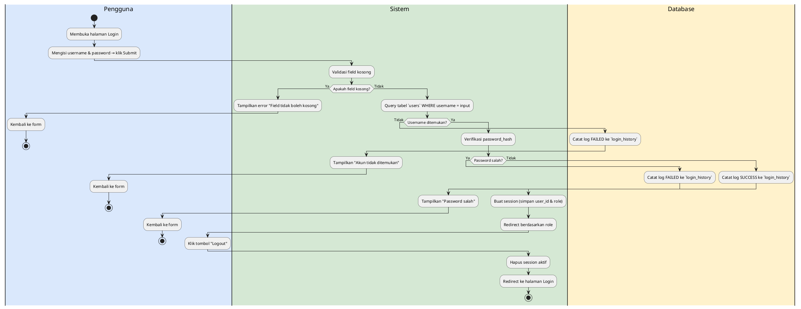
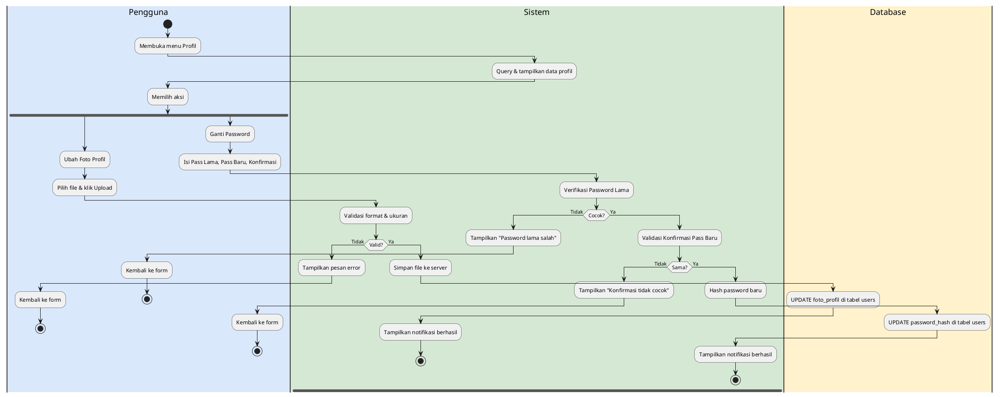
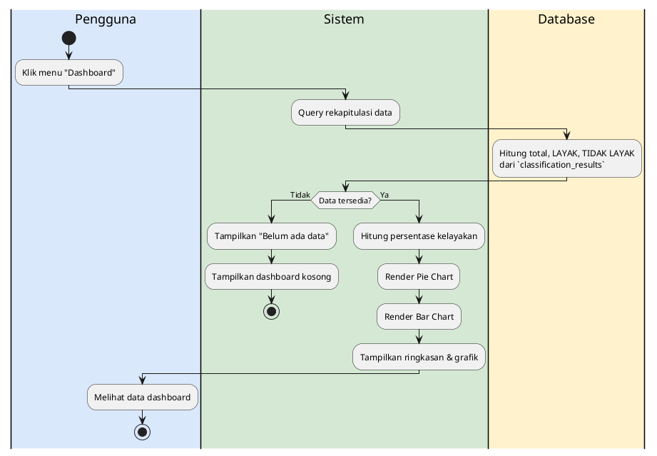
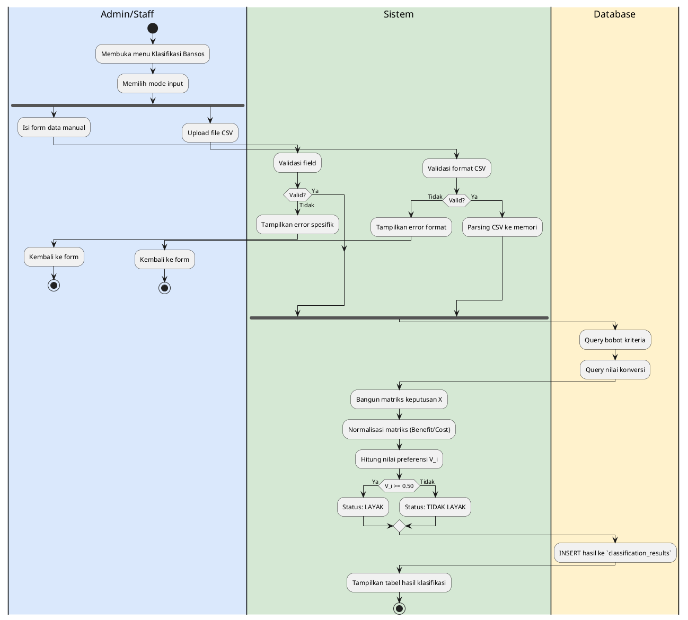
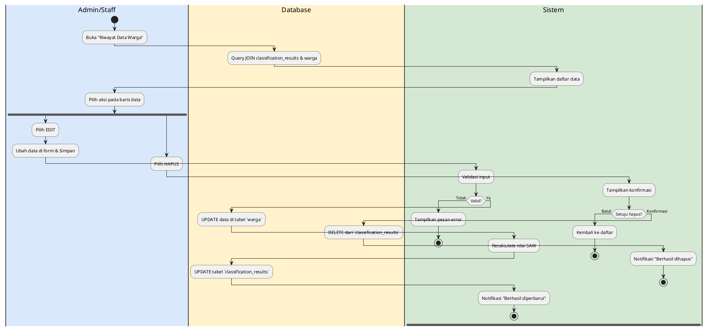
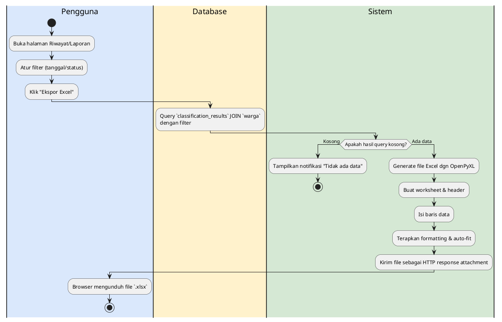
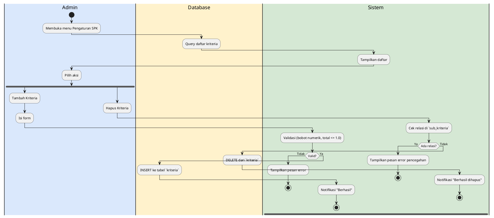
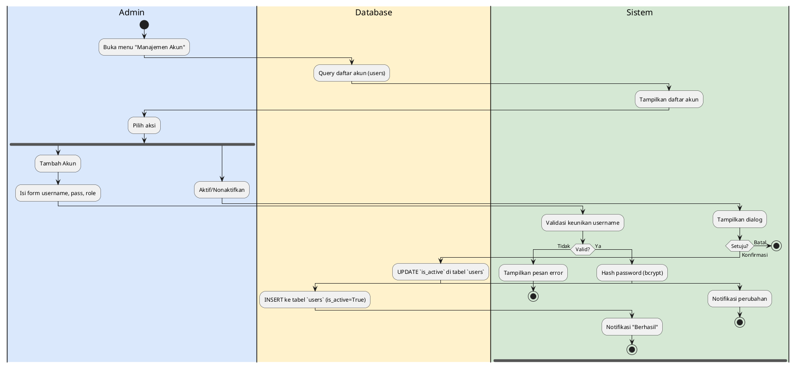

# Dokumentasi Activity Diagram SPK Bansos SAW

---
### ALUR 1 — Autentikasi (Login & Logout)

**Narasi:**
Proses autentikasi dimulai ketika Pengguna (Admin, Staff, atau Camat) mengakses halaman login dan memasukkan kredensial berupa username dan password. Sistem akan memvalidasi kelengkapan form. Jika ada field yang kosong, sistem menolak proses dan menampilkan pesan error. Jika lengkap, sistem melakukan kueri ke tabel `users` untuk memverifikasi username. Apabila username tidak ditemukan atau password hash tidak cocok, sistem mencatat kegagalan pada tabel `login_history` dan mengembalikan pengguna ke form login. Jika validasi berhasil, sistem mencatat keberhasilan login di tabel yang sama, membuat sesi aktif berdasarkan peran pengguna, lalu mengarahkannya ke dashboard. Untuk proses logout, pengguna menekan tombol logout, kemudian sistem merespons dengan menghapus sesi yang aktif dan mengarahkan pengguna kembali ke halaman login utama.

**Format A — PlantUML:**


**Format B — XML draw.io:**
```xml
<mxGraphModel dx="1422" dy="762" grid="1" gridSize="10" guides="1" tooltips="1" connect="1" arrows="1" fold="1" page="1" pageScale="1" pageWidth="1654" pageHeight="1169" math="0" shadow="0">
  <root>
    <mxCell id="0"/>
    <mxCell id="1" parent="0"/>
    <mxCell id="A1_col1" value="Pengguna" style="swimlane;html=1;startSize=20;horizontal=1;" vertex="1" parent="1">
      <mxGeometry x="0" y="0" width="260" height="2530" as="geometry"/>
    </mxCell>
    <mxCell id="A1_col2" value="System" style="swimlane;html=1;startSize=20;horizontal=1;" vertex="1" parent="1">
      <mxGeometry x="260" y="0" width="260" height="2530" as="geometry"/>
    </mxCell>
    <mxCell id="A1_col3" value="Database" style="swimlane;html=1;startSize=20;horizontal=1;" vertex="1" parent="1">
      <mxGeometry x="520" y="0" width="260" height="2530" as="geometry"/>
    </mxCell>
    <mxCell id="A1_start" value="" style="ellipse;aspect=fixed;fillColor=#000000;strokeColor=#000000;" vertex="1" parent="A1_col1">
      <mxGeometry x="115" y="100" width="30" height="30" as="geometry"/>
    </mxCell>
    <mxCell id="A1_act1" value="Membuka halaman Login" style="rounded=1;whiteSpace=wrap;html=1;arcSize=50;" vertex="1" parent="A1_col1">
      <mxGeometry x="40" y="190" width="180" height="50" as="geometry"/>
    </mxCell>
    <mxCell id="A1_act2" value="Isi username & password" style="rounded=1;whiteSpace=wrap;html=1;arcSize=50;" vertex="1" parent="A1_col1">
      <mxGeometry x="40" y="280" width="180" height="50" as="geometry"/>
    </mxCell>
    <mxCell id="A1_act3" value="Validasi field kosong" style="rounded=1;whiteSpace=wrap;html=1;arcSize=50;" vertex="1" parent="A1_col2">
      <mxGeometry x="40" y="370" width="180" height="50" as="geometry"/>
    </mxCell>
    <mxCell id="A1_dec1" value="Kosong?" style="rhombus;whiteSpace=wrap;html=1;" vertex="1" parent="A1_col2">
      <mxGeometry x="90" y="460" width="80" height="80" as="geometry"/>
    </mxCell>
    <mxCell id="A1_err1" value="Error Field Kosong" style="rounded=1;whiteSpace=wrap;html=1;arcSize=50;" vertex="1" parent="A1_col2">
      <mxGeometry x="40" y="550" width="180" height="50" as="geometry"/>
    </mxCell>
    <mxCell id="A1_back1" value="Kembali ke form" style="rounded=1;whiteSpace=wrap;html=1;arcSize=50;" vertex="1" parent="A1_col1">
      <mxGeometry x="40" y="640" width="180" height="50" as="geometry"/>
    </mxCell>
    <mxCell id="A1_end1" value="" style="ellipse;aspect=fixed;fillColor=#000000;strokeColor=#000000;double=1;" vertex="1" parent="A1_col1">
      <mxGeometry x="115" y="730" width="30" height="30" as="geometry"/>
    </mxCell>
    <mxCell id="A1_act4" value="Query tabel users" style="rounded=1;whiteSpace=wrap;html=1;arcSize=50;" vertex="1" parent="A1_col2">
      <mxGeometry x="40" y="820" width="180" height="50" as="geometry"/>
    </mxCell>
    <mxCell id="A1_dec2" value="Ditemukan?" style="rhombus;whiteSpace=wrap;html=1;" vertex="1" parent="A1_col2">
      <mxGeometry x="90" y="910" width="80" height="80" as="geometry"/>
    </mxCell>
    <mxCell id="A1_db1" value="Catat log FAILED" style="rounded=1;whiteSpace=wrap;html=1;arcSize=50;" vertex="1" parent="A1_col3">
      <mxGeometry x="40" y="1000" width="180" height="50" as="geometry"/>
    </mxCell>
    <mxCell id="A1_err2" value="Error Akun tidak ditemukan" style="rounded=1;whiteSpace=wrap;html=1;arcSize=50;" vertex="1" parent="A1_col2">
      <mxGeometry x="40" y="1090" width="180" height="50" as="geometry"/>
    </mxCell>
    <mxCell id="A1_back2" value="Kembali ke form" style="rounded=1;whiteSpace=wrap;html=1;arcSize=50;" vertex="1" parent="A1_col1">
      <mxGeometry x="40" y="1180" width="180" height="50" as="geometry"/>
    </mxCell>
    <mxCell id="A1_end2" value="" style="ellipse;aspect=fixed;fillColor=#000000;strokeColor=#000000;double=1;" vertex="1" parent="A1_col1">
      <mxGeometry x="115" y="1270" width="30" height="30" as="geometry"/>
    </mxCell>
    <mxCell id="A1_act5" value="Verifikasi password_hash" style="rounded=1;whiteSpace=wrap;html=1;arcSize=50;" vertex="1" parent="A1_col2">
      <mxGeometry x="40" y="1360" width="180" height="50" as="geometry"/>
    </mxCell>
    <mxCell id="A1_dec3" value="Salah?" style="rhombus;whiteSpace=wrap;html=1;" vertex="1" parent="A1_col2">
      <mxGeometry x="90" y="1450" width="80" height="80" as="geometry"/>
    </mxCell>
    <mxCell id="A1_db2" value="Catat log FAILED" style="rounded=1;whiteSpace=wrap;html=1;arcSize=50;" vertex="1" parent="A1_col3">
      <mxGeometry x="40" y="1540" width="180" height="50" as="geometry"/>
    </mxCell>
    <mxCell id="A1_err3" value="Error Password salah" style="rounded=1;whiteSpace=wrap;html=1;arcSize=50;" vertex="1" parent="A1_col2">
      <mxGeometry x="40" y="1630" width="180" height="50" as="geometry"/>
    </mxCell>
    <mxCell id="A1_back3" value="Kembali ke form" style="rounded=1;whiteSpace=wrap;html=1;arcSize=50;" vertex="1" parent="A1_col1">
      <mxGeometry x="40" y="1720" width="180" height="50" as="geometry"/>
    </mxCell>
    <mxCell id="A1_end3" value="" style="ellipse;aspect=fixed;fillColor=#000000;strokeColor=#000000;double=1;" vertex="1" parent="A1_col1">
      <mxGeometry x="115" y="1810" width="30" height="30" as="geometry"/>
    </mxCell>
    <mxCell id="A1_db3" value="Catat log SUCCESS" style="rounded=1;whiteSpace=wrap;html=1;arcSize=50;" vertex="1" parent="A1_col3">
      <mxGeometry x="40" y="1900" width="180" height="50" as="geometry"/>
    </mxCell>
    <mxCell id="A1_act6" value="Buat session" style="rounded=1;whiteSpace=wrap;html=1;arcSize=50;" vertex="1" parent="A1_col2">
      <mxGeometry x="40" y="1990" width="180" height="50" as="geometry"/>
    </mxCell>
    <mxCell id="A1_act7" value="Redirect dashboard" style="rounded=1;whiteSpace=wrap;html=1;arcSize=50;" vertex="1" parent="A1_col2">
      <mxGeometry x="40" y="2080" width="180" height="50" as="geometry"/>
    </mxCell>
    <mxCell id="A1_act8" value="Klik tombol Logout" style="rounded=1;whiteSpace=wrap;html=1;arcSize=50;" vertex="1" parent="A1_col1">
      <mxGeometry x="40" y="2170" width="180" height="50" as="geometry"/>
    </mxCell>
    <mxCell id="A1_act9" value="Hapus session aktif" style="rounded=1;whiteSpace=wrap;html=1;arcSize=50;" vertex="1" parent="A1_col2">
      <mxGeometry x="40" y="2260" width="180" height="50" as="geometry"/>
    </mxCell>
    <mxCell id="A1_act10" value="Redirect ke halaman Login" style="rounded=1;whiteSpace=wrap;html=1;arcSize=50;" vertex="1" parent="A1_col2">
      <mxGeometry x="40" y="2350" width="180" height="50" as="geometry"/>
    </mxCell>
    <mxCell id="A1_end4" value="" style="ellipse;aspect=fixed;fillColor=#000000;strokeColor=#000000;double=1;" vertex="1" parent="A1_col2">
      <mxGeometry x="115" y="2440" width="30" height="30" as="geometry"/>
    </mxCell>
    <mxCell id="A1_edge1" style="edgeStyle=orthogonalEdgeStyle;rounded=0;orthogonalLoop=1;jettySize=auto;exitX=0.5;exitY=1;entryX=0.5;entryY=0;" edge="1" parent="1" source="A1_start" target="A1_act1">
      <mxGeometry relative="1" as="geometry"/>
    </mxCell>
    <mxCell id="A1_edge2" style="edgeStyle=orthogonalEdgeStyle;rounded=0;orthogonalLoop=1;jettySize=auto;exitX=0.5;exitY=1;entryX=0.5;entryY=0;" edge="1" parent="1" source="A1_act1" target="A1_act2">
      <mxGeometry relative="1" as="geometry"/>
    </mxCell>
    <mxCell id="A1_edge3" style="edgeStyle=orthogonalEdgeStyle;rounded=0;orthogonalLoop=1;jettySize=auto;exitX=1;exitY=0.5;entryX=0;entryY=0.5;" edge="1" parent="1" source="A1_act2" target="A1_act3">
      <mxGeometry relative="1" as="geometry"/>
    </mxCell>
    <mxCell id="A1_edge4" style="edgeStyle=orthogonalEdgeStyle;rounded=0;orthogonalLoop=1;jettySize=auto;exitX=0.5;exitY=1;entryX=0.5;entryY=0;" edge="1" parent="1" source="A1_act3" target="A1_dec1">
      <mxGeometry relative="1" as="geometry"/>
    </mxCell>
    <mxCell id="A1_edge5" value="Ya" style="edgeStyle=orthogonalEdgeStyle;rounded=0;orthogonalLoop=1;jettySize=auto;exitX=0.5;exitY=1;entryX=0.5;entryY=0;" edge="1" parent="1" source="A1_dec1" target="A1_err1">
      <mxGeometry relative="1" as="geometry"/>
    </mxCell>
    <mxCell id="A1_edge6" style="edgeStyle=orthogonalEdgeStyle;rounded=0;orthogonalLoop=1;jettySize=auto;exitX=0;exitY=0.5;entryX=1;entryY=0.5;" edge="1" parent="1" source="A1_err1" target="A1_back1">
      <mxGeometry relative="1" as="geometry"/>
    </mxCell>
    <mxCell id="A1_edge7" style="edgeStyle=orthogonalEdgeStyle;rounded=0;orthogonalLoop=1;jettySize=auto;exitX=0.5;exitY=1;entryX=0.5;entryY=0;" edge="1" parent="1" source="A1_back1" target="A1_end1">
      <mxGeometry relative="1" as="geometry"/>
    </mxCell>
    <mxCell id="A1_edge8" value="Tidak" style="edgeStyle=orthogonalEdgeStyle;rounded=0;orthogonalLoop=1;jettySize=auto;exitX=0.5;exitY=1;entryX=0.5;entryY=0;" edge="1" parent="1" source="A1_dec1" target="A1_act4">
      <mxGeometry relative="1" as="geometry"/>
    </mxCell>
    <mxCell id="A1_edge9" style="edgeStyle=orthogonalEdgeStyle;rounded=0;orthogonalLoop=1;jettySize=auto;exitX=0.5;exitY=1;entryX=0.5;entryY=0;" edge="1" parent="1" source="A1_act4" target="A1_dec2">
      <mxGeometry relative="1" as="geometry"/>
    </mxCell>
    <mxCell id="A1_edge10" value="Tidak" style="edgeStyle=orthogonalEdgeStyle;rounded=0;orthogonalLoop=1;jettySize=auto;exitX=1;exitY=0.5;entryX=0;entryY=0.5;" edge="1" parent="1" source="A1_dec2" target="A1_db1">
      <mxGeometry relative="1" as="geometry"/>
    </mxCell>
    <mxCell id="A1_edge11" style="edgeStyle=orthogonalEdgeStyle;rounded=0;orthogonalLoop=1;jettySize=auto;exitX=0;exitY=0.5;entryX=1;entryY=0.5;" edge="1" parent="1" source="A1_db1" target="A1_err2">
      <mxGeometry relative="1" as="geometry"/>
    </mxCell>
    <mxCell id="A1_edge12" style="edgeStyle=orthogonalEdgeStyle;rounded=0;orthogonalLoop=1;jettySize=auto;exitX=0;exitY=0.5;entryX=1;entryY=0.5;" edge="1" parent="1" source="A1_err2" target="A1_back2">
      <mxGeometry relative="1" as="geometry"/>
    </mxCell>
    <mxCell id="A1_edge13" style="edgeStyle=orthogonalEdgeStyle;rounded=0;orthogonalLoop=1;jettySize=auto;exitX=0.5;exitY=1;entryX=0.5;entryY=0;" edge="1" parent="1" source="A1_back2" target="A1_end2">
      <mxGeometry relative="1" as="geometry"/>
    </mxCell>
    <mxCell id="A1_edge14" value="Ya" style="edgeStyle=orthogonalEdgeStyle;rounded=0;orthogonalLoop=1;jettySize=auto;exitX=0.5;exitY=1;entryX=0.5;entryY=0;" edge="1" parent="1" source="A1_dec2" target="A1_act5">
      <mxGeometry relative="1" as="geometry"/>
    </mxCell>
    <mxCell id="A1_edge15" style="edgeStyle=orthogonalEdgeStyle;rounded=0;orthogonalLoop=1;jettySize=auto;exitX=0.5;exitY=1;entryX=0.5;entryY=0;" edge="1" parent="1" source="A1_act5" target="A1_dec3">
      <mxGeometry relative="1" as="geometry"/>
    </mxCell>
    <mxCell id="A1_edge16" value="Ya" style="edgeStyle=orthogonalEdgeStyle;rounded=0;orthogonalLoop=1;jettySize=auto;exitX=1;exitY=0.5;entryX=0;entryY=0.5;" edge="1" parent="1" source="A1_dec3" target="A1_db2">
      <mxGeometry relative="1" as="geometry"/>
    </mxCell>
    <mxCell id="A1_edge17" style="edgeStyle=orthogonalEdgeStyle;rounded=0;orthogonalLoop=1;jettySize=auto;exitX=0;exitY=0.5;entryX=1;entryY=0.5;" edge="1" parent="1" source="A1_db2" target="A1_err3">
      <mxGeometry relative="1" as="geometry"/>
    </mxCell>
    <mxCell id="A1_edge18" style="edgeStyle=orthogonalEdgeStyle;rounded=0;orthogonalLoop=1;jettySize=auto;exitX=0;exitY=0.5;entryX=1;entryY=0.5;" edge="1" parent="1" source="A1_err3" target="A1_back3">
      <mxGeometry relative="1" as="geometry"/>
    </mxCell>
    <mxCell id="A1_edge19" style="edgeStyle=orthogonalEdgeStyle;rounded=0;orthogonalLoop=1;jettySize=auto;exitX=0.5;exitY=1;entryX=0.5;entryY=0;" edge="1" parent="1" source="A1_back3" target="A1_end3">
      <mxGeometry relative="1" as="geometry"/>
    </mxCell>
    <mxCell id="A1_edge20" value="Tidak" style="edgeStyle=orthogonalEdgeStyle;rounded=0;orthogonalLoop=1;jettySize=auto;exitX=1;exitY=0.5;entryX=0;entryY=0.5;" edge="1" parent="1" source="A1_dec3" target="A1_db3">
      <mxGeometry relative="1" as="geometry"/>
    </mxCell>
    <mxCell id="A1_edge21" style="edgeStyle=orthogonalEdgeStyle;rounded=0;orthogonalLoop=1;jettySize=auto;exitX=0;exitY=0.5;entryX=1;entryY=0.5;" edge="1" parent="1" source="A1_db3" target="A1_act6">
      <mxGeometry relative="1" as="geometry"/>
    </mxCell>
    <mxCell id="A1_edge22" style="edgeStyle=orthogonalEdgeStyle;rounded=0;orthogonalLoop=1;jettySize=auto;exitX=0.5;exitY=1;entryX=0.5;entryY=0;" edge="1" parent="1" source="A1_act6" target="A1_act7">
      <mxGeometry relative="1" as="geometry"/>
    </mxCell>
    <mxCell id="A1_edge23" style="edgeStyle=orthogonalEdgeStyle;rounded=0;orthogonalLoop=1;jettySize=auto;exitX=0;exitY=0.5;entryX=1;entryY=0.5;" edge="1" parent="1" source="A1_act7" target="A1_act8">
      <mxGeometry relative="1" as="geometry"/>
    </mxCell>
    <mxCell id="A1_edge24" style="edgeStyle=orthogonalEdgeStyle;rounded=0;orthogonalLoop=1;jettySize=auto;exitX=1;exitY=0.5;entryX=0;entryY=0.5;" edge="1" parent="1" source="A1_act8" target="A1_act9">
      <mxGeometry relative="1" as="geometry"/>
    </mxCell>
    <mxCell id="A1_edge25" style="edgeStyle=orthogonalEdgeStyle;rounded=0;orthogonalLoop=1;jettySize=auto;exitX=0.5;exitY=1;entryX=0.5;entryY=0;" edge="1" parent="1" source="A1_act9" target="A1_act10">
      <mxGeometry relative="1" as="geometry"/>
    </mxCell>
    <mxCell id="A1_edge26" style="edgeStyle=orthogonalEdgeStyle;rounded=0;orthogonalLoop=1;jettySize=auto;exitX=0.5;exitY=1;entryX=0.5;entryY=0;" edge="1" parent="1" source="A1_act10" target="A1_end4">
      <mxGeometry relative="1" as="geometry"/>
    </mxCell>
  </root>
</mxGraphModel>
```
---
### ALUR 2 — Manajemen Profil & Keamanan

**Narasi:**
Alur ini memfasilitasi pengguna untuk memperbarui informasi profil, termasuk foto dan password. Pengguna mengakses menu Profil, dan sistem menampilkan data terkini dari tabel `users`. Jika pengguna ingin mengubah foto, mereka mengunggah file. Sistem kemudian memvalidasi format dan ukuran file; jika tidak valid, sistem mengembalikan pesan error. Jika valid, sistem menyimpan file dan memperbarui record di database. Jika pengguna memilih untuk mengganti password, mereka harus mengisi password lama dan password baru. Sistem memverifikasi kecocokan password lama dengan hash di database serta kecocokan konfirmasi password baru. Apabila validasi berhasil, sistem akan melakukan hashing pada password baru, memperbaruinya di tabel `users`, dan menampilkan notifikasi keberhasilan kepada pengguna.

**Format A — PlantUML:**


**Format B — XML draw.io:**
```xml
<mxGraphModel dx="1422" dy="762" grid="1" gridSize="10" guides="1" tooltips="1" connect="1" arrows="1" fold="1" page="1" pageScale="1" pageWidth="1654" pageHeight="1169" math="0" shadow="0">
  <root>
    <mxCell id="0"/>
    <mxCell id="1" parent="0"/>
    <mxCell id="A2_col1" value="Pengguna" style="swimlane;html=1;startSize=20;horizontal=1;" vertex="1" parent="1">
      <mxGeometry x="0" y="0" width="260" height="2080" as="geometry"/>
    </mxCell>
    <mxCell id="A2_col2" value="Sistem" style="swimlane;html=1;startSize=20;horizontal=1;" vertex="1" parent="1">
      <mxGeometry x="260" y="0" width="260" height="2080" as="geometry"/>
    </mxCell>
    <mxCell id="A2_col3" value="Database" style="swimlane;html=1;startSize=20;horizontal=1;" vertex="1" parent="1">
      <mxGeometry x="520" y="0" width="260" height="2080" as="geometry"/>
    </mxCell>
    <mxCell id="A2_start" value="" style="ellipse;aspect=fixed;fillColor=#000000;strokeColor=#000000;" vertex="1" parent="A2_col1">
      <mxGeometry x="115" y="100" width="30" height="30" as="geometry"/>
    </mxCell>
    <mxCell id="A2_act1" value="Membuka menu Profil" style="rounded=1;whiteSpace=wrap;html=1;arcSize=50;" vertex="1" parent="A2_col1">
      <mxGeometry x="40" y="190" width="180" height="50" as="geometry"/>
    </mxCell>
    <mxCell id="A2_act2" value="Query data profil" style="rounded=1;whiteSpace=wrap;html=1;arcSize=50;" vertex="1" parent="A2_col2">
      <mxGeometry x="40" y="280" width="180" height="50" as="geometry"/>
    </mxCell>
    <mxCell id="A2_act3" value="Memilih aksi" style="rounded=1;whiteSpace=wrap;html=1;arcSize=50;" vertex="1" parent="A2_col1">
      <mxGeometry x="40" y="370" width="180" height="50" as="geometry"/>
    </mxCell>
    <mxCell id="A2_act4" value="Ubah Foto Profil" style="rounded=1;whiteSpace=wrap;html=1;arcSize=50;" vertex="1" parent="A2_col1">
      <mxGeometry x="40" y="460" width="180" height="50" as="geometry"/>
    </mxCell>
    <mxCell id="A2_act5" value="Validasi format & ukuran" style="rounded=1;whiteSpace=wrap;html=1;arcSize=50;" vertex="1" parent="A2_col2">
      <mxGeometry x="40" y="550" width="180" height="50" as="geometry"/>
    </mxCell>
    <mxCell id="A2_dec1" value="Valid?" style="rhombus;whiteSpace=wrap;html=1;" vertex="1" parent="A2_col2">
      <mxGeometry x="90" y="640" width="80" height="80" as="geometry"/>
    </mxCell>
    <mxCell id="A2_err1" value="Error format foto" style="rounded=1;whiteSpace=wrap;html=1;arcSize=50;" vertex="1" parent="A2_col2">
      <mxGeometry x="40" y="730" width="180" height="50" as="geometry"/>
    </mxCell>
    <mxCell id="A2_end1" value="" style="ellipse;aspect=fixed;fillColor=#000000;strokeColor=#000000;double=1;" vertex="1" parent="A2_col2">
      <mxGeometry x="115" y="820" width="30" height="30" as="geometry"/>
    </mxCell>
    <mxCell id="A2_db1" value="UPDATE foto_profil" style="rounded=1;whiteSpace=wrap;html=1;arcSize=50;" vertex="1" parent="A2_col3">
      <mxGeometry x="40" y="910" width="180" height="50" as="geometry"/>
    </mxCell>
    <mxCell id="A2_act6" value="Ganti Password" style="rounded=1;whiteSpace=wrap;html=1;arcSize=50;" vertex="1" parent="A2_col1">
      <mxGeometry x="40" y="1000" width="180" height="50" as="geometry"/>
    </mxCell>
    <mxCell id="A2_act7" value="Verifikasi Password Lama" style="rounded=1;whiteSpace=wrap;html=1;arcSize=50;" vertex="1" parent="A2_col2">
      <mxGeometry x="40" y="1090" width="180" height="50" as="geometry"/>
    </mxCell>
    <mxCell id="A2_dec2" value="Cocok?" style="rhombus;whiteSpace=wrap;html=1;" vertex="1" parent="A2_col2">
      <mxGeometry x="90" y="1180" width="80" height="80" as="geometry"/>
    </mxCell>
    <mxCell id="A2_err2" value="Error password lama" style="rounded=1;whiteSpace=wrap;html=1;arcSize=50;" vertex="1" parent="A2_col2">
      <mxGeometry x="40" y="1270" width="180" height="50" as="geometry"/>
    </mxCell>
    <mxCell id="A2_end2" value="" style="ellipse;aspect=fixed;fillColor=#000000;strokeColor=#000000;double=1;" vertex="1" parent="A2_col2">
      <mxGeometry x="115" y="1360" width="30" height="30" as="geometry"/>
    </mxCell>
    <mxCell id="A2_dec3" value="Sama?" style="rhombus;whiteSpace=wrap;html=1;" vertex="1" parent="A2_col2">
      <mxGeometry x="90" y="1450" width="80" height="80" as="geometry"/>
    </mxCell>
    <mxCell id="A2_err3" value="Error konfirmasi" style="rounded=1;whiteSpace=wrap;html=1;arcSize=50;" vertex="1" parent="A2_col2">
      <mxGeometry x="40" y="1540" width="180" height="50" as="geometry"/>
    </mxCell>
    <mxCell id="A2_end3" value="" style="ellipse;aspect=fixed;fillColor=#000000;strokeColor=#000000;double=1;" vertex="1" parent="A2_col2">
      <mxGeometry x="115" y="1630" width="30" height="30" as="geometry"/>
    </mxCell>
    <mxCell id="A2_act8" value="Hash password baru" style="rounded=1;whiteSpace=wrap;html=1;arcSize=50;" vertex="1" parent="A2_col2">
      <mxGeometry x="40" y="1720" width="180" height="50" as="geometry"/>
    </mxCell>
    <mxCell id="A2_db2" value="UPDATE password_hash" style="rounded=1;whiteSpace=wrap;html=1;arcSize=50;" vertex="1" parent="A2_col3">
      <mxGeometry x="40" y="1810" width="180" height="50" as="geometry"/>
    </mxCell>
    <mxCell id="A2_act9" value="Notifikasi Berhasil" style="rounded=1;whiteSpace=wrap;html=1;arcSize=50;" vertex="1" parent="A2_col2">
      <mxGeometry x="40" y="1900" width="180" height="50" as="geometry"/>
    </mxCell>
    <mxCell id="A2_end4" value="" style="ellipse;aspect=fixed;fillColor=#000000;strokeColor=#000000;double=1;" vertex="1" parent="A2_col2">
      <mxGeometry x="115" y="1990" width="30" height="30" as="geometry"/>
    </mxCell>
    <mxCell id="A2_edge1" style="edgeStyle=orthogonalEdgeStyle;rounded=0;orthogonalLoop=1;jettySize=auto;exitX=0.5;exitY=1;entryX=0.5;entryY=0;" edge="1" parent="1" source="A2_start" target="A2_act1">
      <mxGeometry relative="1" as="geometry"/>
    </mxCell>
    <mxCell id="A2_edge2" style="edgeStyle=orthogonalEdgeStyle;rounded=0;orthogonalLoop=1;jettySize=auto;exitX=1;exitY=0.5;entryX=0;entryY=0.5;" edge="1" parent="1" source="A2_act1" target="A2_act2">
      <mxGeometry relative="1" as="geometry"/>
    </mxCell>
    <mxCell id="A2_edge3" style="edgeStyle=orthogonalEdgeStyle;rounded=0;orthogonalLoop=1;jettySize=auto;exitX=0;exitY=0.5;entryX=1;entryY=0.5;" edge="1" parent="1" source="A2_act2" target="A2_act3">
      <mxGeometry relative="1" as="geometry"/>
    </mxCell>
    <mxCell id="A2_edge4" value="Opsi Foto" style="edgeStyle=orthogonalEdgeStyle;rounded=0;orthogonalLoop=1;jettySize=auto;exitX=0.5;exitY=1;entryX=0.5;entryY=0;" edge="1" parent="1" source="A2_act3" target="A2_act4">
      <mxGeometry relative="1" as="geometry"/>
    </mxCell>
    <mxCell id="A2_edge5" style="edgeStyle=orthogonalEdgeStyle;rounded=0;orthogonalLoop=1;jettySize=auto;exitX=1;exitY=0.5;entryX=0;entryY=0.5;" edge="1" parent="1" source="A2_act4" target="A2_act5">
      <mxGeometry relative="1" as="geometry"/>
    </mxCell>
    <mxCell id="A2_edge6" style="edgeStyle=orthogonalEdgeStyle;rounded=0;orthogonalLoop=1;jettySize=auto;exitX=0.5;exitY=1;entryX=0.5;entryY=0;" edge="1" parent="1" source="A2_act5" target="A2_dec1">
      <mxGeometry relative="1" as="geometry"/>
    </mxCell>
    <mxCell id="A2_edge7" value="Tidak" style="edgeStyle=orthogonalEdgeStyle;rounded=0;orthogonalLoop=1;jettySize=auto;exitX=0.5;exitY=1;entryX=0.5;entryY=0;" edge="1" parent="1" source="A2_dec1" target="A2_err1">
      <mxGeometry relative="1" as="geometry"/>
    </mxCell>
    <mxCell id="A2_edge8" style="edgeStyle=orthogonalEdgeStyle;rounded=0;orthogonalLoop=1;jettySize=auto;exitX=0.5;exitY=1;entryX=0.5;entryY=0;" edge="1" parent="1" source="A2_err1" target="A2_end1">
      <mxGeometry relative="1" as="geometry"/>
    </mxCell>
    <mxCell id="A2_edge9" value="Ya" style="edgeStyle=orthogonalEdgeStyle;rounded=0;orthogonalLoop=1;jettySize=auto;exitX=1;exitY=0.5;entryX=0;entryY=0.5;" edge="1" parent="1" source="A2_dec1" target="A2_db1">
      <mxGeometry relative="1" as="geometry"/>
    </mxCell>
    <mxCell id="A2_edge10" style="edgeStyle=orthogonalEdgeStyle;rounded=0;orthogonalLoop=1;jettySize=auto;exitX=0;exitY=0.5;entryX=1;entryY=0.5;" edge="1" parent="1" source="A2_db1" target="A2_act9">
      <mxGeometry relative="1" as="geometry"/>
    </mxCell>
    <mxCell id="A2_edge11" value="Opsi Password" style="edgeStyle=orthogonalEdgeStyle;rounded=0;orthogonalLoop=1;jettySize=auto;exitX=0.5;exitY=1;entryX=0.5;entryY=0;" edge="1" parent="1" source="A2_act3" target="A2_act6">
      <mxGeometry relative="1" as="geometry"/>
    </mxCell>
    <mxCell id="A2_edge12" style="edgeStyle=orthogonalEdgeStyle;rounded=0;orthogonalLoop=1;jettySize=auto;exitX=1;exitY=0.5;entryX=0;entryY=0.5;" edge="1" parent="1" source="A2_act6" target="A2_act7">
      <mxGeometry relative="1" as="geometry"/>
    </mxCell>
    <mxCell id="A2_edge13" style="edgeStyle=orthogonalEdgeStyle;rounded=0;orthogonalLoop=1;jettySize=auto;exitX=0.5;exitY=1;entryX=0.5;entryY=0;" edge="1" parent="1" source="A2_act7" target="A2_dec2">
      <mxGeometry relative="1" as="geometry"/>
    </mxCell>
    <mxCell id="A2_edge14" value="Tidak" style="edgeStyle=orthogonalEdgeStyle;rounded=0;orthogonalLoop=1;jettySize=auto;exitX=0.5;exitY=1;entryX=0.5;entryY=0;" edge="1" parent="1" source="A2_dec2" target="A2_err2">
      <mxGeometry relative="1" as="geometry"/>
    </mxCell>
    <mxCell id="A2_edge15" style="edgeStyle=orthogonalEdgeStyle;rounded=0;orthogonalLoop=1;jettySize=auto;exitX=0.5;exitY=1;entryX=0.5;entryY=0;" edge="1" parent="1" source="A2_err2" target="A2_end2">
      <mxGeometry relative="1" as="geometry"/>
    </mxCell>
    <mxCell id="A2_edge16" value="Ya" style="edgeStyle=orthogonalEdgeStyle;rounded=0;orthogonalLoop=1;jettySize=auto;exitX=0.5;exitY=1;entryX=0.5;entryY=0;" edge="1" parent="1" source="A2_dec2" target="A2_dec3">
      <mxGeometry relative="1" as="geometry"/>
    </mxCell>
    <mxCell id="A2_edge17" value="Tidak" style="edgeStyle=orthogonalEdgeStyle;rounded=0;orthogonalLoop=1;jettySize=auto;exitX=0.5;exitY=1;entryX=0.5;entryY=0;" edge="1" parent="1" source="A2_dec3" target="A2_err3">
      <mxGeometry relative="1" as="geometry"/>
    </mxCell>
    <mxCell id="A2_edge18" style="edgeStyle=orthogonalEdgeStyle;rounded=0;orthogonalLoop=1;jettySize=auto;exitX=0.5;exitY=1;entryX=0.5;entryY=0;" edge="1" parent="1" source="A2_err3" target="A2_end3">
      <mxGeometry relative="1" as="geometry"/>
    </mxCell>
    <mxCell id="A2_edge19" value="Ya" style="edgeStyle=orthogonalEdgeStyle;rounded=0;orthogonalLoop=1;jettySize=auto;exitX=0.5;exitY=1;entryX=0.5;entryY=0;" edge="1" parent="1" source="A2_dec3" target="A2_act8">
      <mxGeometry relative="1" as="geometry"/>
    </mxCell>
    <mxCell id="A2_edge20" style="edgeStyle=orthogonalEdgeStyle;rounded=0;orthogonalLoop=1;jettySize=auto;exitX=1;exitY=0.5;entryX=0;entryY=0.5;" edge="1" parent="1" source="A2_act8" target="A2_db2">
      <mxGeometry relative="1" as="geometry"/>
    </mxCell>
    <mxCell id="A2_edge21" style="edgeStyle=orthogonalEdgeStyle;rounded=0;orthogonalLoop=1;jettySize=auto;exitX=0;exitY=0.5;entryX=1;entryY=0.5;" edge="1" parent="1" source="A2_db2" target="A2_act9">
      <mxGeometry relative="1" as="geometry"/>
    </mxCell>
    <mxCell id="A2_edge22" style="edgeStyle=orthogonalEdgeStyle;rounded=0;orthogonalLoop=1;jettySize=auto;exitX=0.5;exitY=1;entryX=0.5;entryY=0;" edge="1" parent="1" source="A2_act9" target="A2_end4">
      <mxGeometry relative="1" as="geometry"/>
    </mxCell>
  </root>
</mxGraphModel>
```
---
### ALUR 3 — Akses Dashboard & Statistik

**Narasi:**
Seluruh aktor yang memiliki hak akses dapat membuka menu Dashboard untuk melihat ringkasan statistik. Saat halaman diakses, sistem menjalankan kueri ke tabel `classification_results` untuk merekap total warga terklasifikasi, jumlah yang LAYAK, dan jumlah TIDAK LAYAK. Sistem mengevaluasi apakah data tersedia. Jika database kosong, sistem akan menampilkan pesan bahwa belum ada data klasifikasi dan merender dashboard kosong. Jika data tersedia, sistem akan menghitung persentase proporsi masing-masing kelayakan, merender visualisasi berupa Pie Chart untuk persentase kelayakan, serta Bar Chart untuk distribusi klasifikasi. Hasil olahan data dan grafik tersebut ditampilkan pada antarmuka dashboard sebagai laporan statistik yang bersifat read-only bagi pengguna.

**Format A — PlantUML:**


**Format B — XML draw.io:**
```xml
<mxGraphModel dx="1422" dy="762" grid="1" gridSize="10" guides="1" tooltips="1" connect="1" arrows="1" fold="1" page="1" pageScale="1" pageWidth="1654" pageHeight="1169" math="0" shadow="0">
  <root>
    <mxCell id="0"/>
    <mxCell id="1" parent="0"/>
    <mxCell id="A3_col1" value="Pengguna" style="swimlane;html=1;startSize=20;horizontal=1;" vertex="1" parent="1">
      <mxGeometry x="0" y="0" width="260" height="1270" as="geometry"/>
    </mxCell>
    <mxCell id="A3_col2" value="Sistem" style="swimlane;html=1;startSize=20;horizontal=1;" vertex="1" parent="1">
      <mxGeometry x="260" y="0" width="260" height="1270" as="geometry"/>
    </mxCell>
    <mxCell id="A3_col3" value="Database" style="swimlane;html=1;startSize=20;horizontal=1;" vertex="1" parent="1">
      <mxGeometry x="520" y="0" width="260" height="1270" as="geometry"/>
    </mxCell>
    <mxCell id="A3_start" value="" style="ellipse;aspect=fixed;fillColor=#000000;strokeColor=#000000;" vertex="1" parent="A3_col1">
      <mxGeometry x="115" y="100" width="30" height="30" as="geometry"/>
    </mxCell>
    <mxCell id="A3_act1" value="Klik menu Dashboard" style="rounded=1;whiteSpace=wrap;html=1;arcSize=50;" vertex="1" parent="A3_col1">
      <mxGeometry x="40" y="190" width="180" height="50" as="geometry"/>
    </mxCell>
    <mxCell id="A3_act2" value="Query rekapitulasi data" style="rounded=1;whiteSpace=wrap;html=1;arcSize=50;" vertex="1" parent="A3_col2">
      <mxGeometry x="40" y="280" width="180" height="50" as="geometry"/>
    </mxCell>
    <mxCell id="A3_db1" value="Hitung agregat data" style="rounded=1;whiteSpace=wrap;html=1;arcSize=50;" vertex="1" parent="A3_col3">
      <mxGeometry x="40" y="370" width="180" height="50" as="geometry"/>
    </mxCell>
    <mxCell id="A3_dec1" value="Data
Tersedia?" style="rhombus;whiteSpace=wrap;html=1;" vertex="1" parent="A3_col2">
      <mxGeometry x="90" y="460" width="80" height="80" as="geometry"/>
    </mxCell>
    <mxCell id="A3_err1" value="Tampilkan Belum ada data" style="rounded=1;whiteSpace=wrap;html=1;arcSize=50;" vertex="1" parent="A3_col2">
      <mxGeometry x="40" y="550" width="180" height="50" as="geometry"/>
    </mxCell>
    <mxCell id="A3_end1" value="" style="ellipse;aspect=fixed;fillColor=#000000;strokeColor=#000000;double=1;" vertex="1" parent="A3_col2">
      <mxGeometry x="115" y="640" width="30" height="30" as="geometry"/>
    </mxCell>
    <mxCell id="A3_act3" value="Hitung persentase" style="rounded=1;whiteSpace=wrap;html=1;arcSize=50;" vertex="1" parent="A3_col2">
      <mxGeometry x="40" y="730" width="180" height="50" as="geometry"/>
    </mxCell>
    <mxCell id="A3_act4" value="Render Pie Chart" style="rounded=1;whiteSpace=wrap;html=1;arcSize=50;" vertex="1" parent="A3_col2">
      <mxGeometry x="40" y="820" width="180" height="50" as="geometry"/>
    </mxCell>
    <mxCell id="A3_act5" value="Render Bar Chart" style="rounded=1;whiteSpace=wrap;html=1;arcSize=50;" vertex="1" parent="A3_col2">
      <mxGeometry x="40" y="910" width="180" height="50" as="geometry"/>
    </mxCell>
    <mxCell id="A3_act6" value="Tampilkan statistik" style="rounded=1;whiteSpace=wrap;html=1;arcSize=50;" vertex="1" parent="A3_col2">
      <mxGeometry x="40" y="1000" width="180" height="50" as="geometry"/>
    </mxCell>
    <mxCell id="A3_act7" value="Melihat data" style="rounded=1;whiteSpace=wrap;html=1;arcSize=50;" vertex="1" parent="A3_col1">
      <mxGeometry x="40" y="1090" width="180" height="50" as="geometry"/>
    </mxCell>
    <mxCell id="A3_end2" value="" style="ellipse;aspect=fixed;fillColor=#000000;strokeColor=#000000;double=1;" vertex="1" parent="A3_col1">
      <mxGeometry x="115" y="1180" width="30" height="30" as="geometry"/>
    </mxCell>
    <mxCell id="A3_edge1" style="edgeStyle=orthogonalEdgeStyle;rounded=0;orthogonalLoop=1;jettySize=auto;exitX=0.5;exitY=1;entryX=0.5;entryY=0;" edge="1" parent="1" source="A3_start" target="A3_act1">
      <mxGeometry relative="1" as="geometry"/>
    </mxCell>
    <mxCell id="A3_edge2" style="edgeStyle=orthogonalEdgeStyle;rounded=0;orthogonalLoop=1;jettySize=auto;exitX=1;exitY=0.5;entryX=0;entryY=0.5;" edge="1" parent="1" source="A3_act1" target="A3_act2">
      <mxGeometry relative="1" as="geometry"/>
    </mxCell>
    <mxCell id="A3_edge3" style="edgeStyle=orthogonalEdgeStyle;rounded=0;orthogonalLoop=1;jettySize=auto;exitX=1;exitY=0.5;entryX=0;entryY=0.5;" edge="1" parent="1" source="A3_act2" target="A3_db1">
      <mxGeometry relative="1" as="geometry"/>
    </mxCell>
    <mxCell id="A3_edge4" style="edgeStyle=orthogonalEdgeStyle;rounded=0;orthogonalLoop=1;jettySize=auto;exitX=0;exitY=0.5;entryX=1;entryY=0.5;" edge="1" parent="1" source="A3_db1" target="A3_dec1">
      <mxGeometry relative="1" as="geometry"/>
    </mxCell>
    <mxCell id="A3_edge5" value="Tidak" style="edgeStyle=orthogonalEdgeStyle;rounded=0;orthogonalLoop=1;jettySize=auto;exitX=0.5;exitY=1;entryX=0.5;entryY=0;" edge="1" parent="1" source="A3_dec1" target="A3_err1">
      <mxGeometry relative="1" as="geometry"/>
    </mxCell>
    <mxCell id="A3_edge6" style="edgeStyle=orthogonalEdgeStyle;rounded=0;orthogonalLoop=1;jettySize=auto;exitX=0.5;exitY=1;entryX=0.5;entryY=0;" edge="1" parent="1" source="A3_err1" target="A3_end1">
      <mxGeometry relative="1" as="geometry"/>
    </mxCell>
    <mxCell id="A3_edge7" value="Ya" style="edgeStyle=orthogonalEdgeStyle;rounded=0;orthogonalLoop=1;jettySize=auto;exitX=0.5;exitY=1;entryX=0.5;entryY=0;" edge="1" parent="1" source="A3_dec1" target="A3_act3">
      <mxGeometry relative="1" as="geometry"/>
    </mxCell>
    <mxCell id="A3_edge8" style="edgeStyle=orthogonalEdgeStyle;rounded=0;orthogonalLoop=1;jettySize=auto;exitX=0.5;exitY=1;entryX=0.5;entryY=0;" edge="1" parent="1" source="A3_act3" target="A3_act4">
      <mxGeometry relative="1" as="geometry"/>
    </mxCell>
    <mxCell id="A3_edge9" style="edgeStyle=orthogonalEdgeStyle;rounded=0;orthogonalLoop=1;jettySize=auto;exitX=0.5;exitY=1;entryX=0.5;entryY=0;" edge="1" parent="1" source="A3_act4" target="A3_act5">
      <mxGeometry relative="1" as="geometry"/>
    </mxCell>
    <mxCell id="A3_edge10" style="edgeStyle=orthogonalEdgeStyle;rounded=0;orthogonalLoop=1;jettySize=auto;exitX=0.5;exitY=1;entryX=0.5;entryY=0;" edge="1" parent="1" source="A3_act5" target="A3_act6">
      <mxGeometry relative="1" as="geometry"/>
    </mxCell>
    <mxCell id="A3_edge11" style="edgeStyle=orthogonalEdgeStyle;rounded=0;orthogonalLoop=1;jettySize=auto;exitX=0;exitY=0.5;entryX=1;entryY=0.5;" edge="1" parent="1" source="A3_act6" target="A3_act7">
      <mxGeometry relative="1" as="geometry"/>
    </mxCell>
    <mxCell id="A3_edge12" style="edgeStyle=orthogonalEdgeStyle;rounded=0;orthogonalLoop=1;jettySize=auto;exitX=0.5;exitY=1;entryX=0.5;entryY=0;" edge="1" parent="1" source="A3_act7" target="A3_end2">
      <mxGeometry relative="1" as="geometry"/>
    </mxCell>
  </root>
</mxGraphModel>
```
---
### ALUR 4 — Klasifikasi Bansos (Metode SAW) [ALUR UTAMA]

**Narasi:**
Alur utama ini dijalankan oleh Admin atau Staff untuk mengklasifikasikan kelayakan warga penerima bansos. Pengguna dapat memilih mode manual (input satu per satu) atau import CSV. Sistem memvalidasi input; jika tidak valid atau format salah, proses dikembalikan ke form. Setelah data valid, sistem memulai proses perhitungan metode SAW. Sistem melakukan kueri bobot kriteria dan nilai konversi dari tabel `kriteria` dan `sub_kriteria`. Selanjutnya, sistem membangun matriks keputusan (X) lalu melakukan normalisasi matriks sesuai sifat kriteria (benefit atau cost). Setelah matriks dinormalisasi, sistem menghitung nilai preferensi (V) menggunakan bobot. Hasil (V) dievaluasi dengan threshold 0.50: jika >= 0.50 status LAYAK, dan jika < 0.50 status TIDAK LAYAK. Hasil disimpan di `classification_results` dan ditampilkan di antarmuka.

**Format A — PlantUML:**


**Format B — XML draw.io:**
```xml
<mxGraphModel dx="1422" dy="762" grid="1" gridSize="10" guides="1" tooltips="1" connect="1" arrows="1" fold="1" page="1" pageScale="1" pageWidth="1654" pageHeight="1169" math="0" shadow="0">
  <root>
    <mxCell id="0"/>
    <mxCell id="1" parent="0"/>
    <mxCell id="A4_col1" value="Admin/Staff" style="swimlane;html=1;startSize=20;horizontal=1;" vertex="1" parent="1">
      <mxGeometry x="0" y="0" width="260" height="2350" as="geometry"/>
    </mxCell>
    <mxCell id="A4_col2" value="Sistem" style="swimlane;html=1;startSize=20;horizontal=1;" vertex="1" parent="1">
      <mxGeometry x="260" y="0" width="260" height="2350" as="geometry"/>
    </mxCell>
    <mxCell id="A4_col3" value="Database" style="swimlane;html=1;startSize=20;horizontal=1;" vertex="1" parent="1">
      <mxGeometry x="520" y="0" width="260" height="2350" as="geometry"/>
    </mxCell>
    <mxCell id="A4_start" value="" style="ellipse;aspect=fixed;fillColor=#000000;strokeColor=#000000;" vertex="1" parent="A4_col1">
      <mxGeometry x="115" y="100" width="30" height="30" as="geometry"/>
    </mxCell>
    <mxCell id="A4_act1" value="Membuka Klasifikasi" style="rounded=1;whiteSpace=wrap;html=1;arcSize=50;" vertex="1" parent="A4_col1">
      <mxGeometry x="40" y="190" width="180" height="50" as="geometry"/>
    </mxCell>
    <mxCell id="A4_act2" value="Pilih Mode Input" style="rounded=1;whiteSpace=wrap;html=1;arcSize=50;" vertex="1" parent="A4_col1">
      <mxGeometry x="40" y="280" width="180" height="50" as="geometry"/>
    </mxCell>
    <mxCell id="A4_act3" value="Isi Form Manual" style="rounded=1;whiteSpace=wrap;html=1;arcSize=50;" vertex="1" parent="A4_col1">
      <mxGeometry x="40" y="370" width="180" height="50" as="geometry"/>
    </mxCell>
    <mxCell id="A4_act4" value="Validasi Field" style="rounded=1;whiteSpace=wrap;html=1;arcSize=50;" vertex="1" parent="A4_col2">
      <mxGeometry x="40" y="460" width="180" height="50" as="geometry"/>
    </mxCell>
    <mxCell id="A4_dec1" value="Valid?" style="rhombus;whiteSpace=wrap;html=1;" vertex="1" parent="A4_col2">
      <mxGeometry x="90" y="550" width="80" height="80" as="geometry"/>
    </mxCell>
    <mxCell id="A4_err1" value="Error Manual" style="rounded=1;whiteSpace=wrap;html=1;arcSize=50;" vertex="1" parent="A4_col2">
      <mxGeometry x="40" y="640" width="180" height="50" as="geometry"/>
    </mxCell>
    <mxCell id="A4_end1" value="" style="ellipse;aspect=fixed;fillColor=#000000;strokeColor=#000000;double=1;" vertex="1" parent="A4_col2">
      <mxGeometry x="115" y="730" width="30" height="30" as="geometry"/>
    </mxCell>
    <mxCell id="A4_act5" value="Upload CSV" style="rounded=1;whiteSpace=wrap;html=1;arcSize=50;" vertex="1" parent="A4_col1">
      <mxGeometry x="40" y="820" width="180" height="50" as="geometry"/>
    </mxCell>
    <mxCell id="A4_act6" value="Validasi Format CSV" style="rounded=1;whiteSpace=wrap;html=1;arcSize=50;" vertex="1" parent="A4_col2">
      <mxGeometry x="40" y="910" width="180" height="50" as="geometry"/>
    </mxCell>
    <mxCell id="A4_dec2" value="Valid?" style="rhombus;whiteSpace=wrap;html=1;" vertex="1" parent="A4_col2">
      <mxGeometry x="90" y="1000" width="80" height="80" as="geometry"/>
    </mxCell>
    <mxCell id="A4_err2" value="Error CSV" style="rounded=1;whiteSpace=wrap;html=1;arcSize=50;" vertex="1" parent="A4_col2">
      <mxGeometry x="40" y="1090" width="180" height="50" as="geometry"/>
    </mxCell>
    <mxCell id="A4_end2" value="" style="ellipse;aspect=fixed;fillColor=#000000;strokeColor=#000000;double=1;" vertex="1" parent="A4_col2">
      <mxGeometry x="115" y="1180" width="30" height="30" as="geometry"/>
    </mxCell>
    <mxCell id="A4_act7" value="Parsing CSV" style="rounded=1;whiteSpace=wrap;html=1;arcSize=50;" vertex="1" parent="A4_col2">
      <mxGeometry x="40" y="1270" width="180" height="50" as="geometry"/>
    </mxCell>
    <mxCell id="A4_db1" value="Query bobot kriteria" style="rounded=1;whiteSpace=wrap;html=1;arcSize=50;" vertex="1" parent="A4_col3">
      <mxGeometry x="40" y="1360" width="180" height="50" as="geometry"/>
    </mxCell>
    <mxCell id="A4_db2" value="Query nilai konversi" style="rounded=1;whiteSpace=wrap;html=1;arcSize=50;" vertex="1" parent="A4_col3">
      <mxGeometry x="40" y="1450" width="180" height="50" as="geometry"/>
    </mxCell>
    <mxCell id="A4_act8" value="Bangun matriks X" style="rounded=1;whiteSpace=wrap;html=1;arcSize=50;" vertex="1" parent="A4_col2">
      <mxGeometry x="40" y="1540" width="180" height="50" as="geometry"/>
    </mxCell>
    <mxCell id="A4_act9" value="Normalisasi matriks" style="rounded=1;whiteSpace=wrap;html=1;arcSize=50;" vertex="1" parent="A4_col2">
      <mxGeometry x="40" y="1630" width="180" height="50" as="geometry"/>
    </mxCell>
    <mxCell id="A4_act10" value="Hitung nilai preferensi V" style="rounded=1;whiteSpace=wrap;html=1;arcSize=50;" vertex="1" parent="A4_col2">
      <mxGeometry x="40" y="1720" width="180" height="50" as="geometry"/>
    </mxCell>
    <mxCell id="A4_dec3" value="V >= 0.50?" style="rhombus;whiteSpace=wrap;html=1;" vertex="1" parent="A4_col2">
      <mxGeometry x="90" y="1810" width="80" height="80" as="geometry"/>
    </mxCell>
    <mxCell id="A4_act11" value="Status LAYAK" style="rounded=1;whiteSpace=wrap;html=1;arcSize=50;" vertex="1" parent="A4_col2">
      <mxGeometry x="40" y="1900" width="180" height="50" as="geometry"/>
    </mxCell>
    <mxCell id="A4_act12" value="Status TIDAK LAYAK" style="rounded=1;whiteSpace=wrap;html=1;arcSize=50;" vertex="1" parent="A4_col2">
      <mxGeometry x="40" y="1990" width="180" height="50" as="geometry"/>
    </mxCell>
    <mxCell id="A4_db3" value="INSERT ke database" style="rounded=1;whiteSpace=wrap;html=1;arcSize=50;" vertex="1" parent="A4_col3">
      <mxGeometry x="40" y="2080" width="180" height="50" as="geometry"/>
    </mxCell>
    <mxCell id="A4_act13" value="Tampilkan Hasil" style="rounded=1;whiteSpace=wrap;html=1;arcSize=50;" vertex="1" parent="A4_col2">
      <mxGeometry x="40" y="2170" width="180" height="50" as="geometry"/>
    </mxCell>
    <mxCell id="A4_end3" value="" style="ellipse;aspect=fixed;fillColor=#000000;strokeColor=#000000;double=1;" vertex="1" parent="A4_col2">
      <mxGeometry x="115" y="2260" width="30" height="30" as="geometry"/>
    </mxCell>
    <mxCell id="A4_edge1" style="edgeStyle=orthogonalEdgeStyle;rounded=0;orthogonalLoop=1;jettySize=auto;exitX=0.5;exitY=1;entryX=0.5;entryY=0;" edge="1" parent="1" source="A4_start" target="A4_act1">
      <mxGeometry relative="1" as="geometry"/>
    </mxCell>
    <mxCell id="A4_edge2" style="edgeStyle=orthogonalEdgeStyle;rounded=0;orthogonalLoop=1;jettySize=auto;exitX=0.5;exitY=1;entryX=0.5;entryY=0;" edge="1" parent="1" source="A4_act1" target="A4_act2">
      <mxGeometry relative="1" as="geometry"/>
    </mxCell>
    <mxCell id="A4_edge3" value="Manual" style="edgeStyle=orthogonalEdgeStyle;rounded=0;orthogonalLoop=1;jettySize=auto;exitX=0.5;exitY=1;entryX=0.5;entryY=0;" edge="1" parent="1" source="A4_act2" target="A4_act3">
      <mxGeometry relative="1" as="geometry"/>
    </mxCell>
    <mxCell id="A4_edge4" style="edgeStyle=orthogonalEdgeStyle;rounded=0;orthogonalLoop=1;jettySize=auto;exitX=1;exitY=0.5;entryX=0;entryY=0.5;" edge="1" parent="1" source="A4_act3" target="A4_act4">
      <mxGeometry relative="1" as="geometry"/>
    </mxCell>
    <mxCell id="A4_edge5" style="edgeStyle=orthogonalEdgeStyle;rounded=0;orthogonalLoop=1;jettySize=auto;exitX=0.5;exitY=1;entryX=0.5;entryY=0;" edge="1" parent="1" source="A4_act4" target="A4_dec1">
      <mxGeometry relative="1" as="geometry"/>
    </mxCell>
    <mxCell id="A4_edge6" value="Tidak" style="edgeStyle=orthogonalEdgeStyle;rounded=0;orthogonalLoop=1;jettySize=auto;exitX=0.5;exitY=1;entryX=0.5;entryY=0;" edge="1" parent="1" source="A4_dec1" target="A4_err1">
      <mxGeometry relative="1" as="geometry"/>
    </mxCell>
    <mxCell id="A4_edge7" style="edgeStyle=orthogonalEdgeStyle;rounded=0;orthogonalLoop=1;jettySize=auto;exitX=0.5;exitY=1;entryX=0.5;entryY=0;" edge="1" parent="1" source="A4_err1" target="A4_end1">
      <mxGeometry relative="1" as="geometry"/>
    </mxCell>
    <mxCell id="A4_edge8" value="Ya" style="edgeStyle=orthogonalEdgeStyle;rounded=0;orthogonalLoop=1;jettySize=auto;exitX=1;exitY=0.5;entryX=0;entryY=0.5;" edge="1" parent="1" source="A4_dec1" target="A4_db1">
      <mxGeometry relative="1" as="geometry"/>
    </mxCell>
    <mxCell id="A4_edge9" value="CSV" style="edgeStyle=orthogonalEdgeStyle;rounded=0;orthogonalLoop=1;jettySize=auto;exitX=0.5;exitY=1;entryX=0.5;entryY=0;" edge="1" parent="1" source="A4_act2" target="A4_act5">
      <mxGeometry relative="1" as="geometry"/>
    </mxCell>
    <mxCell id="A4_edge10" style="edgeStyle=orthogonalEdgeStyle;rounded=0;orthogonalLoop=1;jettySize=auto;exitX=1;exitY=0.5;entryX=0;entryY=0.5;" edge="1" parent="1" source="A4_act5" target="A4_act6">
      <mxGeometry relative="1" as="geometry"/>
    </mxCell>
    <mxCell id="A4_edge11" style="edgeStyle=orthogonalEdgeStyle;rounded=0;orthogonalLoop=1;jettySize=auto;exitX=0.5;exitY=1;entryX=0.5;entryY=0;" edge="1" parent="1" source="A4_act6" target="A4_dec2">
      <mxGeometry relative="1" as="geometry"/>
    </mxCell>
    <mxCell id="A4_edge12" value="Tidak" style="edgeStyle=orthogonalEdgeStyle;rounded=0;orthogonalLoop=1;jettySize=auto;exitX=0.5;exitY=1;entryX=0.5;entryY=0;" edge="1" parent="1" source="A4_dec2" target="A4_err2">
      <mxGeometry relative="1" as="geometry"/>
    </mxCell>
    <mxCell id="A4_edge13" style="edgeStyle=orthogonalEdgeStyle;rounded=0;orthogonalLoop=1;jettySize=auto;exitX=0.5;exitY=1;entryX=0.5;entryY=0;" edge="1" parent="1" source="A4_err2" target="A4_end2">
      <mxGeometry relative="1" as="geometry"/>
    </mxCell>
    <mxCell id="A4_edge14" value="Ya" style="edgeStyle=orthogonalEdgeStyle;rounded=0;orthogonalLoop=1;jettySize=auto;exitX=0.5;exitY=1;entryX=0.5;entryY=0;" edge="1" parent="1" source="A4_dec2" target="A4_act7">
      <mxGeometry relative="1" as="geometry"/>
    </mxCell>
    <mxCell id="A4_edge15" style="edgeStyle=orthogonalEdgeStyle;rounded=0;orthogonalLoop=1;jettySize=auto;exitX=1;exitY=0.5;entryX=0;entryY=0.5;" edge="1" parent="1" source="A4_act7" target="A4_db1">
      <mxGeometry relative="1" as="geometry"/>
    </mxCell>
    <mxCell id="A4_edge16" style="edgeStyle=orthogonalEdgeStyle;rounded=0;orthogonalLoop=1;jettySize=auto;exitX=0.5;exitY=1;entryX=0.5;entryY=0;" edge="1" parent="1" source="A4_db1" target="A4_db2">
      <mxGeometry relative="1" as="geometry"/>
    </mxCell>
    <mxCell id="A4_edge17" style="edgeStyle=orthogonalEdgeStyle;rounded=0;orthogonalLoop=1;jettySize=auto;exitX=0;exitY=0.5;entryX=1;entryY=0.5;" edge="1" parent="1" source="A4_db2" target="A4_act8">
      <mxGeometry relative="1" as="geometry"/>
    </mxCell>
    <mxCell id="A4_edge18" style="edgeStyle=orthogonalEdgeStyle;rounded=0;orthogonalLoop=1;jettySize=auto;exitX=0.5;exitY=1;entryX=0.5;entryY=0;" edge="1" parent="1" source="A4_act8" target="A4_act9">
      <mxGeometry relative="1" as="geometry"/>
    </mxCell>
    <mxCell id="A4_edge19" style="edgeStyle=orthogonalEdgeStyle;rounded=0;orthogonalLoop=1;jettySize=auto;exitX=0.5;exitY=1;entryX=0.5;entryY=0;" edge="1" parent="1" source="A4_act9" target="A4_act10">
      <mxGeometry relative="1" as="geometry"/>
    </mxCell>
    <mxCell id="A4_edge20" style="edgeStyle=orthogonalEdgeStyle;rounded=0;orthogonalLoop=1;jettySize=auto;exitX=0.5;exitY=1;entryX=0.5;entryY=0;" edge="1" parent="1" source="A4_act10" target="A4_dec3">
      <mxGeometry relative="1" as="geometry"/>
    </mxCell>
    <mxCell id="A4_edge21" value="Ya" style="edgeStyle=orthogonalEdgeStyle;rounded=0;orthogonalLoop=1;jettySize=auto;exitX=0.5;exitY=1;entryX=0.5;entryY=0;" edge="1" parent="1" source="A4_dec3" target="A4_act11">
      <mxGeometry relative="1" as="geometry"/>
    </mxCell>
    <mxCell id="A4_edge22" value="Tidak" style="edgeStyle=orthogonalEdgeStyle;rounded=0;orthogonalLoop=1;jettySize=auto;exitX=0.5;exitY=1;entryX=0.5;entryY=0;" edge="1" parent="1" source="A4_dec3" target="A4_act12">
      <mxGeometry relative="1" as="geometry"/>
    </mxCell>
    <mxCell id="A4_edge23" style="edgeStyle=orthogonalEdgeStyle;rounded=0;orthogonalLoop=1;jettySize=auto;exitX=1;exitY=0.5;entryX=0;entryY=0.5;" edge="1" parent="1" source="A4_act11" target="A4_db3">
      <mxGeometry relative="1" as="geometry"/>
    </mxCell>
    <mxCell id="A4_edge24" style="edgeStyle=orthogonalEdgeStyle;rounded=0;orthogonalLoop=1;jettySize=auto;exitX=1;exitY=0.5;entryX=0;entryY=0.5;" edge="1" parent="1" source="A4_act12" target="A4_db3">
      <mxGeometry relative="1" as="geometry"/>
    </mxCell>
    <mxCell id="A4_edge25" style="edgeStyle=orthogonalEdgeStyle;rounded=0;orthogonalLoop=1;jettySize=auto;exitX=0;exitY=0.5;entryX=1;entryY=0.5;" edge="1" parent="1" source="A4_db3" target="A4_act13">
      <mxGeometry relative="1" as="geometry"/>
    </mxCell>
    <mxCell id="A4_edge26" style="edgeStyle=orthogonalEdgeStyle;rounded=0;orthogonalLoop=1;jettySize=auto;exitX=0.5;exitY=1;entryX=0.5;entryY=0;" edge="1" parent="1" source="A4_act13" target="A4_end3">
      <mxGeometry relative="1" as="geometry"/>
    </mxCell>
  </root>
</mxGraphModel>
```
---
### ALUR 5 — Manajemen Data Warga (Edit & Hapus)

**Narasi:**
Admin atau Staff menggunakan alur ini untuk mengelola riwayat klasifikasi warga. Ketika menu Riwayat Data Warga dibuka, sistem akan menjalankan kueri JOIN antara `classification_results` dan `warga` untuk menampilkan data. Pengguna dapat menggunakan filter pencarian. Jika pengguna memilih Edit, sistem akan menampilkan form terisi data lama. Pengguna memperbarui data, lalu sistem memvalidasinya. Jika valid, sistem meng-update data di tabel `warga`, melakukan perhitungan ulang nilai SAW, dan meng-update `classification_results`. Jika pengguna memilih Hapus, sistem memunculkan dialog konfirmasi. Jika disetujui, sistem menghapus record secara permanen dari database. Setiap proses yang berhasil akan diakhiri dengan pesan notifikasi dan penyegaran tampilan tabel data.

**Format A — PlantUML:**


**Format B — XML draw.io:**
```xml
<mxGraphModel dx="1422" dy="762" grid="1" gridSize="10" guides="1" tooltips="1" connect="1" arrows="1" fold="1" page="1" pageScale="1" pageWidth="1654" pageHeight="1169" math="0" shadow="0">
  <root>
    <mxCell id="0"/>
    <mxCell id="1" parent="0"/>
    <mxCell id="A5_col1" value="Admin/Staff" style="swimlane;html=1;startSize=20;horizontal=1;" vertex="1" parent="1">
      <mxGeometry x="0" y="0" width="260" height="2170" as="geometry"/>
    </mxCell>
    <mxCell id="A5_col2" value="Sistem" style="swimlane;html=1;startSize=20;horizontal=1;" vertex="1" parent="1">
      <mxGeometry x="260" y="0" width="260" height="2170" as="geometry"/>
    </mxCell>
    <mxCell id="A5_col3" value="Database" style="swimlane;html=1;startSize=20;horizontal=1;" vertex="1" parent="1">
      <mxGeometry x="520" y="0" width="260" height="2170" as="geometry"/>
    </mxCell>
    <mxCell id="A5_start" value="" style="ellipse;aspect=fixed;fillColor=#000000;strokeColor=#000000;" vertex="1" parent="A5_col1">
      <mxGeometry x="115" y="100" width="30" height="30" as="geometry"/>
    </mxCell>
    <mxCell id="A5_act1" value="Buka Riwayat Data Warga" style="rounded=1;whiteSpace=wrap;html=1;arcSize=50;" vertex="1" parent="A5_col1">
      <mxGeometry x="40" y="190" width="180" height="50" as="geometry"/>
    </mxCell>
    <mxCell id="A5_db1" value="Query JOIN data" style="rounded=1;whiteSpace=wrap;html=1;arcSize=50;" vertex="1" parent="A5_col3">
      <mxGeometry x="40" y="280" width="180" height="50" as="geometry"/>
    </mxCell>
    <mxCell id="A5_act2" value="Tampilkan daftar" style="rounded=1;whiteSpace=wrap;html=1;arcSize=50;" vertex="1" parent="A5_col2">
      <mxGeometry x="40" y="370" width="180" height="50" as="geometry"/>
    </mxCell>
    <mxCell id="A5_act3" value="Pilih Aksi" style="rounded=1;whiteSpace=wrap;html=1;arcSize=50;" vertex="1" parent="A5_col1">
      <mxGeometry x="40" y="460" width="180" height="50" as="geometry"/>
    </mxCell>
    <mxCell id="A5_act4" value="Pilih EDIT & Ubah Form" style="rounded=1;whiteSpace=wrap;html=1;arcSize=50;" vertex="1" parent="A5_col1">
      <mxGeometry x="40" y="550" width="180" height="50" as="geometry"/>
    </mxCell>
    <mxCell id="A5_act5" value="Validasi input" style="rounded=1;whiteSpace=wrap;html=1;arcSize=50;" vertex="1" parent="A5_col2">
      <mxGeometry x="40" y="640" width="180" height="50" as="geometry"/>
    </mxCell>
    <mxCell id="A5_dec1" value="Valid?" style="rhombus;whiteSpace=wrap;html=1;" vertex="1" parent="A5_col2">
      <mxGeometry x="90" y="730" width="80" height="80" as="geometry"/>
    </mxCell>
    <mxCell id="A5_err1" value="Tampilkan error" style="rounded=1;whiteSpace=wrap;html=1;arcSize=50;" vertex="1" parent="A5_col2">
      <mxGeometry x="40" y="820" width="180" height="50" as="geometry"/>
    </mxCell>
    <mxCell id="A5_end1" value="" style="ellipse;aspect=fixed;fillColor=#000000;strokeColor=#000000;double=1;" vertex="1" parent="A5_col2">
      <mxGeometry x="115" y="910" width="30" height="30" as="geometry"/>
    </mxCell>
    <mxCell id="A5_db2" value="UPDATE tabel warga" style="rounded=1;whiteSpace=wrap;html=1;arcSize=50;" vertex="1" parent="A5_col3">
      <mxGeometry x="40" y="1000" width="180" height="50" as="geometry"/>
    </mxCell>
    <mxCell id="A5_act6" value="Recalculate nilai SAW" style="rounded=1;whiteSpace=wrap;html=1;arcSize=50;" vertex="1" parent="A5_col2">
      <mxGeometry x="40" y="1090" width="180" height="50" as="geometry"/>
    </mxCell>
    <mxCell id="A5_db3" value="UPDATE hasil" style="rounded=1;whiteSpace=wrap;html=1;arcSize=50;" vertex="1" parent="A5_col3">
      <mxGeometry x="40" y="1180" width="180" height="50" as="geometry"/>
    </mxCell>
    <mxCell id="A5_act7" value="Notifikasi Update" style="rounded=1;whiteSpace=wrap;html=1;arcSize=50;" vertex="1" parent="A5_col2">
      <mxGeometry x="40" y="1270" width="180" height="50" as="geometry"/>
    </mxCell>
    <mxCell id="A5_end2" value="" style="ellipse;aspect=fixed;fillColor=#000000;strokeColor=#000000;double=1;" vertex="1" parent="A5_col2">
      <mxGeometry x="115" y="1360" width="30" height="30" as="geometry"/>
    </mxCell>
    <mxCell id="A5_act8" value="Pilih HAPUS" style="rounded=1;whiteSpace=wrap;html=1;arcSize=50;" vertex="1" parent="A5_col1">
      <mxGeometry x="40" y="1450" width="180" height="50" as="geometry"/>
    </mxCell>
    <mxCell id="A5_act9" value="Tampilkan konfirmasi" style="rounded=1;whiteSpace=wrap;html=1;arcSize=50;" vertex="1" parent="A5_col2">
      <mxGeometry x="40" y="1540" width="180" height="50" as="geometry"/>
    </mxCell>
    <mxCell id="A5_dec2" value="Setuju?" style="rhombus;whiteSpace=wrap;html=1;" vertex="1" parent="A5_col2">
      <mxGeometry x="90" y="1630" width="80" height="80" as="geometry"/>
    </mxCell>
    <mxCell id="A5_act10" value="Batal" style="rounded=1;whiteSpace=wrap;html=1;arcSize=50;" vertex="1" parent="A5_col2">
      <mxGeometry x="40" y="1720" width="180" height="50" as="geometry"/>
    </mxCell>
    <mxCell id="A5_end3" value="" style="ellipse;aspect=fixed;fillColor=#000000;strokeColor=#000000;double=1;" vertex="1" parent="A5_col2">
      <mxGeometry x="115" y="1810" width="30" height="30" as="geometry"/>
    </mxCell>
    <mxCell id="A5_db4" value="DELETE data" style="rounded=1;whiteSpace=wrap;html=1;arcSize=50;" vertex="1" parent="A5_col3">
      <mxGeometry x="40" y="1900" width="180" height="50" as="geometry"/>
    </mxCell>
    <mxCell id="A5_act11" value="Notifikasi Hapus" style="rounded=1;whiteSpace=wrap;html=1;arcSize=50;" vertex="1" parent="A5_col2">
      <mxGeometry x="40" y="1990" width="180" height="50" as="geometry"/>
    </mxCell>
    <mxCell id="A5_end4" value="" style="ellipse;aspect=fixed;fillColor=#000000;strokeColor=#000000;double=1;" vertex="1" parent="A5_col2">
      <mxGeometry x="115" y="2080" width="30" height="30" as="geometry"/>
    </mxCell>
    <mxCell id="A5_edge1" style="edgeStyle=orthogonalEdgeStyle;rounded=0;orthogonalLoop=1;jettySize=auto;exitX=0.5;exitY=1;entryX=0.5;entryY=0;" edge="1" parent="1" source="A5_start" target="A5_act1">
      <mxGeometry relative="1" as="geometry"/>
    </mxCell>
    <mxCell id="A5_edge2" style="edgeStyle=orthogonalEdgeStyle;rounded=0;orthogonalLoop=1;jettySize=auto;exitX=1;exitY=0.5;entryX=0;entryY=0.5;" edge="1" parent="1" source="A5_act1" target="A5_db1">
      <mxGeometry relative="1" as="geometry"/>
    </mxCell>
    <mxCell id="A5_edge3" style="edgeStyle=orthogonalEdgeStyle;rounded=0;orthogonalLoop=1;jettySize=auto;exitX=0;exitY=0.5;entryX=1;entryY=0.5;" edge="1" parent="1" source="A5_db1" target="A5_act2">
      <mxGeometry relative="1" as="geometry"/>
    </mxCell>
    <mxCell id="A5_edge4" style="edgeStyle=orthogonalEdgeStyle;rounded=0;orthogonalLoop=1;jettySize=auto;exitX=0;exitY=0.5;entryX=1;entryY=0.5;" edge="1" parent="1" source="A5_act2" target="A5_act3">
      <mxGeometry relative="1" as="geometry"/>
    </mxCell>
    <mxCell id="A5_edge5" value="Edit" style="edgeStyle=orthogonalEdgeStyle;rounded=0;orthogonalLoop=1;jettySize=auto;exitX=0.5;exitY=1;entryX=0.5;entryY=0;" edge="1" parent="1" source="A5_act3" target="A5_act4">
      <mxGeometry relative="1" as="geometry"/>
    </mxCell>
    <mxCell id="A5_edge6" style="edgeStyle=orthogonalEdgeStyle;rounded=0;orthogonalLoop=1;jettySize=auto;exitX=1;exitY=0.5;entryX=0;entryY=0.5;" edge="1" parent="1" source="A5_act4" target="A5_act5">
      <mxGeometry relative="1" as="geometry"/>
    </mxCell>
    <mxCell id="A5_edge7" style="edgeStyle=orthogonalEdgeStyle;rounded=0;orthogonalLoop=1;jettySize=auto;exitX=0.5;exitY=1;entryX=0.5;entryY=0;" edge="1" parent="1" source="A5_act5" target="A5_dec1">
      <mxGeometry relative="1" as="geometry"/>
    </mxCell>
    <mxCell id="A5_edge8" value="Tidak" style="edgeStyle=orthogonalEdgeStyle;rounded=0;orthogonalLoop=1;jettySize=auto;exitX=0.5;exitY=1;entryX=0.5;entryY=0;" edge="1" parent="1" source="A5_dec1" target="A5_err1">
      <mxGeometry relative="1" as="geometry"/>
    </mxCell>
    <mxCell id="A5_edge9" style="edgeStyle=orthogonalEdgeStyle;rounded=0;orthogonalLoop=1;jettySize=auto;exitX=0.5;exitY=1;entryX=0.5;entryY=0;" edge="1" parent="1" source="A5_err1" target="A5_end1">
      <mxGeometry relative="1" as="geometry"/>
    </mxCell>
    <mxCell id="A5_edge10" value="Ya" style="edgeStyle=orthogonalEdgeStyle;rounded=0;orthogonalLoop=1;jettySize=auto;exitX=1;exitY=0.5;entryX=0;entryY=0.5;" edge="1" parent="1" source="A5_dec1" target="A5_db2">
      <mxGeometry relative="1" as="geometry"/>
    </mxCell>
    <mxCell id="A5_edge11" style="edgeStyle=orthogonalEdgeStyle;rounded=0;orthogonalLoop=1;jettySize=auto;exitX=0;exitY=0.5;entryX=1;entryY=0.5;" edge="1" parent="1" source="A5_db2" target="A5_act6">
      <mxGeometry relative="1" as="geometry"/>
    </mxCell>
    <mxCell id="A5_edge12" style="edgeStyle=orthogonalEdgeStyle;rounded=0;orthogonalLoop=1;jettySize=auto;exitX=1;exitY=0.5;entryX=0;entryY=0.5;" edge="1" parent="1" source="A5_act6" target="A5_db3">
      <mxGeometry relative="1" as="geometry"/>
    </mxCell>
    <mxCell id="A5_edge13" style="edgeStyle=orthogonalEdgeStyle;rounded=0;orthogonalLoop=1;jettySize=auto;exitX=0;exitY=0.5;entryX=1;entryY=0.5;" edge="1" parent="1" source="A5_db3" target="A5_act7">
      <mxGeometry relative="1" as="geometry"/>
    </mxCell>
    <mxCell id="A5_edge14" style="edgeStyle=orthogonalEdgeStyle;rounded=0;orthogonalLoop=1;jettySize=auto;exitX=0.5;exitY=1;entryX=0.5;entryY=0;" edge="1" parent="1" source="A5_act7" target="A5_end2">
      <mxGeometry relative="1" as="geometry"/>
    </mxCell>
    <mxCell id="A5_edge15" value="Hapus" style="edgeStyle=orthogonalEdgeStyle;rounded=0;orthogonalLoop=1;jettySize=auto;exitX=0.5;exitY=1;entryX=0.5;entryY=0;" edge="1" parent="1" source="A5_act3" target="A5_act8">
      <mxGeometry relative="1" as="geometry"/>
    </mxCell>
    <mxCell id="A5_edge16" style="edgeStyle=orthogonalEdgeStyle;rounded=0;orthogonalLoop=1;jettySize=auto;exitX=1;exitY=0.5;entryX=0;entryY=0.5;" edge="1" parent="1" source="A5_act8" target="A5_act9">
      <mxGeometry relative="1" as="geometry"/>
    </mxCell>
    <mxCell id="A5_edge17" style="edgeStyle=orthogonalEdgeStyle;rounded=0;orthogonalLoop=1;jettySize=auto;exitX=0.5;exitY=1;entryX=0.5;entryY=0;" edge="1" parent="1" source="A5_act9" target="A5_dec2">
      <mxGeometry relative="1" as="geometry"/>
    </mxCell>
    <mxCell id="A5_edge18" value="Tidak" style="edgeStyle=orthogonalEdgeStyle;rounded=0;orthogonalLoop=1;jettySize=auto;exitX=0.5;exitY=1;entryX=0.5;entryY=0;" edge="1" parent="1" source="A5_dec2" target="A5_act10">
      <mxGeometry relative="1" as="geometry"/>
    </mxCell>
    <mxCell id="A5_edge19" style="edgeStyle=orthogonalEdgeStyle;rounded=0;orthogonalLoop=1;jettySize=auto;exitX=0.5;exitY=1;entryX=0.5;entryY=0;" edge="1" parent="1" source="A5_act10" target="A5_end3">
      <mxGeometry relative="1" as="geometry"/>
    </mxCell>
    <mxCell id="A5_edge20" value="Ya" style="edgeStyle=orthogonalEdgeStyle;rounded=0;orthogonalLoop=1;jettySize=auto;exitX=1;exitY=0.5;entryX=0;entryY=0.5;" edge="1" parent="1" source="A5_dec2" target="A5_db4">
      <mxGeometry relative="1" as="geometry"/>
    </mxCell>
    <mxCell id="A5_edge21" style="edgeStyle=orthogonalEdgeStyle;rounded=0;orthogonalLoop=1;jettySize=auto;exitX=0;exitY=0.5;entryX=1;entryY=0.5;" edge="1" parent="1" source="A5_db4" target="A5_act11">
      <mxGeometry relative="1" as="geometry"/>
    </mxCell>
    <mxCell id="A5_edge22" style="edgeStyle=orthogonalEdgeStyle;rounded=0;orthogonalLoop=1;jettySize=auto;exitX=0.5;exitY=1;entryX=0.5;entryY=0;" edge="1" parent="1" source="A5_act11" target="A5_end4">
      <mxGeometry relative="1" as="geometry"/>
    </mxCell>
  </root>
</mxGraphModel>
```
---
### ALUR 6 — Ekspor Laporan Excel

**Narasi:**
Fitur ini mengizinkan pengguna untuk mengekstrak data ke dalam format .xlsx. Pengguna mengakses halaman laporan, kemudian secara opsional dapat menerapkan filter berdasarkan rentang tanggal atau status kelayakan. Setelah pengguna mengeklik Ekspor, sistem menjalankan kueri ke tabel `classification_results` JOIN `warga`. Apabila hasil pencarian kosong, sistem membatalkan proses dan memberikan notifikasi error. Apabila terdapat data, sistem memanfaatkan pustaka OpenPyXL untuk menyusun dokumen Excel. Sistem akan membuat worksheet, menuliskan baris header, memasukkan baris data yang difilter, dan menerapkan format visual (seperti bold dan auto-fit column). Setelah file siap, sistem mengirimkan file tersebut sebagai respons HTTP (attachment), sehingga browser pengguna akan mengunduhnya secara otomatis.

**Format A — PlantUML:**


**Format B — XML draw.io:**
```xml
<mxGraphModel dx="1422" dy="762" grid="1" gridSize="10" guides="1" tooltips="1" connect="1" arrows="1" fold="1" page="1" pageScale="1" pageWidth="1654" pageHeight="1169" math="0" shadow="0">
  <root>
    <mxCell id="0"/>
    <mxCell id="1" parent="0"/>
    <mxCell id="A6_col1" value="Pengguna" style="swimlane;html=1;startSize=20;horizontal=1;" vertex="1" parent="1">
      <mxGeometry x="0" y="0" width="260" height="1270" as="geometry"/>
    </mxCell>
    <mxCell id="A6_col2" value="Sistem" style="swimlane;html=1;startSize=20;horizontal=1;" vertex="1" parent="1">
      <mxGeometry x="260" y="0" width="260" height="1270" as="geometry"/>
    </mxCell>
    <mxCell id="A6_col3" value="Database" style="swimlane;html=1;startSize=20;horizontal=1;" vertex="1" parent="1">
      <mxGeometry x="520" y="0" width="260" height="1270" as="geometry"/>
    </mxCell>
    <mxCell id="A6_start" value="" style="ellipse;aspect=fixed;fillColor=#000000;strokeColor=#000000;" vertex="1" parent="A6_col1">
      <mxGeometry x="115" y="100" width="30" height="30" as="geometry"/>
    </mxCell>
    <mxCell id="A6_act1" value="Buka halaman Laporan" style="rounded=1;whiteSpace=wrap;html=1;arcSize=50;" vertex="1" parent="A6_col1">
      <mxGeometry x="40" y="190" width="180" height="50" as="geometry"/>
    </mxCell>
    <mxCell id="A6_act2" value="Atur filter" style="rounded=1;whiteSpace=wrap;html=1;arcSize=50;" vertex="1" parent="A6_col1">
      <mxGeometry x="40" y="280" width="180" height="50" as="geometry"/>
    </mxCell>
    <mxCell id="A6_act3" value="Klik Ekspor" style="rounded=1;whiteSpace=wrap;html=1;arcSize=50;" vertex="1" parent="A6_col1">
      <mxGeometry x="40" y="370" width="180" height="50" as="geometry"/>
    </mxCell>
    <mxCell id="A6_db1" value="Query data dengan filter" style="rounded=1;whiteSpace=wrap;html=1;arcSize=50;" vertex="1" parent="A6_col3">
      <mxGeometry x="40" y="460" width="180" height="50" as="geometry"/>
    </mxCell>
    <mxCell id="A6_dec1" value="Kosong?" style="rhombus;whiteSpace=wrap;html=1;" vertex="1" parent="A6_col2">
      <mxGeometry x="90" y="550" width="80" height="80" as="geometry"/>
    </mxCell>
    <mxCell id="A6_err1" value="Notifikasi Tidak Ada Data" style="rounded=1;whiteSpace=wrap;html=1;arcSize=50;" vertex="1" parent="A6_col2">
      <mxGeometry x="40" y="640" width="180" height="50" as="geometry"/>
    </mxCell>
    <mxCell id="A6_end1" value="" style="ellipse;aspect=fixed;fillColor=#000000;strokeColor=#000000;double=1;" vertex="1" parent="A6_col2">
      <mxGeometry x="115" y="730" width="30" height="30" as="geometry"/>
    </mxCell>
    <mxCell id="A6_act4" value="Generate file Excel" style="rounded=1;whiteSpace=wrap;html=1;arcSize=50;" vertex="1" parent="A6_col2">
      <mxGeometry x="40" y="820" width="180" height="50" as="geometry"/>
    </mxCell>
    <mxCell id="A6_act5" value="Format worksheet" style="rounded=1;whiteSpace=wrap;html=1;arcSize=50;" vertex="1" parent="A6_col2">
      <mxGeometry x="40" y="910" width="180" height="50" as="geometry"/>
    </mxCell>
    <mxCell id="A6_act6" value="Kirim HTTP response" style="rounded=1;whiteSpace=wrap;html=1;arcSize=50;" vertex="1" parent="A6_col2">
      <mxGeometry x="40" y="1000" width="180" height="50" as="geometry"/>
    </mxCell>
    <mxCell id="A6_act7" value="Unduh file .xlsx" style="rounded=1;whiteSpace=wrap;html=1;arcSize=50;" vertex="1" parent="A6_col1">
      <mxGeometry x="40" y="1090" width="180" height="50" as="geometry"/>
    </mxCell>
    <mxCell id="A6_end2" value="" style="ellipse;aspect=fixed;fillColor=#000000;strokeColor=#000000;double=1;" vertex="1" parent="A6_col1">
      <mxGeometry x="115" y="1180" width="30" height="30" as="geometry"/>
    </mxCell>
    <mxCell id="A6_edge1" style="edgeStyle=orthogonalEdgeStyle;rounded=0;orthogonalLoop=1;jettySize=auto;exitX=0.5;exitY=1;entryX=0.5;entryY=0;" edge="1" parent="1" source="A6_start" target="A6_act1">
      <mxGeometry relative="1" as="geometry"/>
    </mxCell>
    <mxCell id="A6_edge2" style="edgeStyle=orthogonalEdgeStyle;rounded=0;orthogonalLoop=1;jettySize=auto;exitX=0.5;exitY=1;entryX=0.5;entryY=0;" edge="1" parent="1" source="A6_act1" target="A6_act2">
      <mxGeometry relative="1" as="geometry"/>
    </mxCell>
    <mxCell id="A6_edge3" style="edgeStyle=orthogonalEdgeStyle;rounded=0;orthogonalLoop=1;jettySize=auto;exitX=0.5;exitY=1;entryX=0.5;entryY=0;" edge="1" parent="1" source="A6_act2" target="A6_act3">
      <mxGeometry relative="1" as="geometry"/>
    </mxCell>
    <mxCell id="A6_edge4" style="edgeStyle=orthogonalEdgeStyle;rounded=0;orthogonalLoop=1;jettySize=auto;exitX=1;exitY=0.5;entryX=0;entryY=0.5;" edge="1" parent="1" source="A6_act3" target="A6_db1">
      <mxGeometry relative="1" as="geometry"/>
    </mxCell>
    <mxCell id="A6_edge5" style="edgeStyle=orthogonalEdgeStyle;rounded=0;orthogonalLoop=1;jettySize=auto;exitX=0;exitY=0.5;entryX=1;entryY=0.5;" edge="1" parent="1" source="A6_db1" target="A6_dec1">
      <mxGeometry relative="1" as="geometry"/>
    </mxCell>
    <mxCell id="A6_edge6" value="Ya" style="edgeStyle=orthogonalEdgeStyle;rounded=0;orthogonalLoop=1;jettySize=auto;exitX=0.5;exitY=1;entryX=0.5;entryY=0;" edge="1" parent="1" source="A6_dec1" target="A6_err1">
      <mxGeometry relative="1" as="geometry"/>
    </mxCell>
    <mxCell id="A6_edge7" style="edgeStyle=orthogonalEdgeStyle;rounded=0;orthogonalLoop=1;jettySize=auto;exitX=0.5;exitY=1;entryX=0.5;entryY=0;" edge="1" parent="1" source="A6_err1" target="A6_end1">
      <mxGeometry relative="1" as="geometry"/>
    </mxCell>
    <mxCell id="A6_edge8" value="Tidak" style="edgeStyle=orthogonalEdgeStyle;rounded=0;orthogonalLoop=1;jettySize=auto;exitX=0.5;exitY=1;entryX=0.5;entryY=0;" edge="1" parent="1" source="A6_dec1" target="A6_act4">
      <mxGeometry relative="1" as="geometry"/>
    </mxCell>
    <mxCell id="A6_edge9" style="edgeStyle=orthogonalEdgeStyle;rounded=0;orthogonalLoop=1;jettySize=auto;exitX=0.5;exitY=1;entryX=0.5;entryY=0;" edge="1" parent="1" source="A6_act4" target="A6_act5">
      <mxGeometry relative="1" as="geometry"/>
    </mxCell>
    <mxCell id="A6_edge10" style="edgeStyle=orthogonalEdgeStyle;rounded=0;orthogonalLoop=1;jettySize=auto;exitX=0.5;exitY=1;entryX=0.5;entryY=0;" edge="1" parent="1" source="A6_act5" target="A6_act6">
      <mxGeometry relative="1" as="geometry"/>
    </mxCell>
    <mxCell id="A6_edge11" style="edgeStyle=orthogonalEdgeStyle;rounded=0;orthogonalLoop=1;jettySize=auto;exitX=0;exitY=0.5;entryX=1;entryY=0.5;" edge="1" parent="1" source="A6_act6" target="A6_act7">
      <mxGeometry relative="1" as="geometry"/>
    </mxCell>
    <mxCell id="A6_edge12" style="edgeStyle=orthogonalEdgeStyle;rounded=0;orthogonalLoop=1;jettySize=auto;exitX=0.5;exitY=1;entryX=0.5;entryY=0;" edge="1" parent="1" source="A6_act7" target="A6_end2">
      <mxGeometry relative="1" as="geometry"/>
    </mxCell>
  </root>
</mxGraphModel>
```
---
### ALUR 7 — Pengaturan SPK (Kriteria & Sub Kriteria)

**Narasi:**
Alur khusus Admin untuk mengonfigurasi struktur kriteria dan bobot yang krusial untuk metode SAW. Admin membuka Manajemen Kriteria dan melihat tabel data. Jika menambah kriteria, sistem memvalidasi bahwa bobot diinputkan dengan benar dan total bobot tidak melebihi 1.0. Jika valid, data ditambahkan ke tabel `kriteria`. Jika mengedit, alur validasi yang sama diterapkan, lalu data di-update. Apabila Admin menghapus kriteria, sistem memastikan tidak ada relasi di tabel `sub_kriteria`. Jika ada, sistem mencegah penghapusan. Logika CRUD (Create, Read, Update, Delete) yang sama juga diterapkan saat mengelola Sub Kriteria di submenu berikutnya, dengan memvalidasi input spesifik tabel `sub_kriteria` (label, nilai_konversi). Seluruh perubahan disertai dengan notifikasi sukses.

**Format A — PlantUML:**


**Format B — XML draw.io:**
```xml
<mxGraphModel dx="1422" dy="762" grid="1" gridSize="10" guides="1" tooltips="1" connect="1" arrows="1" fold="1" page="1" pageScale="1" pageWidth="1654" pageHeight="1169" math="0" shadow="0">
  <root>
    <mxCell id="0"/>
    <mxCell id="1" parent="0"/>
    <mxCell id="A7_col1" value="Admin" style="swimlane;html=1;startSize=20;horizontal=1;" vertex="1" parent="1">
      <mxGeometry x="0" y="0" width="260" height="1990" as="geometry"/>
    </mxCell>
    <mxCell id="A7_col2" value="Sistem" style="swimlane;html=1;startSize=20;horizontal=1;" vertex="1" parent="1">
      <mxGeometry x="260" y="0" width="260" height="1990" as="geometry"/>
    </mxCell>
    <mxCell id="A7_col3" value="Database" style="swimlane;html=1;startSize=20;horizontal=1;" vertex="1" parent="1">
      <mxGeometry x="520" y="0" width="260" height="1990" as="geometry"/>
    </mxCell>
    <mxCell id="A7_start" value="" style="ellipse;aspect=fixed;fillColor=#000000;strokeColor=#000000;" vertex="1" parent="A7_col1">
      <mxGeometry x="115" y="100" width="30" height="30" as="geometry"/>
    </mxCell>
    <mxCell id="A7_act1" value="Membuka Pengaturan SPK" style="rounded=1;whiteSpace=wrap;html=1;arcSize=50;" vertex="1" parent="A7_col1">
      <mxGeometry x="40" y="190" width="180" height="50" as="geometry"/>
    </mxCell>
    <mxCell id="A7_db1" value="Query daftar kriteria" style="rounded=1;whiteSpace=wrap;html=1;arcSize=50;" vertex="1" parent="A7_col3">
      <mxGeometry x="40" y="280" width="180" height="50" as="geometry"/>
    </mxCell>
    <mxCell id="A7_act2" value="Tampilkan daftar" style="rounded=1;whiteSpace=wrap;html=1;arcSize=50;" vertex="1" parent="A7_col2">
      <mxGeometry x="40" y="370" width="180" height="50" as="geometry"/>
    </mxCell>
    <mxCell id="A7_act3" value="Pilih aksi (Tambah/Edit/Hapus)" style="rounded=1;whiteSpace=wrap;html=1;arcSize=50;" vertex="1" parent="A7_col1">
      <mxGeometry x="40" y="460" width="180" height="50" as="geometry"/>
    </mxCell>
    <mxCell id="A7_act4" value="Isi Form Tambah/Edit" style="rounded=1;whiteSpace=wrap;html=1;arcSize=50;" vertex="1" parent="A7_col1">
      <mxGeometry x="40" y="550" width="180" height="50" as="geometry"/>
    </mxCell>
    <mxCell id="A7_act5" value="Validasi aturan bobot" style="rounded=1;whiteSpace=wrap;html=1;arcSize=50;" vertex="1" parent="A7_col2">
      <mxGeometry x="40" y="640" width="180" height="50" as="geometry"/>
    </mxCell>
    <mxCell id="A7_dec1" value="Valid?" style="rhombus;whiteSpace=wrap;html=1;" vertex="1" parent="A7_col2">
      <mxGeometry x="90" y="730" width="80" height="80" as="geometry"/>
    </mxCell>
    <mxCell id="A7_err1" value="Error validasi" style="rounded=1;whiteSpace=wrap;html=1;arcSize=50;" vertex="1" parent="A7_col2">
      <mxGeometry x="40" y="820" width="180" height="50" as="geometry"/>
    </mxCell>
    <mxCell id="A7_end1" value="" style="ellipse;aspect=fixed;fillColor=#000000;strokeColor=#000000;double=1;" vertex="1" parent="A7_col2">
      <mxGeometry x="115" y="910" width="30" height="30" as="geometry"/>
    </mxCell>
    <mxCell id="A7_db2" value="INSERT/UPDATE kriteria" style="rounded=1;whiteSpace=wrap;html=1;arcSize=50;" vertex="1" parent="A7_col3">
      <mxGeometry x="40" y="1000" width="180" height="50" as="geometry"/>
    </mxCell>
    <mxCell id="A7_act6" value="Notifikasi Berhasil" style="rounded=1;whiteSpace=wrap;html=1;arcSize=50;" vertex="1" parent="A7_col2">
      <mxGeometry x="40" y="1090" width="180" height="50" as="geometry"/>
    </mxCell>
    <mxCell id="A7_end2" value="" style="ellipse;aspect=fixed;fillColor=#000000;strokeColor=#000000;double=1;" vertex="1" parent="A7_col2">
      <mxGeometry x="115" y="1180" width="30" height="30" as="geometry"/>
    </mxCell>
    <mxCell id="A7_act7" value="Hapus Kriteria" style="rounded=1;whiteSpace=wrap;html=1;arcSize=50;" vertex="1" parent="A7_col1">
      <mxGeometry x="40" y="1270" width="180" height="50" as="geometry"/>
    </mxCell>
    <mxCell id="A7_db3" value="Cek relasi sub_kriteria" style="rounded=1;whiteSpace=wrap;html=1;arcSize=50;" vertex="1" parent="A7_col3">
      <mxGeometry x="40" y="1360" width="180" height="50" as="geometry"/>
    </mxCell>
    <mxCell id="A7_dec2" value="Ada Relasi?" style="rhombus;whiteSpace=wrap;html=1;" vertex="1" parent="A7_col2">
      <mxGeometry x="90" y="1450" width="80" height="80" as="geometry"/>
    </mxCell>
    <mxCell id="A7_err2" value="Error Pencegahan Hapus" style="rounded=1;whiteSpace=wrap;html=1;arcSize=50;" vertex="1" parent="A7_col2">
      <mxGeometry x="40" y="1540" width="180" height="50" as="geometry"/>
    </mxCell>
    <mxCell id="A7_end3" value="" style="ellipse;aspect=fixed;fillColor=#000000;strokeColor=#000000;double=1;" vertex="1" parent="A7_col2">
      <mxGeometry x="115" y="1630" width="30" height="30" as="geometry"/>
    </mxCell>
    <mxCell id="A7_db4" value="DELETE kriteria" style="rounded=1;whiteSpace=wrap;html=1;arcSize=50;" vertex="1" parent="A7_col3">
      <mxGeometry x="40" y="1720" width="180" height="50" as="geometry"/>
    </mxCell>
    <mxCell id="A7_act8" value="Notifikasi Dihapus" style="rounded=1;whiteSpace=wrap;html=1;arcSize=50;" vertex="1" parent="A7_col2">
      <mxGeometry x="40" y="1810" width="180" height="50" as="geometry"/>
    </mxCell>
    <mxCell id="A7_end4" value="" style="ellipse;aspect=fixed;fillColor=#000000;strokeColor=#000000;double=1;" vertex="1" parent="A7_col2">
      <mxGeometry x="115" y="1900" width="30" height="30" as="geometry"/>
    </mxCell>
    <mxCell id="A7_edge1" style="edgeStyle=orthogonalEdgeStyle;rounded=0;orthogonalLoop=1;jettySize=auto;exitX=0.5;exitY=1;entryX=0.5;entryY=0;" edge="1" parent="1" source="A7_start" target="A7_act1">
      <mxGeometry relative="1" as="geometry"/>
    </mxCell>
    <mxCell id="A7_edge2" style="edgeStyle=orthogonalEdgeStyle;rounded=0;orthogonalLoop=1;jettySize=auto;exitX=1;exitY=0.5;entryX=0;entryY=0.5;" edge="1" parent="1" source="A7_act1" target="A7_db1">
      <mxGeometry relative="1" as="geometry"/>
    </mxCell>
    <mxCell id="A7_edge3" style="edgeStyle=orthogonalEdgeStyle;rounded=0;orthogonalLoop=1;jettySize=auto;exitX=0;exitY=0.5;entryX=1;entryY=0.5;" edge="1" parent="1" source="A7_db1" target="A7_act2">
      <mxGeometry relative="1" as="geometry"/>
    </mxCell>
    <mxCell id="A7_edge4" style="edgeStyle=orthogonalEdgeStyle;rounded=0;orthogonalLoop=1;jettySize=auto;exitX=0;exitY=0.5;entryX=1;entryY=0.5;" edge="1" parent="1" source="A7_act2" target="A7_act3">
      <mxGeometry relative="1" as="geometry"/>
    </mxCell>
    <mxCell id="A7_edge5" value="Tambah/Edit" style="edgeStyle=orthogonalEdgeStyle;rounded=0;orthogonalLoop=1;jettySize=auto;exitX=0.5;exitY=1;entryX=0.5;entryY=0;" edge="1" parent="1" source="A7_act3" target="A7_act4">
      <mxGeometry relative="1" as="geometry"/>
    </mxCell>
    <mxCell id="A7_edge6" style="edgeStyle=orthogonalEdgeStyle;rounded=0;orthogonalLoop=1;jettySize=auto;exitX=1;exitY=0.5;entryX=0;entryY=0.5;" edge="1" parent="1" source="A7_act4" target="A7_act5">
      <mxGeometry relative="1" as="geometry"/>
    </mxCell>
    <mxCell id="A7_edge7" style="edgeStyle=orthogonalEdgeStyle;rounded=0;orthogonalLoop=1;jettySize=auto;exitX=0.5;exitY=1;entryX=0.5;entryY=0;" edge="1" parent="1" source="A7_act5" target="A7_dec1">
      <mxGeometry relative="1" as="geometry"/>
    </mxCell>
    <mxCell id="A7_edge8" value="Tidak" style="edgeStyle=orthogonalEdgeStyle;rounded=0;orthogonalLoop=1;jettySize=auto;exitX=0.5;exitY=1;entryX=0.5;entryY=0;" edge="1" parent="1" source="A7_dec1" target="A7_err1">
      <mxGeometry relative="1" as="geometry"/>
    </mxCell>
    <mxCell id="A7_edge9" style="edgeStyle=orthogonalEdgeStyle;rounded=0;orthogonalLoop=1;jettySize=auto;exitX=0.5;exitY=1;entryX=0.5;entryY=0;" edge="1" parent="1" source="A7_err1" target="A7_end1">
      <mxGeometry relative="1" as="geometry"/>
    </mxCell>
    <mxCell id="A7_edge10" value="Ya" style="edgeStyle=orthogonalEdgeStyle;rounded=0;orthogonalLoop=1;jettySize=auto;exitX=1;exitY=0.5;entryX=0;entryY=0.5;" edge="1" parent="1" source="A7_dec1" target="A7_db2">
      <mxGeometry relative="1" as="geometry"/>
    </mxCell>
    <mxCell id="A7_edge11" style="edgeStyle=orthogonalEdgeStyle;rounded=0;orthogonalLoop=1;jettySize=auto;exitX=0;exitY=0.5;entryX=1;entryY=0.5;" edge="1" parent="1" source="A7_db2" target="A7_act6">
      <mxGeometry relative="1" as="geometry"/>
    </mxCell>
    <mxCell id="A7_edge12" style="edgeStyle=orthogonalEdgeStyle;rounded=0;orthogonalLoop=1;jettySize=auto;exitX=0.5;exitY=1;entryX=0.5;entryY=0;" edge="1" parent="1" source="A7_act6" target="A7_end2">
      <mxGeometry relative="1" as="geometry"/>
    </mxCell>
    <mxCell id="A7_edge13" value="Hapus" style="edgeStyle=orthogonalEdgeStyle;rounded=0;orthogonalLoop=1;jettySize=auto;exitX=0.5;exitY=1;entryX=0.5;entryY=0;" edge="1" parent="1" source="A7_act3" target="A7_act7">
      <mxGeometry relative="1" as="geometry"/>
    </mxCell>
    <mxCell id="A7_edge14" style="edgeStyle=orthogonalEdgeStyle;rounded=0;orthogonalLoop=1;jettySize=auto;exitX=1;exitY=0.5;entryX=0;entryY=0.5;" edge="1" parent="1" source="A7_act7" target="A7_db3">
      <mxGeometry relative="1" as="geometry"/>
    </mxCell>
    <mxCell id="A7_edge15" style="edgeStyle=orthogonalEdgeStyle;rounded=0;orthogonalLoop=1;jettySize=auto;exitX=0;exitY=0.5;entryX=1;entryY=0.5;" edge="1" parent="1" source="A7_db3" target="A7_dec2">
      <mxGeometry relative="1" as="geometry"/>
    </mxCell>
    <mxCell id="A7_edge16" value="Ya" style="edgeStyle=orthogonalEdgeStyle;rounded=0;orthogonalLoop=1;jettySize=auto;exitX=0.5;exitY=1;entryX=0.5;entryY=0;" edge="1" parent="1" source="A7_dec2" target="A7_err2">
      <mxGeometry relative="1" as="geometry"/>
    </mxCell>
    <mxCell id="A7_edge17" style="edgeStyle=orthogonalEdgeStyle;rounded=0;orthogonalLoop=1;jettySize=auto;exitX=0.5;exitY=1;entryX=0.5;entryY=0;" edge="1" parent="1" source="A7_err2" target="A7_end3">
      <mxGeometry relative="1" as="geometry"/>
    </mxCell>
    <mxCell id="A7_edge18" value="Tidak" style="edgeStyle=orthogonalEdgeStyle;rounded=0;orthogonalLoop=1;jettySize=auto;exitX=1;exitY=0.5;entryX=0;entryY=0.5;" edge="1" parent="1" source="A7_dec2" target="A7_db4">
      <mxGeometry relative="1" as="geometry"/>
    </mxCell>
    <mxCell id="A7_edge19" style="edgeStyle=orthogonalEdgeStyle;rounded=0;orthogonalLoop=1;jettySize=auto;exitX=0;exitY=0.5;entryX=1;entryY=0.5;" edge="1" parent="1" source="A7_db4" target="A7_act8">
      <mxGeometry relative="1" as="geometry"/>
    </mxCell>
    <mxCell id="A7_edge20" style="edgeStyle=orthogonalEdgeStyle;rounded=0;orthogonalLoop=1;jettySize=auto;exitX=0.5;exitY=1;entryX=0.5;entryY=0;" edge="1" parent="1" source="A7_act8" target="A7_end4">
      <mxGeometry relative="1" as="geometry"/>
    </mxCell>
  </root>
</mxGraphModel>
```
---
### ALUR 8 — Manajemen Akun (Khusus Admin)

**Narasi:**
Fitur eksklusif bagi Admin untuk mengontrol akses pengguna ke dalam sistem. Admin mengakses submenu Manajemen Akun yang memuat daftar seluruh user di tabel `users`. Untuk menambah akun baru, Admin mengisi form username, password, dan memilih role. Sistem memvalidasi keunikan username; apabila valid, password di-hash secara aman menggunakan bcrypt lalu disimpan ke database. Saat mengedit akun, Admin dapat memperbarui informasi atau mengubah role. Apabila Admin memasukkan password baru, sistem akan memproses hash ulang, namun jika dikosongkan, password lama akan tetap digunakan. Selain itu, Admin dapat secara dinamis menonaktifkan atau mengaktifkan kembali sebuah akun melalui toggle khusus. Aksi tersebut akan mengubah status `is_active` pada tabel setelah Admin menyetujui konfirmasi dialog.

**Format A — PlantUML:**


**Format B — XML draw.io:**
```xml
<mxGraphModel dx="1422" dy="762" grid="1" gridSize="10" guides="1" tooltips="1" connect="1" arrows="1" fold="1" page="1" pageScale="1" pageWidth="1654" pageHeight="1169" math="0" shadow="0">
  <root>
    <mxCell id="0"/>
    <mxCell id="1" parent="0"/>
    <mxCell id="A8_col1" value="Admin" style="swimlane;html=1;startSize=20;horizontal=1;" vertex="1" parent="1">
      <mxGeometry x="0" y="0" width="260" height="1990" as="geometry"/>
    </mxCell>
    <mxCell id="A8_col2" value="Sistem" style="swimlane;html=1;startSize=20;horizontal=1;" vertex="1" parent="1">
      <mxGeometry x="260" y="0" width="260" height="1990" as="geometry"/>
    </mxCell>
    <mxCell id="A8_col3" value="Database" style="swimlane;html=1;startSize=20;horizontal=1;" vertex="1" parent="1">
      <mxGeometry x="520" y="0" width="260" height="1990" as="geometry"/>
    </mxCell>
    <mxCell id="A8_start" value="" style="ellipse;aspect=fixed;fillColor=#000000;strokeColor=#000000;" vertex="1" parent="A8_col1">
      <mxGeometry x="115" y="100" width="30" height="30" as="geometry"/>
    </mxCell>
    <mxCell id="A8_act1" value="Buka Manajemen Akun" style="rounded=1;whiteSpace=wrap;html=1;arcSize=50;" vertex="1" parent="A8_col1">
      <mxGeometry x="40" y="190" width="180" height="50" as="geometry"/>
    </mxCell>
    <mxCell id="A8_db1" value="Query daftar akun" style="rounded=1;whiteSpace=wrap;html=1;arcSize=50;" vertex="1" parent="A8_col3">
      <mxGeometry x="40" y="280" width="180" height="50" as="geometry"/>
    </mxCell>
    <mxCell id="A8_act2" value="Tampilkan daftar" style="rounded=1;whiteSpace=wrap;html=1;arcSize=50;" vertex="1" parent="A8_col2">
      <mxGeometry x="40" y="370" width="180" height="50" as="geometry"/>
    </mxCell>
    <mxCell id="A8_act3" value="Pilih aksi" style="rounded=1;whiteSpace=wrap;html=1;arcSize=50;" vertex="1" parent="A8_col1">
      <mxGeometry x="40" y="460" width="180" height="50" as="geometry"/>
    </mxCell>
    <mxCell id="A8_act4" value="Tambah/Edit Akun" style="rounded=1;whiteSpace=wrap;html=1;arcSize=50;" vertex="1" parent="A8_col1">
      <mxGeometry x="40" y="550" width="180" height="50" as="geometry"/>
    </mxCell>
    <mxCell id="A8_act5" value="Validasi form & unik" style="rounded=1;whiteSpace=wrap;html=1;arcSize=50;" vertex="1" parent="A8_col2">
      <mxGeometry x="40" y="640" width="180" height="50" as="geometry"/>
    </mxCell>
    <mxCell id="A8_dec1" value="Valid?" style="rhombus;whiteSpace=wrap;html=1;" vertex="1" parent="A8_col2">
      <mxGeometry x="90" y="730" width="80" height="80" as="geometry"/>
    </mxCell>
    <mxCell id="A8_err1" value="Tampilkan Error" style="rounded=1;whiteSpace=wrap;html=1;arcSize=50;" vertex="1" parent="A8_col2">
      <mxGeometry x="40" y="820" width="180" height="50" as="geometry"/>
    </mxCell>
    <mxCell id="A8_end1" value="" style="ellipse;aspect=fixed;fillColor=#000000;strokeColor=#000000;double=1;" vertex="1" parent="A8_col2">
      <mxGeometry x="115" y="910" width="30" height="30" as="geometry"/>
    </mxCell>
    <mxCell id="A8_act6" value="Hash password baru" style="rounded=1;whiteSpace=wrap;html=1;arcSize=50;" vertex="1" parent="A8_col2">
      <mxGeometry x="40" y="1000" width="180" height="50" as="geometry"/>
    </mxCell>
    <mxCell id="A8_db2" value="INSERT/UPDATE users" style="rounded=1;whiteSpace=wrap;html=1;arcSize=50;" vertex="1" parent="A8_col3">
      <mxGeometry x="40" y="1090" width="180" height="50" as="geometry"/>
    </mxCell>
    <mxCell id="A8_act7" value="Notifikasi Sukses" style="rounded=1;whiteSpace=wrap;html=1;arcSize=50;" vertex="1" parent="A8_col2">
      <mxGeometry x="40" y="1180" width="180" height="50" as="geometry"/>
    </mxCell>
    <mxCell id="A8_end2" value="" style="ellipse;aspect=fixed;fillColor=#000000;strokeColor=#000000;double=1;" vertex="1" parent="A8_col2">
      <mxGeometry x="115" y="1270" width="30" height="30" as="geometry"/>
    </mxCell>
    <mxCell id="A8_act8" value="Toggle Aktif/Nonaktif" style="rounded=1;whiteSpace=wrap;html=1;arcSize=50;" vertex="1" parent="A8_col1">
      <mxGeometry x="40" y="1360" width="180" height="50" as="geometry"/>
    </mxCell>
    <mxCell id="A8_act9" value="Tampilkan dialog konfirmasi" style="rounded=1;whiteSpace=wrap;html=1;arcSize=50;" vertex="1" parent="A8_col2">
      <mxGeometry x="40" y="1450" width="180" height="50" as="geometry"/>
    </mxCell>
    <mxCell id="A8_dec2" value="Setuju?" style="rhombus;whiteSpace=wrap;html=1;" vertex="1" parent="A8_col2">
      <mxGeometry x="90" y="1540" width="80" height="80" as="geometry"/>
    </mxCell>
    <mxCell id="A8_end3" value="" style="ellipse;aspect=fixed;fillColor=#000000;strokeColor=#000000;double=1;" vertex="1" parent="A8_col2">
      <mxGeometry x="115" y="1630" width="30" height="30" as="geometry"/>
    </mxCell>
    <mxCell id="A8_db3" value="UPDATE is_active" style="rounded=1;whiteSpace=wrap;html=1;arcSize=50;" vertex="1" parent="A8_col3">
      <mxGeometry x="40" y="1720" width="180" height="50" as="geometry"/>
    </mxCell>
    <mxCell id="A8_act10" value="Notifikasi status" style="rounded=1;whiteSpace=wrap;html=1;arcSize=50;" vertex="1" parent="A8_col2">
      <mxGeometry x="40" y="1810" width="180" height="50" as="geometry"/>
    </mxCell>
    <mxCell id="A8_end4" value="" style="ellipse;aspect=fixed;fillColor=#000000;strokeColor=#000000;double=1;" vertex="1" parent="A8_col2">
      <mxGeometry x="115" y="1900" width="30" height="30" as="geometry"/>
    </mxCell>
    <mxCell id="A8_edge1" style="edgeStyle=orthogonalEdgeStyle;rounded=0;orthogonalLoop=1;jettySize=auto;exitX=0.5;exitY=1;entryX=0.5;entryY=0;" edge="1" parent="1" source="A8_start" target="A8_act1">
      <mxGeometry relative="1" as="geometry"/>
    </mxCell>
    <mxCell id="A8_edge2" style="edgeStyle=orthogonalEdgeStyle;rounded=0;orthogonalLoop=1;jettySize=auto;exitX=1;exitY=0.5;entryX=0;entryY=0.5;" edge="1" parent="1" source="A8_act1" target="A8_db1">
      <mxGeometry relative="1" as="geometry"/>
    </mxCell>
    <mxCell id="A8_edge3" style="edgeStyle=orthogonalEdgeStyle;rounded=0;orthogonalLoop=1;jettySize=auto;exitX=0;exitY=0.5;entryX=1;entryY=0.5;" edge="1" parent="1" source="A8_db1" target="A8_act2">
      <mxGeometry relative="1" as="geometry"/>
    </mxCell>
    <mxCell id="A8_edge4" style="edgeStyle=orthogonalEdgeStyle;rounded=0;orthogonalLoop=1;jettySize=auto;exitX=0;exitY=0.5;entryX=1;entryY=0.5;" edge="1" parent="1" source="A8_act2" target="A8_act3">
      <mxGeometry relative="1" as="geometry"/>
    </mxCell>
    <mxCell id="A8_edge5" value="Tambah/Edit" style="edgeStyle=orthogonalEdgeStyle;rounded=0;orthogonalLoop=1;jettySize=auto;exitX=0.5;exitY=1;entryX=0.5;entryY=0;" edge="1" parent="1" source="A8_act3" target="A8_act4">
      <mxGeometry relative="1" as="geometry"/>
    </mxCell>
    <mxCell id="A8_edge6" style="edgeStyle=orthogonalEdgeStyle;rounded=0;orthogonalLoop=1;jettySize=auto;exitX=1;exitY=0.5;entryX=0;entryY=0.5;" edge="1" parent="1" source="A8_act4" target="A8_act5">
      <mxGeometry relative="1" as="geometry"/>
    </mxCell>
    <mxCell id="A8_edge7" style="edgeStyle=orthogonalEdgeStyle;rounded=0;orthogonalLoop=1;jettySize=auto;exitX=0.5;exitY=1;entryX=0.5;entryY=0;" edge="1" parent="1" source="A8_act5" target="A8_dec1">
      <mxGeometry relative="1" as="geometry"/>
    </mxCell>
    <mxCell id="A8_edge8" value="Tidak" style="edgeStyle=orthogonalEdgeStyle;rounded=0;orthogonalLoop=1;jettySize=auto;exitX=0.5;exitY=1;entryX=0.5;entryY=0;" edge="1" parent="1" source="A8_dec1" target="A8_err1">
      <mxGeometry relative="1" as="geometry"/>
    </mxCell>
    <mxCell id="A8_edge9" style="edgeStyle=orthogonalEdgeStyle;rounded=0;orthogonalLoop=1;jettySize=auto;exitX=0.5;exitY=1;entryX=0.5;entryY=0;" edge="1" parent="1" source="A8_err1" target="A8_end1">
      <mxGeometry relative="1" as="geometry"/>
    </mxCell>
    <mxCell id="A8_edge10" value="Ya" style="edgeStyle=orthogonalEdgeStyle;rounded=0;orthogonalLoop=1;jettySize=auto;exitX=0.5;exitY=1;entryX=0.5;entryY=0;" edge="1" parent="1" source="A8_dec1" target="A8_act6">
      <mxGeometry relative="1" as="geometry"/>
    </mxCell>
    <mxCell id="A8_edge11" style="edgeStyle=orthogonalEdgeStyle;rounded=0;orthogonalLoop=1;jettySize=auto;exitX=1;exitY=0.5;entryX=0;entryY=0.5;" edge="1" parent="1" source="A8_act6" target="A8_db2">
      <mxGeometry relative="1" as="geometry"/>
    </mxCell>
    <mxCell id="A8_edge12" style="edgeStyle=orthogonalEdgeStyle;rounded=0;orthogonalLoop=1;jettySize=auto;exitX=0;exitY=0.5;entryX=1;entryY=0.5;" edge="1" parent="1" source="A8_db2" target="A8_act7">
      <mxGeometry relative="1" as="geometry"/>
    </mxCell>
    <mxCell id="A8_edge13" style="edgeStyle=orthogonalEdgeStyle;rounded=0;orthogonalLoop=1;jettySize=auto;exitX=0.5;exitY=1;entryX=0.5;entryY=0;" edge="1" parent="1" source="A8_act7" target="A8_end2">
      <mxGeometry relative="1" as="geometry"/>
    </mxCell>
    <mxCell id="A8_edge14" value="Aktif/Nonaktif" style="edgeStyle=orthogonalEdgeStyle;rounded=0;orthogonalLoop=1;jettySize=auto;exitX=0.5;exitY=1;entryX=0.5;entryY=0;" edge="1" parent="1" source="A8_act3" target="A8_act8">
      <mxGeometry relative="1" as="geometry"/>
    </mxCell>
    <mxCell id="A8_edge15" style="edgeStyle=orthogonalEdgeStyle;rounded=0;orthogonalLoop=1;jettySize=auto;exitX=1;exitY=0.5;entryX=0;entryY=0.5;" edge="1" parent="1" source="A8_act8" target="A8_act9">
      <mxGeometry relative="1" as="geometry"/>
    </mxCell>
    <mxCell id="A8_edge16" style="edgeStyle=orthogonalEdgeStyle;rounded=0;orthogonalLoop=1;jettySize=auto;exitX=0.5;exitY=1;entryX=0.5;entryY=0;" edge="1" parent="1" source="A8_act9" target="A8_dec2">
      <mxGeometry relative="1" as="geometry"/>
    </mxCell>
    <mxCell id="A8_edge17" value="Batal" style="edgeStyle=orthogonalEdgeStyle;rounded=0;orthogonalLoop=1;jettySize=auto;exitX=0.5;exitY=1;entryX=0.5;entryY=0;" edge="1" parent="1" source="A8_dec2" target="A8_end3">
      <mxGeometry relative="1" as="geometry"/>
    </mxCell>
    <mxCell id="A8_edge18" value="Ya" style="edgeStyle=orthogonalEdgeStyle;rounded=0;orthogonalLoop=1;jettySize=auto;exitX=1;exitY=0.5;entryX=0;entryY=0.5;" edge="1" parent="1" source="A8_dec2" target="A8_db3">
      <mxGeometry relative="1" as="geometry"/>
    </mxCell>
    <mxCell id="A8_edge19" style="edgeStyle=orthogonalEdgeStyle;rounded=0;orthogonalLoop=1;jettySize=auto;exitX=0;exitY=0.5;entryX=1;entryY=0.5;" edge="1" parent="1" source="A8_db3" target="A8_act10">
      <mxGeometry relative="1" as="geometry"/>
    </mxCell>
    <mxCell id="A8_edge20" style="edgeStyle=orthogonalEdgeStyle;rounded=0;orthogonalLoop=1;jettySize=auto;exitX=0.5;exitY=1;entryX=0.5;entryY=0;" edge="1" parent="1" source="A8_act10" target="A8_end4">
      <mxGeometry relative="1" as="geometry"/>
    </mxCell>
  </root>
</mxGraphModel>
```
