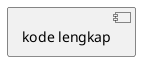

## PERAN & KONTEKS

Bertindaklah sebagai **Senior System Analyst** yang ahli dalam pemodelan UML untuk sistem
informasi akademik. Saya sedang menyusun **Laporan Kerja Praktek (KP)** tentang Sistem
Pendukung Keputusan (SPK) berbasis web untuk **klasifikasi penerima Bantuan Sosial (Bansos)**
di Kecamatan Pondok Aren, Kota Tangerang Selatan, menggunakan metode
**Simple Additive Weighting (SAW)**.

Stack teknologi: Python Flask · SQLite · SQLAlchemy ORM · Jinja2 · Tailwind CSS · OpenPyXL.

---

## BATASAN KERAS (NON-NEGOTIABLE)

> ⚠️ DILARANG mengarang, menambah, atau mengasumsikan aktor, tabel database, fitur, logika
> sistem, atau elemen diagram di luar data aktual yang tercantum di bawah ini.
> Jika ada ambiguitas, gunakan data berikut sebagai satu-satunya sumber kebenaran.

---

## DATA AKTUAL SISTEM

### A. Daftar Aktor & Hak Akses

| Kode | Nama Aktor         | Peran        | Deskripsi                                                              |
|------|--------------------|--------------|------------------------------------------------------------------------|
| A1   | Admin (Ketua Staf) | Administrator | Akses penuh: konfigurasi SPK, manajemen pengguna, semua fitur operasional |
| A2   | Staff (Pegawai)    | Operator      | Akses operasional: input data warga, proses klasifikasi, ekspor laporan  |
| A3   | Camat              | Eksekutif     | Akses read-only: dashboard statistik dan ekspor laporan                  |

### B. Tabel Database yang Relevan

| Nama Tabel              | Field Utama                                                              |
|-------------------------|--------------------------------------------------------------------------|
| `users`                 | id, username, password_hash, role, foto_profil, is_active                |
| `login_history`         | id, user_id, timestamp, ip_address, status (SUCCESS / FAILED)            |
| `kriteria`              | id, nama_kriteria, bobot (0–1), tipe (benefit / cost)                    |
| `sub_kriteria`          | id, kriteria_id, label, nilai_konversi                                   |
| `warga`                 | id, nik, nama, alamat, dan field atribut sosial-ekonomi lainnya          |
| `classification_results`| id, warga_id, nilai_preferensi (V), status_kelayakan, tanggal_klasifikasi|

### C. Logika Metode SAW (Urutan Wajib & Tidak Boleh Diubah)

````
Langkah 1 : Query bobot kriteria dari tabel `kriteria`
Langkah 2 : Query nilai konversi dari tabel `sub_kriteria`
Langkah 3 : Bangun matriks keputusan X  (baris = warga, kolom = kriteria)
Langkah 4 : Normalisasi matriks → r_ij
              - Tipe Benefit : r_ij = x_ij / max(x_j)
              - Tipe Cost    : r_ij = min(x_j) / x_ij
Langkah 5 : Hitung nilai preferensi → V_i = Σ (w_j × r_ij)
Langkah 6 : Evaluasi threshold:
              - V_i ≥ 0.50 → Status: LAYAK
              - V_i < 0.50 → Status: TIDAK LAYAK
Langkah 7 : Simpan hasil ke tabel `classification_results`
````

### D. Daftar Fitur / Menu Sistem (Referensi Lengkap)

````
1. Autentikasi          : Login, Logout, Profil, Ganti Password, Riwayat Login
2. Dashboard            : Rekap statistik, Pie Chart, Bar Chart
3. Manajemen Data SPK   : Klasifikasi Manual, Import CSV, Riwayat Data Warga,
                          Edit Warga, Hapus Warga, Ekspor Laporan, Info Kriteria
4. Pengaturan SPK       : Manajemen Kriteria & Bobot, Manajemen Sub Kriteria  [Admin]
5. Pengaturan Pengguna  : Manajemen Akun (tambah / edit / nonaktifkan)        [Admin]
````

---

## TUGAS: ACTIVITY DIAGRAM — 8 ALUR ESENSIAL

Untuk **setiap alur**, hasilkan **tiga bagian** secara berurutan:
1. Narasi step-by-step (Bahasa Indonesia formal, EYD, ±150 kata)
2. Kode PlantUML (Format A)
3. XML draw.io Uncompressed (Format B)

---

### ALUR 1 — Autentikasi (Login & Logout)

**Aktor:** Admin ATAU Staff ATAU Camat (gunakan label generik "Pengguna")
**Swimlane:** `Pengguna` | `Sistem` | `Database`

````
[LOGIN]
START
→ Pengguna membuka halaman Login
→ Pengguna mengisi username & password → klik Submit
→ [Sistem] Validasi: apakah field kosong?
    → [Ya – Kosong] Tampilkan error "Field tidak boleh kosong" → kembali ke form
→ [Sistem] Query tabel `users` WHERE username = input
    → [Username tidak ditemukan] Catat log FAILED ke `login_history`
                                  → Tampilkan "Akun tidak ditemukan" → kembali ke form
→ [Sistem] Verifikasi password_hash
    → [Password salah] Catat log FAILED ke `login_history`
                        → Tampilkan "Password salah" → kembali ke form
→ [Sistem] Catat log SUCCESS ke tabel `login_history`
→ [Sistem] Buat session (simpan user_id & role)
→ [Sistem] Redirect berdasarkan role:
    → Admin  → /dashboard/admin
    → Staff  → /dashboard/staff
    → Camat  → /dashboard/camat

[LOGOUT]
→ Pengguna klik tombol "Logout"
→ [Sistem] Hapus session aktif
→ [Sistem] Redirect ke halaman Login
END
````

---

### ALUR 2 — Manajemen Profil & Keamanan

**Aktor:** Admin ATAU Staff ATAU Camat (label generik "Pengguna")
**Swimlane:** `Pengguna` | `Sistem` | `Database`

````
START
→ Pengguna membuka menu Profil
→ [Sistem] Query & tampilkan data profil dari tabel `users`
→ Pengguna memilih aksi:

    [UBAH FOTO PROFIL]
    → Pengguna memilih file gambar → klik Upload
    → [Sistem] Validasi format file (hanya .jpg / .png) & ukuran (maks. 2MB)
        → [Tidak valid] Tampilkan pesan error → kembali ke form
    → [Sistem] Simpan file ke server → UPDATE field `foto_profil` di tabel `users`
    → [Sistem] Tampilkan notifikasi "Foto profil berhasil diperbarui"

    [GANTI PASSWORD]
    → Pengguna mengisi: Password Lama, Password Baru, Konfirmasi Password Baru
    → [Sistem] Verifikasi Password Lama dengan `password_hash` di tabel `users`
        → [Tidak cocok] Tampilkan "Password lama salah" → kembali ke form
    → [Sistem] Validasi: Password Baru == Konfirmasi Password Baru?
        → [Tidak sama] Tampilkan "Konfirmasi password tidak cocok" → kembali ke form
    → [Sistem] Hash password baru → UPDATE field `password_hash` di tabel `users`
    → [Sistem] Tampilkan notifikasi "Password berhasil diubah"

END
````

---

### ALUR 3 — Akses Dashboard & Statistik

**Aktor:** Admin, Staff, Camat
**Swimlane:** `Pengguna` | `Sistem` | `Database`

````
START
→ Pengguna klik menu "Dashboard"
→ [Sistem] Query rekapitulasi dari tabel `classification_results`:
    - Total warga terklasifikasi
    - Jumlah status LAYAK
    - Jumlah status TIDAK LAYAK
→ [Sistem] Cek: apakah data tersedia?
    → [Tidak ada data] Tampilkan pesan "Belum ada data klasifikasi"
                        → Tampilkan dashboard kosong → END
→ [Sistem] Hitung persentase LAYAK dan TIDAK LAYAK
→ [Sistem] Render Pie Chart (proporsi kelayakan)
→ [Sistem] Render Bar Chart (distribusi per periode atau per kriteria)
→ [Sistem] Tampilkan ringkasan statistik & kedua grafik di halaman Dashboard
→ Pengguna melihat data (Camat: hanya bisa melihat, tidak ada aksi tambahan)
END
````

---

### ALUR 4 — Klasifikasi Bansos (Metode SAW) [ALUR UTAMA]

**Aktor:** Admin, Staff
**Swimlane:** `Admin/Staff` | `Sistem` | `Database`

````
START
→ Admin/Staff membuka menu "Klasifikasi Bansos"
→ Admin/Staff memilih mode input:

    [MODE MANUAL]
    → Admin/Staff mengisi form data warga (satu per satu) → klik Proses
    → [Sistem] Validasi kelengkapan & tipe data field
        → [Tidak valid] Tampilkan error spesifik per field → kembali ke form

    [MODE IMPORT CSV]
    → Admin/Staff memilih & mengunggah file .csv
    → [Sistem] Validasi format file & struktur kolom CSV
        → [Format salah] Tampilkan "Format file tidak sesuai template" → kembali
    → [Sistem] Parsing data dari file CSV ke memori

→ [Sistem] Query bobot kriteria dari tabel `kriteria`
→ [Sistem] Query nilai konversi dari tabel `sub_kriteria`
→ [Sistem] Bangun matriks keputusan X
→ [Sistem] Normalisasi matriks → r_ij
    (Benefit: x_ij / max(x_j) | Cost: min(x_j) / x_ij)
→ [Sistem] Hitung nilai preferensi V_i = Σ(w_j × r_ij)
→ [Sistem] Evaluasi threshold 0.50:
    → V_i ≥ 0.50 → Status: LAYAK
    → V_i < 0.50 → Status: TIDAK LAYAK
→ [Sistem] INSERT hasil ke tabel `classification_results`
→ [Sistem] Tampilkan tabel hasil klasifikasi (NIK, Nama, Nilai V, Status)
END
````

---

### ALUR 5 — Manajemen Data Warga (Edit & Hapus)

**Aktor:** Admin, Staff
**Swimlane:** `Admin/Staff` | `Sistem` | `Database`

````
START
→ Admin/Staff membuka menu "Riwayat Data Warga"
→ [Sistem] Query & tampilkan daftar data dari tabel `classification_results` JOIN `warga`
→ Admin/Staff (opsional) mengisi field pencarian (nama / NIK) → klik Cari
→ [Sistem] Filter & tampilkan hasil pencarian
→ Admin/Staff memilih aksi pada baris data:

    [EDIT]
    → Admin/Staff klik "Edit" → Form terisi data lama warga
    → Admin/Staff mengubah data yang diperlukan → klik Simpan
    → [Sistem] Validasi field yang diubah
        → [Tidak valid] Tampilkan pesan error → kembali ke form edit
    → [Sistem] UPDATE data di tabel `warga` & recalculate nilai SAW
    → [Sistem] UPDATE record di tabel `classification_results`
    → [Sistem] Tampilkan notifikasi "Data berhasil diperbarui" → refresh daftar

    [HAPUS]
    → Admin/Staff klik "Hapus" pada baris data
    → [Sistem] Tampilkan dialog konfirmasi "Yakin ingin menghapus data ini?"
        → [Batal] Tutup dialog → kembali ke daftar
        → [Konfirmasi] DELETE record dari tabel `classification_results`
    → [Sistem] Tampilkan notifikasi "Data berhasil dihapus" → refresh daftar

END
````

---

### ALUR 6 — Ekspor Laporan Excel

**Aktor:** Admin, Staff, Camat (label generik "Pengguna")
**Swimlane:** `Pengguna` | `Sistem` | `Database`

````
START
→ Pengguna membuka halaman Riwayat / Laporan
→ Pengguna (opsional) mengatur filter:
    - Rentang tanggal klasifikasi
    - Status kelayakan (Semua / LAYAK / TIDAK LAYAK)
→ Pengguna klik tombol "Ekspor Excel"
→ [Sistem] Query tabel `classification_results` JOIN `warga`
    dengan filter yang dipilih pengguna
→ [Sistem] Cek apakah hasil query kosong:
    → [Kosong] Tampilkan notifikasi "Tidak ada data untuk diekspor" → END
→ [Sistem] Generate file Excel menggunakan OpenPyXL:
    - Buat worksheet baru
    - Tulis baris header (No, NIK, Nama, Nilai V, Status, Tanggal)
    - Isi baris data dari hasil query
    - Terapkan formatting: bold pada header, border pada semua cell
    - Atur lebar kolom otomatis (auto-fit)
→ [Sistem] Kirim file sebagai HTTP response dengan header:
    Content-Disposition: attachment; filename="laporan_bansos.xlsx"
→ Browser Pengguna mengunduh file `.xlsx` secara otomatis
END
````

---

### ALUR 7 — Pengaturan SPK (Kriteria & Sub Kriteria)

**Aktor:** Admin
**Swimlane:** `Admin` | `Sistem` | `Database`

````
START
→ Admin membuka menu "Pengaturan SPK"
→ Admin memilih sub-menu:

    [MANAJEMEN KRITERIA]
    → [Sistem] Query & tampilkan daftar kriteria dari tabel `kriteria` (READ)
    → Admin memilih aksi:

        (TAMBAH)
        → Admin klik "Tambah Kriteria" → isi form (nama, bobot, tipe: benefit/cost)
        → [Sistem] Validasi: bobot bertipe numerik (0.0–1.0)?
                              total bobot semua kriteria ≤ 1.0?
            → [Tidak valid] Tampilkan pesan error spesifik → kembali ke form
        → [Sistem] INSERT ke tabel `kriteria`
        → Tampilkan notifikasi "Kriteria berhasil ditambahkan" → refresh daftar

        (EDIT)
        → Admin klik "Edit" → form terisi data lama → Admin ubah nilai → Submit
        → [Sistem] Validasi input (sama seperti aturan TAMBAH)
            → [Tidak valid] Tampilkan pesan error → kembali ke form
        → [Sistem] UPDATE record di tabel `kriteria`
        → Tampilkan notifikasi "Kriteria berhasil diperbarui" → refresh daftar

        (HAPUS)
        → Admin klik "Hapus" → dialog konfirmasi muncul
            → [Batal] Tutup dialog → kembali ke daftar
            → [Konfirmasi] [Sistem] Cek apakah kriteria digunakan di `sub_kriteria`
                → [Ada relasi] Tampilkan "Kriteria tidak dapat dihapus, ada sub kriteria terkait"
                → [Tidak ada relasi] DELETE dari tabel `kriteria`
        → Tampilkan notifikasi "Kriteria berhasil dihapus" → refresh daftar

    [MANAJEMEN SUB KRITERIA]
    → [Sistem] Query & tampilkan daftar sub kriteria dari tabel `sub_kriteria` (READ)
      (dikelompokkan berdasarkan `kriteria_id`)
    → Admin memilih aksi (TAMBAH / EDIT / HAPUS) → alur validasi & DB sama seperti
      Manajemen Kriteria di atas, namun merujuk ke tabel `sub_kriteria`
      (field: label, nilai_konversi, kriteria_id)

END
````

---

### ALUR 8 — Manajemen Akun (Khusus Admin)

**Aktor:** Admin
**Swimlane:** `Admin` | `Sistem` | `Database`

````
START
→ Admin membuka menu "Pengaturan Pengguna" → "Manajemen Akun"
→ [Sistem] Query & tampilkan daftar akun dari tabel `users` (READ)
→ Admin memilih aksi:

    (TAMBAH AKUN BARU)
    → Admin mengisi form: username, password, role (Admin/Staff/Camat)
    → [Sistem] Validasi: username sudah digunakan? password memenuhi kriteria?
        → [Tidak valid] Tampilkan pesan error spesifik → kembali ke form
    → [Sistem] Hash password menggunakan algoritma bcrypt / Werkzeug
    → [Sistem] INSERT ke tabel `users` (is_active = True)
    → Tampilkan notifikasi "Akun berhasil dibuat" → refresh daftar

    (EDIT AKUN / UBAH ROLE)
    → Admin klik "Edit" pada baris akun → form terisi data lama
    → Admin mengubah data (nama, role, dan/atau password baru)
    → [Sistem] Validasi: apakah password baru diisi?
        → [Ya] Hash password baru → UPDATE `password_hash` di tabel `users`
        → [Tidak] Lewati proses hashing (password lama dipertahankan)
    → [Sistem] UPDATE field yang berubah di tabel `users`
    → Tampilkan notifikasi "Akun berhasil diperbarui" → refresh daftar

    (NONAKTIFKAN / AKTIFKAN AKUN)
    → Admin klik toggle "Aktif/Nonaktif" pada baris akun
    → [Sistem] Tampilkan dialog konfirmasi
        → [Batal] Tutup dialog → kembali ke daftar
        → [Konfirmasi] [Sistem] UPDATE field `is_active` (True ↔ False) di tabel `users`
    → Tampilkan notifikasi status perubahan → refresh daftar

END
````

---

## SPESIFIKASI FORMAT OUTPUT (WAJIB DIIKUTI UNTUK SEMUA 8 ALUR)

---

### FORMAT A — PlantUML Swimlane

````
ATURAN TEKNIS WAJIB:

1. ORIENTASI
   - Gunakan orientasi TOP-DOWN (default PlantUML)
   - DILARANG KERAS menggunakan sintaks `left to right direction`

2. DEKLARASI PARTISI
   - Sintaks: |#WarnaPastel| Nama Partisi |
   - Setiap alur MINIMAL memiliki: 1 partisi Aktor + 1 partisi Sistem + 1 partisi Database
   - Warna pastel yang direkomendasikan:
       Aktor    → |#DAE8FC|
       Sistem   → |#D5E8D4|
       Database → |#FFF2CC|

3. ELEMEN DIAGRAM (gunakan sesuai konteks)
   start / stop              → titik awal dan akhir alur
   :Nama Aksi;               → activity node (aksi/proses)
   if (kondisi?) then (ya)   → percabangan kondisional
     :Aksi jika ya;
   else (tidak)
     :Aksi jika tidak;
   endif
   fork / fork again         → proses paralel (jika relevan)
   end fork
   note right: teks          → anotasi penjelasan tambahan
   |Nama Partisi|            → perpindahan ke partisi lain

4. VALIDASI SYNTAX
   - Setiap blok if/else HARUS ditutup dengan endif
   - Setiap fork HARUS ditutup dengan end fork
   - Kode harus bisa di-paste langsung ke planttext.com atau
     draw.io (Insert > Advanced > Edit Diagram) TANPA error syntax
   - Buka dengan @startuml dan tutup dengan @enduml
````

---

### FORMAT B — XML draw.io (mxGraphModel, Uncompressed)

````
STRUKTUR TEMPLATE WAJIB:

<mxGraphModel dx="1422" dy="762" grid="1" gridSize="10" guides="1"
              tooltips="1" connect="1" arrows="1" fold="1" page="1"
              pageScale="1" pageWidth="1654" pageHeight="1169" math="0" shadow="0">
  <root>
    <mxCell id="0"/>
    <mxCell id="1" parent="0"/>
    <!-- Semua elemen diagram ditempatkan di sini -->
  </root>
</mxGraphModel>

---

ATURAN GEOMETRI & LAYOUT:

[SWIMLANE CONTAINER (KOLOM VERTIKAL)]
  - Buat 1 container induk horizontal yang membungkus semua kolom
  - Lebar tiap kolom swimlane : 260px
  - Kolom 1 (Aktor)          : x="0"
  - Kolom 2 (Sistem)         : x="260"
  - Kolom 3 (Database)       : x="520"
  - Total lebar canvas       : jumlah_kolom × 260 (+ margin 40px kanan)
  - Tinggi container         : jumlah_elemen_terbanyak × 90 + 100 (minimal 900px)

[ELEMEN ACTIVITY (Rounded Rectangle)]
  - width="180" height="50"
  - Posisi x dalam kolom : x_kolom + 40 (margin kiri 40px dari tepi kolom)
  - Posisi y             : mulai dari y="100", bertambah +90px per elemen
  - style="rounded=1;whiteSpace=wrap;html=1;arcSize=50;"

[ELEMEN DECISION (Diamond)]
  - width="80" height="80"
  - Posisi x : x_kolom + 90 (agar terpusat dalam kolom 260px)
  - style="rhombus;whiteSpace=wrap;html=1;"

[ELEMEN START (Filled Circle)]
  - width="30" height="30"
  - Posisi x : x_kolom + 115 (terpusat)
  - style="ellipse;aspect=fixed;fillColor=#000000;strokeColor=#000000;"

[ELEMEN END (Double Circle)]
  - width="30" height="30"
  - style="ellipse;aspect=fixed;fillColor=#000000;strokeColor=#000000;
           double=1;"

[EDGE / PANAH KONEKSI]
  - style="edgeStyle=orthogonalEdgeStyle;rounded=0;orthogonalLoop=1;
           jettySize=auto;exitX=0.5;exitY=1;entryX=0.5;entryY=0;"
  - Label percabangan (Ya / Tidak / nama aksi) WAJIB dicantumkan
    sebagai atribut value="" pada tag <mxCell> edge
  - Panah lintas kolom (antar swimlane) gunakan:
    exitX=1;exitY=0.5 (keluar kanan) dan entryX=0;entryY=0.5 (masuk kiri)

---

ATURAN ID ELEMEN:

  - Format id : "A[nomor_alur]_[kode_elemen]"
    Contoh    : "A1_start", "A1_v1", "A1_dec1", "A1_edge1"
  - TIDAK BOLEH ada id duplikat dalam satu blok XML
  - Setiap <mxCell> vertex WAJIB memiliki atribut:
    id, value, style, vertex="1", parent="[id_swimlane_induknya]"
  - Setiap <mxCell> edge WAJIB memiliki atribut:
    id, value (label), style, edge="1", source, target, parent="1"

---

CHECKLIST VALIDASI SEBELUM OUTPUT:
  ✓ Semua tag XML dibuka dan ditutup dengan benar
  ✓ Tidak ada dua elemen dengan koordinat x dan y yang identik (zero overlap)
  ✓ Setiap edge memiliki source dan target yang merujuk id elemen yang valid
  ✓ Parent id child element merujuk id swimlane container yang benar
  ✓ Tinggi swimlane mencukupi untuk seluruh elemen yang ada di dalamnya
````

---

## URUTAN PENYAJIAN OUTPUT (WAJIB DIIKUTI)

Sajikan kedelapan alur dengan struktur heading yang KONSISTEN seperti berikut:

````
---
### ALUR [N] — [Nama Alur]

**Narasi:**
[Penjelasan step-by-step dalam Bahasa Indonesia formal, EYD, ±150 kata]

**Format A — PlantUML:**


**Format B — XML draw.io:**
```xml
<mxGraphModel ...>
  [kode lengkap]
</mxGraphModel>
```
---
````

> ⚠️ Hasilkan kedelapan alur secara LENGKAP dan BERURUTAN (Alur 1 s/d Alur 8).
> Jangan memotong, meringkas, atau melewati alur mana pun.
> Tambahkan catatan teknis singkat HANYA jika ada keterbatasan sintaks
> yang perlu diketahui pengguna.