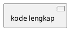

## PERAN & KONTEKS

Bertindaklah sebagai **Senior Database Administrator dan System Analyst** yang ahli dalam
perancangan basis data relasional untuk sistem informasi akademik. Saya sedang menyusun
**Laporan Kerja Praktek (KP)** tentang Sistem Pendukung Keputusan (SPK) berbasis web untuk
**klasifikasi penerima Bantuan Sosial (Bansos)** di Kecamatan Pondok Aren, Kota Tangerang
Selatan, menggunakan metode **Simple Additive Weighting (SAW)**.

Stack teknologi: Python Flask · SQLite · SQLAlchemy ORM · Jinja2 · Tailwind CSS · OpenPyXL.
ERD yang dihasilkan merepresentasikan **skema basis data fisik (physical schema) SQLite**,
bukan model konseptual atau logikal.

---

## BATASAN KERAS (NON-NEGOTIABLE)

> ⚠️ DILARANG KERAS mengarang, menambah, atau mengasumsikan tabel, kolom, tipe data,
> constraint, atau relasi di luar skema fisik yang tercantum di bawah ini.
> Seluruh output harus 100% bersumber dari definisi skema berikut — tidak lebih, tidak kurang.
> Pelanggaran terhadap aturan ini membuat output tidak valid untuk laporan akademik.

---

## DATA AKTUAL — SKEMA BASIS DATA FISIK (SUMBER KEBENARAN TUNGGAL)

### TABEL 1: `users`
**Peran:** Menyimpan data akun seluruh pengguna sistem (Admin, Staff, Camat)

| No | Nama Kolom    | Tipe Data SQLite | Constraint                        |
|----|---------------|------------------|-----------------------------------|
| 1  | id            | INTEGER          | PRIMARY KEY, AUTOINCREMENT        |
| 2  | username      | VARCHAR          | UNIQUE, NOT NULL                  |
| 3  | password_hash | VARCHAR          | NOT NULL                          |
| 4  | nama_lengkap  | VARCHAR          | NOT NULL                          |
| 5  | foto_profil   | VARCHAR          | NULLABLE (path file gambar)       |
| 6  | role          | VARCHAR          | NOT NULL ('Admin'/'Staff'/'Camat')|
| 7  | is_active     | BOOLEAN          | NOT NULL, DEFAULT 1 (True)        |
| 8  | created_at    | DATETIME         | NOT NULL, DEFAULT CURRENT_TIMESTAMP|

**Relasi keluar:**
- `users.id` ← FK dari `login_history.user_id` (One-to-Many)

---

### TABEL 2: `login_history`
**Peran:** Mencatat riwayat setiap percobaan login ke sistem

| No | Nama Kolom | Tipe Data SQLite | Constraint                              |
|----|------------|------------------|-----------------------------------------|
| 1  | id         | INTEGER          | PRIMARY KEY, AUTOINCREMENT              |
| 2  | user_id    | INTEGER          | FOREIGN KEY → users.id, NOT NULL        |
| 3  | login_time | DATETIME         | NOT NULL, DEFAULT CURRENT_TIMESTAMP     |
| 4  | ip_address | VARCHAR          | NULLABLE                                |
| 5  | user_agent | TEXT             | NULLABLE                                |

**Relasi masuk:**
- `login_history.user_id` → FK ke `users.id` (Many-to-One)

---

### TABEL 3: `kriteria`
**Peran:** Menyimpan definisi kriteria penilaian yang digunakan dalam metode SAW

| No | Nama Kolom | Tipe Data SQLite | Constraint                        |
|----|------------|------------------|-----------------------------------|
| 1  | id         | INTEGER          | PRIMARY KEY, AUTOINCREMENT        |
| 2  | kode       | VARCHAR          | UNIQUE, NOT NULL                  |
| 3  | nama       | VARCHAR          | NOT NULL                          |
| 4  | tipe       | VARCHAR          | NOT NULL ('benefit' / 'cost')     |
| 5  | bobot      | FLOAT            | NOT NULL (nilai 0.0 hingga 1.0)   |

**Relasi keluar:**
- `kriteria.id` ← FK dari `sub_kriteria.kriteria_id` (One-to-Many)

---

### TABEL 4: `sub_kriteria`
**Peran:** Menyimpan label dan nilai konversi skor untuk setiap sub-kriteria turunan

| No | Nama Kolom  | Tipe Data SQLite | Constraint                         |
|----|-------------|------------------|------------------------------------|
| 1  | id          | INTEGER          | PRIMARY KEY, AUTOINCREMENT         |
| 2  | kriteria_id | INTEGER          | FOREIGN KEY → kriteria.id, NOT NULL|
| 3  | nama        | VARCHAR          | NOT NULL (label sub kriteria)      |
| 4  | skor        | INTEGER          | NOT NULL (nilai konversi)          |

**Relasi masuk:**
- `sub_kriteria.kriteria_id` → FK ke `kriteria.id` (Many-to-One)

---

### TABEL 5: `classification_results`
**Peran:** Menyimpan data lengkap warga beserta hasil kalkulasi SAW dan status kelayakan.
**Catatan desain penting:** Tabel ini secara fisik **berdiri sendiri (standalone)** —
tidak memiliki Foreign Key ke tabel manapun. Ini adalah keputusan desain yang disengaja
dan harus dijelaskan dalam narasi.

| No | Nama Kolom          | Tipe Data SQLite | Constraint / Keterangan                    |
|----|---------------------|------------------|--------------------------------------------|
| 1  | id                  | INTEGER          | PRIMARY KEY, AUTOINCREMENT                 |
| 2  | nik                 | VARCHAR          | NOT NULL (Nomor Induk Kependudukan)        |
| 3  | no_kk               | VARCHAR          | NOT NULL (Nomor Kartu Keluarga)            |
| 4  | nama                | VARCHAR          | NOT NULL                                   |
| 5  | pekerjaan           | VARCHAR          | NULLABLE                                   |
| 6  | alamat              | TEXT             | NULLABLE                                   |
| 7  | kelurahan           | VARCHAR          | NULLABLE                                   |
| 8  | penghasilan         | VARCHAR          | NOT NULL (input kriteria SAW)              |
| 9  | jumlah_tanggungan   | VARCHAR          | NOT NULL (input kriteria SAW)              |
| 10 | status_rumah        | VARCHAR          | NOT NULL (input kriteria SAW)              |
| 11 | kondisi_bangunan    | VARCHAR          | NOT NULL (input kriteria SAW)              |
| 12 | sumber_air          | VARCHAR          | NOT NULL (input kriteria SAW)              |
| 13 | daya_listrik        | VARCHAR          | NOT NULL (input kriteria SAW)              |
| 14 | kriteria_details    | TEXT             | JSON string — skor tiap kriteria per warga |
| 15 | skor_saw            | FLOAT            | Hasil akhir V_i = Σ(w_j × r_ij)          |
| 16 | hasil_klasifikasi   | VARCHAR          | 'LAYAK' atau 'TIDAK LAYAK'                 |
| 17 | alasan              | TEXT             | NULLABLE (penjelasan hasil)                |
| 18 | created_at          | DATETIME         | NOT NULL, DEFAULT CURRENT_TIMESTAMP        |

**Relasi:** TIDAK ADA Foreign Key keluar maupun masuk (standalone table by design).

---

## PETA RELASI ANTAR TABEL (RINGKASAN WAJIB DIIKUTI)

````
users (1) ──────────────── (0..*) login_history
  └── users.id = login_history.user_id  [FK]

kriteria (1) ───────────── (1..*) sub_kriteria
  └── kriteria.id = sub_kriteria.kriteria_id  [FK]

classification_results ──── [STANDALONE — tidak ada FK ke tabel lain]
````

---

## TUGAS: ERD — SATU DIAGRAM UTUH (5 TABEL)

Hasilkan **tiga bagian output** secara berurutan:

---

### OUTPUT 1 — Narasi Akademis ERD

Tulis penjelasan naratif dalam **Bahasa Indonesia formal (EYD)**, mencakup:

1. **Deskripsi per entitas** — fungsi dan peran masing-masing tabel dalam sistem
2. **Analisis Primary Key** — jelaskan peran PK di setiap tabel sebagai identifikasi unik record
3. **Analisis Foreign Key & Kardinalitas** — uraikan setiap relasi FK dengan tipe kardinalitasnya:
   - `users` → `login_history` : One-to-Many
     *(satu pengguna dapat memiliki nol atau lebih riwayat login)*
   - `kriteria` → `sub_kriteria` : One-to-Many
     *(satu kriteria harus memiliki satu atau lebih sub kriteria)*
4. **Justifikasi desain standalone** — jelaskan mengapa `classification_results` tidak
   memiliki FK ke `users`: ungkapkan argumen teknis dan akademis, antara lain:
   - Data warga bersifat transaksional dan perlu tetap ada meski akun operator dihapus
   - Mencegah orphaned record pada hasil klasifikasi
   - Memudahkan ekspor dan pemrosesan data secara mandiri
   - Informasi operator dapat dicatat di kolom `alasan` atau field non-FK lainnya
5. **Panjang narasi:** ±250–350 kata, padat dan akademis

---

### OUTPUT 2 — Format PlantUML ERD (Crow's Foot Notation)

````
ATURAN TEKNIS WAJIB:

1. DEKLARASI ENTITAS
   Gunakan blok sintaks:
   entity "NamaTabel" as ALIAS {
     * kolom_pk : tipe  <<PK>>
     --
     # kolom_fk : tipe  <<FK>>
     --
     kolom_biasa : tipe
   }
   Pemisah section dengan `--` wajib digunakan

2. SIMBOL ATRIBUT
   * (asterisk)  → kolom dengan constraint PRIMARY KEY
   # (hash)      → kolom dengan constraint FOREIGN KEY
   (tanpa simbol) → kolom biasa (NOT NULL atau NULLABLE)

3. NOTASI RELASI CROW'S FOOT (standar PlantUML ERD)
   One-to-Many (mandatory)      : ALIAS_A ||--o{ ALIAS_B : "label"
   One-to-Many (wajib ada anak) : ALIAS_A ||--|{ ALIAS_B : "label"
   Penjelasan simbol:
   ||  → tepat satu (one, mandatory)
   o{  → nol atau banyak (zero or many)
   |{  → satu atau banyak (one or many)

   Relasi wajib yang harus muncul:
   USERS      ||--o{ LOGIN_HIST  : "memiliki"
   KRITERIA   ||--|{ SUB_KRIT    : "memiliki"

   Untuk classification_results yang standalone:
   Tambahkan note: note "Standalone Table\n(No FK by design)" as N1
                   CLASSRESULT .. N1

4. LABEL ATRIBUT
   Sertakan tipe data SQLite yang sesuai:
   INTEGER, VARCHAR, FLOAT, BOOLEAN, DATETIME, TEXT

5. VALIDASI SYNTAX
   - Buka dengan @startuml dan tutup dengan @enduml
   - Tambahkan: !define TABLE(x) entity x << (T, #FFAAAA) >>
     jika ingin memberi visual tabel yang lebih jelas (opsional)
   - Kode harus bisa di-paste ke planttext.com atau
     draw.io (Insert > Advanced > Edit Diagram) TANPA error syntax
````

---

### OUTPUT 3 — XML draw.io (mxGraphModel, Uncompressed)

````
STRUKTUR TEMPLATE WAJIB:

<mxGraphModel dx="1422" dy="762" grid="1" gridSize="10" guides="1"
              tooltips="1" connect="1" arrows="1" fold="1" page="1"
              pageScale="1" pageWidth="1654" pageHeight="1169" math="0" shadow="0">
  <root>
    <mxCell id="0"/>
    <mxCell id="1" parent="0"/>
    <!-- Semua elemen diagram di sini -->
  </root>
</mxGraphModel>

---

ATURAN POSISI TABEL (GRID SPASIAL — WAJIB DIIKUTI PERSIS):

  ┌────────────────────────────────────────────────────────┐
  │  users           (x=40,  y=40)                         │
  │  login_history   (x=480, y=40)                         │
  │                                                        │
  │  kriteria        (x=40,  y=420)                        │
  │  sub_kriteria    (x=480, y=420)                        │
  │                                                        │
  │  classification_results  (x=240, y=800)                │
  └────────────────────────────────────────────────────────┘

  Lebar semua tabel: width="320"
  Tinggi tabel: dihitung = (jumlah_kolom × 26) + 30 (header)
    - users                 : 8 kolom  → height="238"
    - login_history         : 5 kolom  → height="160"
    - kriteria              : 5 kolom  → height="160"
    - sub_kriteria          : 4 kolom  → height="134"
    - classification_results: 18 kolom → height="498"

---

STRUKTUR ELEMEN XML PER TABEL:

Setiap tabel ERD terdiri dari 1 container + N baris kolom sebagai child:

  A. CONTAINER TABEL (swimlane/header)
     <mxCell id="tbl_users" value="users" style="shape=table;startSize=30;
             container=1;collapsible=1;childLayout=tableLayout;
             fillColor=#dae8fc;strokeColor=#6c8ebf;fontStyle=1;fontSize=12;"
             vertex="1" parent="1">
       <mxGeometry x="40" y="40" width="320" height="238" as="geometry"/>
     </mxCell>

  B. BARIS KOLOM (child dari container — satu <mxCell> per kolom)
     <mxCell id="tbl_users_id" value="" style="shape=tableRow;horizontal=0;
             startSize=0;swimlaneHead=0;swimlaneBody=0;fillColor=none;
             collapsible=0;dropTarget=0;strokeColor=#6c8ebf;"
             vertex="1" parent="tbl_users">
       <mxGeometry y="30" width="320" height="26" as="geometry"/>
     </mxCell>

     Setiap baris kolom memiliki DUA child label:
     - Label nama kolom (kiri):
       <mxCell id="tbl_users_id_name" value="🔑 id" style="shape=partialRectangle;
               connectable=0;fillColor=none;top=0;left=0;bottom=0;right=0;
               fontStyle=1;" vertex="1" parent="tbl_users_id">
         <mxGeometry width="160" height="26" as="geometry"/>
       </mxCell>
     - Label tipe data (kanan):
       <mxCell id="tbl_users_id_type" value="INTEGER PK" style="shape=partialRectangle;
               connectable=0;fillColor=none;top=0;left=0;bottom=0;right=0;
               align=right;" vertex="1" parent="tbl_users_id">
         <mxGeometry x="160" width="160" height="26" as="geometry"/>
       </mxCell>

  IKON LABEL UNTUK KOLOM KHUSUS (gunakan sebagai prefix value nama kolom):
  - Primary Key : "🔑 nama_kolom"  (atau "[PK]" jika emoji tidak support)
  - Foreign Key : "🔗 nama_kolom"  (atau "[FK]" jika emoji tidak support)
  - Kolom biasa : "  nama_kolom"   (tanpa prefix)

---

WARNA FILL PER TABEL (visual berbeda antar tabel):

  users                 : fillColor=#dae8fc; strokeColor=#6c8ebf  (biru muda)
  login_history         : fillColor=#d5e8d4; strokeColor=#82b366  (hijau muda)
  kriteria              : fillColor=#fff2cc; strokeColor=#d6b656  (kuning muda)
  sub_kriteria          : fillColor=#ffe6cc; strokeColor=#d79b00  (oranye muda)
  classification_results: fillColor=#f8cecc; strokeColor=#b85450  (merah muda)

---

ATURAN GARIS RELASI (EDGES — CROW'S FOOT):

  Gunakan style Crow's Foot draw.io untuk setiap relasi FK:

  RELASI 1: users → login_history (One-to-Many)
  <mxCell id="edge_users_login" value="memiliki"
          style="edgeStyle=entityRelationEdgeStyle;endArrow=ERmany;
                 startArrow=ERone;exitX=1;exitY=0.5;entryX=0;entryY=0.5;"
          edge="1" source="tbl_users_id" target="tbl_lh_userid" parent="1">
    <mxGeometry relative="1" as="geometry"/>
  </mxCell>
  (source: baris id di tabel users | target: baris user_id di tabel login_history)

  RELASI 2: kriteria → sub_kriteria (One-to-Many mandatory)
  <mxCell id="edge_kriteria_sub" value="memiliki"
          style="edgeStyle=entityRelationEdgeStyle;endArrow=ERmandOne;
                 startArrow=ERone;exitX=1;exitY=0.5;entryX=0;entryY=0.5;"
          edge="1" source="tbl_kriteria_id" target="tbl_sub_kriteriaid" parent="1">
    <mxGeometry relative="1" as="geometry"/>
  </mxCell>
  (source: baris id di tabel kriteria | target: baris kriteria_id di tabel sub_kriteria)

  CATATAN STANDALONE untuk classification_results:
  Tambahkan elemen <mxCell> label teks sebagai anotasi:
  <mxCell id="note_standalone" value="⚠ Standalone Table&#xa;(No FK by design)"
          style="text;html=1;strokeColor=#b85450;fillColor=#f8cecc;
                 align=center;verticalAlign=middle;whiteSpace=wrap;rounded=1;"
          vertex="1" parent="1">
    <mxGeometry x="620" y="880" width="200" height="60" as="geometry"/>
  </mxCell>

  Tambahkan garis putus-putus dari anotasi ke tabel classification_results:
  style="endArrow=none;dashed=1;strokeColor=#b85450;"

---

ATURAN ID ELEMEN:

  Format: "tbl_[nama]_[kode_kolom]"
  Contoh:
    "tbl_users"           → container tabel users
    "tbl_users_id"        → baris kolom id di tabel users
    "tbl_users_id_name"   → label nama kolom id
    "tbl_users_id_type"   → label tipe data kolom id
    "tbl_lh"              → container tabel login_history  (singkatan)
    "tbl_lh_userid"       → baris kolom user_id di login_history
    "edge_users_login"    → garis relasi users → login_history

  TIDAK BOLEH ada id duplikat dalam satu file XML

---

CHECKLIST VALIDASI SEBELUM OUTPUT:
  ✓ Semua 5 tabel muncul sesuai grid posisi yang ditentukan
  ✓ Tidak ada tabel yang tumpang tindih (koordinat berbeda per tabel)
  ✓ Semua kolom per tabel tercantum lengkap sesuai skema di atas
  ✓ Kolom PK diberi penanda "🔑" atau "[PK]"
  ✓ Kolom FK diberi penanda "🔗" atau "[FK]"
  ✓ Tinggi container mencukupi untuk semua baris kolom
  ✓ Relasi users→login_history dan kriteria→sub_kriteria dibuat sebagai edge FK
  ✓ classification_results memiliki anotasi "Standalone Table"
  ✓ Setiap edge source dan target merujuk ke baris kolom PK/FK yang benar
  ✓ Semua tag XML dibuka dan ditutup dengan benar
  ✓ Line break dalam value menggunakan &#xa;
````

---

## URUTAN PENYAJIAN OUTPUT (WAJIB DIIKUTI)

````
## OUTPUT 1 — Narasi Akademis ERD
[teks narasi ±250–350 kata dalam Bahasa Indonesia formal]

---

## OUTPUT 2 — Format PlantUML (Crow's Foot ERD)


---

## OUTPUT 3 — XML draw.io (mxGraphModel ERD)
```xml
<mxGraphModel ...>
  [kode lengkap]
</mxGraphModel>
```
````

> ⚠️ Hasilkan ketiga output secara **LENGKAP** tanpa pemotongan.
> Jangan menambahkan tabel atau kolom di luar yang telah didefinisikan.
> Tambahkan catatan teknis singkat **HANYA** jika ada keterbatasan sintaks
> yang perlu diketahui pengguna.