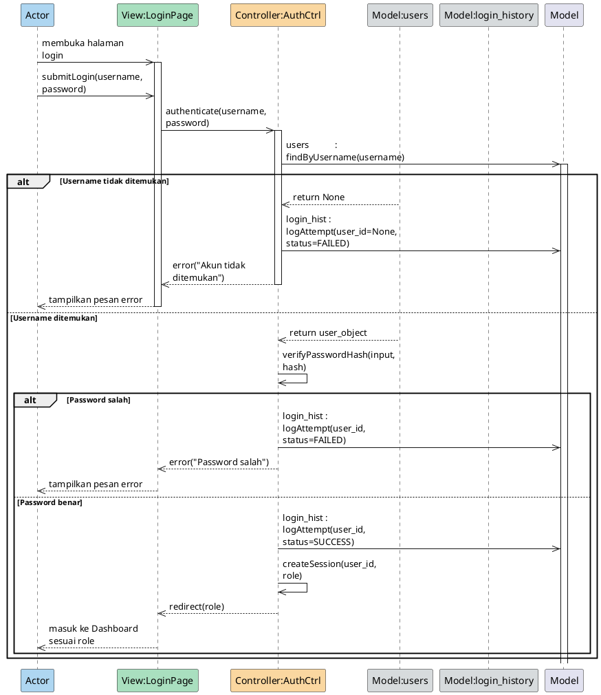
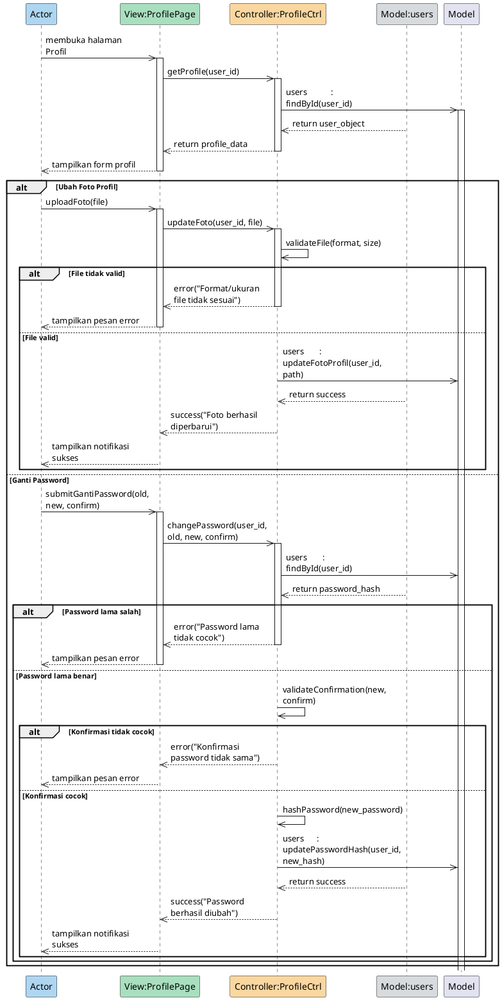
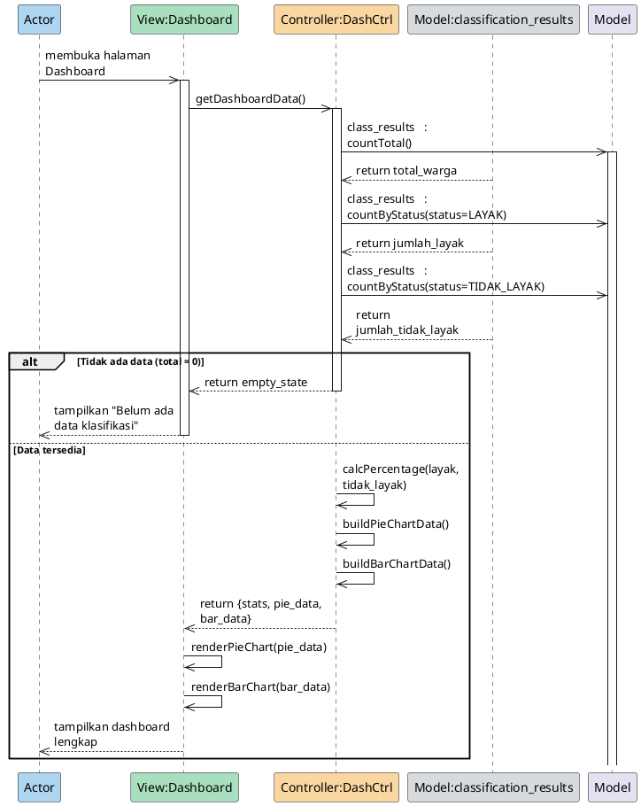
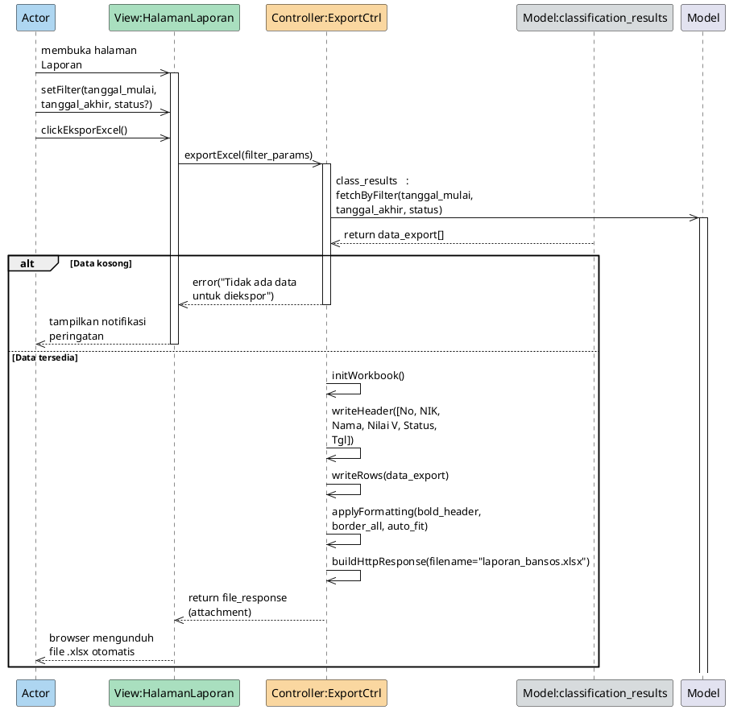
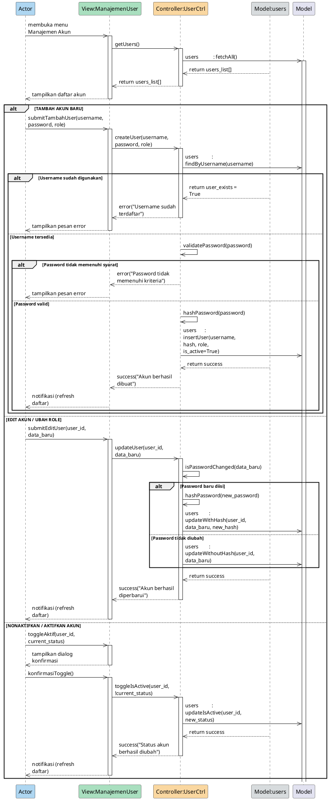

```plantuml
@startuml
skinparam maxMessageSize 150
participant "Actor" as Admin #AED6F1
participant "View:PengaturanSPK" as View #A9DFBF
participant "Controller:SPKCtrl" as Controller #FAD7A0
participant "Model:kriteria" as Model_kriteria #D7DBDD
participant "Model:sub_kriteria" as Model_sub_kriteria #D7DBDD
Admin ->> View : membuka menu Pengaturan SPK
activate View
Admin ->> View : pilih sub-menu (Kriteria / Sub Kriteria)
alt Manajemen Kriteria
View ->> Controller : getKriteria()
activate Controller
Controller ->> Model : kriteria      : fetchAll()
activate Model
Model_kriteria -->> Controller : return kriteria_list[]
Controller -->> View : return kriteria_list[]
deactivate Controller
View -->> Admin : tampilkan daftar kriteria
deactivate View
alt TAMBAH
Admin ->> View : submitKriteria(nama, bobot, tipe)
activate View
View ->> Controller : createKriteria(nama, bobot, tipe)
activate Controller
Controller ->> Controller : validateBobot(bobot, total_existing)
alt Tidak valid
Controller -->> View : error("Bobot tidak valid")
deactivate Controller
View -->> Admin : tampilkan pesan error
deactivate View
else Valid
Controller ->> Model : kriteria   : insertKriteria(nama, bobot, tipe)
Model_kriteria -->> Controller : return success
Controller -->> View : success("Kriteria berhasil ditambahkan")
View -->> Admin : notifikasi (refresh daftar)
end
else EDIT
Admin ->> View : submitEditKriteria(id, nama, bobot, tipe)
activate View
View ->> Controller : updateKriteria(id, nama, bobot, tipe)
activate Controller
Controller ->> Controller : validateBobot(bobot, total_excluding_id)
alt Tidak valid
Controller -->> View : error("Bobot tidak valid")
deactivate Controller
View -->> Admin : tampilkan pesan error
deactivate View
else Valid
Controller ->> Model : kriteria   : updateById(id, nama, bobot, tipe)
Model_kriteria -->> Controller : return success
Controller -->> View : success("Kriteria berhasil diperbarui")
View -->> Admin : notifikasi (refresh daftar)
end
else HAPUS
Admin ->> View : clickHapus(kriteria_id)
activate View
View ->> Controller : deleteKriteria(kriteria_id)
activate Controller
Controller ->> Model : sub_kriteria : checkRelasi(kriteria_id)
alt Ada sub kriteria terkait
Model_sub_kriteria -->> Controller : return relasi_exists = True
Controller -->> View : error("Ada sub kriteria terkait")
deactivate Controller
View -->> Admin : tampilkan pesan error
deactivate View
else Tidak ada relasi
Controller ->> Model : kriteria   : deleteById(kriteria_id)
Model_kriteria -->> Controller : return success
Controller -->> View : success("Kriteria berhasil dihapus")
View -->> Admin : notifikasi (refresh daftar)
end
end
else Manajemen Sub Kriteria
View ->> Controller : getSubKriteria()
activate Controller
Controller ->> Model : sub_kriteria  : fetchAll()
Model_sub_kriteria -->> Controller : return sub_kriteria_list[]
Controller -->> View : return sub_kriteria_list[]
deactivate Controller
View -->> Admin : tampilkan daftar sub kriteria
alt TAMBAH
Admin ->> View : submitSubKriteria(kriteria_id, label, nilai)
activate View
View ->> Controller : createSubKriteria(kriteria_id, label, nilai)
activate Controller
Controller ->> Controller : validateNilaiKonversi(nilai)
alt Tidak valid
Controller -->> View : error("Nilai konversi harus numerik")
deactivate Controller
View -->> Admin : tampilkan pesan error
deactivate View
else Valid
Controller ->> Model : sub_kriteria: insertSubKriteria(kriteria_id, label, nilai)
Model_sub_kriteria -->> Controller : return success
Controller -->> View : success("Sub kriteria berhasil ditambahkan")
View -->> Admin : notifikasi (refresh daftar)
end
else EDIT / HAPUS
Admin ->> View : submitEditHapus()
activate View
View ->> Controller : updateOrDelete()
activate Controller
Controller ->> Model : sub_kriteria : execute()
Model_sub_kriteria -->> Controller : return success
Controller -->> View : success()
deactivate Controller
View -->> Admin : notifikasi (refresh daftar)
deactivate View
end
end
@enduml
```

# Sequence Diagrams — Sistem Klasifikasi Bansos (Metode SAW)

Dokumen ini berisi 8 sequence diagram esensial beserta narasi, kode PlantUML, dan XML uncompressed Draw.io sesuai dengan format yang telah ditentukan.


### SEQUENCE 1 — Autentikasi (Login)

**Narasi:**
Pengguna mengakses halaman login dan mengirimkan username serta password. View meneruskan data autentikasi ke Controller. Controller kemudian mencari username pada Model users. Jika username tidak ditemukan, sistem mencatat percobaan gagal pada riwayat login dan menampilkan pesan error kepada pengguna. Jika username ditemukan, Controller memverifikasi kecocokan password hash. Jika password salah, percobaan gagal dicatat dan pesan error ditampilkan. Namun, jika password benar, Controller mencatat riwayat login yang sukses, membuat sesi pengguna berdasarkan peran (role), dan mengarahkan pengguna ke halaman Dashboard yang sesuai.


**Format A — PlantUML:**



**Format B — XML draw.io:**
```xml
<mxGraphModel dx="1422" dy="762" grid="1" gridSize="10" guides="1" tooltips="1" connect="1" arrows="1" fold="1" page="1" pageScale="1" pageWidth="1654" pageHeight="1169" math="0" shadow="0">
  <root>
    <mxCell id="0"/>
    <mxCell id="1" parent="0"/>
    <mxCell id="S1_header_0" value="Actor" style="rounded=1;whiteSpace=wrap;html=1;fillColor=#AED6F1;" vertex="1" parent="1">
      <mxGeometry x="20" y="20" width="160" height="50" as="geometry"/>
    </mxCell>
    <mxCell id="S1_line_0" style="endArrow=none;dashed=1;strokeColor=#000000;" edge="1" parent="1" source="S1_header_0">
      <mxGeometry relative="1" as="geometry">
        <mxPoint x="100" y="70" as="sourcePoint"/>
        <mxPoint x="100" y="1180" as="targetPoint"/>
      </mxGeometry>
    </mxCell>
    <mxCell id="S1_header_1" value="View:LoginPage" style="rounded=1;whiteSpace=wrap;html=1;fillColor=#A9DFBF;" vertex="1" parent="1">
      <mxGeometry x="220" y="20" width="160" height="50" as="geometry"/>
    </mxCell>
    <mxCell id="S1_line_1" style="endArrow=none;dashed=1;strokeColor=#000000;" edge="1" parent="1" source="S1_header_1">
      <mxGeometry relative="1" as="geometry">
        <mxPoint x="300" y="70" as="sourcePoint"/>
        <mxPoint x="300" y="1180" as="targetPoint"/>
      </mxGeometry>
    </mxCell>
    <mxCell id="S1_header_2" value="Controller:AuthCtrl" style="rounded=1;whiteSpace=wrap;html=1;fillColor=#FAD7A0;" vertex="1" parent="1">
      <mxGeometry x="420" y="20" width="160" height="50" as="geometry"/>
    </mxCell>
    <mxCell id="S1_line_2" style="endArrow=none;dashed=1;strokeColor=#000000;" edge="1" parent="1" source="S1_header_2">
      <mxGeometry relative="1" as="geometry">
        <mxPoint x="500" y="70" as="sourcePoint"/>
        <mxPoint x="500" y="1180" as="targetPoint"/>
      </mxGeometry>
    </mxCell>
    <mxCell id="S1_header_3" value="Model:users" style="rounded=1;whiteSpace=wrap;html=1;fillColor=#D7DBDD;" vertex="1" parent="1">
      <mxGeometry x="620" y="20" width="160" height="50" as="geometry"/>
    </mxCell>
    <mxCell id="S1_line_3" style="endArrow=none;dashed=1;strokeColor=#000000;" edge="1" parent="1" source="S1_header_3">
      <mxGeometry relative="1" as="geometry">
        <mxPoint x="700" y="70" as="sourcePoint"/>
        <mxPoint x="700" y="1180" as="targetPoint"/>
      </mxGeometry>
    </mxCell>
    <mxCell id="S1_header_4" value="Model:login_history" style="rounded=1;whiteSpace=wrap;html=1;fillColor=#D7DBDD;" vertex="1" parent="1">
      <mxGeometry x="820" y="20" width="160" height="50" as="geometry"/>
    </mxCell>
    <mxCell id="S1_line_4" style="endArrow=none;dashed=1;strokeColor=#000000;" edge="1" parent="1" source="S1_header_4">
      <mxGeometry relative="1" as="geometry">
        <mxPoint x="900" y="70" as="sourcePoint"/>
        <mxPoint x="900" y="1180" as="targetPoint"/>
      </mxGeometry>
    </mxCell>
    <mxCell id="S1_block_1" value="[alt] Username tidak ditemukan" style="swimlane;startSize=20;fillColor=#f5f5f5;strokeColor=#666666;fontColor=#333333;" vertex="1" parent="1">
      <mxGeometry x="0" y="280" width="1000" height="250" as="geometry"/>
    </mxCell>
    <mxCell id="S1_block_2" value="[else] Username ditemukan" style="swimlane;startSize=20;fillColor=#f5f5f5;strokeColor=#666666;fontColor=#333333;" vertex="1" parent="1">
      <mxGeometry x="0" y="530" width="1000" height="590" as="geometry"/>
    </mxCell>
    <mxCell id="S1_block_3" value="[alt] Password salah" style="swimlane;startSize=20;fillColor=#f5f5f5;strokeColor=#666666;fontColor=#333333;" vertex="1" parent="1">
      <mxGeometry x="0" y="640" width="1000" height="200" as="geometry"/>
    </mxCell>
    <mxCell id="S1_block_4" value="[else] Password benar" style="swimlane;startSize=20;fillColor=#f5f5f5;strokeColor=#666666;fontColor=#333333;" vertex="1" parent="1">
      <mxGeometry x="0" y="840" width="1000" height="250" as="geometry"/>
    </mxCell>
    <mxCell id="S1_msg_1" value="membuka halaman login" style="endArrow=block;endFill=1;edgeStyle=orthogonalEdgeStyle;" edge="1" parent="1">
      <mxGeometry relative="1" as="geometry">
        <mxPoint x="100" y="100" as="sourcePoint"/>
        <mxPoint x="300" y="100" as="targetPoint"/>
      </mxGeometry>
    </mxCell>
    <mxCell id="S1_msg_2" value="submitLogin(username, password)" style="endArrow=block;endFill=1;edgeStyle=orthogonalEdgeStyle;" edge="1" parent="1">
      <mxGeometry relative="1" as="geometry">
        <mxPoint x="100" y="150" as="sourcePoint"/>
        <mxPoint x="300" y="150" as="targetPoint"/>
      </mxGeometry>
    </mxCell>
    <mxCell id="S1_msg_3" value="authenticate(username, password)" style="endArrow=block;endFill=1;edgeStyle=orthogonalEdgeStyle;" edge="1" parent="1">
      <mxGeometry relative="1" as="geometry">
        <mxPoint x="300" y="200" as="sourcePoint"/>
        <mxPoint x="500" y="200" as="targetPoint"/>
      </mxGeometry>
    </mxCell>
    <mxCell id="S1_msg_4" value="users           : findByUsername(username)" style="endArrow=block;endFill=1;edgeStyle=orthogonalEdgeStyle;" edge="1" parent="1">
      <mxGeometry relative="1" as="geometry">
        <mxPoint x="500" y="250" as="sourcePoint"/>
        <mxPoint x="300" y="250" as="targetPoint"/>
      </mxGeometry>
    </mxCell>
    <mxCell id="S1_msg_5" value="return None" style="endArrow=block;endFill=1;edgeStyle=orthogonalEdgeStyle;dashed=1;" edge="1" parent="1">
      <mxGeometry relative="1" as="geometry">
        <mxPoint x="700" y="330" as="sourcePoint"/>
        <mxPoint x="500" y="330" as="targetPoint"/>
      </mxGeometry>
    </mxCell>
    <mxCell id="S1_msg_6" value="login_hist : logAttempt(user_id=None, status=FAILED)" style="endArrow=block;endFill=1;edgeStyle=orthogonalEdgeStyle;" edge="1" parent="1">
      <mxGeometry relative="1" as="geometry">
        <mxPoint x="500" y="380" as="sourcePoint"/>
        <mxPoint x="300" y="380" as="targetPoint"/>
      </mxGeometry>
    </mxCell>
    <mxCell id="S1_msg_7" value="error(&quot;Akun tidak ditemukan&quot;)" style="endArrow=block;endFill=1;edgeStyle=orthogonalEdgeStyle;dashed=1;" edge="1" parent="1">
      <mxGeometry relative="1" as="geometry">
        <mxPoint x="500" y="430" as="sourcePoint"/>
        <mxPoint x="300" y="430" as="targetPoint"/>
      </mxGeometry>
    </mxCell>
    <mxCell id="S1_msg_8" value="tampilkan pesan error" style="endArrow=block;endFill=1;edgeStyle=orthogonalEdgeStyle;dashed=1;" edge="1" parent="1">
      <mxGeometry relative="1" as="geometry">
        <mxPoint x="300" y="480" as="sourcePoint"/>
        <mxPoint x="100" y="480" as="targetPoint"/>
      </mxGeometry>
    </mxCell>
    <mxCell id="S1_msg_9" value="return user_object" style="endArrow=block;endFill=1;edgeStyle=orthogonalEdgeStyle;dashed=1;" edge="1" parent="1">
      <mxGeometry relative="1" as="geometry">
        <mxPoint x="700" y="560" as="sourcePoint"/>
        <mxPoint x="500" y="560" as="targetPoint"/>
      </mxGeometry>
    </mxCell>
    <mxCell id="S1_msg_10" value="verifyPasswordHash(input, hash)" style="endArrow=block;endFill=1;edgeStyle=orthogonalEdgeStyle;" edge="1" parent="1">
      <mxGeometry relative="1" as="geometry">
        <mxPoint x="500" y="610" as="sourcePoint"/>
        <mxPoint x="500" y="610" as="targetPoint"/>
      </mxGeometry>
    </mxCell>
    <mxCell id="S1_msg_11" value="login_hist : logAttempt(user_id, status=FAILED)" style="endArrow=block;endFill=1;edgeStyle=orthogonalEdgeStyle;" edge="1" parent="1">
      <mxGeometry relative="1" as="geometry">
        <mxPoint x="500" y="690" as="sourcePoint"/>
        <mxPoint x="300" y="690" as="targetPoint"/>
      </mxGeometry>
    </mxCell>
    <mxCell id="S1_msg_12" value="error(&quot;Password salah&quot;)" style="endArrow=block;endFill=1;edgeStyle=orthogonalEdgeStyle;dashed=1;" edge="1" parent="1">
      <mxGeometry relative="1" as="geometry">
        <mxPoint x="500" y="740" as="sourcePoint"/>
        <mxPoint x="300" y="740" as="targetPoint"/>
      </mxGeometry>
    </mxCell>
    <mxCell id="S1_msg_13" value="tampilkan pesan error" style="endArrow=block;endFill=1;edgeStyle=orthogonalEdgeStyle;dashed=1;" edge="1" parent="1">
      <mxGeometry relative="1" as="geometry">
        <mxPoint x="300" y="790" as="sourcePoint"/>
        <mxPoint x="100" y="790" as="targetPoint"/>
      </mxGeometry>
    </mxCell>
    <mxCell id="S1_msg_14" value="login_hist : logAttempt(user_id, status=SUCCESS)" style="endArrow=block;endFill=1;edgeStyle=orthogonalEdgeStyle;" edge="1" parent="1">
      <mxGeometry relative="1" as="geometry">
        <mxPoint x="500" y="870" as="sourcePoint"/>
        <mxPoint x="300" y="870" as="targetPoint"/>
      </mxGeometry>
    </mxCell>
    <mxCell id="S1_msg_15" value="createSession(user_id, role)" style="endArrow=block;endFill=1;edgeStyle=orthogonalEdgeStyle;" edge="1" parent="1">
      <mxGeometry relative="1" as="geometry">
        <mxPoint x="500" y="920" as="sourcePoint"/>
        <mxPoint x="500" y="920" as="targetPoint"/>
      </mxGeometry>
    </mxCell>
    <mxCell id="S1_msg_16" value="redirect(role)" style="endArrow=block;endFill=1;edgeStyle=orthogonalEdgeStyle;dashed=1;" edge="1" parent="1">
      <mxGeometry relative="1" as="geometry">
        <mxPoint x="500" y="970" as="sourcePoint"/>
        <mxPoint x="300" y="970" as="targetPoint"/>
      </mxGeometry>
    </mxCell>
    <mxCell id="S1_msg_17" value="masuk ke Dashboard sesuai role" style="endArrow=block;endFill=1;edgeStyle=orthogonalEdgeStyle;dashed=1;" edge="1" parent="1">
      <mxGeometry relative="1" as="geometry">
        <mxPoint x="300" y="1020" as="sourcePoint"/>
        <mxPoint x="100" y="1020" as="targetPoint"/>
      </mxGeometry>
    </mxCell>
  </root>
</mxGraphModel>
```


---

### SEQUENCE 2 — Manajemen Profil & Keamanan

**Narasi:**
Pengguna membuka halaman profil, dan View meminta data profil kepada Controller yang kemudian mengambilnya dari Model users. Setelah data ditampilkan, pengguna dapat memilih dua aksi. Jika mengubah foto profil, pengguna mengunggah file yang kemudian divalidasi format dan ukurannya oleh Controller. Jika valid, path foto diperbarui di database dan notifikasi sukses ditampilkan. Jika mengganti password, pengguna menginput password lama dan baru. Controller memverifikasi password lama; jika cocok, konfirmasi password baru divalidasi. Apabila sesuai, password baru di-hash dan disimpan ke database, diakhiri dengan pesan sukses kepada pengguna.


**Format A — PlantUML:**



**Format B — XML draw.io:**
```xml
<mxGraphModel dx="1422" dy="762" grid="1" gridSize="10" guides="1" tooltips="1" connect="1" arrows="1" fold="1" page="1" pageScale="1" pageWidth="1654" pageHeight="1169" math="0" shadow="0">
  <root>
    <mxCell id="0"/>
    <mxCell id="1" parent="0"/>
    <mxCell id="S2_header_0" value="Actor" style="rounded=1;whiteSpace=wrap;html=1;fillColor=#AED6F1;" vertex="1" parent="1">
      <mxGeometry x="20" y="20" width="160" height="50" as="geometry"/>
    </mxCell>
    <mxCell id="S2_line_0" style="endArrow=none;dashed=1;strokeColor=#000000;" edge="1" parent="1" source="S2_header_0">
      <mxGeometry relative="1" as="geometry">
        <mxPoint x="100" y="70" as="sourcePoint"/>
        <mxPoint x="100" y="1960" as="targetPoint"/>
      </mxGeometry>
    </mxCell>
    <mxCell id="S2_header_1" value="View:ProfilePage" style="rounded=1;whiteSpace=wrap;html=1;fillColor=#A9DFBF;" vertex="1" parent="1">
      <mxGeometry x="220" y="20" width="160" height="50" as="geometry"/>
    </mxCell>
    <mxCell id="S2_line_1" style="endArrow=none;dashed=1;strokeColor=#000000;" edge="1" parent="1" source="S2_header_1">
      <mxGeometry relative="1" as="geometry">
        <mxPoint x="300" y="70" as="sourcePoint"/>
        <mxPoint x="300" y="1960" as="targetPoint"/>
      </mxGeometry>
    </mxCell>
    <mxCell id="S2_header_2" value="Controller:ProfileCtrl" style="rounded=1;whiteSpace=wrap;html=1;fillColor=#FAD7A0;" vertex="1" parent="1">
      <mxGeometry x="420" y="20" width="160" height="50" as="geometry"/>
    </mxCell>
    <mxCell id="S2_line_2" style="endArrow=none;dashed=1;strokeColor=#000000;" edge="1" parent="1" source="S2_header_2">
      <mxGeometry relative="1" as="geometry">
        <mxPoint x="500" y="70" as="sourcePoint"/>
        <mxPoint x="500" y="1960" as="targetPoint"/>
      </mxGeometry>
    </mxCell>
    <mxCell id="S2_header_3" value="Model:users" style="rounded=1;whiteSpace=wrap;html=1;fillColor=#D7DBDD;" vertex="1" parent="1">
      <mxGeometry x="620" y="20" width="160" height="50" as="geometry"/>
    </mxCell>
    <mxCell id="S2_line_3" style="endArrow=none;dashed=1;strokeColor=#000000;" edge="1" parent="1" source="S2_header_3">
      <mxGeometry relative="1" as="geometry">
        <mxPoint x="700" y="70" as="sourcePoint"/>
        <mxPoint x="700" y="1960" as="targetPoint"/>
      </mxGeometry>
    </mxCell>
    <mxCell id="S2_block_1" value="[alt] Ubah Foto Profil" style="swimlane;startSize=20;fillColor=#f5f5f5;strokeColor=#666666;fontColor=#333333;" vertex="1" parent="1">
      <mxGeometry x="0" y="380" width="800" height="590" as="geometry"/>
    </mxCell>
    <mxCell id="S2_block_2" value="[alt] File tidak valid" style="swimlane;startSize=20;fillColor=#f5f5f5;strokeColor=#666666;fontColor=#333333;" vertex="1" parent="1">
      <mxGeometry x="0" y="560" width="800" height="150" as="geometry"/>
    </mxCell>
    <mxCell id="S2_block_3" value="[else] File valid" style="swimlane;startSize=20;fillColor=#f5f5f5;strokeColor=#666666;fontColor=#333333;" vertex="1" parent="1">
      <mxGeometry x="0" y="710" width="800" height="250" as="geometry"/>
    </mxCell>
    <mxCell id="S2_block_4" value="[else] Ganti Password" style="swimlane;startSize=20;fillColor=#f5f5f5;strokeColor=#666666;fontColor=#333333;" vertex="1" parent="1">
      <mxGeometry x="0" y="970" width="800" height="930" as="geometry"/>
    </mxCell>
    <mxCell id="S2_block_5" value="[alt] Password lama salah" style="swimlane;startSize=20;fillColor=#f5f5f5;strokeColor=#666666;fontColor=#333333;" vertex="1" parent="1">
      <mxGeometry x="0" y="1180" width="800" height="150" as="geometry"/>
    </mxCell>
    <mxCell id="S2_block_6" value="[else] Password lama benar" style="swimlane;startSize=20;fillColor=#f5f5f5;strokeColor=#666666;fontColor=#333333;" vertex="1" parent="1">
      <mxGeometry x="0" y="1330" width="800" height="540" as="geometry"/>
    </mxCell>
    <mxCell id="S2_block_7" value="[alt] Konfirmasi tidak cocok" style="swimlane;startSize=20;fillColor=#f5f5f5;strokeColor=#666666;fontColor=#333333;" vertex="1" parent="1">
      <mxGeometry x="0" y="1390" width="800" height="150" as="geometry"/>
    </mxCell>
    <mxCell id="S2_block_8" value="[else] Konfirmasi cocok" style="swimlane;startSize=20;fillColor=#f5f5f5;strokeColor=#666666;fontColor=#333333;" vertex="1" parent="1">
      <mxGeometry x="0" y="1540" width="800" height="300" as="geometry"/>
    </mxCell>
    <mxCell id="S2_msg_1" value="membuka halaman Profil" style="endArrow=block;endFill=1;edgeStyle=orthogonalEdgeStyle;" edge="1" parent="1">
      <mxGeometry relative="1" as="geometry">
        <mxPoint x="100" y="100" as="sourcePoint"/>
        <mxPoint x="300" y="100" as="targetPoint"/>
      </mxGeometry>
    </mxCell>
    <mxCell id="S2_msg_2" value="getProfile(user_id)" style="endArrow=block;endFill=1;edgeStyle=orthogonalEdgeStyle;" edge="1" parent="1">
      <mxGeometry relative="1" as="geometry">
        <mxPoint x="300" y="150" as="sourcePoint"/>
        <mxPoint x="500" y="150" as="targetPoint"/>
      </mxGeometry>
    </mxCell>
    <mxCell id="S2_msg_3" value="users           : findById(user_id)" style="endArrow=block;endFill=1;edgeStyle=orthogonalEdgeStyle;" edge="1" parent="1">
      <mxGeometry relative="1" as="geometry">
        <mxPoint x="500" y="200" as="sourcePoint"/>
        <mxPoint x="300" y="200" as="targetPoint"/>
      </mxGeometry>
    </mxCell>
    <mxCell id="S2_msg_4" value="return user_object" style="endArrow=block;endFill=1;edgeStyle=orthogonalEdgeStyle;dashed=1;" edge="1" parent="1">
      <mxGeometry relative="1" as="geometry">
        <mxPoint x="700" y="250" as="sourcePoint"/>
        <mxPoint x="500" y="250" as="targetPoint"/>
      </mxGeometry>
    </mxCell>
    <mxCell id="S2_msg_5" value="return profile_data" style="endArrow=block;endFill=1;edgeStyle=orthogonalEdgeStyle;dashed=1;" edge="1" parent="1">
      <mxGeometry relative="1" as="geometry">
        <mxPoint x="500" y="300" as="sourcePoint"/>
        <mxPoint x="300" y="300" as="targetPoint"/>
      </mxGeometry>
    </mxCell>
    <mxCell id="S2_msg_6" value="tampilkan form profil" style="endArrow=block;endFill=1;edgeStyle=orthogonalEdgeStyle;dashed=1;" edge="1" parent="1">
      <mxGeometry relative="1" as="geometry">
        <mxPoint x="300" y="350" as="sourcePoint"/>
        <mxPoint x="100" y="350" as="targetPoint"/>
      </mxGeometry>
    </mxCell>
    <mxCell id="S2_msg_7" value="uploadFoto(file)" style="endArrow=block;endFill=1;edgeStyle=orthogonalEdgeStyle;" edge="1" parent="1">
      <mxGeometry relative="1" as="geometry">
        <mxPoint x="100" y="430" as="sourcePoint"/>
        <mxPoint x="300" y="430" as="targetPoint"/>
      </mxGeometry>
    </mxCell>
    <mxCell id="S2_msg_8" value="updateFoto(user_id, file)" style="endArrow=block;endFill=1;edgeStyle=orthogonalEdgeStyle;" edge="1" parent="1">
      <mxGeometry relative="1" as="geometry">
        <mxPoint x="300" y="480" as="sourcePoint"/>
        <mxPoint x="500" y="480" as="targetPoint"/>
      </mxGeometry>
    </mxCell>
    <mxCell id="S2_msg_9" value="validateFile(format, size)" style="endArrow=block;endFill=1;edgeStyle=orthogonalEdgeStyle;" edge="1" parent="1">
      <mxGeometry relative="1" as="geometry">
        <mxPoint x="500" y="530" as="sourcePoint"/>
        <mxPoint x="500" y="530" as="targetPoint"/>
      </mxGeometry>
    </mxCell>
    <mxCell id="S2_msg_10" value="error(&quot;Format/ukuran file tidak sesuai&quot;)" style="endArrow=block;endFill=1;edgeStyle=orthogonalEdgeStyle;dashed=1;" edge="1" parent="1">
      <mxGeometry relative="1" as="geometry">
        <mxPoint x="500" y="610" as="sourcePoint"/>
        <mxPoint x="300" y="610" as="targetPoint"/>
      </mxGeometry>
    </mxCell>
    <mxCell id="S2_msg_11" value="tampilkan pesan error" style="endArrow=block;endFill=1;edgeStyle=orthogonalEdgeStyle;dashed=1;" edge="1" parent="1">
      <mxGeometry relative="1" as="geometry">
        <mxPoint x="300" y="660" as="sourcePoint"/>
        <mxPoint x="100" y="660" as="targetPoint"/>
      </mxGeometry>
    </mxCell>
    <mxCell id="S2_msg_12" value="users       : updateFotoProfil(user_id, path)" style="endArrow=block;endFill=1;edgeStyle=orthogonalEdgeStyle;" edge="1" parent="1">
      <mxGeometry relative="1" as="geometry">
        <mxPoint x="500" y="740" as="sourcePoint"/>
        <mxPoint x="300" y="740" as="targetPoint"/>
      </mxGeometry>
    </mxCell>
    <mxCell id="S2_msg_13" value="return success" style="endArrow=block;endFill=1;edgeStyle=orthogonalEdgeStyle;dashed=1;" edge="1" parent="1">
      <mxGeometry relative="1" as="geometry">
        <mxPoint x="700" y="790" as="sourcePoint"/>
        <mxPoint x="500" y="790" as="targetPoint"/>
      </mxGeometry>
    </mxCell>
    <mxCell id="S2_msg_14" value="success(&quot;Foto berhasil diperbarui&quot;)" style="endArrow=block;endFill=1;edgeStyle=orthogonalEdgeStyle;dashed=1;" edge="1" parent="1">
      <mxGeometry relative="1" as="geometry">
        <mxPoint x="500" y="840" as="sourcePoint"/>
        <mxPoint x="300" y="840" as="targetPoint"/>
      </mxGeometry>
    </mxCell>
    <mxCell id="S2_msg_15" value="tampilkan notifikasi sukses" style="endArrow=block;endFill=1;edgeStyle=orthogonalEdgeStyle;dashed=1;" edge="1" parent="1">
      <mxGeometry relative="1" as="geometry">
        <mxPoint x="300" y="890" as="sourcePoint"/>
        <mxPoint x="100" y="890" as="targetPoint"/>
      </mxGeometry>
    </mxCell>
    <mxCell id="S2_msg_16" value="submitGantiPassword(old, new, confirm)" style="endArrow=block;endFill=1;edgeStyle=orthogonalEdgeStyle;" edge="1" parent="1">
      <mxGeometry relative="1" as="geometry">
        <mxPoint x="100" y="1000" as="sourcePoint"/>
        <mxPoint x="300" y="1000" as="targetPoint"/>
      </mxGeometry>
    </mxCell>
    <mxCell id="S2_msg_17" value="changePassword(user_id, old, new, confirm)" style="endArrow=block;endFill=1;edgeStyle=orthogonalEdgeStyle;" edge="1" parent="1">
      <mxGeometry relative="1" as="geometry">
        <mxPoint x="300" y="1050" as="sourcePoint"/>
        <mxPoint x="500" y="1050" as="targetPoint"/>
      </mxGeometry>
    </mxCell>
    <mxCell id="S2_msg_18" value="users       : findById(user_id)" style="endArrow=block;endFill=1;edgeStyle=orthogonalEdgeStyle;" edge="1" parent="1">
      <mxGeometry relative="1" as="geometry">
        <mxPoint x="500" y="1100" as="sourcePoint"/>
        <mxPoint x="300" y="1100" as="targetPoint"/>
      </mxGeometry>
    </mxCell>
    <mxCell id="S2_msg_19" value="return password_hash" style="endArrow=block;endFill=1;edgeStyle=orthogonalEdgeStyle;dashed=1;" edge="1" parent="1">
      <mxGeometry relative="1" as="geometry">
        <mxPoint x="700" y="1150" as="sourcePoint"/>
        <mxPoint x="500" y="1150" as="targetPoint"/>
      </mxGeometry>
    </mxCell>
    <mxCell id="S2_msg_20" value="error(&quot;Password lama tidak cocok&quot;)" style="endArrow=block;endFill=1;edgeStyle=orthogonalEdgeStyle;dashed=1;" edge="1" parent="1">
      <mxGeometry relative="1" as="geometry">
        <mxPoint x="500" y="1230" as="sourcePoint"/>
        <mxPoint x="300" y="1230" as="targetPoint"/>
      </mxGeometry>
    </mxCell>
    <mxCell id="S2_msg_21" value="tampilkan pesan error" style="endArrow=block;endFill=1;edgeStyle=orthogonalEdgeStyle;dashed=1;" edge="1" parent="1">
      <mxGeometry relative="1" as="geometry">
        <mxPoint x="300" y="1280" as="sourcePoint"/>
        <mxPoint x="100" y="1280" as="targetPoint"/>
      </mxGeometry>
    </mxCell>
    <mxCell id="S2_msg_22" value="validateConfirmation(new, confirm)" style="endArrow=block;endFill=1;edgeStyle=orthogonalEdgeStyle;" edge="1" parent="1">
      <mxGeometry relative="1" as="geometry">
        <mxPoint x="500" y="1360" as="sourcePoint"/>
        <mxPoint x="500" y="1360" as="targetPoint"/>
      </mxGeometry>
    </mxCell>
    <mxCell id="S2_msg_23" value="error(&quot;Konfirmasi password tidak sama&quot;)" style="endArrow=block;endFill=1;edgeStyle=orthogonalEdgeStyle;dashed=1;" edge="1" parent="1">
      <mxGeometry relative="1" as="geometry">
        <mxPoint x="500" y="1440" as="sourcePoint"/>
        <mxPoint x="300" y="1440" as="targetPoint"/>
      </mxGeometry>
    </mxCell>
    <mxCell id="S2_msg_24" value="tampilkan pesan error" style="endArrow=block;endFill=1;edgeStyle=orthogonalEdgeStyle;dashed=1;" edge="1" parent="1">
      <mxGeometry relative="1" as="geometry">
        <mxPoint x="300" y="1490" as="sourcePoint"/>
        <mxPoint x="100" y="1490" as="targetPoint"/>
      </mxGeometry>
    </mxCell>
    <mxCell id="S2_msg_25" value="hashPassword(new_password)" style="endArrow=block;endFill=1;edgeStyle=orthogonalEdgeStyle;" edge="1" parent="1">
      <mxGeometry relative="1" as="geometry">
        <mxPoint x="500" y="1570" as="sourcePoint"/>
        <mxPoint x="500" y="1570" as="targetPoint"/>
      </mxGeometry>
    </mxCell>
    <mxCell id="S2_msg_26" value="users      : updatePasswordHash(user_id, new_hash)" style="endArrow=block;endFill=1;edgeStyle=orthogonalEdgeStyle;" edge="1" parent="1">
      <mxGeometry relative="1" as="geometry">
        <mxPoint x="500" y="1620" as="sourcePoint"/>
        <mxPoint x="300" y="1620" as="targetPoint"/>
      </mxGeometry>
    </mxCell>
    <mxCell id="S2_msg_27" value="return success" style="endArrow=block;endFill=1;edgeStyle=orthogonalEdgeStyle;dashed=1;" edge="1" parent="1">
      <mxGeometry relative="1" as="geometry">
        <mxPoint x="700" y="1670" as="sourcePoint"/>
        <mxPoint x="500" y="1670" as="targetPoint"/>
      </mxGeometry>
    </mxCell>
    <mxCell id="S2_msg_28" value="success(&quot;Password berhasil diubah&quot;)" style="endArrow=block;endFill=1;edgeStyle=orthogonalEdgeStyle;dashed=1;" edge="1" parent="1">
      <mxGeometry relative="1" as="geometry">
        <mxPoint x="500" y="1720" as="sourcePoint"/>
        <mxPoint x="300" y="1720" as="targetPoint"/>
      </mxGeometry>
    </mxCell>
    <mxCell id="S2_msg_29" value="tampilkan notifikasi sukses" style="endArrow=block;endFill=1;edgeStyle=orthogonalEdgeStyle;dashed=1;" edge="1" parent="1">
      <mxGeometry relative="1" as="geometry">
        <mxPoint x="300" y="1770" as="sourcePoint"/>
        <mxPoint x="100" y="1770" as="targetPoint"/>
      </mxGeometry>
    </mxCell>
  </root>
</mxGraphModel>
```


---

### SEQUENCE 3 — Akses Dashboard & Statistik

**Narasi:**
Pengguna mengakses halaman Dashboard. View meminta data statistik kepada Controller, yang merespons dengan menghitung total warga, jumlah warga layak, dan tidak layak dari Model classification_results. Jika data kosong, sistem menampilkan pesan status kosong. Namun, jika data tersedia, Controller mengkalkulasi persentase kelayakan dan menyiapkan format data untuk grafik lingkaran (pie chart) dan grafik batang (bar chart). Data yang telah diformat kemudian dikembalikan ke View, yang merender kedua grafik tersebut sehingga pengguna dapat melihat ringkasan statistik klasifikasi secara visual dan lengkap.


**Format A — PlantUML:**



**Format B — XML draw.io:**
```xml
<mxGraphModel dx="1422" dy="762" grid="1" gridSize="10" guides="1" tooltips="1" connect="1" arrows="1" fold="1" page="1" pageScale="1" pageWidth="1654" pageHeight="1169" math="0" shadow="0">
  <root>
    <mxCell id="0"/>
    <mxCell id="1" parent="0"/>
    <mxCell id="S3_header_0" value="Actor" style="rounded=1;whiteSpace=wrap;html=1;fillColor=#AED6F1;" vertex="1" parent="1">
      <mxGeometry x="20" y="20" width="160" height="50" as="geometry"/>
    </mxCell>
    <mxCell id="S3_line_0" style="endArrow=none;dashed=1;strokeColor=#000000;" edge="1" parent="1" source="S3_header_0">
      <mxGeometry relative="1" as="geometry">
        <mxPoint x="100" y="70" as="sourcePoint"/>
        <mxPoint x="100" y="1090" as="targetPoint"/>
      </mxGeometry>
    </mxCell>
    <mxCell id="S3_header_1" value="View:Dashboard" style="rounded=1;whiteSpace=wrap;html=1;fillColor=#A9DFBF;" vertex="1" parent="1">
      <mxGeometry x="220" y="20" width="160" height="50" as="geometry"/>
    </mxCell>
    <mxCell id="S3_line_1" style="endArrow=none;dashed=1;strokeColor=#000000;" edge="1" parent="1" source="S3_header_1">
      <mxGeometry relative="1" as="geometry">
        <mxPoint x="300" y="70" as="sourcePoint"/>
        <mxPoint x="300" y="1090" as="targetPoint"/>
      </mxGeometry>
    </mxCell>
    <mxCell id="S3_header_2" value="Controller:DashCtrl" style="rounded=1;whiteSpace=wrap;html=1;fillColor=#FAD7A0;" vertex="1" parent="1">
      <mxGeometry x="420" y="20" width="160" height="50" as="geometry"/>
    </mxCell>
    <mxCell id="S3_line_2" style="endArrow=none;dashed=1;strokeColor=#000000;" edge="1" parent="1" source="S3_header_2">
      <mxGeometry relative="1" as="geometry">
        <mxPoint x="500" y="70" as="sourcePoint"/>
        <mxPoint x="500" y="1090" as="targetPoint"/>
      </mxGeometry>
    </mxCell>
    <mxCell id="S3_header_3" value="Model:classification_results" style="rounded=1;whiteSpace=wrap;html=1;fillColor=#D7DBDD;" vertex="1" parent="1">
      <mxGeometry x="620" y="20" width="160" height="50" as="geometry"/>
    </mxCell>
    <mxCell id="S3_line_3" style="endArrow=none;dashed=1;strokeColor=#000000;" edge="1" parent="1" source="S3_header_3">
      <mxGeometry relative="1" as="geometry">
        <mxPoint x="700" y="70" as="sourcePoint"/>
        <mxPoint x="700" y="1090" as="targetPoint"/>
      </mxGeometry>
    </mxCell>
    <mxCell id="S3_block_1" value="[alt] Tidak ada data (total = 0)" style="swimlane;startSize=20;fillColor=#f5f5f5;strokeColor=#666666;fontColor=#333333;" vertex="1" parent="1">
      <mxGeometry x="0" y="480" width="800" height="150" as="geometry"/>
    </mxCell>
    <mxCell id="S3_block_2" value="[else] Data tersedia" style="swimlane;startSize=20;fillColor=#f5f5f5;strokeColor=#666666;fontColor=#333333;" vertex="1" parent="1">
      <mxGeometry x="0" y="630" width="800" height="400" as="geometry"/>
    </mxCell>
    <mxCell id="S3_msg_1" value="membuka halaman Dashboard" style="endArrow=block;endFill=1;edgeStyle=orthogonalEdgeStyle;" edge="1" parent="1">
      <mxGeometry relative="1" as="geometry">
        <mxPoint x="100" y="100" as="sourcePoint"/>
        <mxPoint x="300" y="100" as="targetPoint"/>
      </mxGeometry>
    </mxCell>
    <mxCell id="S3_msg_2" value="getDashboardData()" style="endArrow=block;endFill=1;edgeStyle=orthogonalEdgeStyle;" edge="1" parent="1">
      <mxGeometry relative="1" as="geometry">
        <mxPoint x="300" y="150" as="sourcePoint"/>
        <mxPoint x="500" y="150" as="targetPoint"/>
      </mxGeometry>
    </mxCell>
    <mxCell id="S3_msg_3" value="class_results   : countTotal()" style="endArrow=block;endFill=1;edgeStyle=orthogonalEdgeStyle;" edge="1" parent="1">
      <mxGeometry relative="1" as="geometry">
        <mxPoint x="500" y="200" as="sourcePoint"/>
        <mxPoint x="300" y="200" as="targetPoint"/>
      </mxGeometry>
    </mxCell>
    <mxCell id="S3_msg_4" value="return total_warga" style="endArrow=block;endFill=1;edgeStyle=orthogonalEdgeStyle;dashed=1;" edge="1" parent="1">
      <mxGeometry relative="1" as="geometry">
        <mxPoint x="700" y="250" as="sourcePoint"/>
        <mxPoint x="500" y="250" as="targetPoint"/>
      </mxGeometry>
    </mxCell>
    <mxCell id="S3_msg_5" value="class_results   : countByStatus(status=LAYAK)" style="endArrow=block;endFill=1;edgeStyle=orthogonalEdgeStyle;" edge="1" parent="1">
      <mxGeometry relative="1" as="geometry">
        <mxPoint x="500" y="300" as="sourcePoint"/>
        <mxPoint x="300" y="300" as="targetPoint"/>
      </mxGeometry>
    </mxCell>
    <mxCell id="S3_msg_6" value="return jumlah_layak" style="endArrow=block;endFill=1;edgeStyle=orthogonalEdgeStyle;dashed=1;" edge="1" parent="1">
      <mxGeometry relative="1" as="geometry">
        <mxPoint x="700" y="350" as="sourcePoint"/>
        <mxPoint x="500" y="350" as="targetPoint"/>
      </mxGeometry>
    </mxCell>
    <mxCell id="S3_msg_7" value="class_results   : countByStatus(status=TIDAK_LAYAK)" style="endArrow=block;endFill=1;edgeStyle=orthogonalEdgeStyle;" edge="1" parent="1">
      <mxGeometry relative="1" as="geometry">
        <mxPoint x="500" y="400" as="sourcePoint"/>
        <mxPoint x="300" y="400" as="targetPoint"/>
      </mxGeometry>
    </mxCell>
    <mxCell id="S3_msg_8" value="return jumlah_tidak_layak" style="endArrow=block;endFill=1;edgeStyle=orthogonalEdgeStyle;dashed=1;" edge="1" parent="1">
      <mxGeometry relative="1" as="geometry">
        <mxPoint x="700" y="450" as="sourcePoint"/>
        <mxPoint x="500" y="450" as="targetPoint"/>
      </mxGeometry>
    </mxCell>
    <mxCell id="S3_msg_9" value="return empty_state" style="endArrow=block;endFill=1;edgeStyle=orthogonalEdgeStyle;dashed=1;" edge="1" parent="1">
      <mxGeometry relative="1" as="geometry">
        <mxPoint x="500" y="530" as="sourcePoint"/>
        <mxPoint x="300" y="530" as="targetPoint"/>
      </mxGeometry>
    </mxCell>
    <mxCell id="S3_msg_10" value="tampilkan &quot;Belum ada data klasifikasi&quot;" style="endArrow=block;endFill=1;edgeStyle=orthogonalEdgeStyle;dashed=1;" edge="1" parent="1">
      <mxGeometry relative="1" as="geometry">
        <mxPoint x="300" y="580" as="sourcePoint"/>
        <mxPoint x="100" y="580" as="targetPoint"/>
      </mxGeometry>
    </mxCell>
    <mxCell id="S3_msg_11" value="calcPercentage(layak, tidak_layak)" style="endArrow=block;endFill=1;edgeStyle=orthogonalEdgeStyle;" edge="1" parent="1">
      <mxGeometry relative="1" as="geometry">
        <mxPoint x="500" y="660" as="sourcePoint"/>
        <mxPoint x="500" y="660" as="targetPoint"/>
      </mxGeometry>
    </mxCell>
    <mxCell id="S3_msg_12" value="buildPieChartData()" style="endArrow=block;endFill=1;edgeStyle=orthogonalEdgeStyle;" edge="1" parent="1">
      <mxGeometry relative="1" as="geometry">
        <mxPoint x="500" y="710" as="sourcePoint"/>
        <mxPoint x="500" y="710" as="targetPoint"/>
      </mxGeometry>
    </mxCell>
    <mxCell id="S3_msg_13" value="buildBarChartData()" style="endArrow=block;endFill=1;edgeStyle=orthogonalEdgeStyle;" edge="1" parent="1">
      <mxGeometry relative="1" as="geometry">
        <mxPoint x="500" y="760" as="sourcePoint"/>
        <mxPoint x="500" y="760" as="targetPoint"/>
      </mxGeometry>
    </mxCell>
    <mxCell id="S3_msg_14" value="return {stats, pie_data, bar_data}" style="endArrow=block;endFill=1;edgeStyle=orthogonalEdgeStyle;dashed=1;" edge="1" parent="1">
      <mxGeometry relative="1" as="geometry">
        <mxPoint x="500" y="810" as="sourcePoint"/>
        <mxPoint x="300" y="810" as="targetPoint"/>
      </mxGeometry>
    </mxCell>
    <mxCell id="S3_msg_15" value="renderPieChart(pie_data)" style="endArrow=block;endFill=1;edgeStyle=orthogonalEdgeStyle;" edge="1" parent="1">
      <mxGeometry relative="1" as="geometry">
        <mxPoint x="300" y="860" as="sourcePoint"/>
        <mxPoint x="300" y="860" as="targetPoint"/>
      </mxGeometry>
    </mxCell>
    <mxCell id="S3_msg_16" value="renderBarChart(bar_data)" style="endArrow=block;endFill=1;edgeStyle=orthogonalEdgeStyle;" edge="1" parent="1">
      <mxGeometry relative="1" as="geometry">
        <mxPoint x="300" y="910" as="sourcePoint"/>
        <mxPoint x="300" y="910" as="targetPoint"/>
      </mxGeometry>
    </mxCell>
    <mxCell id="S3_msg_17" value="tampilkan dashboard lengkap" style="endArrow=block;endFill=1;edgeStyle=orthogonalEdgeStyle;dashed=1;" edge="1" parent="1">
      <mxGeometry relative="1" as="geometry">
        <mxPoint x="300" y="960" as="sourcePoint"/>
        <mxPoint x="100" y="960" as="targetPoint"/>
      </mxGeometry>
    </mxCell>
  </root>
</mxGraphModel>
```


---

### SEQUENCE 4 — Klasifikasi Bansos / SPK Engine (Metode SAW)

**Narasi:**
Admin atau Staff membuka menu Klasifikasi Bansos dan memilih mode input manual atau import CSV. Pada mode CSV, file divalidasi formatnya. Data warga kemudian diproses oleh Controller (SPK Engine) yang diawali dengan validasi kelengkapan data. Controller mengambil bobot dari Model kriteria dan nilai konversi dari Model sub_kriteria. Selanjutnya, matriks keputusan dibangun dan dinormalisasi (dibagi nilai maksimal untuk kriteria benefit, atau nilai minimal dibagi nilai data untuk cost). Nilai preferensi dihitung dengan mengalikan matriks ternormalisasi dengan bobot. Status kelayakan ditentukan berdasarkan ambang batas 0.50. Hasil akhirnya disimpan ke Model classification_results dan ditampilkan pada View.


**Format A — PlantUML:**
```plantuml
@startuml
skinparam maxMessageSize 150
participant "Actor" as Admin/Staff #AED6F1
participant "View:FormKlasifikasi" as View #A9DFBF
participant "Controller:SPK_Engine" as Controller #FAD7A0
participant "Model:kriteria" as Model_kriteria #D7DBDD
participant "Model:sub_kriteria" as Model_sub_kriteria #D7DBDD
participant "Model:classification_results" as Model_class_results #D7DBDD
Admin/Staff ->> View : membuka menu Klasifikasi Bansos
activate View
Admin/Staff ->> View : pilih mode (Manual / Import CSV)
alt Mode Manual
Admin/Staff ->> View : submitFormWarga(data_warga)
else Mode Import CSV
Admin/Staff ->> View : uploadCSV(file)
View ->> Controller : parseCSV(file)
activate Controller
alt Format CSV tidak valid
Controller -->> View : error("Format file tidak sesuai template")
deactivate Controller
View -->> Admin/Staff : tampilkan pesan error
deactivate View
end
end
View ->> Controller : processKlasifikasi(data_input)
activate Controller
Controller ->> Controller : validateInput(data_input)
alt Input tidak valid
Controller -->> View : error(detail_field_bermasalah)
deactivate Controller
View -->> Admin/Staff : tampilkan pesan error
end
Controller ->> Model : kriteria        : getBobot()
activate Model
Model_kriteria -->> Controller : return [{id, nama, bobot, tipe}, ...]
Controller ->> Model : sub_kriteria    : getKonversi()
Model_sub_kriteria -->> Controller : return [{kriteria_id, label, nilai}, ...]
Controller ->> Controller : buildMatrix(data_input, konversi)
Controller ->> Controller : normalizeMatrix(matrix, tipe_kriteria)
note right of Controller
  Benefit: r_ij = x_ij/max(x_j)\nCost: r_ij = min(x_j)/x_ij
end note
Controller ->> Controller : calcPreference(r_matrix, bobot)
note right of Controller
  V_i = Σ(w_j × r_ij)
end note
Controller ->> Controller : determineStatus(V_i, threshold=0.50)
note right of Controller
  V_i ≥ 0.50 → LAYAK\nV_i < 0.50 → TIDAK LAYAK
end note
Controller ->> Model : class_results   : saveResult(warga_id, V_i, status)
Model_class_results -->> Controller : return success
Controller -->> View : return hasil_klasifikasi[]
View -->> Admin/Staff : tampilkan tabel (NIK, Nama, Nilai V, Status)
@enduml
```


**Format B — XML draw.io:**
```xml
<mxGraphModel dx="1422" dy="762" grid="1" gridSize="10" guides="1" tooltips="1" connect="1" arrows="1" fold="1" page="1" pageScale="1" pageWidth="1654" pageHeight="1169" math="0" shadow="0">
  <root>
    <mxCell id="0"/>
    <mxCell id="1" parent="0"/>
    <mxCell id="S4_header_0" value="Actor" style="rounded=1;whiteSpace=wrap;html=1;fillColor=#AED6F1;" vertex="1" parent="1">
      <mxGeometry x="20" y="20" width="160" height="50" as="geometry"/>
    </mxCell>
    <mxCell id="S4_line_0" style="endArrow=none;dashed=1;strokeColor=#000000;" edge="1" parent="1" source="S4_header_0">
      <mxGeometry relative="1" as="geometry">
        <mxPoint x="100" y="70" as="sourcePoint"/>
        <mxPoint x="100" y="1660" as="targetPoint"/>
      </mxGeometry>
    </mxCell>
    <mxCell id="S4_header_1" value="View:FormKlasifikasi" style="rounded=1;whiteSpace=wrap;html=1;fillColor=#A9DFBF;" vertex="1" parent="1">
      <mxGeometry x="220" y="20" width="160" height="50" as="geometry"/>
    </mxCell>
    <mxCell id="S4_line_1" style="endArrow=none;dashed=1;strokeColor=#000000;" edge="1" parent="1" source="S4_header_1">
      <mxGeometry relative="1" as="geometry">
        <mxPoint x="300" y="70" as="sourcePoint"/>
        <mxPoint x="300" y="1660" as="targetPoint"/>
      </mxGeometry>
    </mxCell>
    <mxCell id="S4_header_2" value="Controller:SPK_Engine" style="rounded=1;whiteSpace=wrap;html=1;fillColor=#FAD7A0;" vertex="1" parent="1">
      <mxGeometry x="420" y="20" width="160" height="50" as="geometry"/>
    </mxCell>
    <mxCell id="S4_line_2" style="endArrow=none;dashed=1;strokeColor=#000000;" edge="1" parent="1" source="S4_header_2">
      <mxGeometry relative="1" as="geometry">
        <mxPoint x="500" y="70" as="sourcePoint"/>
        <mxPoint x="500" y="1660" as="targetPoint"/>
      </mxGeometry>
    </mxCell>
    <mxCell id="S4_header_3" value="Model:kriteria" style="rounded=1;whiteSpace=wrap;html=1;fillColor=#D7DBDD;" vertex="1" parent="1">
      <mxGeometry x="620" y="20" width="160" height="50" as="geometry"/>
    </mxCell>
    <mxCell id="S4_line_3" style="endArrow=none;dashed=1;strokeColor=#000000;" edge="1" parent="1" source="S4_header_3">
      <mxGeometry relative="1" as="geometry">
        <mxPoint x="700" y="70" as="sourcePoint"/>
        <mxPoint x="700" y="1660" as="targetPoint"/>
      </mxGeometry>
    </mxCell>
    <mxCell id="S4_header_4" value="Model:sub_kriteria" style="rounded=1;whiteSpace=wrap;html=1;fillColor=#D7DBDD;" vertex="1" parent="1">
      <mxGeometry x="820" y="20" width="160" height="50" as="geometry"/>
    </mxCell>
    <mxCell id="S4_line_4" style="endArrow=none;dashed=1;strokeColor=#000000;" edge="1" parent="1" source="S4_header_4">
      <mxGeometry relative="1" as="geometry">
        <mxPoint x="900" y="70" as="sourcePoint"/>
        <mxPoint x="900" y="1660" as="targetPoint"/>
      </mxGeometry>
    </mxCell>
    <mxCell id="S4_header_5" value="Model:classification_results" style="rounded=1;whiteSpace=wrap;html=1;fillColor=#D7DBDD;" vertex="1" parent="1">
      <mxGeometry x="1020" y="20" width="160" height="50" as="geometry"/>
    </mxCell>
    <mxCell id="S4_line_5" style="endArrow=none;dashed=1;strokeColor=#000000;" edge="1" parent="1" source="S4_header_5">
      <mxGeometry relative="1" as="geometry">
        <mxPoint x="1100" y="70" as="sourcePoint"/>
        <mxPoint x="1100" y="1660" as="targetPoint"/>
      </mxGeometry>
    </mxCell>
    <mxCell id="S4_block_1" value="[alt] Mode Manual" style="swimlane;startSize=20;fillColor=#f5f5f5;strokeColor=#666666;fontColor=#333333;" vertex="1" parent="1">
      <mxGeometry x="0" y="180" width="1200" height="100" as="geometry"/>
    </mxCell>
    <mxCell id="S4_block_2" value="[else] Mode Import CSV" style="swimlane;startSize=20;fillColor=#f5f5f5;strokeColor=#666666;fontColor=#333333;" vertex="1" parent="1">
      <mxGeometry x="0" y="280" width="1200" height="310" as="geometry"/>
    </mxCell>
    <mxCell id="S4_block_3" value="[alt] Format CSV tidak valid" style="swimlane;startSize=20;fillColor=#f5f5f5;strokeColor=#666666;fontColor=#333333;" vertex="1" parent="1">
      <mxGeometry x="0" y="390" width="1200" height="170" as="geometry"/>
    </mxCell>
    <mxCell id="S4_block_4" value="[alt] Input tidak valid" style="swimlane;startSize=20;fillColor=#f5f5f5;strokeColor=#666666;fontColor=#333333;" vertex="1" parent="1">
      <mxGeometry x="0" y="680" width="1200" height="170" as="geometry"/>
    </mxCell>
    <mxCell id="S4_msg_1" value="membuka menu Klasifikasi Bansos" style="endArrow=block;endFill=1;edgeStyle=orthogonalEdgeStyle;" edge="1" parent="1">
      <mxGeometry relative="1" as="geometry">
        <mxPoint x="100" y="100" as="sourcePoint"/>
        <mxPoint x="300" y="100" as="targetPoint"/>
      </mxGeometry>
    </mxCell>
    <mxCell id="S4_msg_2" value="pilih mode (Manual / Import CSV)" style="endArrow=block;endFill=1;edgeStyle=orthogonalEdgeStyle;" edge="1" parent="1">
      <mxGeometry relative="1" as="geometry">
        <mxPoint x="100" y="150" as="sourcePoint"/>
        <mxPoint x="300" y="150" as="targetPoint"/>
      </mxGeometry>
    </mxCell>
    <mxCell id="S4_msg_3" value="submitFormWarga(data_warga)" style="endArrow=block;endFill=1;edgeStyle=orthogonalEdgeStyle;" edge="1" parent="1">
      <mxGeometry relative="1" as="geometry">
        <mxPoint x="100" y="230" as="sourcePoint"/>
        <mxPoint x="300" y="230" as="targetPoint"/>
      </mxGeometry>
    </mxCell>
    <mxCell id="S4_msg_4" value="uploadCSV(file)" style="endArrow=block;endFill=1;edgeStyle=orthogonalEdgeStyle;" edge="1" parent="1">
      <mxGeometry relative="1" as="geometry">
        <mxPoint x="100" y="310" as="sourcePoint"/>
        <mxPoint x="300" y="310" as="targetPoint"/>
      </mxGeometry>
    </mxCell>
    <mxCell id="S4_msg_5" value="parseCSV(file)" style="endArrow=block;endFill=1;edgeStyle=orthogonalEdgeStyle;" edge="1" parent="1">
      <mxGeometry relative="1" as="geometry">
        <mxPoint x="300" y="360" as="sourcePoint"/>
        <mxPoint x="500" y="360" as="targetPoint"/>
      </mxGeometry>
    </mxCell>
    <mxCell id="S4_msg_6" value="error(&quot;Format file tidak sesuai template&quot;)" style="endArrow=block;endFill=1;edgeStyle=orthogonalEdgeStyle;dashed=1;" edge="1" parent="1">
      <mxGeometry relative="1" as="geometry">
        <mxPoint x="500" y="440" as="sourcePoint"/>
        <mxPoint x="300" y="440" as="targetPoint"/>
      </mxGeometry>
    </mxCell>
    <mxCell id="S4_msg_7" value="tampilkan pesan error" style="endArrow=block;endFill=1;edgeStyle=orthogonalEdgeStyle;dashed=1;" edge="1" parent="1">
      <mxGeometry relative="1" as="geometry">
        <mxPoint x="300" y="490" as="sourcePoint"/>
        <mxPoint x="100" y="490" as="targetPoint"/>
      </mxGeometry>
    </mxCell>
    <mxCell id="S4_msg_8" value="processKlasifikasi(data_input)" style="endArrow=block;endFill=1;edgeStyle=orthogonalEdgeStyle;" edge="1" parent="1">
      <mxGeometry relative="1" as="geometry">
        <mxPoint x="300" y="600" as="sourcePoint"/>
        <mxPoint x="500" y="600" as="targetPoint"/>
      </mxGeometry>
    </mxCell>
    <mxCell id="S4_msg_9" value="validateInput(data_input)" style="endArrow=block;endFill=1;edgeStyle=orthogonalEdgeStyle;" edge="1" parent="1">
      <mxGeometry relative="1" as="geometry">
        <mxPoint x="500" y="650" as="sourcePoint"/>
        <mxPoint x="500" y="650" as="targetPoint"/>
      </mxGeometry>
    </mxCell>
    <mxCell id="S4_msg_10" value="error(detail_field_bermasalah)" style="endArrow=block;endFill=1;edgeStyle=orthogonalEdgeStyle;dashed=1;" edge="1" parent="1">
      <mxGeometry relative="1" as="geometry">
        <mxPoint x="500" y="730" as="sourcePoint"/>
        <mxPoint x="300" y="730" as="targetPoint"/>
      </mxGeometry>
    </mxCell>
    <mxCell id="S4_msg_11" value="tampilkan pesan error" style="endArrow=block;endFill=1;edgeStyle=orthogonalEdgeStyle;dashed=1;" edge="1" parent="1">
      <mxGeometry relative="1" as="geometry">
        <mxPoint x="300" y="780" as="sourcePoint"/>
        <mxPoint x="100" y="780" as="targetPoint"/>
      </mxGeometry>
    </mxCell>
    <mxCell id="S4_msg_12" value="kriteria        : getBobot()" style="endArrow=block;endFill=1;edgeStyle=orthogonalEdgeStyle;" edge="1" parent="1">
      <mxGeometry relative="1" as="geometry">
        <mxPoint x="500" y="860" as="sourcePoint"/>
        <mxPoint x="300" y="860" as="targetPoint"/>
      </mxGeometry>
    </mxCell>
    <mxCell id="S4_msg_13" value="return [{id, nama, bobot, tipe}, ...]" style="endArrow=block;endFill=1;edgeStyle=orthogonalEdgeStyle;dashed=1;" edge="1" parent="1">
      <mxGeometry relative="1" as="geometry">
        <mxPoint x="700" y="910" as="sourcePoint"/>
        <mxPoint x="500" y="910" as="targetPoint"/>
      </mxGeometry>
    </mxCell>
    <mxCell id="S4_msg_14" value="sub_kriteria    : getKonversi()" style="endArrow=block;endFill=1;edgeStyle=orthogonalEdgeStyle;" edge="1" parent="1">
      <mxGeometry relative="1" as="geometry">
        <mxPoint x="500" y="960" as="sourcePoint"/>
        <mxPoint x="300" y="960" as="targetPoint"/>
      </mxGeometry>
    </mxCell>
    <mxCell id="S4_msg_15" value="return [{kriteria_id, label, nilai}, ...]" style="endArrow=block;endFill=1;edgeStyle=orthogonalEdgeStyle;dashed=1;" edge="1" parent="1">
      <mxGeometry relative="1" as="geometry">
        <mxPoint x="900" y="1010" as="sourcePoint"/>
        <mxPoint x="500" y="1010" as="targetPoint"/>
      </mxGeometry>
    </mxCell>
    <mxCell id="S4_msg_16" value="buildMatrix(data_input, konversi)" style="endArrow=block;endFill=1;edgeStyle=orthogonalEdgeStyle;" edge="1" parent="1">
      <mxGeometry relative="1" as="geometry">
        <mxPoint x="500" y="1060" as="sourcePoint"/>
        <mxPoint x="500" y="1060" as="targetPoint"/>
      </mxGeometry>
    </mxCell>
    <mxCell id="S4_msg_17" value="normalizeMatrix(matrix, tipe_kriteria)" style="endArrow=block;endFill=1;edgeStyle=orthogonalEdgeStyle;" edge="1" parent="1">
      <mxGeometry relative="1" as="geometry">
        <mxPoint x="500" y="1110" as="sourcePoint"/>
        <mxPoint x="500" y="1110" as="targetPoint"/>
      </mxGeometry>
    </mxCell>
    <mxCell id="S4_note_1" value="Benefit: r_ij = x_ij/max(x_j)\nCost: r_ij = min(x_j)/x_ij" style="shape=note;whiteSpace=wrap;html=1;backgroundOutline=1;darkOpacity=0.05;fillColor=#FFF2CC;strokeColor=#D6B656;" vertex="1" parent="1">
      <mxGeometry x="510" y="1145" width="180" height="40" as="geometry"/>
    </mxCell>
    <mxCell id="S4_msg_18" value="calcPreference(r_matrix, bobot)" style="endArrow=block;endFill=1;edgeStyle=orthogonalEdgeStyle;" edge="1" parent="1">
      <mxGeometry relative="1" as="geometry">
        <mxPoint x="500" y="1210" as="sourcePoint"/>
        <mxPoint x="500" y="1210" as="targetPoint"/>
      </mxGeometry>
    </mxCell>
    <mxCell id="S4_note_2" value="V_i = Σ(w_j × r_ij)" style="shape=note;whiteSpace=wrap;html=1;backgroundOutline=1;darkOpacity=0.05;fillColor=#FFF2CC;strokeColor=#D6B656;" vertex="1" parent="1">
      <mxGeometry x="510" y="1245" width="180" height="40" as="geometry"/>
    </mxCell>
    <mxCell id="S4_msg_19" value="determineStatus(V_i, threshold=0.50)" style="endArrow=block;endFill=1;edgeStyle=orthogonalEdgeStyle;" edge="1" parent="1">
      <mxGeometry relative="1" as="geometry">
        <mxPoint x="500" y="1310" as="sourcePoint"/>
        <mxPoint x="500" y="1310" as="targetPoint"/>
      </mxGeometry>
    </mxCell>
    <mxCell id="S4_note_3" value="V_i ≥ 0.50 → LAYAK\nV_i &lt; 0.50 → TIDAK LAYAK" style="shape=note;whiteSpace=wrap;html=1;backgroundOutline=1;darkOpacity=0.05;fillColor=#FFF2CC;strokeColor=#D6B656;" vertex="1" parent="1">
      <mxGeometry x="510" y="1345" width="180" height="40" as="geometry"/>
    </mxCell>
    <mxCell id="S4_msg_20" value="class_results   : saveResult(warga_id, V_i, status)" style="endArrow=block;endFill=1;edgeStyle=orthogonalEdgeStyle;" edge="1" parent="1">
      <mxGeometry relative="1" as="geometry">
        <mxPoint x="500" y="1410" as="sourcePoint"/>
        <mxPoint x="300" y="1410" as="targetPoint"/>
      </mxGeometry>
    </mxCell>
    <mxCell id="S4_msg_21" value="return success" style="endArrow=block;endFill=1;edgeStyle=orthogonalEdgeStyle;dashed=1;" edge="1" parent="1">
      <mxGeometry relative="1" as="geometry">
        <mxPoint x="1100" y="1460" as="sourcePoint"/>
        <mxPoint x="500" y="1460" as="targetPoint"/>
      </mxGeometry>
    </mxCell>
    <mxCell id="S4_msg_22" value="return hasil_klasifikasi[]" style="endArrow=block;endFill=1;edgeStyle=orthogonalEdgeStyle;dashed=1;" edge="1" parent="1">
      <mxGeometry relative="1" as="geometry">
        <mxPoint x="500" y="1510" as="sourcePoint"/>
        <mxPoint x="300" y="1510" as="targetPoint"/>
      </mxGeometry>
    </mxCell>
    <mxCell id="S4_msg_23" value="tampilkan tabel (NIK, Nama, Nilai V, Status)" style="endArrow=block;endFill=1;edgeStyle=orthogonalEdgeStyle;dashed=1;" edge="1" parent="1">
      <mxGeometry relative="1" as="geometry">
        <mxPoint x="300" y="1560" as="sourcePoint"/>
        <mxPoint x="100" y="1560" as="targetPoint"/>
      </mxGeometry>
    </mxCell>
  </root>
</mxGraphModel>
```


---

### SEQUENCE 5 — Manajemen Data Warga (Edit & Hapus)

**Narasi:**
Admin atau Staff mengakses halaman Riwayat Data Warga. View meminta data riwayat yang kemudian diambil oleh Controller dari Model classification_results dan ditampilkan dalam bentuk tabel. Pengguna dapat melakukan pencarian berdasarkan kata kunci yang akan memfilter data. Untuk aksi pengeditan, data lama diambil dan divalidasi setelah diubah; jika valid, database diperbarui dan tabel direfresh. Untuk aksi penghapusan, View akan menampilkan dialog konfirmasi terlebih dahulu. Setelah dikonfirmasi, Controller menghapus data pada Model classification_results, mengembalikan pesan sukses, dan memperbarui tampilan tabel riwayat.


**Format A — PlantUML:**
```plantuml
@startuml
skinparam maxMessageSize 150
participant "Actor" as Admin/Staff #AED6F1
participant "View:RiwayatWarga" as View #A9DFBF
participant "Controller:DataCtrl" as Controller #FAD7A0
participant "Model:classification_results" as Model_class_results #D7DBDD
Admin/Staff ->> View : membuka halaman Riwayat Data Warga
activate View
View ->> Controller : getDataWarga(filter?)
activate Controller
Controller ->> Model : class_results   : fetchAll(filter)
activate Model
Model_class_results -->> Controller : return data_list[]
Controller -->> View : return data_list[]
deactivate Controller
View -->> Admin/Staff : tampilkan tabel riwayat
deactivate View
Admin/Staff ->> View : inputPencarian(keyword)
activate View
View ->> Controller : searchData(keyword)
activate Controller
Controller ->> Model : class_results   : findByKeyword(keyword)
Model_class_results -->> Controller : return filtered_list[]
Controller -->> View : return filtered_list[]
deactivate Controller
View -->> Admin/Staff : tampilkan hasil pencarian
deactivate View
alt Edit Data
Admin/Staff ->> View : clickEdit(record_id)
activate View
View ->> Controller : getDetail(record_id)
activate Controller
Controller ->> Model : class_results : findById(record_id)
Model_class_results -->> Controller : return record_data
Controller -->> View : return record_data
deactivate Controller
View -->> Admin/Staff : tampilkan form edit terisi data lama
deactivate View
Admin/Staff ->> View : submitEdit(record_id, new_data)
activate View
View ->> Controller : updateData(record_id, new_data)
activate Controller
Controller ->> Controller : validateInput(new_data)
alt Data tidak valid
Controller -->> View : error(detail_error)
deactivate Controller
View -->> Admin/Staff : tampilkan pesan error
deactivate View
else Data valid
Controller ->> Model : class_results: updateRecord(record_id, new_data)
Model_class_results -->> Controller : return success
Controller -->> View : success("Data berhasil diperbarui")
View -->> Admin/Staff : tampilkan notifikasi (refresh tabel)
end
else Hapus Data
Admin/Staff ->> View : clickHapus(record_id)
activate View
View -->> Admin/Staff : tampilkan dialog konfirmasi
deactivate View
Admin/Staff ->> View : konfirmasiHapus(record_id)
activate View
View ->> Controller : deleteData(record_id)
activate Controller
Controller ->> Model : class_results : deleteById(record_id)
Model_class_results -->> Controller : return success
Controller -->> View : success("Data berhasil dihapus")
deactivate Controller
View -->> Admin/Staff : tampilkan notifikasi (refresh tabel)
deactivate View
end
@enduml
```


**Format B — XML draw.io:**
```xml
<mxGraphModel dx="1422" dy="762" grid="1" gridSize="10" guides="1" tooltips="1" connect="1" arrows="1" fold="1" page="1" pageScale="1" pageWidth="1654" pageHeight="1169" math="0" shadow="0">
  <root>
    <mxCell id="0"/>
    <mxCell id="1" parent="0"/>
    <mxCell id="S5_header_0" value="Actor" style="rounded=1;whiteSpace=wrap;html=1;fillColor=#AED6F1;" vertex="1" parent="1">
      <mxGeometry x="20" y="20" width="160" height="50" as="geometry"/>
    </mxCell>
    <mxCell id="S5_line_0" style="endArrow=none;dashed=1;strokeColor=#000000;" edge="1" parent="1" source="S5_header_0">
      <mxGeometry relative="1" as="geometry">
        <mxPoint x="100" y="70" as="sourcePoint"/>
        <mxPoint x="100" y="2080" as="targetPoint"/>
      </mxGeometry>
    </mxCell>
    <mxCell id="S5_header_1" value="View:RiwayatWarga" style="rounded=1;whiteSpace=wrap;html=1;fillColor=#A9DFBF;" vertex="1" parent="1">
      <mxGeometry x="220" y="20" width="160" height="50" as="geometry"/>
    </mxCell>
    <mxCell id="S5_line_1" style="endArrow=none;dashed=1;strokeColor=#000000;" edge="1" parent="1" source="S5_header_1">
      <mxGeometry relative="1" as="geometry">
        <mxPoint x="300" y="70" as="sourcePoint"/>
        <mxPoint x="300" y="2080" as="targetPoint"/>
      </mxGeometry>
    </mxCell>
    <mxCell id="S5_header_2" value="Controller:DataCtrl" style="rounded=1;whiteSpace=wrap;html=1;fillColor=#FAD7A0;" vertex="1" parent="1">
      <mxGeometry x="420" y="20" width="160" height="50" as="geometry"/>
    </mxCell>
    <mxCell id="S5_line_2" style="endArrow=none;dashed=1;strokeColor=#000000;" edge="1" parent="1" source="S5_header_2">
      <mxGeometry relative="1" as="geometry">
        <mxPoint x="500" y="70" as="sourcePoint"/>
        <mxPoint x="500" y="2080" as="targetPoint"/>
      </mxGeometry>
    </mxCell>
    <mxCell id="S5_header_3" value="Model:classification_results" style="rounded=1;whiteSpace=wrap;html=1;fillColor=#D7DBDD;" vertex="1" parent="1">
      <mxGeometry x="620" y="20" width="160" height="50" as="geometry"/>
    </mxCell>
    <mxCell id="S5_line_3" style="endArrow=none;dashed=1;strokeColor=#000000;" edge="1" parent="1" source="S5_header_3">
      <mxGeometry relative="1" as="geometry">
        <mxPoint x="700" y="70" as="sourcePoint"/>
        <mxPoint x="700" y="2080" as="targetPoint"/>
      </mxGeometry>
    </mxCell>
    <mxCell id="S5_block_1" value="[alt] Edit Data" style="swimlane;startSize=20;fillColor=#f5f5f5;strokeColor=#666666;fontColor=#333333;" vertex="1" parent="1">
      <mxGeometry x="0" y="680" width="800" height="890" as="geometry"/>
    </mxCell>
    <mxCell id="S5_block_2" value="[alt] Data tidak valid" style="swimlane;startSize=20;fillColor=#f5f5f5;strokeColor=#666666;fontColor=#333333;" vertex="1" parent="1">
      <mxGeometry x="0" y="1160" width="800" height="150" as="geometry"/>
    </mxCell>
    <mxCell id="S5_block_3" value="[else] Data valid" style="swimlane;startSize=20;fillColor=#f5f5f5;strokeColor=#666666;fontColor=#333333;" vertex="1" parent="1">
      <mxGeometry x="0" y="1310" width="800" height="250" as="geometry"/>
    </mxCell>
    <mxCell id="S5_block_4" value="[else] Hapus Data" style="swimlane;startSize=20;fillColor=#f5f5f5;strokeColor=#666666;fontColor=#333333;" vertex="1" parent="1">
      <mxGeometry x="0" y="1570" width="800" height="450" as="geometry"/>
    </mxCell>
    <mxCell id="S5_msg_1" value="membuka halaman Riwayat Data Warga" style="endArrow=block;endFill=1;edgeStyle=orthogonalEdgeStyle;" edge="1" parent="1">
      <mxGeometry relative="1" as="geometry">
        <mxPoint x="100" y="100" as="sourcePoint"/>
        <mxPoint x="300" y="100" as="targetPoint"/>
      </mxGeometry>
    </mxCell>
    <mxCell id="S5_msg_2" value="getDataWarga(filter?)" style="endArrow=block;endFill=1;edgeStyle=orthogonalEdgeStyle;" edge="1" parent="1">
      <mxGeometry relative="1" as="geometry">
        <mxPoint x="300" y="150" as="sourcePoint"/>
        <mxPoint x="500" y="150" as="targetPoint"/>
      </mxGeometry>
    </mxCell>
    <mxCell id="S5_msg_3" value="class_results   : fetchAll(filter)" style="endArrow=block;endFill=1;edgeStyle=orthogonalEdgeStyle;" edge="1" parent="1">
      <mxGeometry relative="1" as="geometry">
        <mxPoint x="500" y="200" as="sourcePoint"/>
        <mxPoint x="300" y="200" as="targetPoint"/>
      </mxGeometry>
    </mxCell>
    <mxCell id="S5_msg_4" value="return data_list[]" style="endArrow=block;endFill=1;edgeStyle=orthogonalEdgeStyle;dashed=1;" edge="1" parent="1">
      <mxGeometry relative="1" as="geometry">
        <mxPoint x="700" y="250" as="sourcePoint"/>
        <mxPoint x="500" y="250" as="targetPoint"/>
      </mxGeometry>
    </mxCell>
    <mxCell id="S5_msg_5" value="return data_list[]" style="endArrow=block;endFill=1;edgeStyle=orthogonalEdgeStyle;dashed=1;" edge="1" parent="1">
      <mxGeometry relative="1" as="geometry">
        <mxPoint x="500" y="300" as="sourcePoint"/>
        <mxPoint x="300" y="300" as="targetPoint"/>
      </mxGeometry>
    </mxCell>
    <mxCell id="S5_msg_6" value="tampilkan tabel riwayat" style="endArrow=block;endFill=1;edgeStyle=orthogonalEdgeStyle;dashed=1;" edge="1" parent="1">
      <mxGeometry relative="1" as="geometry">
        <mxPoint x="300" y="350" as="sourcePoint"/>
        <mxPoint x="100" y="350" as="targetPoint"/>
      </mxGeometry>
    </mxCell>
    <mxCell id="S5_msg_7" value="inputPencarian(keyword)" style="endArrow=block;endFill=1;edgeStyle=orthogonalEdgeStyle;" edge="1" parent="1">
      <mxGeometry relative="1" as="geometry">
        <mxPoint x="100" y="400" as="sourcePoint"/>
        <mxPoint x="300" y="400" as="targetPoint"/>
      </mxGeometry>
    </mxCell>
    <mxCell id="S5_msg_8" value="searchData(keyword)" style="endArrow=block;endFill=1;edgeStyle=orthogonalEdgeStyle;" edge="1" parent="1">
      <mxGeometry relative="1" as="geometry">
        <mxPoint x="300" y="450" as="sourcePoint"/>
        <mxPoint x="500" y="450" as="targetPoint"/>
      </mxGeometry>
    </mxCell>
    <mxCell id="S5_msg_9" value="class_results   : findByKeyword(keyword)" style="endArrow=block;endFill=1;edgeStyle=orthogonalEdgeStyle;" edge="1" parent="1">
      <mxGeometry relative="1" as="geometry">
        <mxPoint x="500" y="500" as="sourcePoint"/>
        <mxPoint x="300" y="500" as="targetPoint"/>
      </mxGeometry>
    </mxCell>
    <mxCell id="S5_msg_10" value="return filtered_list[]" style="endArrow=block;endFill=1;edgeStyle=orthogonalEdgeStyle;dashed=1;" edge="1" parent="1">
      <mxGeometry relative="1" as="geometry">
        <mxPoint x="700" y="550" as="sourcePoint"/>
        <mxPoint x="500" y="550" as="targetPoint"/>
      </mxGeometry>
    </mxCell>
    <mxCell id="S5_msg_11" value="return filtered_list[]" style="endArrow=block;endFill=1;edgeStyle=orthogonalEdgeStyle;dashed=1;" edge="1" parent="1">
      <mxGeometry relative="1" as="geometry">
        <mxPoint x="500" y="600" as="sourcePoint"/>
        <mxPoint x="300" y="600" as="targetPoint"/>
      </mxGeometry>
    </mxCell>
    <mxCell id="S5_msg_12" value="tampilkan hasil pencarian" style="endArrow=block;endFill=1;edgeStyle=orthogonalEdgeStyle;dashed=1;" edge="1" parent="1">
      <mxGeometry relative="1" as="geometry">
        <mxPoint x="300" y="650" as="sourcePoint"/>
        <mxPoint x="100" y="650" as="targetPoint"/>
      </mxGeometry>
    </mxCell>
    <mxCell id="S5_msg_13" value="clickEdit(record_id)" style="endArrow=block;endFill=1;edgeStyle=orthogonalEdgeStyle;" edge="1" parent="1">
      <mxGeometry relative="1" as="geometry">
        <mxPoint x="100" y="730" as="sourcePoint"/>
        <mxPoint x="300" y="730" as="targetPoint"/>
      </mxGeometry>
    </mxCell>
    <mxCell id="S5_msg_14" value="getDetail(record_id)" style="endArrow=block;endFill=1;edgeStyle=orthogonalEdgeStyle;" edge="1" parent="1">
      <mxGeometry relative="1" as="geometry">
        <mxPoint x="300" y="780" as="sourcePoint"/>
        <mxPoint x="500" y="780" as="targetPoint"/>
      </mxGeometry>
    </mxCell>
    <mxCell id="S5_msg_15" value="class_results : findById(record_id)" style="endArrow=block;endFill=1;edgeStyle=orthogonalEdgeStyle;" edge="1" parent="1">
      <mxGeometry relative="1" as="geometry">
        <mxPoint x="500" y="830" as="sourcePoint"/>
        <mxPoint x="300" y="830" as="targetPoint"/>
      </mxGeometry>
    </mxCell>
    <mxCell id="S5_msg_16" value="return record_data" style="endArrow=block;endFill=1;edgeStyle=orthogonalEdgeStyle;dashed=1;" edge="1" parent="1">
      <mxGeometry relative="1" as="geometry">
        <mxPoint x="700" y="880" as="sourcePoint"/>
        <mxPoint x="500" y="880" as="targetPoint"/>
      </mxGeometry>
    </mxCell>
    <mxCell id="S5_msg_17" value="return record_data" style="endArrow=block;endFill=1;edgeStyle=orthogonalEdgeStyle;dashed=1;" edge="1" parent="1">
      <mxGeometry relative="1" as="geometry">
        <mxPoint x="500" y="930" as="sourcePoint"/>
        <mxPoint x="300" y="930" as="targetPoint"/>
      </mxGeometry>
    </mxCell>
    <mxCell id="S5_msg_18" value="tampilkan form edit terisi data lama" style="endArrow=block;endFill=1;edgeStyle=orthogonalEdgeStyle;dashed=1;" edge="1" parent="1">
      <mxGeometry relative="1" as="geometry">
        <mxPoint x="300" y="980" as="sourcePoint"/>
        <mxPoint x="100" y="980" as="targetPoint"/>
      </mxGeometry>
    </mxCell>
    <mxCell id="S5_msg_19" value="submitEdit(record_id, new_data)" style="endArrow=block;endFill=1;edgeStyle=orthogonalEdgeStyle;" edge="1" parent="1">
      <mxGeometry relative="1" as="geometry">
        <mxPoint x="100" y="1030" as="sourcePoint"/>
        <mxPoint x="300" y="1030" as="targetPoint"/>
      </mxGeometry>
    </mxCell>
    <mxCell id="S5_msg_20" value="updateData(record_id, new_data)" style="endArrow=block;endFill=1;edgeStyle=orthogonalEdgeStyle;" edge="1" parent="1">
      <mxGeometry relative="1" as="geometry">
        <mxPoint x="300" y="1080" as="sourcePoint"/>
        <mxPoint x="500" y="1080" as="targetPoint"/>
      </mxGeometry>
    </mxCell>
    <mxCell id="S5_msg_21" value="validateInput(new_data)" style="endArrow=block;endFill=1;edgeStyle=orthogonalEdgeStyle;" edge="1" parent="1">
      <mxGeometry relative="1" as="geometry">
        <mxPoint x="500" y="1130" as="sourcePoint"/>
        <mxPoint x="500" y="1130" as="targetPoint"/>
      </mxGeometry>
    </mxCell>
    <mxCell id="S5_msg_22" value="error(detail_error)" style="endArrow=block;endFill=1;edgeStyle=orthogonalEdgeStyle;dashed=1;" edge="1" parent="1">
      <mxGeometry relative="1" as="geometry">
        <mxPoint x="500" y="1210" as="sourcePoint"/>
        <mxPoint x="300" y="1210" as="targetPoint"/>
      </mxGeometry>
    </mxCell>
    <mxCell id="S5_msg_23" value="tampilkan pesan error" style="endArrow=block;endFill=1;edgeStyle=orthogonalEdgeStyle;dashed=1;" edge="1" parent="1">
      <mxGeometry relative="1" as="geometry">
        <mxPoint x="300" y="1260" as="sourcePoint"/>
        <mxPoint x="100" y="1260" as="targetPoint"/>
      </mxGeometry>
    </mxCell>
    <mxCell id="S5_msg_24" value="class_results: updateRecord(record_id, new_data)" style="endArrow=block;endFill=1;edgeStyle=orthogonalEdgeStyle;" edge="1" parent="1">
      <mxGeometry relative="1" as="geometry">
        <mxPoint x="500" y="1340" as="sourcePoint"/>
        <mxPoint x="300" y="1340" as="targetPoint"/>
      </mxGeometry>
    </mxCell>
    <mxCell id="S5_msg_25" value="return success" style="endArrow=block;endFill=1;edgeStyle=orthogonalEdgeStyle;dashed=1;" edge="1" parent="1">
      <mxGeometry relative="1" as="geometry">
        <mxPoint x="700" y="1390" as="sourcePoint"/>
        <mxPoint x="500" y="1390" as="targetPoint"/>
      </mxGeometry>
    </mxCell>
    <mxCell id="S5_msg_26" value="success(&quot;Data berhasil diperbarui&quot;)" style="endArrow=block;endFill=1;edgeStyle=orthogonalEdgeStyle;dashed=1;" edge="1" parent="1">
      <mxGeometry relative="1" as="geometry">
        <mxPoint x="500" y="1440" as="sourcePoint"/>
        <mxPoint x="300" y="1440" as="targetPoint"/>
      </mxGeometry>
    </mxCell>
    <mxCell id="S5_msg_27" value="tampilkan notifikasi (refresh tabel)" style="endArrow=block;endFill=1;edgeStyle=orthogonalEdgeStyle;dashed=1;" edge="1" parent="1">
      <mxGeometry relative="1" as="geometry">
        <mxPoint x="300" y="1490" as="sourcePoint"/>
        <mxPoint x="100" y="1490" as="targetPoint"/>
      </mxGeometry>
    </mxCell>
    <mxCell id="S5_msg_28" value="clickHapus(record_id)" style="endArrow=block;endFill=1;edgeStyle=orthogonalEdgeStyle;" edge="1" parent="1">
      <mxGeometry relative="1" as="geometry">
        <mxPoint x="100" y="1600" as="sourcePoint"/>
        <mxPoint x="300" y="1600" as="targetPoint"/>
      </mxGeometry>
    </mxCell>
    <mxCell id="S5_msg_29" value="tampilkan dialog konfirmasi" style="endArrow=block;endFill=1;edgeStyle=orthogonalEdgeStyle;dashed=1;" edge="1" parent="1">
      <mxGeometry relative="1" as="geometry">
        <mxPoint x="300" y="1650" as="sourcePoint"/>
        <mxPoint x="100" y="1650" as="targetPoint"/>
      </mxGeometry>
    </mxCell>
    <mxCell id="S5_msg_30" value="konfirmasiHapus(record_id)" style="endArrow=block;endFill=1;edgeStyle=orthogonalEdgeStyle;" edge="1" parent="1">
      <mxGeometry relative="1" as="geometry">
        <mxPoint x="100" y="1700" as="sourcePoint"/>
        <mxPoint x="300" y="1700" as="targetPoint"/>
      </mxGeometry>
    </mxCell>
    <mxCell id="S5_msg_31" value="deleteData(record_id)" style="endArrow=block;endFill=1;edgeStyle=orthogonalEdgeStyle;" edge="1" parent="1">
      <mxGeometry relative="1" as="geometry">
        <mxPoint x="300" y="1750" as="sourcePoint"/>
        <mxPoint x="500" y="1750" as="targetPoint"/>
      </mxGeometry>
    </mxCell>
    <mxCell id="S5_msg_32" value="class_results : deleteById(record_id)" style="endArrow=block;endFill=1;edgeStyle=orthogonalEdgeStyle;" edge="1" parent="1">
      <mxGeometry relative="1" as="geometry">
        <mxPoint x="500" y="1800" as="sourcePoint"/>
        <mxPoint x="300" y="1800" as="targetPoint"/>
      </mxGeometry>
    </mxCell>
    <mxCell id="S5_msg_33" value="return success" style="endArrow=block;endFill=1;edgeStyle=orthogonalEdgeStyle;dashed=1;" edge="1" parent="1">
      <mxGeometry relative="1" as="geometry">
        <mxPoint x="700" y="1850" as="sourcePoint"/>
        <mxPoint x="500" y="1850" as="targetPoint"/>
      </mxGeometry>
    </mxCell>
    <mxCell id="S5_msg_34" value="success(&quot;Data berhasil dihapus&quot;)" style="endArrow=block;endFill=1;edgeStyle=orthogonalEdgeStyle;dashed=1;" edge="1" parent="1">
      <mxGeometry relative="1" as="geometry">
        <mxPoint x="500" y="1900" as="sourcePoint"/>
        <mxPoint x="300" y="1900" as="targetPoint"/>
      </mxGeometry>
    </mxCell>
    <mxCell id="S5_msg_35" value="tampilkan notifikasi (refresh tabel)" style="endArrow=block;endFill=1;edgeStyle=orthogonalEdgeStyle;dashed=1;" edge="1" parent="1">
      <mxGeometry relative="1" as="geometry">
        <mxPoint x="300" y="1950" as="sourcePoint"/>
        <mxPoint x="100" y="1950" as="targetPoint"/>
      </mxGeometry>
    </mxCell>
  </root>
</mxGraphModel>
```


---

### SEQUENCE 6 — Ekspor Laporan Excel

**Narasi:**
Pengguna membuka halaman Laporan, mengatur filter berdasarkan rentang tanggal dan status kelayakan, lalu menekan tombol ekspor Excel. View mengirimkan parameter filter ke Controller, yang mengambil data dari Model classification_results sesuai kondisi filter. Jika hasil query kosong, peringatan ditampilkan dan proses dihentikan. Jika data tersedia, Controller menginisialisasi workbook baru, menuliskan header kolom (No, NIK, Nama, Nilai V, Status, Tanggal), lalu menyisipkan baris data. Setelah menerapkan pemformatan seperti huruf tebal pada header dan border, Controller membangun HTTP response berupa file attachment dan mengirimkannya agar otomatis terunduh di browser pengguna.


**Format A — PlantUML:**



**Format B — XML draw.io:**
```xml
<mxGraphModel dx="1422" dy="762" grid="1" gridSize="10" guides="1" tooltips="1" connect="1" arrows="1" fold="1" page="1" pageScale="1" pageWidth="1654" pageHeight="1169" math="0" shadow="0">
  <root>
    <mxCell id="0"/>
    <mxCell id="1" parent="0"/>
    <mxCell id="S6_header_0" value="Actor" style="rounded=1;whiteSpace=wrap;html=1;fillColor=#AED6F1;" vertex="1" parent="1">
      <mxGeometry x="20" y="20" width="160" height="50" as="geometry"/>
    </mxCell>
    <mxCell id="S6_line_0" style="endArrow=none;dashed=1;strokeColor=#000000;" edge="1" parent="1" source="S6_header_0">
      <mxGeometry relative="1" as="geometry">
        <mxPoint x="100" y="70" as="sourcePoint"/>
        <mxPoint x="100" y="990" as="targetPoint"/>
      </mxGeometry>
    </mxCell>
    <mxCell id="S6_header_1" value="View:HalamanLaporan" style="rounded=1;whiteSpace=wrap;html=1;fillColor=#A9DFBF;" vertex="1" parent="1">
      <mxGeometry x="220" y="20" width="160" height="50" as="geometry"/>
    </mxCell>
    <mxCell id="S6_line_1" style="endArrow=none;dashed=1;strokeColor=#000000;" edge="1" parent="1" source="S6_header_1">
      <mxGeometry relative="1" as="geometry">
        <mxPoint x="300" y="70" as="sourcePoint"/>
        <mxPoint x="300" y="990" as="targetPoint"/>
      </mxGeometry>
    </mxCell>
    <mxCell id="S6_header_2" value="Controller:ExportCtrl" style="rounded=1;whiteSpace=wrap;html=1;fillColor=#FAD7A0;" vertex="1" parent="1">
      <mxGeometry x="420" y="20" width="160" height="50" as="geometry"/>
    </mxCell>
    <mxCell id="S6_line_2" style="endArrow=none;dashed=1;strokeColor=#000000;" edge="1" parent="1" source="S6_header_2">
      <mxGeometry relative="1" as="geometry">
        <mxPoint x="500" y="70" as="sourcePoint"/>
        <mxPoint x="500" y="990" as="targetPoint"/>
      </mxGeometry>
    </mxCell>
    <mxCell id="S6_header_3" value="Model:classification_results" style="rounded=1;whiteSpace=wrap;html=1;fillColor=#D7DBDD;" vertex="1" parent="1">
      <mxGeometry x="620" y="20" width="160" height="50" as="geometry"/>
    </mxCell>
    <mxCell id="S6_line_3" style="endArrow=none;dashed=1;strokeColor=#000000;" edge="1" parent="1" source="S6_header_3">
      <mxGeometry relative="1" as="geometry">
        <mxPoint x="700" y="70" as="sourcePoint"/>
        <mxPoint x="700" y="990" as="targetPoint"/>
      </mxGeometry>
    </mxCell>
    <mxCell id="S6_block_1" value="[alt] Data kosong" style="swimlane;startSize=20;fillColor=#f5f5f5;strokeColor=#666666;fontColor=#333333;" vertex="1" parent="1">
      <mxGeometry x="0" y="380" width="800" height="150" as="geometry"/>
    </mxCell>
    <mxCell id="S6_block_2" value="[else] Data tersedia" style="swimlane;startSize=20;fillColor=#f5f5f5;strokeColor=#666666;fontColor=#333333;" vertex="1" parent="1">
      <mxGeometry x="0" y="530" width="800" height="400" as="geometry"/>
    </mxCell>
    <mxCell id="S6_msg_1" value="membuka halaman Laporan" style="endArrow=block;endFill=1;edgeStyle=orthogonalEdgeStyle;" edge="1" parent="1">
      <mxGeometry relative="1" as="geometry">
        <mxPoint x="100" y="100" as="sourcePoint"/>
        <mxPoint x="300" y="100" as="targetPoint"/>
      </mxGeometry>
    </mxCell>
    <mxCell id="S6_msg_2" value="setFilter(tanggal_mulai, tanggal_akhir, status?)" style="endArrow=block;endFill=1;edgeStyle=orthogonalEdgeStyle;" edge="1" parent="1">
      <mxGeometry relative="1" as="geometry">
        <mxPoint x="100" y="150" as="sourcePoint"/>
        <mxPoint x="300" y="150" as="targetPoint"/>
      </mxGeometry>
    </mxCell>
    <mxCell id="S6_msg_3" value="clickEksporExcel()" style="endArrow=block;endFill=1;edgeStyle=orthogonalEdgeStyle;" edge="1" parent="1">
      <mxGeometry relative="1" as="geometry">
        <mxPoint x="100" y="200" as="sourcePoint"/>
        <mxPoint x="300" y="200" as="targetPoint"/>
      </mxGeometry>
    </mxCell>
    <mxCell id="S6_msg_4" value="exportExcel(filter_params)" style="endArrow=block;endFill=1;edgeStyle=orthogonalEdgeStyle;" edge="1" parent="1">
      <mxGeometry relative="1" as="geometry">
        <mxPoint x="300" y="250" as="sourcePoint"/>
        <mxPoint x="500" y="250" as="targetPoint"/>
      </mxGeometry>
    </mxCell>
    <mxCell id="S6_msg_5" value="class_results   : fetchByFilter(tanggal_mulai, tanggal_akhir, status)" style="endArrow=block;endFill=1;edgeStyle=orthogonalEdgeStyle;" edge="1" parent="1">
      <mxGeometry relative="1" as="geometry">
        <mxPoint x="500" y="300" as="sourcePoint"/>
        <mxPoint x="300" y="300" as="targetPoint"/>
      </mxGeometry>
    </mxCell>
    <mxCell id="S6_msg_6" value="return data_export[]" style="endArrow=block;endFill=1;edgeStyle=orthogonalEdgeStyle;dashed=1;" edge="1" parent="1">
      <mxGeometry relative="1" as="geometry">
        <mxPoint x="700" y="350" as="sourcePoint"/>
        <mxPoint x="500" y="350" as="targetPoint"/>
      </mxGeometry>
    </mxCell>
    <mxCell id="S6_msg_7" value="error(&quot;Tidak ada data untuk diekspor&quot;)" style="endArrow=block;endFill=1;edgeStyle=orthogonalEdgeStyle;dashed=1;" edge="1" parent="1">
      <mxGeometry relative="1" as="geometry">
        <mxPoint x="500" y="430" as="sourcePoint"/>
        <mxPoint x="300" y="430" as="targetPoint"/>
      </mxGeometry>
    </mxCell>
    <mxCell id="S6_msg_8" value="tampilkan notifikasi peringatan" style="endArrow=block;endFill=1;edgeStyle=orthogonalEdgeStyle;dashed=1;" edge="1" parent="1">
      <mxGeometry relative="1" as="geometry">
        <mxPoint x="300" y="480" as="sourcePoint"/>
        <mxPoint x="100" y="480" as="targetPoint"/>
      </mxGeometry>
    </mxCell>
    <mxCell id="S6_msg_9" value="initWorkbook()" style="endArrow=block;endFill=1;edgeStyle=orthogonalEdgeStyle;" edge="1" parent="1">
      <mxGeometry relative="1" as="geometry">
        <mxPoint x="500" y="560" as="sourcePoint"/>
        <mxPoint x="500" y="560" as="targetPoint"/>
      </mxGeometry>
    </mxCell>
    <mxCell id="S6_msg_10" value="writeHeader([No, NIK, Nama, Nilai V, Status, Tgl])" style="endArrow=block;endFill=1;edgeStyle=orthogonalEdgeStyle;" edge="1" parent="1">
      <mxGeometry relative="1" as="geometry">
        <mxPoint x="500" y="610" as="sourcePoint"/>
        <mxPoint x="500" y="610" as="targetPoint"/>
      </mxGeometry>
    </mxCell>
    <mxCell id="S6_msg_11" value="writeRows(data_export)" style="endArrow=block;endFill=1;edgeStyle=orthogonalEdgeStyle;" edge="1" parent="1">
      <mxGeometry relative="1" as="geometry">
        <mxPoint x="500" y="660" as="sourcePoint"/>
        <mxPoint x="500" y="660" as="targetPoint"/>
      </mxGeometry>
    </mxCell>
    <mxCell id="S6_msg_12" value="applyFormatting(bold_header, border_all, auto_fit)" style="endArrow=block;endFill=1;edgeStyle=orthogonalEdgeStyle;" edge="1" parent="1">
      <mxGeometry relative="1" as="geometry">
        <mxPoint x="500" y="710" as="sourcePoint"/>
        <mxPoint x="500" y="710" as="targetPoint"/>
      </mxGeometry>
    </mxCell>
    <mxCell id="S6_msg_13" value="buildHttpResponse(filename=&quot;laporan_bansos.xlsx&quot;)" style="endArrow=block;endFill=1;edgeStyle=orthogonalEdgeStyle;" edge="1" parent="1">
      <mxGeometry relative="1" as="geometry">
        <mxPoint x="500" y="760" as="sourcePoint"/>
        <mxPoint x="500" y="760" as="targetPoint"/>
      </mxGeometry>
    </mxCell>
    <mxCell id="S6_msg_14" value="return file_response (attachment)" style="endArrow=block;endFill=1;edgeStyle=orthogonalEdgeStyle;dashed=1;" edge="1" parent="1">
      <mxGeometry relative="1" as="geometry">
        <mxPoint x="500" y="810" as="sourcePoint"/>
        <mxPoint x="300" y="810" as="targetPoint"/>
      </mxGeometry>
    </mxCell>
    <mxCell id="S6_msg_15" value="browser mengunduh file .xlsx otomatis" style="endArrow=block;endFill=1;edgeStyle=orthogonalEdgeStyle;dashed=1;" edge="1" parent="1">
      <mxGeometry relative="1" as="geometry">
        <mxPoint x="300" y="860" as="sourcePoint"/>
        <mxPoint x="100" y="860" as="targetPoint"/>
      </mxGeometry>
    </mxCell>
  </root>
</mxGraphModel>
```


---

### SEQUENCE 7 — Pengaturan SPK (Kriteria & Sub Kriteria)

**Narasi:**
Admin membuka menu Pengaturan SPK untuk mengelola Kriteria atau Sub Kriteria. Pada Kriteria, View menampilkan daftar yang diambil melalui Controller dari Model kriteria. Saat menambah atau mengedit kriteria, Controller memvalidasi total bobot agar tidak melebihi 1.0; jika valid, data disimpan ke database. Saat menghapus, Controller mengecek relasi di Model sub_kriteria; penghapusan ditolak jika masih ada sub kriteria terkait. Untuk Sub Kriteria, alur serupa terjadi: daftar ditampilkan, lalu saat menambah atau mengedit, Controller memvalidasi tipe data nilai konversi (harus numerik) sebelum menyimpannya ke database, dan menampilkan notifikasi sukses setelah operasi berhasil.


**Format A — PlantUML:**



**Format B — XML draw.io:**
```xml
<mxGraphModel dx="1422" dy="762" grid="1" gridSize="10" guides="1" tooltips="1" connect="1" arrows="1" fold="1" page="1" pageScale="1" pageWidth="1654" pageHeight="1169" math="0" shadow="0">
  <root>
    <mxCell id="0"/>
    <mxCell id="1" parent="0"/>
    <mxCell id="S7_header_0" value="Actor" style="rounded=1;whiteSpace=wrap;html=1;fillColor=#AED6F1;" vertex="1" parent="1">
      <mxGeometry x="20" y="20" width="160" height="50" as="geometry"/>
    </mxCell>
    <mxCell id="S7_line_0" style="endArrow=none;dashed=1;strokeColor=#000000;" edge="1" parent="1" source="S7_header_0">
      <mxGeometry relative="1" as="geometry">
        <mxPoint x="100" y="70" as="sourcePoint"/>
        <mxPoint x="100" y="3560" as="targetPoint"/>
      </mxGeometry>
    </mxCell>
    <mxCell id="S7_header_1" value="View:PengaturanSPK" style="rounded=1;whiteSpace=wrap;html=1;fillColor=#A9DFBF;" vertex="1" parent="1">
      <mxGeometry x="220" y="20" width="160" height="50" as="geometry"/>
    </mxCell>
    <mxCell id="S7_line_1" style="endArrow=none;dashed=1;strokeColor=#000000;" edge="1" parent="1" source="S7_header_1">
      <mxGeometry relative="1" as="geometry">
        <mxPoint x="300" y="70" as="sourcePoint"/>
        <mxPoint x="300" y="3560" as="targetPoint"/>
      </mxGeometry>
    </mxCell>
    <mxCell id="S7_header_2" value="Controller:SPKCtrl" style="rounded=1;whiteSpace=wrap;html=1;fillColor=#FAD7A0;" vertex="1" parent="1">
      <mxGeometry x="420" y="20" width="160" height="50" as="geometry"/>
    </mxCell>
    <mxCell id="S7_line_2" style="endArrow=none;dashed=1;strokeColor=#000000;" edge="1" parent="1" source="S7_header_2">
      <mxGeometry relative="1" as="geometry">
        <mxPoint x="500" y="70" as="sourcePoint"/>
        <mxPoint x="500" y="3560" as="targetPoint"/>
      </mxGeometry>
    </mxCell>
    <mxCell id="S7_header_3" value="Model:kriteria" style="rounded=1;whiteSpace=wrap;html=1;fillColor=#D7DBDD;" vertex="1" parent="1">
      <mxGeometry x="620" y="20" width="160" height="50" as="geometry"/>
    </mxCell>
    <mxCell id="S7_line_3" style="endArrow=none;dashed=1;strokeColor=#000000;" edge="1" parent="1" source="S7_header_3">
      <mxGeometry relative="1" as="geometry">
        <mxPoint x="700" y="70" as="sourcePoint"/>
        <mxPoint x="700" y="3560" as="targetPoint"/>
      </mxGeometry>
    </mxCell>
    <mxCell id="S7_header_4" value="Model:sub_kriteria" style="rounded=1;whiteSpace=wrap;html=1;fillColor=#D7DBDD;" vertex="1" parent="1">
      <mxGeometry x="820" y="20" width="160" height="50" as="geometry"/>
    </mxCell>
    <mxCell id="S7_line_4" style="endArrow=none;dashed=1;strokeColor=#000000;" edge="1" parent="1" source="S7_header_4">
      <mxGeometry relative="1" as="geometry">
        <mxPoint x="900" y="70" as="sourcePoint"/>
        <mxPoint x="900" y="3560" as="targetPoint"/>
      </mxGeometry>
    </mxCell>
    <mxCell id="S7_block_1" value="[alt] Manajemen Kriteria" style="swimlane;startSize=20;fillColor=#f5f5f5;strokeColor=#666666;fontColor=#333333;" vertex="1" parent="1">
      <mxGeometry x="0" y="180" width="1000" height="2090" as="geometry"/>
    </mxCell>
    <mxCell id="S7_block_2" value="[alt] TAMBAH" style="swimlane;startSize=20;fillColor=#f5f5f5;strokeColor=#666666;fontColor=#333333;" vertex="1" parent="1">
      <mxGeometry x="0" y="460" width="1000" height="590" as="geometry"/>
    </mxCell>
    <mxCell id="S7_block_3" value="[alt] Tidak valid" style="swimlane;startSize=20;fillColor=#f5f5f5;strokeColor=#666666;fontColor=#333333;" vertex="1" parent="1">
      <mxGeometry x="0" y="640" width="1000" height="150" as="geometry"/>
    </mxCell>
    <mxCell id="S7_block_4" value="[else] Valid" style="swimlane;startSize=20;fillColor=#f5f5f5;strokeColor=#666666;fontColor=#333333;" vertex="1" parent="1">
      <mxGeometry x="0" y="790" width="1000" height="250" as="geometry"/>
    </mxCell>
    <mxCell id="S7_block_5" value="[else] EDIT" style="swimlane;startSize=20;fillColor=#f5f5f5;strokeColor=#666666;fontColor=#333333;" vertex="1" parent="1">
      <mxGeometry x="0" y="1050" width="1000" height="570" as="geometry"/>
    </mxCell>
    <mxCell id="S7_block_6" value="[alt] Tidak valid" style="swimlane;startSize=20;fillColor=#f5f5f5;strokeColor=#666666;fontColor=#333333;" vertex="1" parent="1">
      <mxGeometry x="0" y="1210" width="1000" height="150" as="geometry"/>
    </mxCell>
    <mxCell id="S7_block_7" value="[else] Valid" style="swimlane;startSize=20;fillColor=#f5f5f5;strokeColor=#666666;fontColor=#333333;" vertex="1" parent="1">
      <mxGeometry x="0" y="1360" width="1000" height="250" as="geometry"/>
    </mxCell>
    <mxCell id="S7_block_8" value="[else] HAPUS" style="swimlane;startSize=20;fillColor=#f5f5f5;strokeColor=#666666;fontColor=#333333;" vertex="1" parent="1">
      <mxGeometry x="0" y="1620" width="1000" height="640" as="geometry"/>
    </mxCell>
    <mxCell id="S7_block_9" value="[alt] Ada sub kriteria terkait" style="swimlane;startSize=20;fillColor=#f5f5f5;strokeColor=#666666;fontColor=#333333;" vertex="1" parent="1">
      <mxGeometry x="0" y="1780" width="1000" height="200" as="geometry"/>
    </mxCell>
    <mxCell id="S7_block_10" value="[else] Tidak ada relasi" style="swimlane;startSize=20;fillColor=#f5f5f5;strokeColor=#666666;fontColor=#333333;" vertex="1" parent="1">
      <mxGeometry x="0" y="1980" width="1000" height="250" as="geometry"/>
    </mxCell>
    <mxCell id="S7_block_11" value="[else] Manajemen Sub Kriteria" style="swimlane;startSize=20;fillColor=#f5f5f5;strokeColor=#666666;fontColor=#333333;" vertex="1" parent="1">
      <mxGeometry x="0" y="2270" width="1000" height="1230" as="geometry"/>
    </mxCell>
    <mxCell id="S7_block_12" value="[alt] TAMBAH" style="swimlane;startSize=20;fillColor=#f5f5f5;strokeColor=#666666;fontColor=#333333;" vertex="1" parent="1">
      <mxGeometry x="0" y="2530" width="1000" height="590" as="geometry"/>
    </mxCell>
    <mxCell id="S7_block_13" value="[alt] Tidak valid" style="swimlane;startSize=20;fillColor=#f5f5f5;strokeColor=#666666;fontColor=#333333;" vertex="1" parent="1">
      <mxGeometry x="0" y="2710" width="1000" height="150" as="geometry"/>
    </mxCell>
    <mxCell id="S7_block_14" value="[else] Valid" style="swimlane;startSize=20;fillColor=#f5f5f5;strokeColor=#666666;fontColor=#333333;" vertex="1" parent="1">
      <mxGeometry x="0" y="2860" width="1000" height="250" as="geometry"/>
    </mxCell>
    <mxCell id="S7_block_15" value="[else] EDIT / HAPUS" style="swimlane;startSize=20;fillColor=#f5f5f5;strokeColor=#666666;fontColor=#333333;" vertex="1" parent="1">
      <mxGeometry x="0" y="3120" width="1000" height="350" as="geometry"/>
    </mxCell>
    <mxCell id="S7_msg_1" value="membuka menu Pengaturan SPK" style="endArrow=block;endFill=1;edgeStyle=orthogonalEdgeStyle;" edge="1" parent="1">
      <mxGeometry relative="1" as="geometry">
        <mxPoint x="100" y="100" as="sourcePoint"/>
        <mxPoint x="300" y="100" as="targetPoint"/>
      </mxGeometry>
    </mxCell>
    <mxCell id="S7_msg_2" value="pilih sub-menu (Kriteria / Sub Kriteria)" style="endArrow=block;endFill=1;edgeStyle=orthogonalEdgeStyle;" edge="1" parent="1">
      <mxGeometry relative="1" as="geometry">
        <mxPoint x="100" y="150" as="sourcePoint"/>
        <mxPoint x="300" y="150" as="targetPoint"/>
      </mxGeometry>
    </mxCell>
    <mxCell id="S7_msg_3" value="getKriteria()" style="endArrow=block;endFill=1;edgeStyle=orthogonalEdgeStyle;" edge="1" parent="1">
      <mxGeometry relative="1" as="geometry">
        <mxPoint x="300" y="230" as="sourcePoint"/>
        <mxPoint x="500" y="230" as="targetPoint"/>
      </mxGeometry>
    </mxCell>
    <mxCell id="S7_msg_4" value="kriteria      : fetchAll()" style="endArrow=block;endFill=1;edgeStyle=orthogonalEdgeStyle;" edge="1" parent="1">
      <mxGeometry relative="1" as="geometry">
        <mxPoint x="500" y="280" as="sourcePoint"/>
        <mxPoint x="300" y="280" as="targetPoint"/>
      </mxGeometry>
    </mxCell>
    <mxCell id="S7_msg_5" value="return kriteria_list[]" style="endArrow=block;endFill=1;edgeStyle=orthogonalEdgeStyle;dashed=1;" edge="1" parent="1">
      <mxGeometry relative="1" as="geometry">
        <mxPoint x="700" y="330" as="sourcePoint"/>
        <mxPoint x="500" y="330" as="targetPoint"/>
      </mxGeometry>
    </mxCell>
    <mxCell id="S7_msg_6" value="return kriteria_list[]" style="endArrow=block;endFill=1;edgeStyle=orthogonalEdgeStyle;dashed=1;" edge="1" parent="1">
      <mxGeometry relative="1" as="geometry">
        <mxPoint x="500" y="380" as="sourcePoint"/>
        <mxPoint x="300" y="380" as="targetPoint"/>
      </mxGeometry>
    </mxCell>
    <mxCell id="S7_msg_7" value="tampilkan daftar kriteria" style="endArrow=block;endFill=1;edgeStyle=orthogonalEdgeStyle;dashed=1;" edge="1" parent="1">
      <mxGeometry relative="1" as="geometry">
        <mxPoint x="300" y="430" as="sourcePoint"/>
        <mxPoint x="100" y="430" as="targetPoint"/>
      </mxGeometry>
    </mxCell>
    <mxCell id="S7_msg_8" value="submitKriteria(nama, bobot, tipe)" style="endArrow=block;endFill=1;edgeStyle=orthogonalEdgeStyle;" edge="1" parent="1">
      <mxGeometry relative="1" as="geometry">
        <mxPoint x="100" y="510" as="sourcePoint"/>
        <mxPoint x="300" y="510" as="targetPoint"/>
      </mxGeometry>
    </mxCell>
    <mxCell id="S7_msg_9" value="createKriteria(nama, bobot, tipe)" style="endArrow=block;endFill=1;edgeStyle=orthogonalEdgeStyle;" edge="1" parent="1">
      <mxGeometry relative="1" as="geometry">
        <mxPoint x="300" y="560" as="sourcePoint"/>
        <mxPoint x="500" y="560" as="targetPoint"/>
      </mxGeometry>
    </mxCell>
    <mxCell id="S7_msg_10" value="validateBobot(bobot, total_existing)" style="endArrow=block;endFill=1;edgeStyle=orthogonalEdgeStyle;" edge="1" parent="1">
      <mxGeometry relative="1" as="geometry">
        <mxPoint x="500" y="610" as="sourcePoint"/>
        <mxPoint x="500" y="610" as="targetPoint"/>
      </mxGeometry>
    </mxCell>
    <mxCell id="S7_msg_11" value="error(&quot;Bobot tidak valid&quot;)" style="endArrow=block;endFill=1;edgeStyle=orthogonalEdgeStyle;dashed=1;" edge="1" parent="1">
      <mxGeometry relative="1" as="geometry">
        <mxPoint x="500" y="690" as="sourcePoint"/>
        <mxPoint x="300" y="690" as="targetPoint"/>
      </mxGeometry>
    </mxCell>
    <mxCell id="S7_msg_12" value="tampilkan pesan error" style="endArrow=block;endFill=1;edgeStyle=orthogonalEdgeStyle;dashed=1;" edge="1" parent="1">
      <mxGeometry relative="1" as="geometry">
        <mxPoint x="300" y="740" as="sourcePoint"/>
        <mxPoint x="100" y="740" as="targetPoint"/>
      </mxGeometry>
    </mxCell>
    <mxCell id="S7_msg_13" value="kriteria   : insertKriteria(nama, bobot, tipe)" style="endArrow=block;endFill=1;edgeStyle=orthogonalEdgeStyle;" edge="1" parent="1">
      <mxGeometry relative="1" as="geometry">
        <mxPoint x="500" y="820" as="sourcePoint"/>
        <mxPoint x="300" y="820" as="targetPoint"/>
      </mxGeometry>
    </mxCell>
    <mxCell id="S7_msg_14" value="return success" style="endArrow=block;endFill=1;edgeStyle=orthogonalEdgeStyle;dashed=1;" edge="1" parent="1">
      <mxGeometry relative="1" as="geometry">
        <mxPoint x="700" y="870" as="sourcePoint"/>
        <mxPoint x="500" y="870" as="targetPoint"/>
      </mxGeometry>
    </mxCell>
    <mxCell id="S7_msg_15" value="success(&quot;Kriteria berhasil ditambahkan&quot;)" style="endArrow=block;endFill=1;edgeStyle=orthogonalEdgeStyle;dashed=1;" edge="1" parent="1">
      <mxGeometry relative="1" as="geometry">
        <mxPoint x="500" y="920" as="sourcePoint"/>
        <mxPoint x="300" y="920" as="targetPoint"/>
      </mxGeometry>
    </mxCell>
    <mxCell id="S7_msg_16" value="notifikasi (refresh daftar)" style="endArrow=block;endFill=1;edgeStyle=orthogonalEdgeStyle;dashed=1;" edge="1" parent="1">
      <mxGeometry relative="1" as="geometry">
        <mxPoint x="300" y="970" as="sourcePoint"/>
        <mxPoint x="100" y="970" as="targetPoint"/>
      </mxGeometry>
    </mxCell>
    <mxCell id="S7_msg_17" value="submitEditKriteria(id, nama, bobot, tipe)" style="endArrow=block;endFill=1;edgeStyle=orthogonalEdgeStyle;" edge="1" parent="1">
      <mxGeometry relative="1" as="geometry">
        <mxPoint x="100" y="1080" as="sourcePoint"/>
        <mxPoint x="300" y="1080" as="targetPoint"/>
      </mxGeometry>
    </mxCell>
    <mxCell id="S7_msg_18" value="updateKriteria(id, nama, bobot, tipe)" style="endArrow=block;endFill=1;edgeStyle=orthogonalEdgeStyle;" edge="1" parent="1">
      <mxGeometry relative="1" as="geometry">
        <mxPoint x="300" y="1130" as="sourcePoint"/>
        <mxPoint x="500" y="1130" as="targetPoint"/>
      </mxGeometry>
    </mxCell>
    <mxCell id="S7_msg_19" value="validateBobot(bobot, total_excluding_id)" style="endArrow=block;endFill=1;edgeStyle=orthogonalEdgeStyle;" edge="1" parent="1">
      <mxGeometry relative="1" as="geometry">
        <mxPoint x="500" y="1180" as="sourcePoint"/>
        <mxPoint x="500" y="1180" as="targetPoint"/>
      </mxGeometry>
    </mxCell>
    <mxCell id="S7_msg_20" value="error(&quot;Bobot tidak valid&quot;)" style="endArrow=block;endFill=1;edgeStyle=orthogonalEdgeStyle;dashed=1;" edge="1" parent="1">
      <mxGeometry relative="1" as="geometry">
        <mxPoint x="500" y="1260" as="sourcePoint"/>
        <mxPoint x="300" y="1260" as="targetPoint"/>
      </mxGeometry>
    </mxCell>
    <mxCell id="S7_msg_21" value="tampilkan pesan error" style="endArrow=block;endFill=1;edgeStyle=orthogonalEdgeStyle;dashed=1;" edge="1" parent="1">
      <mxGeometry relative="1" as="geometry">
        <mxPoint x="300" y="1310" as="sourcePoint"/>
        <mxPoint x="100" y="1310" as="targetPoint"/>
      </mxGeometry>
    </mxCell>
    <mxCell id="S7_msg_22" value="kriteria   : updateById(id, nama, bobot, tipe)" style="endArrow=block;endFill=1;edgeStyle=orthogonalEdgeStyle;" edge="1" parent="1">
      <mxGeometry relative="1" as="geometry">
        <mxPoint x="500" y="1390" as="sourcePoint"/>
        <mxPoint x="300" y="1390" as="targetPoint"/>
      </mxGeometry>
    </mxCell>
    <mxCell id="S7_msg_23" value="return success" style="endArrow=block;endFill=1;edgeStyle=orthogonalEdgeStyle;dashed=1;" edge="1" parent="1">
      <mxGeometry relative="1" as="geometry">
        <mxPoint x="700" y="1440" as="sourcePoint"/>
        <mxPoint x="500" y="1440" as="targetPoint"/>
      </mxGeometry>
    </mxCell>
    <mxCell id="S7_msg_24" value="success(&quot;Kriteria berhasil diperbarui&quot;)" style="endArrow=block;endFill=1;edgeStyle=orthogonalEdgeStyle;dashed=1;" edge="1" parent="1">
      <mxGeometry relative="1" as="geometry">
        <mxPoint x="500" y="1490" as="sourcePoint"/>
        <mxPoint x="300" y="1490" as="targetPoint"/>
      </mxGeometry>
    </mxCell>
    <mxCell id="S7_msg_25" value="notifikasi (refresh daftar)" style="endArrow=block;endFill=1;edgeStyle=orthogonalEdgeStyle;dashed=1;" edge="1" parent="1">
      <mxGeometry relative="1" as="geometry">
        <mxPoint x="300" y="1540" as="sourcePoint"/>
        <mxPoint x="100" y="1540" as="targetPoint"/>
      </mxGeometry>
    </mxCell>
    <mxCell id="S7_msg_26" value="clickHapus(kriteria_id)" style="endArrow=block;endFill=1;edgeStyle=orthogonalEdgeStyle;" edge="1" parent="1">
      <mxGeometry relative="1" as="geometry">
        <mxPoint x="100" y="1650" as="sourcePoint"/>
        <mxPoint x="300" y="1650" as="targetPoint"/>
      </mxGeometry>
    </mxCell>
    <mxCell id="S7_msg_27" value="deleteKriteria(kriteria_id)" style="endArrow=block;endFill=1;edgeStyle=orthogonalEdgeStyle;" edge="1" parent="1">
      <mxGeometry relative="1" as="geometry">
        <mxPoint x="300" y="1700" as="sourcePoint"/>
        <mxPoint x="500" y="1700" as="targetPoint"/>
      </mxGeometry>
    </mxCell>
    <mxCell id="S7_msg_28" value="sub_kriteria : checkRelasi(kriteria_id)" style="endArrow=block;endFill=1;edgeStyle=orthogonalEdgeStyle;" edge="1" parent="1">
      <mxGeometry relative="1" as="geometry">
        <mxPoint x="500" y="1750" as="sourcePoint"/>
        <mxPoint x="300" y="1750" as="targetPoint"/>
      </mxGeometry>
    </mxCell>
    <mxCell id="S7_msg_29" value="return relasi_exists = True" style="endArrow=block;endFill=1;edgeStyle=orthogonalEdgeStyle;dashed=1;" edge="1" parent="1">
      <mxGeometry relative="1" as="geometry">
        <mxPoint x="900" y="1830" as="sourcePoint"/>
        <mxPoint x="500" y="1830" as="targetPoint"/>
      </mxGeometry>
    </mxCell>
    <mxCell id="S7_msg_30" value="error(&quot;Ada sub kriteria terkait&quot;)" style="endArrow=block;endFill=1;edgeStyle=orthogonalEdgeStyle;dashed=1;" edge="1" parent="1">
      <mxGeometry relative="1" as="geometry">
        <mxPoint x="500" y="1880" as="sourcePoint"/>
        <mxPoint x="300" y="1880" as="targetPoint"/>
      </mxGeometry>
    </mxCell>
    <mxCell id="S7_msg_31" value="tampilkan pesan error" style="endArrow=block;endFill=1;edgeStyle=orthogonalEdgeStyle;dashed=1;" edge="1" parent="1">
      <mxGeometry relative="1" as="geometry">
        <mxPoint x="300" y="1930" as="sourcePoint"/>
        <mxPoint x="100" y="1930" as="targetPoint"/>
      </mxGeometry>
    </mxCell>
    <mxCell id="S7_msg_32" value="kriteria   : deleteById(kriteria_id)" style="endArrow=block;endFill=1;edgeStyle=orthogonalEdgeStyle;" edge="1" parent="1">
      <mxGeometry relative="1" as="geometry">
        <mxPoint x="500" y="2010" as="sourcePoint"/>
        <mxPoint x="300" y="2010" as="targetPoint"/>
      </mxGeometry>
    </mxCell>
    <mxCell id="S7_msg_33" value="return success" style="endArrow=block;endFill=1;edgeStyle=orthogonalEdgeStyle;dashed=1;" edge="1" parent="1">
      <mxGeometry relative="1" as="geometry">
        <mxPoint x="700" y="2060" as="sourcePoint"/>
        <mxPoint x="500" y="2060" as="targetPoint"/>
      </mxGeometry>
    </mxCell>
    <mxCell id="S7_msg_34" value="success(&quot;Kriteria berhasil dihapus&quot;)" style="endArrow=block;endFill=1;edgeStyle=orthogonalEdgeStyle;dashed=1;" edge="1" parent="1">
      <mxGeometry relative="1" as="geometry">
        <mxPoint x="500" y="2110" as="sourcePoint"/>
        <mxPoint x="300" y="2110" as="targetPoint"/>
      </mxGeometry>
    </mxCell>
    <mxCell id="S7_msg_35" value="notifikasi (refresh daftar)" style="endArrow=block;endFill=1;edgeStyle=orthogonalEdgeStyle;dashed=1;" edge="1" parent="1">
      <mxGeometry relative="1" as="geometry">
        <mxPoint x="300" y="2160" as="sourcePoint"/>
        <mxPoint x="100" y="2160" as="targetPoint"/>
      </mxGeometry>
    </mxCell>
    <mxCell id="S7_msg_36" value="getSubKriteria()" style="endArrow=block;endFill=1;edgeStyle=orthogonalEdgeStyle;" edge="1" parent="1">
      <mxGeometry relative="1" as="geometry">
        <mxPoint x="300" y="2300" as="sourcePoint"/>
        <mxPoint x="500" y="2300" as="targetPoint"/>
      </mxGeometry>
    </mxCell>
    <mxCell id="S7_msg_37" value="sub_kriteria  : fetchAll()" style="endArrow=block;endFill=1;edgeStyle=orthogonalEdgeStyle;" edge="1" parent="1">
      <mxGeometry relative="1" as="geometry">
        <mxPoint x="500" y="2350" as="sourcePoint"/>
        <mxPoint x="300" y="2350" as="targetPoint"/>
      </mxGeometry>
    </mxCell>
    <mxCell id="S7_msg_38" value="return sub_kriteria_list[]" style="endArrow=block;endFill=1;edgeStyle=orthogonalEdgeStyle;dashed=1;" edge="1" parent="1">
      <mxGeometry relative="1" as="geometry">
        <mxPoint x="900" y="2400" as="sourcePoint"/>
        <mxPoint x="500" y="2400" as="targetPoint"/>
      </mxGeometry>
    </mxCell>
    <mxCell id="S7_msg_39" value="return sub_kriteria_list[]" style="endArrow=block;endFill=1;edgeStyle=orthogonalEdgeStyle;dashed=1;" edge="1" parent="1">
      <mxGeometry relative="1" as="geometry">
        <mxPoint x="500" y="2450" as="sourcePoint"/>
        <mxPoint x="300" y="2450" as="targetPoint"/>
      </mxGeometry>
    </mxCell>
    <mxCell id="S7_msg_40" value="tampilkan daftar sub kriteria" style="endArrow=block;endFill=1;edgeStyle=orthogonalEdgeStyle;dashed=1;" edge="1" parent="1">
      <mxGeometry relative="1" as="geometry">
        <mxPoint x="300" y="2500" as="sourcePoint"/>
        <mxPoint x="100" y="2500" as="targetPoint"/>
      </mxGeometry>
    </mxCell>
    <mxCell id="S7_msg_41" value="submitSubKriteria(kriteria_id, label, nilai)" style="endArrow=block;endFill=1;edgeStyle=orthogonalEdgeStyle;" edge="1" parent="1">
      <mxGeometry relative="1" as="geometry">
        <mxPoint x="100" y="2580" as="sourcePoint"/>
        <mxPoint x="300" y="2580" as="targetPoint"/>
      </mxGeometry>
    </mxCell>
    <mxCell id="S7_msg_42" value="createSubKriteria(kriteria_id, label, nilai)" style="endArrow=block;endFill=1;edgeStyle=orthogonalEdgeStyle;" edge="1" parent="1">
      <mxGeometry relative="1" as="geometry">
        <mxPoint x="300" y="2630" as="sourcePoint"/>
        <mxPoint x="500" y="2630" as="targetPoint"/>
      </mxGeometry>
    </mxCell>
    <mxCell id="S7_msg_43" value="validateNilaiKonversi(nilai)" style="endArrow=block;endFill=1;edgeStyle=orthogonalEdgeStyle;" edge="1" parent="1">
      <mxGeometry relative="1" as="geometry">
        <mxPoint x="500" y="2680" as="sourcePoint"/>
        <mxPoint x="500" y="2680" as="targetPoint"/>
      </mxGeometry>
    </mxCell>
    <mxCell id="S7_msg_44" value="error(&quot;Nilai konversi harus numerik&quot;)" style="endArrow=block;endFill=1;edgeStyle=orthogonalEdgeStyle;dashed=1;" edge="1" parent="1">
      <mxGeometry relative="1" as="geometry">
        <mxPoint x="500" y="2760" as="sourcePoint"/>
        <mxPoint x="300" y="2760" as="targetPoint"/>
      </mxGeometry>
    </mxCell>
    <mxCell id="S7_msg_45" value="tampilkan pesan error" style="endArrow=block;endFill=1;edgeStyle=orthogonalEdgeStyle;dashed=1;" edge="1" parent="1">
      <mxGeometry relative="1" as="geometry">
        <mxPoint x="300" y="2810" as="sourcePoint"/>
        <mxPoint x="100" y="2810" as="targetPoint"/>
      </mxGeometry>
    </mxCell>
    <mxCell id="S7_msg_46" value="sub_kriteria: insertSubKriteria(kriteria_id, label, nilai)" style="endArrow=block;endFill=1;edgeStyle=orthogonalEdgeStyle;" edge="1" parent="1">
      <mxGeometry relative="1" as="geometry">
        <mxPoint x="500" y="2890" as="sourcePoint"/>
        <mxPoint x="300" y="2890" as="targetPoint"/>
      </mxGeometry>
    </mxCell>
    <mxCell id="S7_msg_47" value="return success" style="endArrow=block;endFill=1;edgeStyle=orthogonalEdgeStyle;dashed=1;" edge="1" parent="1">
      <mxGeometry relative="1" as="geometry">
        <mxPoint x="900" y="2940" as="sourcePoint"/>
        <mxPoint x="500" y="2940" as="targetPoint"/>
      </mxGeometry>
    </mxCell>
    <mxCell id="S7_msg_48" value="success(&quot;Sub kriteria berhasil ditambahkan&quot;)" style="endArrow=block;endFill=1;edgeStyle=orthogonalEdgeStyle;dashed=1;" edge="1" parent="1">
      <mxGeometry relative="1" as="geometry">
        <mxPoint x="500" y="2990" as="sourcePoint"/>
        <mxPoint x="300" y="2990" as="targetPoint"/>
      </mxGeometry>
    </mxCell>
    <mxCell id="S7_msg_49" value="notifikasi (refresh daftar)" style="endArrow=block;endFill=1;edgeStyle=orthogonalEdgeStyle;dashed=1;" edge="1" parent="1">
      <mxGeometry relative="1" as="geometry">
        <mxPoint x="300" y="3040" as="sourcePoint"/>
        <mxPoint x="100" y="3040" as="targetPoint"/>
      </mxGeometry>
    </mxCell>
    <mxCell id="S7_msg_50" value="submitEditHapus()" style="endArrow=block;endFill=1;edgeStyle=orthogonalEdgeStyle;" edge="1" parent="1">
      <mxGeometry relative="1" as="geometry">
        <mxPoint x="100" y="3150" as="sourcePoint"/>
        <mxPoint x="300" y="3150" as="targetPoint"/>
      </mxGeometry>
    </mxCell>
    <mxCell id="S7_msg_51" value="updateOrDelete()" style="endArrow=block;endFill=1;edgeStyle=orthogonalEdgeStyle;" edge="1" parent="1">
      <mxGeometry relative="1" as="geometry">
        <mxPoint x="300" y="3200" as="sourcePoint"/>
        <mxPoint x="500" y="3200" as="targetPoint"/>
      </mxGeometry>
    </mxCell>
    <mxCell id="S7_msg_52" value="sub_kriteria : execute()" style="endArrow=block;endFill=1;edgeStyle=orthogonalEdgeStyle;" edge="1" parent="1">
      <mxGeometry relative="1" as="geometry">
        <mxPoint x="500" y="3250" as="sourcePoint"/>
        <mxPoint x="300" y="3250" as="targetPoint"/>
      </mxGeometry>
    </mxCell>
    <mxCell id="S7_msg_53" value="return success" style="endArrow=block;endFill=1;edgeStyle=orthogonalEdgeStyle;dashed=1;" edge="1" parent="1">
      <mxGeometry relative="1" as="geometry">
        <mxPoint x="900" y="3300" as="sourcePoint"/>
        <mxPoint x="500" y="3300" as="targetPoint"/>
      </mxGeometry>
    </mxCell>
    <mxCell id="S7_msg_54" value="success()" style="endArrow=block;endFill=1;edgeStyle=orthogonalEdgeStyle;dashed=1;" edge="1" parent="1">
      <mxGeometry relative="1" as="geometry">
        <mxPoint x="500" y="3350" as="sourcePoint"/>
        <mxPoint x="300" y="3350" as="targetPoint"/>
      </mxGeometry>
    </mxCell>
    <mxCell id="S7_msg_55" value="notifikasi (refresh daftar)" style="endArrow=block;endFill=1;edgeStyle=orthogonalEdgeStyle;dashed=1;" edge="1" parent="1">
      <mxGeometry relative="1" as="geometry">
        <mxPoint x="300" y="3400" as="sourcePoint"/>
        <mxPoint x="100" y="3400" as="targetPoint"/>
      </mxGeometry>
    </mxCell>
  </root>
</mxGraphModel>
```


---

### SEQUENCE 8 — Manajemen Akun (Khusus Admin)

**Narasi:**
Admin membuka menu Manajemen Akun untuk melihat daftar pengguna. View meminta data pengguna ke Controller yang mengambilnya dari Model users. Saat menambah akun baru, Controller memvalidasi ketersediaan username dan kekuatan password; jika lolos, password di-hash dan akun disimpan. Saat mengedit akun, jika password baru diisi, Controller melakukan hashing sebelum memperbarui database; jika tidak, data diperbarui tanpa mengubah password. Admin juga dapat mengubah status aktif/nonaktif pengguna melalui dialog konfirmasi, di mana Controller akan memperbarui status is_active pada database, mengembalikan notifikasi keberhasilan, dan me-refresh tampilan tabel.


**Format A — PlantUML:**



**Format B — XML draw.io:**
```xml
<mxGraphModel dx="1422" dy="762" grid="1" gridSize="10" guides="1" tooltips="1" connect="1" arrows="1" fold="1" page="1" pageScale="1" pageWidth="1654" pageHeight="1169" math="0" shadow="0">
  <root>
    <mxCell id="0"/>
    <mxCell id="1" parent="0"/>
    <mxCell id="S8_header_0" value="Actor" style="rounded=1;whiteSpace=wrap;html=1;fillColor=#AED6F1;" vertex="1" parent="1">
      <mxGeometry x="20" y="20" width="160" height="50" as="geometry"/>
    </mxCell>
    <mxCell id="S8_line_0" style="endArrow=none;dashed=1;strokeColor=#000000;" edge="1" parent="1" source="S8_header_0">
      <mxGeometry relative="1" as="geometry">
        <mxPoint x="100" y="70" as="sourcePoint"/>
        <mxPoint x="100" y="2390" as="targetPoint"/>
      </mxGeometry>
    </mxCell>
    <mxCell id="S8_header_1" value="View:ManajemenUser" style="rounded=1;whiteSpace=wrap;html=1;fillColor=#A9DFBF;" vertex="1" parent="1">
      <mxGeometry x="220" y="20" width="160" height="50" as="geometry"/>
    </mxCell>
    <mxCell id="S8_line_1" style="endArrow=none;dashed=1;strokeColor=#000000;" edge="1" parent="1" source="S8_header_1">
      <mxGeometry relative="1" as="geometry">
        <mxPoint x="300" y="70" as="sourcePoint"/>
        <mxPoint x="300" y="2390" as="targetPoint"/>
      </mxGeometry>
    </mxCell>
    <mxCell id="S8_header_2" value="Controller:UserCtrl" style="rounded=1;whiteSpace=wrap;html=1;fillColor=#FAD7A0;" vertex="1" parent="1">
      <mxGeometry x="420" y="20" width="160" height="50" as="geometry"/>
    </mxCell>
    <mxCell id="S8_line_2" style="endArrow=none;dashed=1;strokeColor=#000000;" edge="1" parent="1" source="S8_header_2">
      <mxGeometry relative="1" as="geometry">
        <mxPoint x="500" y="70" as="sourcePoint"/>
        <mxPoint x="500" y="2390" as="targetPoint"/>
      </mxGeometry>
    </mxCell>
    <mxCell id="S8_header_3" value="Model:users" style="rounded=1;whiteSpace=wrap;html=1;fillColor=#D7DBDD;" vertex="1" parent="1">
      <mxGeometry x="620" y="20" width="160" height="50" as="geometry"/>
    </mxCell>
    <mxCell id="S8_line_3" style="endArrow=none;dashed=1;strokeColor=#000000;" edge="1" parent="1" source="S8_header_3">
      <mxGeometry relative="1" as="geometry">
        <mxPoint x="700" y="70" as="sourcePoint"/>
        <mxPoint x="700" y="2390" as="targetPoint"/>
      </mxGeometry>
    </mxCell>
    <mxCell id="S8_block_1" value="[alt] TAMBAH AKUN BARU" style="swimlane;startSize=20;fillColor=#f5f5f5;strokeColor=#666666;fontColor=#333333;" vertex="1" parent="1">
      <mxGeometry x="0" y="380" width="800" height="930" as="geometry"/>
    </mxCell>
    <mxCell id="S8_block_2" value="[alt] Username sudah digunakan" style="swimlane;startSize=20;fillColor=#f5f5f5;strokeColor=#666666;fontColor=#333333;" vertex="1" parent="1">
      <mxGeometry x="0" y="560" width="800" height="200" as="geometry"/>
    </mxCell>
    <mxCell id="S8_block_3" value="[else] Username tersedia" style="swimlane;startSize=20;fillColor=#f5f5f5;strokeColor=#666666;fontColor=#333333;" vertex="1" parent="1">
      <mxGeometry x="0" y="760" width="800" height="540" as="geometry"/>
    </mxCell>
    <mxCell id="S8_block_4" value="[alt] Password tidak memenuhi syarat" style="swimlane;startSize=20;fillColor=#f5f5f5;strokeColor=#666666;fontColor=#333333;" vertex="1" parent="1">
      <mxGeometry x="0" y="820" width="800" height="150" as="geometry"/>
    </mxCell>
    <mxCell id="S8_block_5" value="[else] Password valid" style="swimlane;startSize=20;fillColor=#f5f5f5;strokeColor=#666666;fontColor=#333333;" vertex="1" parent="1">
      <mxGeometry x="0" y="970" width="800" height="300" as="geometry"/>
    </mxCell>
    <mxCell id="S8_block_6" value="[else] EDIT AKUN / UBAH ROLE" style="swimlane;startSize=20;fillColor=#f5f5f5;strokeColor=#666666;fontColor=#333333;" vertex="1" parent="1">
      <mxGeometry x="0" y="1310" width="800" height="570" as="geometry"/>
    </mxCell>
    <mxCell id="S8_block_7" value="[alt] Password baru diisi" style="swimlane;startSize=20;fillColor=#f5f5f5;strokeColor=#666666;fontColor=#333333;" vertex="1" parent="1">
      <mxGeometry x="0" y="1470" width="800" height="150" as="geometry"/>
    </mxCell>
    <mxCell id="S8_block_8" value="[else] Password tidak diubah" style="swimlane;startSize=20;fillColor=#f5f5f5;strokeColor=#666666;fontColor=#333333;" vertex="1" parent="1">
      <mxGeometry x="0" y="1620" width="800" height="100" as="geometry"/>
    </mxCell>
    <mxCell id="S8_block_9" value="[else] NONAKTIFKAN / AKTIFKAN AKUN" style="swimlane;startSize=20;fillColor=#f5f5f5;strokeColor=#666666;fontColor=#333333;" vertex="1" parent="1">
      <mxGeometry x="0" y="1880" width="800" height="450" as="geometry"/>
    </mxCell>
    <mxCell id="S8_msg_1" value="membuka menu Manajemen Akun" style="endArrow=block;endFill=1;edgeStyle=orthogonalEdgeStyle;" edge="1" parent="1">
      <mxGeometry relative="1" as="geometry">
        <mxPoint x="100" y="100" as="sourcePoint"/>
        <mxPoint x="300" y="100" as="targetPoint"/>
      </mxGeometry>
    </mxCell>
    <mxCell id="S8_msg_2" value="getUsers()" style="endArrow=block;endFill=1;edgeStyle=orthogonalEdgeStyle;" edge="1" parent="1">
      <mxGeometry relative="1" as="geometry">
        <mxPoint x="300" y="150" as="sourcePoint"/>
        <mxPoint x="500" y="150" as="targetPoint"/>
      </mxGeometry>
    </mxCell>
    <mxCell id="S8_msg_3" value="users           : fetchAll()" style="endArrow=block;endFill=1;edgeStyle=orthogonalEdgeStyle;" edge="1" parent="1">
      <mxGeometry relative="1" as="geometry">
        <mxPoint x="500" y="200" as="sourcePoint"/>
        <mxPoint x="300" y="200" as="targetPoint"/>
      </mxGeometry>
    </mxCell>
    <mxCell id="S8_msg_4" value="return users_list[]" style="endArrow=block;endFill=1;edgeStyle=orthogonalEdgeStyle;dashed=1;" edge="1" parent="1">
      <mxGeometry relative="1" as="geometry">
        <mxPoint x="700" y="250" as="sourcePoint"/>
        <mxPoint x="500" y="250" as="targetPoint"/>
      </mxGeometry>
    </mxCell>
    <mxCell id="S8_msg_5" value="return users_list[]" style="endArrow=block;endFill=1;edgeStyle=orthogonalEdgeStyle;dashed=1;" edge="1" parent="1">
      <mxGeometry relative="1" as="geometry">
        <mxPoint x="500" y="300" as="sourcePoint"/>
        <mxPoint x="300" y="300" as="targetPoint"/>
      </mxGeometry>
    </mxCell>
    <mxCell id="S8_msg_6" value="tampilkan daftar akun" style="endArrow=block;endFill=1;edgeStyle=orthogonalEdgeStyle;dashed=1;" edge="1" parent="1">
      <mxGeometry relative="1" as="geometry">
        <mxPoint x="300" y="350" as="sourcePoint"/>
        <mxPoint x="100" y="350" as="targetPoint"/>
      </mxGeometry>
    </mxCell>
    <mxCell id="S8_msg_7" value="submitTambahUser(username, password, role)" style="endArrow=block;endFill=1;edgeStyle=orthogonalEdgeStyle;" edge="1" parent="1">
      <mxGeometry relative="1" as="geometry">
        <mxPoint x="100" y="430" as="sourcePoint"/>
        <mxPoint x="300" y="430" as="targetPoint"/>
      </mxGeometry>
    </mxCell>
    <mxCell id="S8_msg_8" value="createUser(username, password, role)" style="endArrow=block;endFill=1;edgeStyle=orthogonalEdgeStyle;" edge="1" parent="1">
      <mxGeometry relative="1" as="geometry">
        <mxPoint x="300" y="480" as="sourcePoint"/>
        <mxPoint x="500" y="480" as="targetPoint"/>
      </mxGeometry>
    </mxCell>
    <mxCell id="S8_msg_9" value="users          : findByUsername(username)" style="endArrow=block;endFill=1;edgeStyle=orthogonalEdgeStyle;" edge="1" parent="1">
      <mxGeometry relative="1" as="geometry">
        <mxPoint x="500" y="530" as="sourcePoint"/>
        <mxPoint x="300" y="530" as="targetPoint"/>
      </mxGeometry>
    </mxCell>
    <mxCell id="S8_msg_10" value="return user_exists = True" style="endArrow=block;endFill=1;edgeStyle=orthogonalEdgeStyle;dashed=1;" edge="1" parent="1">
      <mxGeometry relative="1" as="geometry">
        <mxPoint x="700" y="610" as="sourcePoint"/>
        <mxPoint x="500" y="610" as="targetPoint"/>
      </mxGeometry>
    </mxCell>
    <mxCell id="S8_msg_11" value="error(&quot;Username sudah terdaftar&quot;)" style="endArrow=block;endFill=1;edgeStyle=orthogonalEdgeStyle;dashed=1;" edge="1" parent="1">
      <mxGeometry relative="1" as="geometry">
        <mxPoint x="500" y="660" as="sourcePoint"/>
        <mxPoint x="300" y="660" as="targetPoint"/>
      </mxGeometry>
    </mxCell>
    <mxCell id="S8_msg_12" value="tampilkan pesan error" style="endArrow=block;endFill=1;edgeStyle=orthogonalEdgeStyle;dashed=1;" edge="1" parent="1">
      <mxGeometry relative="1" as="geometry">
        <mxPoint x="300" y="710" as="sourcePoint"/>
        <mxPoint x="100" y="710" as="targetPoint"/>
      </mxGeometry>
    </mxCell>
    <mxCell id="S8_msg_13" value="validatePassword(password)" style="endArrow=block;endFill=1;edgeStyle=orthogonalEdgeStyle;" edge="1" parent="1">
      <mxGeometry relative="1" as="geometry">
        <mxPoint x="500" y="790" as="sourcePoint"/>
        <mxPoint x="500" y="790" as="targetPoint"/>
      </mxGeometry>
    </mxCell>
    <mxCell id="S8_msg_14" value="error(&quot;Password tidak memenuhi kriteria&quot;)" style="endArrow=block;endFill=1;edgeStyle=orthogonalEdgeStyle;dashed=1;" edge="1" parent="1">
      <mxGeometry relative="1" as="geometry">
        <mxPoint x="500" y="870" as="sourcePoint"/>
        <mxPoint x="300" y="870" as="targetPoint"/>
      </mxGeometry>
    </mxCell>
    <mxCell id="S8_msg_15" value="tampilkan pesan error" style="endArrow=block;endFill=1;edgeStyle=orthogonalEdgeStyle;dashed=1;" edge="1" parent="1">
      <mxGeometry relative="1" as="geometry">
        <mxPoint x="300" y="920" as="sourcePoint"/>
        <mxPoint x="100" y="920" as="targetPoint"/>
      </mxGeometry>
    </mxCell>
    <mxCell id="S8_msg_16" value="hashPassword(password)" style="endArrow=block;endFill=1;edgeStyle=orthogonalEdgeStyle;" edge="1" parent="1">
      <mxGeometry relative="1" as="geometry">
        <mxPoint x="500" y="1000" as="sourcePoint"/>
        <mxPoint x="500" y="1000" as="targetPoint"/>
      </mxGeometry>
    </mxCell>
    <mxCell id="S8_msg_17" value="users      : insertUser(username, hash, role, is_active=True)" style="endArrow=block;endFill=1;edgeStyle=orthogonalEdgeStyle;" edge="1" parent="1">
      <mxGeometry relative="1" as="geometry">
        <mxPoint x="500" y="1050" as="sourcePoint"/>
        <mxPoint x="300" y="1050" as="targetPoint"/>
      </mxGeometry>
    </mxCell>
    <mxCell id="S8_msg_18" value="return success" style="endArrow=block;endFill=1;edgeStyle=orthogonalEdgeStyle;dashed=1;" edge="1" parent="1">
      <mxGeometry relative="1" as="geometry">
        <mxPoint x="700" y="1100" as="sourcePoint"/>
        <mxPoint x="500" y="1100" as="targetPoint"/>
      </mxGeometry>
    </mxCell>
    <mxCell id="S8_msg_19" value="success(&quot;Akun berhasil dibuat&quot;)" style="endArrow=block;endFill=1;edgeStyle=orthogonalEdgeStyle;dashed=1;" edge="1" parent="1">
      <mxGeometry relative="1" as="geometry">
        <mxPoint x="500" y="1150" as="sourcePoint"/>
        <mxPoint x="300" y="1150" as="targetPoint"/>
      </mxGeometry>
    </mxCell>
    <mxCell id="S8_msg_20" value="notifikasi (refresh daftar)" style="endArrow=block;endFill=1;edgeStyle=orthogonalEdgeStyle;dashed=1;" edge="1" parent="1">
      <mxGeometry relative="1" as="geometry">
        <mxPoint x="300" y="1200" as="sourcePoint"/>
        <mxPoint x="100" y="1200" as="targetPoint"/>
      </mxGeometry>
    </mxCell>
    <mxCell id="S8_msg_21" value="submitEditUser(user_id, data_baru)" style="endArrow=block;endFill=1;edgeStyle=orthogonalEdgeStyle;" edge="1" parent="1">
      <mxGeometry relative="1" as="geometry">
        <mxPoint x="100" y="1340" as="sourcePoint"/>
        <mxPoint x="300" y="1340" as="targetPoint"/>
      </mxGeometry>
    </mxCell>
    <mxCell id="S8_msg_22" value="updateUser(user_id, data_baru)" style="endArrow=block;endFill=1;edgeStyle=orthogonalEdgeStyle;" edge="1" parent="1">
      <mxGeometry relative="1" as="geometry">
        <mxPoint x="300" y="1390" as="sourcePoint"/>
        <mxPoint x="500" y="1390" as="targetPoint"/>
      </mxGeometry>
    </mxCell>
    <mxCell id="S8_msg_23" value="isPasswordChanged(data_baru)" style="endArrow=block;endFill=1;edgeStyle=orthogonalEdgeStyle;" edge="1" parent="1">
      <mxGeometry relative="1" as="geometry">
        <mxPoint x="500" y="1440" as="sourcePoint"/>
        <mxPoint x="500" y="1440" as="targetPoint"/>
      </mxGeometry>
    </mxCell>
    <mxCell id="S8_msg_24" value="hashPassword(new_password)" style="endArrow=block;endFill=1;edgeStyle=orthogonalEdgeStyle;" edge="1" parent="1">
      <mxGeometry relative="1" as="geometry">
        <mxPoint x="500" y="1520" as="sourcePoint"/>
        <mxPoint x="500" y="1520" as="targetPoint"/>
      </mxGeometry>
    </mxCell>
    <mxCell id="S8_msg_25" value="users        : updateWithHash(user_id, data_baru, new_hash)" style="endArrow=block;endFill=1;edgeStyle=orthogonalEdgeStyle;" edge="1" parent="1">
      <mxGeometry relative="1" as="geometry">
        <mxPoint x="500" y="1570" as="sourcePoint"/>
        <mxPoint x="300" y="1570" as="targetPoint"/>
      </mxGeometry>
    </mxCell>
    <mxCell id="S8_msg_26" value="users        : updateWithoutHash(user_id, data_baru)" style="endArrow=block;endFill=1;edgeStyle=orthogonalEdgeStyle;" edge="1" parent="1">
      <mxGeometry relative="1" as="geometry">
        <mxPoint x="500" y="1650" as="sourcePoint"/>
        <mxPoint x="300" y="1650" as="targetPoint"/>
      </mxGeometry>
    </mxCell>
    <mxCell id="S8_msg_27" value="return success" style="endArrow=block;endFill=1;edgeStyle=orthogonalEdgeStyle;dashed=1;" edge="1" parent="1">
      <mxGeometry relative="1" as="geometry">
        <mxPoint x="700" y="1730" as="sourcePoint"/>
        <mxPoint x="500" y="1730" as="targetPoint"/>
      </mxGeometry>
    </mxCell>
    <mxCell id="S8_msg_28" value="success(&quot;Akun berhasil diperbarui&quot;)" style="endArrow=block;endFill=1;edgeStyle=orthogonalEdgeStyle;dashed=1;" edge="1" parent="1">
      <mxGeometry relative="1" as="geometry">
        <mxPoint x="500" y="1780" as="sourcePoint"/>
        <mxPoint x="300" y="1780" as="targetPoint"/>
      </mxGeometry>
    </mxCell>
    <mxCell id="S8_msg_29" value="notifikasi (refresh daftar)" style="endArrow=block;endFill=1;edgeStyle=orthogonalEdgeStyle;dashed=1;" edge="1" parent="1">
      <mxGeometry relative="1" as="geometry">
        <mxPoint x="300" y="1830" as="sourcePoint"/>
        <mxPoint x="100" y="1830" as="targetPoint"/>
      </mxGeometry>
    </mxCell>
    <mxCell id="S8_msg_30" value="toggleAktif(user_id, current_status)" style="endArrow=block;endFill=1;edgeStyle=orthogonalEdgeStyle;" edge="1" parent="1">
      <mxGeometry relative="1" as="geometry">
        <mxPoint x="100" y="1910" as="sourcePoint"/>
        <mxPoint x="300" y="1910" as="targetPoint"/>
      </mxGeometry>
    </mxCell>
    <mxCell id="S8_msg_31" value="tampilkan dialog konfirmasi" style="endArrow=block;endFill=1;edgeStyle=orthogonalEdgeStyle;dashed=1;" edge="1" parent="1">
      <mxGeometry relative="1" as="geometry">
        <mxPoint x="300" y="1960" as="sourcePoint"/>
        <mxPoint x="100" y="1960" as="targetPoint"/>
      </mxGeometry>
    </mxCell>
    <mxCell id="S8_msg_32" value="konfirmasiToggle()" style="endArrow=block;endFill=1;edgeStyle=orthogonalEdgeStyle;" edge="1" parent="1">
      <mxGeometry relative="1" as="geometry">
        <mxPoint x="100" y="2010" as="sourcePoint"/>
        <mxPoint x="300" y="2010" as="targetPoint"/>
      </mxGeometry>
    </mxCell>
    <mxCell id="S8_msg_33" value="toggleIsActive(user_id, !current_status)" style="endArrow=block;endFill=1;edgeStyle=orthogonalEdgeStyle;" edge="1" parent="1">
      <mxGeometry relative="1" as="geometry">
        <mxPoint x="300" y="2060" as="sourcePoint"/>
        <mxPoint x="500" y="2060" as="targetPoint"/>
      </mxGeometry>
    </mxCell>
    <mxCell id="S8_msg_34" value="users          : updateIsActive(user_id, new_status)" style="endArrow=block;endFill=1;edgeStyle=orthogonalEdgeStyle;" edge="1" parent="1">
      <mxGeometry relative="1" as="geometry">
        <mxPoint x="500" y="2110" as="sourcePoint"/>
        <mxPoint x="300" y="2110" as="targetPoint"/>
      </mxGeometry>
    </mxCell>
    <mxCell id="S8_msg_35" value="return success" style="endArrow=block;endFill=1;edgeStyle=orthogonalEdgeStyle;dashed=1;" edge="1" parent="1">
      <mxGeometry relative="1" as="geometry">
        <mxPoint x="700" y="2160" as="sourcePoint"/>
        <mxPoint x="500" y="2160" as="targetPoint"/>
      </mxGeometry>
    </mxCell>
    <mxCell id="S8_msg_36" value="success(&quot;Status akun berhasil diubah&quot;)" style="endArrow=block;endFill=1;edgeStyle=orthogonalEdgeStyle;dashed=1;" edge="1" parent="1">
      <mxGeometry relative="1" as="geometry">
        <mxPoint x="500" y="2210" as="sourcePoint"/>
        <mxPoint x="300" y="2210" as="targetPoint"/>
      </mxGeometry>
    </mxCell>
    <mxCell id="S8_msg_37" value="notifikasi (refresh daftar)" style="endArrow=block;endFill=1;edgeStyle=orthogonalEdgeStyle;dashed=1;" edge="1" parent="1">
      <mxGeometry relative="1" as="geometry">
        <mxPoint x="300" y="2260" as="sourcePoint"/>
        <mxPoint x="100" y="2260" as="targetPoint"/>
      </mxGeometry>
    </mxCell>
  </root>
</mxGraphModel>
```


---
