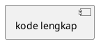

## PERAN & KONTEKS

Bertindaklah sebagai **Senior System Analyst** yang ahli dalam pemodelan UML untuk sistem
informasi akademik. Saya sedang menyusun **Laporan Kerja Praktek (KP)** tentang Sistem
Pendukung Keputusan (SPK) berbasis web untuk **klasifikasi penerima Bantuan Sosial (Bansos)**
di Kecamatan Pondok Aren, Kota Tangerang Selatan, menggunakan metode
**Simple Additive Weighting (SAW)**.

Stack teknologi: Python Flask · SQLite · SQLAlchemy ORM · Jinja2 · Tailwind CSS · OpenPyXL.
Arsitektur sistem mengikuti pola **MVC (Model–View–Controller)**.

---

## BATASAN KERAS (NON-NEGOTIABLE)

> ⚠️ DILARANG mengarang, menambah, atau mengasumsikan aktor, lifeline, tabel database,
> method/function, atau logika sistem di luar data aktual yang tercantum di bawah ini.
> Jika ada ambiguitas, gunakan data berikut sebagai satu-satunya sumber kebenaran.

---

## DATA AKTUAL SISTEM

### A. Daftar Aktor

| Kode | Nama Aktor         | Peran        |
|------|--------------------|--------------|
| A1   | Admin (Ketua Staf) | Administrator — akses penuh ke seluruh fitur |
| A2   | Staff (Pegawai)    | Operator — input data, proses SPK, ekspor     |
| A3   | Camat              | Eksekutif — read-only: dashboard & laporan    |

### B. Tabel Database yang Relevan

| Nama Tabel               | Field Utama                                                                |
|--------------------------|----------------------------------------------------------------------------|
| `users`                  | id, username, password_hash, role, foto_profil, is_active                  |
| `login_history`          | id, user_id, timestamp, ip_address, status (SUCCESS / FAILED)              |
| `kriteria`               | id, nama_kriteria, bobot (0–1), tipe (benefit / cost)                      |
| `sub_kriteria`           | id, kriteria_id, label, nilai_konversi                                     |
| `classification_results` | id, warga_id, nilai_preferensi (V), status_kelayakan, tanggal_klasifikasi  |

### C. Arsitektur Lifeline (Wajib Dipakai di Semua Diagram)

````
┌──────────┐   ┌────────────────────┐   ┌──────────────────────┐   ┌──────────────────────┐
│  Actor   │   │       View         │   │     Controller       │   │       Model          │
│          │   │  (Halaman / UI)    │   │  (Logika & Engine)   │   │  (Tabel Database)    │
└──────────┘   └────────────────────┘   └──────────────────────┘   └──────────────────────┘
````

- **Actor**      : pengguna nyata (Admin / Staff / Camat / Pengguna generik)
- **View**       : halaman/template Jinja2 yang sedang diakses
- **Controller** : logika Flask route / SPK engine yang memproses request
- **Model**      : entitas SQLAlchemy yang merepresentasikan tabel database

### D. Logika Metode SAW (Urutan Tidak Boleh Diubah)

````
Langkah 1 : Controller memanggil getBobot()     → query tabel `kriteria`
Langkah 2 : Controller memanggil getKonversi()  → query tabel `sub_kriteria`
Langkah 3 : Controller memanggil buildMatrix()  → bangun matriks keputusan X
Langkah 4 : Controller memanggil normalizeMatrix():
              - Benefit : r_ij = x_ij / max(x_j)
              - Cost    : r_ij = min(x_j) / x_ij
Langkah 5 : Controller memanggil calcPreference() → V_i = Σ(w_j × r_ij)
Langkah 6 : Controller memanggil determineStatus():
              - V_i ≥ 0.50 → LAYAK
              - V_i < 0.50 → TIDAK LAYAK
Langkah 7 : Controller memanggil saveResult()   → INSERT ke `classification_results`
````

---

## TUGAS: SEQUENCE DIAGRAM — 8 ALUR ESENSIAL

Untuk **setiap alur**, hasilkan **tiga bagian** secara berurutan:
1. Narasi step-by-step (Bahasa Indonesia formal, EYD, ±150 kata)
   — sebutkan nama **method/function** yang dipanggil antar lifeline
2. Kode PlantUML (Format A)
3. XML draw.io Uncompressed (Format B)

---

### SEQUENCE 1 — Autentikasi (Login)

**Aktor:** Pengguna (Admin / Staff / Camat)
**Lifeline:** `Pengguna` → `View:LoginPage` → `Controller:AuthController`
             → `Model:users` → `Model:login_history`

**Alur pesan & method wajib:**
````
Pengguna      ->> View:LoginPage        : membuka halaman login
Pengguna      ->> View:LoginPage        : submitLogin(username, password)
View          ->> Controller:AuthCtrl   : authenticate(username, password)
Controller    ->> Model:users           : findByUsername(username)

  [ALT] Username tidak ditemukan
    Model:users    -->> Controller      : return None
    Controller     ->> Model:login_hist : logAttempt(user_id=None, status=FAILED)
    Controller     -->> View            : error("Akun tidak ditemukan")
    View           -->> Pengguna        : tampilkan pesan error

  [ELSE] Username ditemukan
    Model:users    -->> Controller      : return user_object
    Controller     ->> Controller       : verifyPasswordHash(input, hash)

    [ALT] Password salah
      Controller   ->> Model:login_hist : logAttempt(user_id, status=FAILED)
      Controller   -->> View            : error("Password salah")
      View         -->> Pengguna        : tampilkan pesan error

    [ELSE] Password benar
      Controller   ->> Model:login_hist : logAttempt(user_id, status=SUCCESS)
      Controller   ->> Controller       : createSession(user_id, role)
      Controller   -->> View            : redirect(role)
      View         -->> Pengguna        : masuk ke Dashboard sesuai role
    [END]
  [END]
````

---

### SEQUENCE 2 — Manajemen Profil & Keamanan

**Aktor:** Pengguna (Admin / Staff / Camat)
**Lifeline:** `Pengguna` → `View:ProfilePage` → `Controller:ProfileController`
             → `Model:users`

**Alur pesan & method wajib:**
````
Pengguna      ->> View:ProfilePage      : membuka halaman Profil
View          ->> Controller:ProfileCtrl: getProfile(user_id)
Controller    ->> Model:users           : findById(user_id)
Model:users   -->> Controller           : return user_object
Controller    -->> View                 : return profile_data
View          -->> Pengguna             : tampilkan form profil

Pengguna memilih aksi:

  [ALT] Ubah Foto Profil
    Pengguna      ->> View              : uploadFoto(file)
    View          ->> Controller        : updateFoto(user_id, file)
    Controller    ->> Controller        : validateFile(format, size)

    [ALT] File tidak valid
      Controller  -->> View             : error("Format/ukuran file tidak sesuai")
      View        -->> Pengguna         : tampilkan pesan error

    [ELSE] File valid
      Controller  ->> Model:users       : updateFotoProfil(user_id, path)
      Model:users -->> Controller       : return success
      Controller  -->> View             : success("Foto berhasil diperbarui")
      View        -->> Pengguna         : tampilkan notifikasi sukses
    [END]

  [ELSE] Ganti Password
    Pengguna      ->> View              : submitGantiPassword(old, new, confirm)
    View          ->> Controller        : changePassword(user_id, old, new, confirm)
    Controller    ->> Model:users       : findById(user_id)
    Model:users   -->> Controller       : return password_hash

    [ALT] Password lama salah
      Controller  -->> View             : error("Password lama tidak cocok")
      View        -->> Pengguna         : tampilkan pesan error

    [ELSE] Password lama benar
      Controller  ->> Controller        : validateConfirmation(new, confirm)

      [ALT] Konfirmasi tidak cocok
        Controller -->> View            : error("Konfirmasi password tidak sama")
        View       -->> Pengguna        : tampilkan pesan error

      [ELSE] Konfirmasi cocok
        Controller ->> Controller       : hashPassword(new_password)
        Controller ->> Model:users      : updatePasswordHash(user_id, new_hash)
        Model:users -->> Controller     : return success
        Controller -->> View            : success("Password berhasil diubah")
        View       -->> Pengguna        : tampilkan notifikasi sukses
      [END]
    [END]
  [END]
````

---

### SEQUENCE 3 — Akses Dashboard & Statistik

**Aktor:** Pengguna (Admin / Staff / Camat)
**Lifeline:** `Pengguna` → `View:Dashboard` → `Controller:DashboardController`
             → `Model:classification_results`

**Alur pesan & method wajib:**
````
Pengguna      ->> View:Dashboard        : membuka halaman Dashboard
View          ->> Controller:DashCtrl   : getDashboardData()
Controller    ->> Model:class_results   : countTotal()
Model         -->> Controller           : return total_warga
Controller    ->> Model:class_results   : countByStatus(status=LAYAK)
Model         -->> Controller           : return jumlah_layak
Controller    ->> Model:class_results   : countByStatus(status=TIDAK_LAYAK)
Model         -->> Controller           : return jumlah_tidak_layak

  [ALT] Tidak ada data (total = 0)
    Controller  -->> View               : return empty_state
    View        -->> Pengguna           : tampilkan "Belum ada data klasifikasi"

  [ELSE] Data tersedia
    Controller  ->> Controller          : calcPercentage(layak, tidak_layak)
    Controller  ->> Controller          : buildPieChartData()
    Controller  ->> Controller          : buildBarChartData()
    Controller  -->> View               : return {stats, pie_data, bar_data}
    View        ->> View                : renderPieChart(pie_data)
    View        ->> View                : renderBarChart(bar_data)
    View        -->> Pengguna           : tampilkan dashboard lengkap
  [END]
````

---

### SEQUENCE 4 — Klasifikasi Bansos / SPK Engine (Metode SAW) [ALUR UTAMA]

**Aktor:** Admin / Staff
**Lifeline:** `Admin/Staff` → `View:FormKlasifikasi` → `Controller:SPK_Engine`
             → `Model:kriteria` → `Model:sub_kriteria` → `Model:classification_results`

**Alur pesan & method wajib (ikuti urutan SAW):**
````
Admin/Staff   ->> View:FormKlasifikasi  : membuka menu Klasifikasi Bansos
Admin/Staff   ->> View                  : pilih mode (Manual / Import CSV)

  [ALT] Mode Manual
    Admin/Staff ->> View                : submitFormWarga(data_warga)

  [ELSE] Mode Import CSV
    Admin/Staff ->> View                : uploadCSV(file)
    View        ->> Controller:SPK      : parseCSV(file)

    [ALT] Format CSV tidak valid
      Controller -->> View              : error("Format file tidak sesuai template")
      View       -->> Admin/Staff       : tampilkan pesan error → STOP
    [END]
  [END]

View          ->> Controller:SPK_Engine : processKlasifikasi(data_input)
Controller    ->> Controller            : validateInput(data_input)

  [ALT] Input tidak valid
    Controller  -->> View               : error(detail_field_bermasalah)
    View        -->> Admin/Staff        : tampilkan pesan error → STOP
  [END]

Controller    ->> Model:kriteria        : getBobot()
Model:kriteria -->> Controller          : return [{id, nama, bobot, tipe}, ...]
Controller    ->> Model:sub_kriteria    : getKonversi()
Model:sub_krit -->> Controller          : return [{kriteria_id, label, nilai}, ...]
Controller    ->> Controller            : buildMatrix(data_input, konversi)
Controller    ->> Controller            : normalizeMatrix(matrix, tipe_kriteria)
note right of Controller                : Benefit: r_ij = x_ij/max(x_j)\nCost: r_ij = min(x_j)/x_ij
Controller    ->> Controller            : calcPreference(r_matrix, bobot)
note right of Controller                : V_i = Σ(w_j × r_ij)
Controller    ->> Controller            : determineStatus(V_i, threshold=0.50)
note right of Controller                : V_i ≥ 0.50 → LAYAK\nV_i < 0.50 → TIDAK LAYAK
Controller    ->> Model:class_results   : saveResult(warga_id, V_i, status)
Model         -->> Controller           : return success
Controller    -->> View                 : return hasil_klasifikasi[]
View          -->> Admin/Staff          : tampilkan tabel (NIK, Nama, Nilai V, Status)
````

---

### SEQUENCE 5 — Manajemen Data Warga (Edit & Hapus)

**Aktor:** Admin / Staff
**Lifeline:** `Admin/Staff` → `View:RiwayatWarga` → `Controller:DataController`
             → `Model:classification_results`

**Alur pesan & method wajib:**
````
Admin/Staff   ->> View:RiwayatWarga     : membuka halaman Riwayat Data Warga
View          ->> Controller:DataCtrl   : getDataWarga(filter?)
Controller    ->> Model:class_results   : fetchAll(filter)
Model         -->> Controller           : return data_list[]
Controller    -->> View                 : return data_list[]
View          -->> Admin/Staff          : tampilkan tabel riwayat

Admin/Staff   ->> View                  : inputPencarian(keyword)
View          ->> Controller            : searchData(keyword)
Controller    ->> Model:class_results   : findByKeyword(keyword)
Model         -->> Controller           : return filtered_list[]
Controller    -->> View                 : return filtered_list[]
View          -->> Admin/Staff          : tampilkan hasil pencarian

Admin/Staff pilih aksi:

  [ALT] Edit Data
    Admin/Staff ->> View                : clickEdit(record_id)
    View        ->> Controller          : getDetail(record_id)
    Controller  ->> Model:class_results : findById(record_id)
    Model       -->> Controller         : return record_data
    Controller  -->> View               : return record_data
    View        -->> Admin/Staff        : tampilkan form edit terisi data lama
    Admin/Staff ->> View                : submitEdit(record_id, new_data)
    View        ->> Controller          : updateData(record_id, new_data)
    Controller  ->> Controller          : validateInput(new_data)

    [ALT] Data tidak valid
      Controller -->> View              : error(detail_error)
      View       -->> Admin/Staff       : tampilkan pesan error
    [ELSE] Data valid
      Controller ->> Model:class_results: updateRecord(record_id, new_data)
      Model      -->> Controller        : return success
      Controller -->> View              : success("Data berhasil diperbarui")
      View       -->> Admin/Staff       : tampilkan notifikasi → refresh tabel
    [END]

  [ELSE] Hapus Data
    Admin/Staff ->> View                : clickHapus(record_id)
    View        -->> Admin/Staff        : tampilkan dialog konfirmasi
    Admin/Staff ->> View                : konfirmasiHapus(record_id)
    View        ->> Controller          : deleteData(record_id)
    Controller  ->> Model:class_results : deleteById(record_id)
    Model       -->> Controller         : return success
    Controller  -->> View               : success("Data berhasil dihapus")
    View        -->> Admin/Staff        : tampilkan notifikasi → refresh tabel
  [END]
````

---

### SEQUENCE 6 — Ekspor Laporan Excel

**Aktor:** Pengguna (Admin / Staff / Camat)
**Lifeline:** `Pengguna` → `View:HalamanLaporan` → `Controller:ExportController`
             → `Model:classification_results`

**Alur pesan & method wajib:**
````
Pengguna      ->> View:HalamanLaporan   : membuka halaman Laporan
Pengguna      ->> View                  : setFilter(tanggal_mulai, tanggal_akhir, status?)
Pengguna      ->> View                  : clickEksporExcel()
View          ->> Controller:ExportCtrl : exportExcel(filter_params)
Controller    ->> Model:class_results   : fetchByFilter(tanggal_mulai, tanggal_akhir, status)
Model         -->> Controller           : return data_export[]

  [ALT] Data kosong
    Controller  -->> View               : error("Tidak ada data untuk diekspor")
    View        -->> Pengguna           : tampilkan notifikasi peringatan → STOP

  [ELSE] Data tersedia
    Controller  ->> Controller          : initWorkbook()
    Controller  ->> Controller          : writeHeader([No, NIK, Nama, Nilai V, Status, Tgl])
    Controller  ->> Controller          : writeRows(data_export)
    Controller  ->> Controller          : applyFormatting(bold_header, border_all, auto_fit)
    Controller  ->> Controller          : buildHttpResponse(filename="laporan_bansos.xlsx")
    Controller  -->> View               : return file_response (attachment)
    View        -->> Pengguna           : browser mengunduh file .xlsx otomatis
  [END]
````

---

### SEQUENCE 7 — Pengaturan SPK (Kriteria & Sub Kriteria)

**Aktor:** Admin
**Lifeline:** `Admin` → `View:PengaturanSPK` → `Controller:SPKSettingController`
             → `Model:kriteria` → `Model:sub_kriteria`

**Alur pesan & method wajib:**
````
Admin         ->> View:PengaturanSPK    : membuka menu Pengaturan SPK
Admin         ->> View                  : pilih sub-menu (Kriteria / Sub Kriteria)

  [ALT] Manajemen Kriteria
    View        ->> Controller:SPKCtrl  : getKriteria()
    Controller  ->> Model:kriteria      : fetchAll()
    Model       -->> Controller         : return kriteria_list[]
    Controller  -->> View               : return kriteria_list[]
    View        -->> Admin              : tampilkan daftar kriteria

    Admin pilih aksi (TAMBAH / EDIT / HAPUS):

    [ALT] TAMBAH
      Admin     ->> View                : submitKriteria(nama, bobot, tipe)
      View      ->> Controller          : createKriteria(nama, bobot, tipe)
      Controller ->> Controller         : validateBobot(bobot, total_existing)
      [ALT] Tidak valid (bobot > 1.0 atau total > 1.0)
        Controller -->> View            : error("Bobot tidak valid")
        View       -->> Admin           : tampilkan pesan error
      [ELSE] Valid
        Controller ->> Model:kriteria   : insertKriteria(nama, bobot, tipe)
        Model      -->> Controller      : return success
        Controller -->> View            : success("Kriteria berhasil ditambahkan")
        View       -->> Admin           : notifikasi → refresh daftar
      [END]

    [ELSE] EDIT
      Admin     ->> View                : submitEditKriteria(id, nama, bobot, tipe)
      View      ->> Controller          : updateKriteria(id, nama, bobot, tipe)
      Controller ->> Controller         : validateBobot(bobot, total_excluding_id)
      [ALT] Tidak valid
        Controller -->> View            : error("Bobot tidak valid")
        View       -->> Admin           : tampilkan pesan error
      [ELSE] Valid
        Controller ->> Model:kriteria   : updateById(id, nama, bobot, tipe)
        Model      -->> Controller      : return success
        Controller -->> View            : success("Kriteria berhasil diperbarui")
        View       -->> Admin           : notifikasi → refresh daftar
      [END]

    [ELSE] HAPUS
      Admin     ->> View                : clickHapus(kriteria_id)
      View      ->> Controller          : deleteKriteria(kriteria_id)
      Controller ->> Model:sub_kriteria : checkRelasi(kriteria_id)
      [ALT] Ada sub kriteria terkait
        Model  -->> Controller          : return relasi_exists = True
        Controller -->> View            : error("Ada sub kriteria terkait, tidak dapat dihapus")
        View       -->> Admin           : tampilkan pesan error
      [ELSE] Tidak ada relasi
        Controller ->> Model:kriteria   : deleteById(kriteria_id)
        Model      -->> Controller      : return success
        Controller -->> View            : success("Kriteria berhasil dihapus")
        View       -->> Admin           : notifikasi → refresh daftar
      [END]
    [END]

  [ELSE] Manajemen Sub Kriteria
    View        ->> Controller          : getSubKriteria()
    Controller  ->> Model:sub_kriteria  : fetchAll()
    Model       -->> Controller         : return sub_kriteria_list[]
    Controller  -->> View               : return sub_kriteria_list[]
    View        -->> Admin              : tampilkan daftar sub kriteria (grouped by kriteria)

    Admin pilih aksi (TAMBAH / EDIT / HAPUS):
    [ALT] TAMBAH
      Admin     ->> View                : submitSubKriteria(kriteria_id, label, nilai)
      View      ->> Controller          : createSubKriteria(kriteria_id, label, nilai)
      Controller ->> Controller         : validateNilaiKonversi(nilai)
      [ALT] Tidak valid
        Controller -->> View            : error("Nilai konversi harus numerik")
        View       -->> Admin           : tampilkan pesan error
      [ELSE] Valid
        Controller ->> Model:sub_krit   : insertSubKriteria(kriteria_id, label, nilai)
        Model      -->> Controller      : return success
        Controller -->> View            : success("Sub kriteria berhasil ditambahkan")
        View       -->> Admin           : notifikasi → refresh daftar
      [END]

    [ELSE] EDIT / HAPUS → alur validasi & DB sama seperti TAMBAH,
      method: updateById(id, ...) / deleteById(id) pada Model:sub_kriteria
    [END]
  [END]
````

---

### SEQUENCE 8 — Manajemen Akun (Khusus Admin)

**Aktor:** Admin
**Lifeline:** `Admin` → `View:ManajemenUser` → `Controller:UserController`
             → `Model:users`

**Alur pesan & method wajib:**
````
Admin         ->> View:ManajemenUser    : membuka menu Manajemen Akun
View          ->> Controller:UserCtrl  : getUsers()
Controller    ->> Model:users           : fetchAll()
Model         -->> Controller           : return users_list[]
Controller    -->> View                 : return users_list[]
View          -->> Admin                : tampilkan daftar akun

Admin pilih aksi:

  [ALT] TAMBAH AKUN BARU
    Admin     ->> View                  : submitTambahUser(username, password, role)
    View      ->> Controller            : createUser(username, password, role)
    Controller ->> Model:users          : findByUsername(username)

    [ALT] Username sudah digunakan
      Model  -->> Controller            : return user_exists = True
      Controller -->> View              : error("Username sudah terdaftar")
      View       -->> Admin             : tampilkan pesan error
    [ELSE] Username tersedia
      Controller ->> Controller         : validatePassword(password)
      [ALT] Password tidak memenuhi syarat
        Controller -->> View            : error("Password tidak memenuhi kriteria")
        View       -->> Admin           : tampilkan pesan error
      [ELSE] Password valid
        Controller ->> Controller       : hashPassword(password)
        Controller ->> Model:users      : insertUser(username, hash, role, is_active=True)
        Model      -->> Controller      : return success
        Controller -->> View            : success("Akun berhasil dibuat")
        View       -->> Admin           : notifikasi → refresh daftar
      [END]
    [END]

  [ELSE] EDIT AKUN / UBAH ROLE
    Admin     ->> View                  : submitEditUser(user_id, data_baru)
    View      ->> Controller            : updateUser(user_id, data_baru)
    Controller ->> Controller           : isPasswordChanged(data_baru)

    [ALT] Password baru diisi
      Controller ->> Controller         : hashPassword(new_password)
      Controller ->> Model:users        : updateWithHash(user_id, data_baru, new_hash)
    [ELSE] Password tidak diubah
      Controller ->> Model:users        : updateWithoutHash(user_id, data_baru)
    [END]

    Model     -->> Controller           : return success
    Controller -->> View                : success("Akun berhasil diperbarui")
    View       -->> Admin               : notifikasi → refresh daftar

  [ELSE] NONAKTIFKAN / AKTIFKAN AKUN
    Admin     ->> View                  : toggleAktif(user_id, current_status)
    View      -->> Admin                : tampilkan dialog konfirmasi
    Admin     ->> View                  : konfirmasiToggle()
    View      ->> Controller            : toggleIsActive(user_id, !current_status)
    Controller ->> Model:users          : updateIsActive(user_id, new_status)
    Model     -->> Controller           : return success
    Controller -->> View                : success("Status akun berhasil diubah")
    View       -->> Admin               : notifikasi → refresh daftar
  [END]
````

---

## SPESIFIKASI FORMAT OUTPUT (WAJIB DIIKUTI UNTUK SEMUA 8 SEQUENCE)

---

### FORMAT A — PlantUML Sequence Diagram

````
ATURAN TEKNIS WAJIB:

1. DEKLARASI LIFELINE
   - Gunakan: participant "Nama" as alias
   - Urutan lifeline (kiri ke kanan): Actor → View → Controller → Model(s)
   - Beri warna box dengan: participant "Nama" as alias #WarnaPastel
       Actor      → #AED6F1  (biru muda)
       View       → #A9DFBF  (hijau muda)
       Controller → #FAD7A0  (oranye muda)
       Model      → #D7DBDD  (abu-abu muda)

2. PESAN & PANAH
   - Request  (sinkron)  : Aktor ->> Lifeline : namaMethod(param)
   - Response (return)   : Lifeline -->> Aktor : return nilai
   - Panah self-call     : Controller -> Controller : internalMethod()
   - note right of [lifeline]: teks anotasi    (gunakan untuk rumus/penjelasan)

3. ACTIVATION BARS (WAJIB)
   - activate [lifeline]    setelah lifeline pertama kali dipanggil
   - deactivate [lifeline]  setelah lifeline menyelesaikan tugasnya
   - Tidak boleh ada lifeline yang di-activate tetapi tidak di-deactivate

4. BLOK KONDISIONAL (alt/else)
   - Gunakan alt / else / end untuk setiap percabangan validasi
   - Label alt wajib deskriptif: alt "Username tidak ditemukan"
   - Nest alt di dalam alt diperbolehkan jika logika memang bercabang

5. VALIDASI SYNTAX
   - Buka dengan @startuml dan tutup dengan @enduml
   - Kode harus bisa di-paste langsung ke planttext.com atau
     draw.io (Insert > Advanced > Edit Diagram) TANPA error syntax
   - Pisahkan setiap sequence dengan newline yang cukup untuk keterbacaan
````

---

### FORMAT B — XML draw.io (mxGraphModel, Sequence Diagram Uncompressed)

````
STRUKTUR TEMPLATE WAJIB:

<mxGraphModel dx="1422" dy="762" grid="1" gridSize="10" guides="1"
              tooltips="1" connect="1" arrows="1" fold="1" page="1"
              pageScale="1" pageWidth="1654" pageHeight="1169" math="0" shadow="0">
  <root>
    <mxCell id="0"/>
    <mxCell id="1" parent="0"/>
    <!-- Semua elemen diagram di sini -->
  </root>
</mxGraphModel>

---

ATURAN GEOMETRI SEQUENCE DIAGRAM:

[LIFELINE HEADER (Kotak di Atas)]
  - style="rounded=1;whiteSpace=wrap;html=1;fillColor=#[warna];"
  - width="160" height="50"
  - Posisi y tetap: y="20"
  - Jarak antar lifeline (x): 200px
      Actor      : x="20"
      View       : x="220"
      Controller : x="420"
      Model 1    : x="620"
      Model 2    : x="820"  (jika ada model kedua)

[LIFELINE LINE (Garis Vertikal Putus-putus)]
  - style="endArrow=none;dashed=1;strokeColor=#000000;"
  - Titik awal : x = center_header (x_header + 80), y = 70
  - Titik akhir : x = sama, y = total_tinggi_diagram
  - Buat sebagai edge dengan source dan target = titik geometri absolut

[ACTIVATION BAR (Kotak Tipis di Atas Garis Lifeline)]
  - style="fillColor=#FFFF88;strokeColor=#000000;"
  - width="16" height = durasi_aktivasi × 30px
  - x = center_lifeline − 8

[PESAN / PANAH (Message Arrow)]
  - style="endArrow=block;endFill=1;edgeStyle=orthogonalEdgeStyle;"
  - Posisi y mulai dari: y="100"
  - Increment vertikal antar pesan: +50px (minimum, lebih jika ada label panjang)
  - Panah return (dashed): tambahkan dashed=1; ke style
  - Label pesan: value="namaMethod(param)" pada atribut <mxCell>
  - Label diletakkan di tengah panah: align="center" verticalAlign="bottom"

[BLOK ALT / ELSE (Kotak Kondisi)]
  - style="swimlane;startSize=20;fillColor=#f5f5f5;strokeColor=#666666;
           fontColor=#333333;"
  - Lebar: mencakup semua lifeline yang terlibat
  - Tinggi: jumlah_pesan_dalam_blok × 50 + 30
  - Label: value="[alt] kondisi_percabangan"

---

ATURAN ID ELEMEN:

  - Format: "S[nomor_sequence]_[tipe]_[nomor]"
    Contoh : "S1_header_actor", "S1_msg_1", "S1_alt_1", "S1_return_2"
  - TIDAK BOLEH ada id duplikat dalam satu blok XML
  - Setiap <mxCell> WAJIB memiliki:
    · vertex: atribut id, value, style, vertex="1", parent="1"
    · edge  : atribut id, value, style, edge="1", source, target, parent="1"

---

CHECKLIST VALIDASI SEBELUM OUTPUT:
  ✓ Semua tag XML dibuka dan ditutup dengan benar
  ✓ Tidak ada dua elemen dengan koordinat x dan y yang identik (zero overlap)
  ✓ Increment y antar pesan konsisten (minimum +50px)
  ✓ Setiap edge memiliki source dan target yang merujuk id yang valid
  ✓ Lifeline line memiliki panjang yang cukup untuk semua pesan di bawahnya
  ✓ Activation bar dimulai dan diakhiri pada koordinat y yang logis
````

---

## URUTAN PENYAJIAN OUTPUT (WAJIB DIIKUTI)

Sajikan kedelapan sequence dengan struktur heading yang KONSISTEN:

````
---
### SEQUENCE [N] — [Nama Alur]

**Narasi:**
[Penjelasan step-by-step dalam Bahasa Indonesia formal, EYD, ±150 kata.
 Sebutkan nama method/function yang dipanggil antar lifeline.]

**Format A — PlantUML:**


**Format B — XML draw.io:**
```xml
<mxGraphModel ...>
  [kode lengkap]
</mxGraphModel>
```
---
````

> ⚠️ Hasilkan kedelapan sequence secara LENGKAP dan BERURUTAN (Sequence 1 s/d 8).
> Jangan memotong, meringkas, atau melewati sequence mana pun.
> Tambahkan catatan teknis singkat HANYA jika ada keterbatasan sintaks
> yang perlu diketahui pengguna.