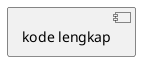

## PERAN & KONTEKS

Bertindaklah sebagai **Senior System Analyst** yang ahli dalam pemodelan UML untuk sistem
informasi akademik. Saya sedang menyusun **Laporan Kerja Praktek (KP)** tentang Sistem
Pendukung Keputusan (SPK) berbasis web untuk **klasifikasi penerima Bantuan Sosial (Bansos)**
di Kecamatan Pondok Aren, Kota Tangerang Selatan, menggunakan metode
**Simple Additive Weighting (SAW)**.

Stack teknologi: Python Flask · SQLite · SQLAlchemy ORM · Jinja2 · Tailwind CSS · OpenPyXL.
Diagram class yang dihasilkan merepresentasikan **model data ORM (SQLAlchemy)**,
bukan arsitektur MVC secara keseluruhan.

---

## BATASAN KERAS (NON-NEGOTIABLE)

> ⚠️ DILARANG KERAS mengarang, menambah, atau mengasumsikan class, atribut, tipe data,
> atau method di luar 5 entitas yang tercantum di bawah ini.
> Seluruh output harus 100% bersumber dari definisi entitas berikut — tidak lebih, tidak kurang.
> Pelanggaran terhadap aturan ini membuat output tidak valid untuk laporan akademik.

---

## DATA AKTUAL — DEFINISI 5 ENTITAS (SUMBER KEBENARAN TUNGGAL)

### CLASS 1: `Users`
**Representasi tabel:** `users`

| Atribut        | Tipe Data SQLAlchemy | Constraint              |
|----------------|----------------------|-------------------------|
| id             | Integer              | Primary Key, Auto-incr  |
| username       | String               | Unique, Not Null        |
| password_hash  | String               | Not Null                |
| nama_lengkap   | String               | Not Null                |
| foto_profil    | String               | Nullable (path file)    |
| role           | String               | Not Null (Admin/Staff/Camat) |
| is_active      | Boolean              | Default: True           |
| created_at     | DateTime             | Default: now()          |

**Relasi:**
- 1 (Users) → 0..* (LoginHistory) — satu pengguna memiliki banyak riwayat login
- 1 (Users) → 0..* (ClassificationResults) — satu pengguna dapat membuat banyak klasifikasi

**Method logika yang relevan (wajib muncul di diagram):**
````
+ checkPassword(input_password: String): Boolean
+ hashPassword(plain_password: String): String
+ setRole(role: String): void
+ toggleAktif(): void
+ getFullProfile(): dict
````

---

### CLASS 2: `LoginHistory`
**Representasi tabel:** `login_history`

| Atribut    | Tipe Data SQLAlchemy | Constraint                    |
|------------|----------------------|-------------------------------|
| id         | Integer              | Primary Key, Auto-incr        |
| user_id    | Integer              | Foreign Key → users.id        |
| login_time | DateTime             | Default: now()                |
| ip_address | String               | Nullable                      |
| user_agent | Text                 | Nullable                      |

**Relasi:**
- 0..* (LoginHistory) → 1 (Users) — banyak riwayat merujuk satu pengguna

**Method logika yang relevan (wajib muncul di diagram):**
````
+ recordLogin(user_id: Integer, ip: String, agent: String): void
+ getHistoryByUser(user_id: Integer): List
+ getLastLogin(user_id: Integer): DateTime
````

---

### CLASS 3: `Kriteria`
**Representasi tabel:** `kriteria`

| Atribut | Tipe Data SQLAlchemy | Constraint              |
|---------|----------------------|-------------------------|
| id      | Integer              | Primary Key, Auto-incr  |
| kode    | String               | Unique, Not Null        |
| nama    | String               | Not Null                |
| tipe    | String               | Not Null (benefit/cost) |
| bobot   | Float                | Not Null (0.0 – 1.0)   |

**Relasi:**
- 1 (Kriteria) → 1..* (SubKriteria) — satu kriteria memiliki satu atau lebih sub kriteria

**Method logika yang relevan (wajib muncul di diagram):**
````
+ validateBobot(bobot: Float): Boolean
+ getTotalBobot(): Float
+ getSubKriteria(): List
+ isBenefit(): Boolean
````

---

### CLASS 4: `SubKriteria`
**Representasi tabel:** `sub_kriteria`

| Atribut     | Tipe Data SQLAlchemy | Constraint                      |
|-------------|----------------------|---------------------------------|
| id          | Integer              | Primary Key, Auto-incr          |
| kriteria_id | Integer              | Foreign Key → kriteria.id       |
| nama        | String               | Not Null (label sub kriteria)   |
| skor        | Integer              | Not Null (nilai konversi)       |

**Relasi:**
- 1..* (SubKriteria) → 1 (Kriteria) — banyak sub kriteria merujuk satu kriteria

**Method logika yang relevan (wajib muncul di diagram):**
````
+ getNilaiKonversi(): Integer
+ getParentKriteria(): Kriteria
+ validateSkor(skor: Integer): Boolean
````

---

### CLASS 5: `ClassificationResults`
**Representasi tabel:** `classification_results`
*(Class terpenting — pusat logika SAW)*

| Atribut             | Tipe Data SQLAlchemy | Constraint / Keterangan                   |
|---------------------|----------------------|-------------------------------------------|
| id                  | Integer              | Primary Key, Auto-incr                    |
| nik                 | String               | Not Null (Nomor Induk Kependudukan)       |
| no_kk               | String               | Not Null (Nomor Kartu Keluarga)           |
| nama                | String               | Not Null                                  |
| pekerjaan           | String               | Nullable                                  |
| alamat              | Text                 | Nullable                                  |
| kelurahan           | String               | Nullable                                  |
| penghasilan         | String               | Not Null (input untuk kriteria SAW)       |
| jumlah_tanggungan   | String               | Not Null (input untuk kriteria SAW)       |
| status_rumah        | String               | Not Null (input untuk kriteria SAW)       |
| kondisi_bangunan    | String               | Not Null (input untuk kriteria SAW)       |
| sumber_air          | String               | Not Null (input untuk kriteria SAW)       |
| daya_listrik        | String               | Not Null (input untuk kriteria SAW)       |
| kriteria_details    | Text (JSON)          | Menyimpan detail skor per kriteria        |
| skor_saw            | Float                | Hasil akhir V_i = Σ(w_j × r_ij)         |
| hasil_klasifikasi   | String               | LAYAK / TIDAK LAYAK (threshold: 0.50)    |
| alasan              | Text                 | Penjelasan hasil klasifikasi              |
| created_at          | DateTime             | Default: now()                            |

**Relasi:**
- 0..* (ClassificationResults) → 1 (Users) — banyak hasil klasifikasi dibuat oleh satu pengguna

**Method logika yang relevan (wajib muncul di diagram):**
````
+ buildMatriksKeputusan(data_input: dict, sub_kriteria: List): dict
+ normalisasiMatriks(matriks: dict, kriteria: List): dict
  — Benefit : r_ij = x_ij / max(x_j)
  — Cost    : r_ij = min(x_j) / x_ij
+ hitungPreferensi(r_matrix: dict, bobot: List): Float
  — V_i = Σ(w_j × r_ij)
+enentukanKelayakan(skor_saw: Float, threshold: Float = 0.50): String
  — skor_saw ≥ 0.50 → "LAYAK"
  — skor_saw < 0.50 → "TIDAK LAYAK"
+ saveResult(): void
+ toExcelRow(): List
+ getKriteriaDetails(): dict
````

---

## TUGAS: CLASS DIAGRAM — SATU DIAGRAM UTUH (5 CLASS)

Hasilkan **tiga bagian output** secara berurutan:

---

### OUTPUT 1 — Narasi Akademis Class Diagram

Tulis penjelasan naratif dalam **Bahasa Indonesia formal (EYD)**, mencakup:

1. **Deskripsi per class** — fungsi dan peran masing-masing class dalam sistem
2. **Relasi & kardinalitas** — jelaskan setiap relasi antar class beserta jenis relasinya:
   - `Users` → `LoginHistory` : One-to-Many (1 user memiliki 0..* riwayat login)
   - `Users` → `ClassificationResults` : One-to-Many (1 user membuat 0..* klasifikasi)
   - `Kriteria` → `SubKriteria` : One-to-Many (1 kriteria memiliki 1..* sub kriteria)
   - `SubKriteria` ← `Kriteria` : diakses via `kriteria_id` sebagai Foreign Key
3. **Peran method kunci** — jelaskan method yang paling penting secara fungsional,
   terutama method SAW di class `ClassificationResults`
4. **Panjang narasi:** ±250–350 kata, padat dan akademis

---

### OUTPUT 2 — Format PlantUML Class Diagram

````
ATURAN TEKNIS WAJIB:

1. DEKLARASI CLASS
   Gunakan blok:
   class NamaClass {
     -- Attributes --
     - tipe namaAtribut
     -- Methods --
     + returnType namaMethod(param: tipe)
   }
   Pemisah section dengan `--` wajib digunakan

2. SIMBOL VISIBILITAS
   - (minus)  → atribut (private/protected — data internal class)
   + (plus)   → method (public — dapat dipanggil dari luar)

3. TIPE DATA
   Gunakan tipe data Python/SQLAlchemy yang sesuai:
   Integer, String, Float, Boolean, DateTime, Text

4. RELASI (gunakan notasi UML yang benar)
   One-to-Many  : ClassA "1" --> "0..*" ClassB : label_relasi
   One-to-Many  : ClassA "1" --> "1..*" ClassB : label_relasi
   (FK)         : notasikan sebagai arah panah dari class induk ke class anak

   Relasi wajib yang harus muncul:
   Users          "1" --> "0..*" LoginHistory         : memiliki
   Users          "1" --> "0..*" ClassificationResults: membuat
   Kriteria       "1" --> "1..*" SubKriteria          : memiliki
   ClassificationResults "0..*" --> "1" Kriteria      : menggunakan (via JSON)

5. CATATAN TAMBAHAN (opsional tapi direkomendasikan)
   Gunakan: note right of ClassName : teks penjelasan
   Terutama untuk mencatat threshold SAW (0.50) dan logika tipe benefit/cost

6. VALIDASI SYNTAX
   - Buka dengan @startuml dan tutup dengan @enduml
   - Kode harus bisa di-paste ke planttext.com atau
     draw.io (Insert > Advanced > Edit Diagram) TANPA error syntax
````

---

### OUTPUT 3 — XML draw.io (mxGraphModel, Uncompressed)

````
STRUKTUR TEMPLATE WAJIB:

<mxGraphModel dx="1422" dy="762" grid="1" gridSize="10" guides="1"
              tooltips="1" connect="1" arrows="1" fold="1" page="1"
              pageScale="1" pageWidth="1654" pageHeight="1169" math="0" shadow="0">
  <root>
    <mxCell id="0"/>
    <mxCell id="1" parent="0"/>
    <!-- Semua elemen diagram di sini -->
  </root>
</mxGraphModel>

---

ATURAN POSISI & TATA LETAK (GRID WAJIB DIIKUTI):

  Posisi class pada canvas (koordinat x, y pojok kiri atas tiap class):

  ┌─────────────────────────────────────────────────────┐
  │  Users (x=40, y=40)       LoginHistory (x=500, y=40)│
  │                                                      │
  │  Kriteria (x=40, y=500)   SubKriteria (x=500, y=500)│
  │                                                      │
  │       ClassificationResults (x=270, y=1000)          │
  └─────────────────────────────────────────────────────┘

  Dimensi tiap class box:
  - width  : 320px (cukup untuk teks atribut + method)
  - height : dihitung otomatis = (jumlah_baris × 26) + 60
             (header 30px + divider + baris atribut + divider + baris method)

---

STRUKTUR ELEMEN XML PER CLASS:

Setiap class UML terdiri dari 3 bagian <mxCell>:

  A. CONTAINER CLASS (swimlane)
     <mxCell id="cls_users" value="Users" style="swimlane;startSize=30;
             fillColor=#dae8fc;strokeColor=#6c8ebf;fontStyle=1;fontSize=12;"
             vertex="1" parent="1">
       <mxGeometry x="40" y="40" width="320" height="[total]" as="geometry"/>
     </mxCell>

  B. SECTION ATRIBUT (text block)
     <mxCell id="cls_users_attrs" value="- Integer id&#xa;- String username&#xa;..."
             style="text;strokeColor=none;fillColor=none;align=left;
                    verticalAlign=top;spacingLeft=4;html=1;"
             vertex="1" parent="cls_users">
       <mxCell> dipasang sebagai child dari container (parent="cls_users")
       <mxGeometry x="0" y="30" width="320" height="[n_attr × 26]" as="geometry"/>
     </mxCell>

  C. SECTION METHOD (text block)
     <mxCell id="cls_users_methods" value="+ Boolean checkPassword(...)&#xa;..."
             style="text;strokeColor=none;fillColor=none;align=left;
                    verticalAlign=top;spacingLeft=4;html=1;"
             vertex="1" parent="cls_users">
       <mxGeometry x="0" y="[30 + n_attr×26 + 8]" width="320"
                   height="[n_method × 26]" as="geometry"/>
     </mxCell>
     (Gunakan &#xa; sebagai line break antar atribut/method dalam value="...")

---

WARNA FILL PER CLASS (untuk membedakan secara visual):

  Users                 : fillColor=#dae8fc; strokeColor=#6c8ebf  (biru muda)
  LoginHistory          : fillColor=#d5e8d4; strokeColor=#82b366  (hijau muda)
  Kriteria              : fillColor=#fff2cc; strokeColor=#d6b656  (kuning muda)
  SubKriteria           : fillColor=#ffe6cc; strokeColor=#d79b00  (oranye muda)
  ClassificationResults : fillColor=#f8cecc; strokeColor=#b85450  (merah muda)

---

ATURAN GARIS RELASI (EDGES):

  Setiap relasi dinyatakan sebagai <mxCell> dengan edge="1":

  style yang digunakan:
  - Association (1 → 0..*) : "endArrow=open;endFill=0;startArrow=none;"
  - label source (kardinalitas asal)  : startLabel="1"  pada atribut mxCell
  - label target (kardinalitas tujuan): endLabel="0..*" pada atribut mxCell
  - Gunakan edgeStyle=orthogonalEdgeStyle untuk garis lurus berbelok

  Relasi wajib yang harus dibuat sebagai edge:
  1. cls_users → cls_loginhistory
     startLabel="1"  endLabel="0..*"  value="memiliki"
  2. cls_users → cls_classresults
     startLabel="1"  endLabel="0..*"  value="membuat"
  3. cls_kriteria → cls_subkriteria
     startLabel="1"  endLabel="1..*"  value="memiliki"
  4. cls_kriteria → cls_classresults  (relasi logis via JSON)
     startLabel="1"  endLabel="0..*"  value="digunakan oleh"
     style tambahan: dashed=1 (menandakan relasi tidak langsung via FK)

---

ATURAN ID ELEMEN:

  Format: "[kode_class]_[tipe_elemen]"
  Contoh :
    "cls_users"           → container class Users
    "cls_users_attrs"     → blok atribut Users
    "cls_users_methods"   → blok method Users
    "cls_loginhistory"    → container class LoginHistory
    "edge_users_login"    → garis relasi Users → LoginHistory

  TIDAK BOLEH ada id duplikat dalam satu file XML

---

CHECKLIST VALIDASI SEBELUM OUTPUT:
  ✓ Semua 5 class muncul dengan posisi sesuai grid yang ditentukan
  ✓ Tidak ada class yang tumpang tindih (koordinat x,y berbeda per class)
  ✓ Semua atribut dan method tercantum sesuai definisi entitas di atas
  ✓ Semua 4 relasi wajib dibuat sebagai edge dengan label kardinalitas
  ✓ Setiap edge memiliki source dan target yang merujuk id container class yang valid
  ✓ Parent id child element (attrs/methods) merujuk id container class-nya
  ✓ Semua tag XML dibuka dan ditutup dengan benar
  ✓ Line break dalam value menggunakan &#xa; (bukan \n atau <br>)
````

---

## URUTAN PENYAJIAN OUTPUT (WAJIB DIIKUTI)

````
## OUTPUT 1 — Narasi Akademis Class Diagram
[teks narasi ±250–350 kata dalam Bahasa Indonesia formal]

---

## OUTPUT 2 — Format PlantUML


---

## OUTPUT 3 — XML draw.io (mxGraphModel)
```xml
<mxGraphModel ...>
  [kode lengkap]
</mxGraphModel>
```
````

> ⚠️ Hasilkan ketiga output secara **LENGKAP** tanpa pemotongan.
> Jangan menambahkan class, atribut, atau method di luar yang telah didefinisikan.
> Tambahkan catatan teknis singkat **HANYA** jika ada keterbatasan sintaks
> yang perlu diketahui pengguna.