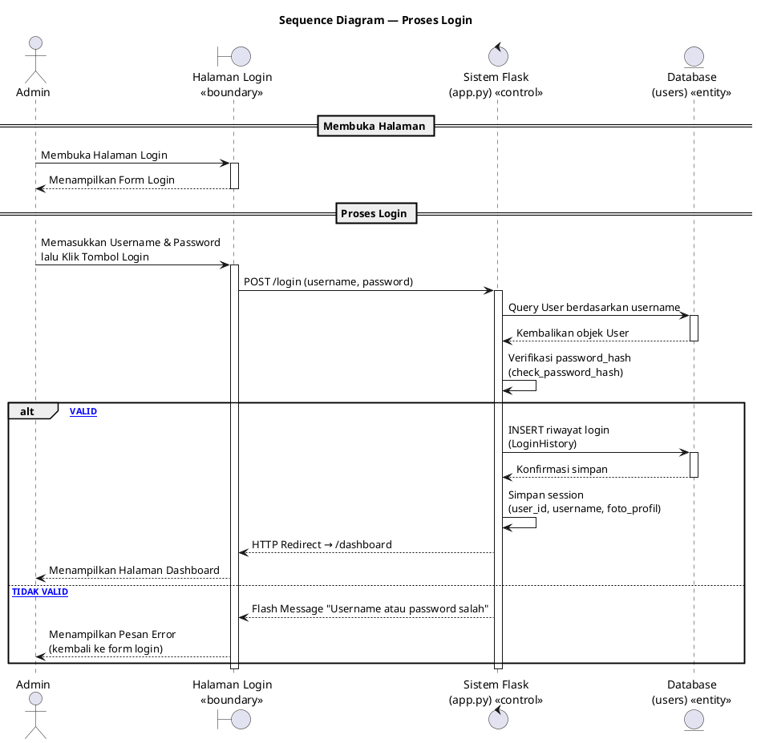
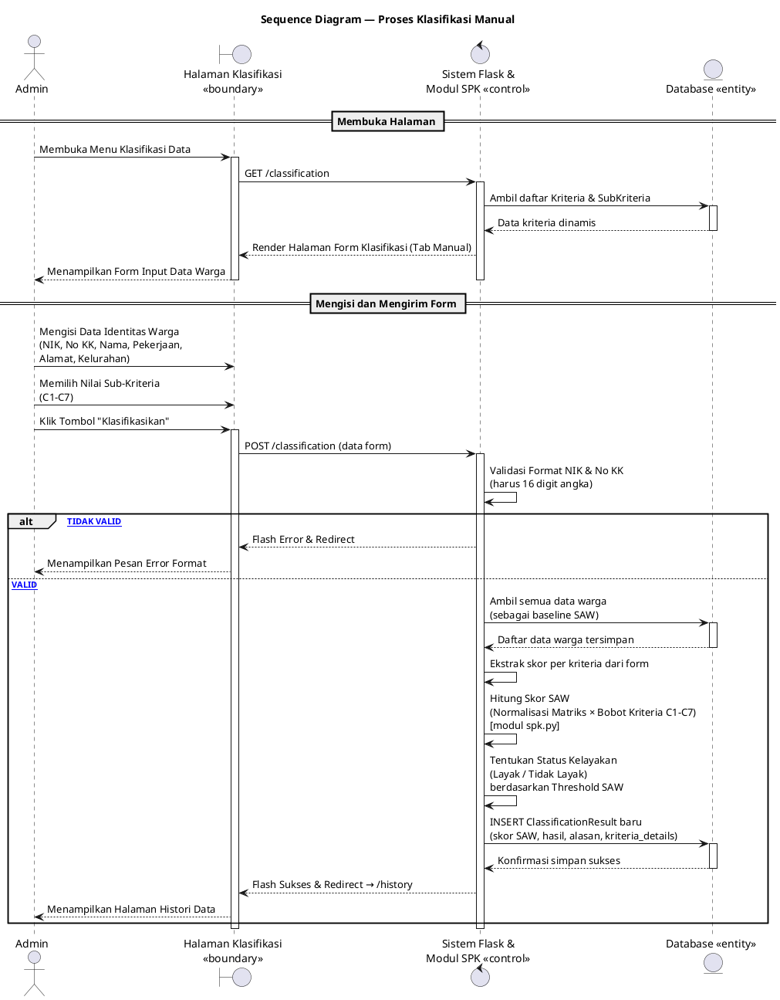
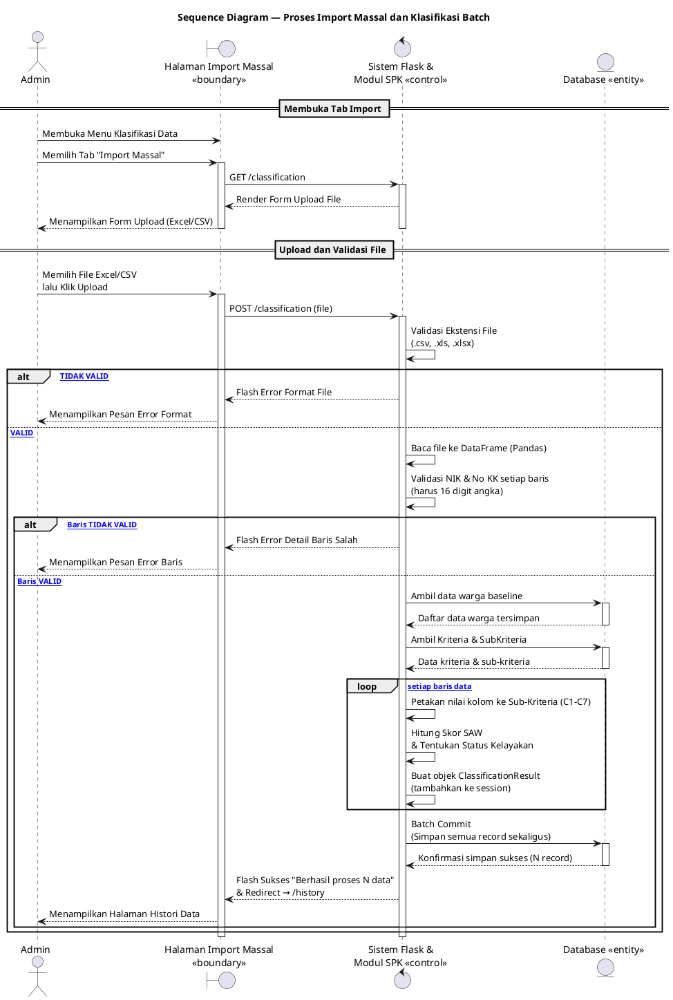
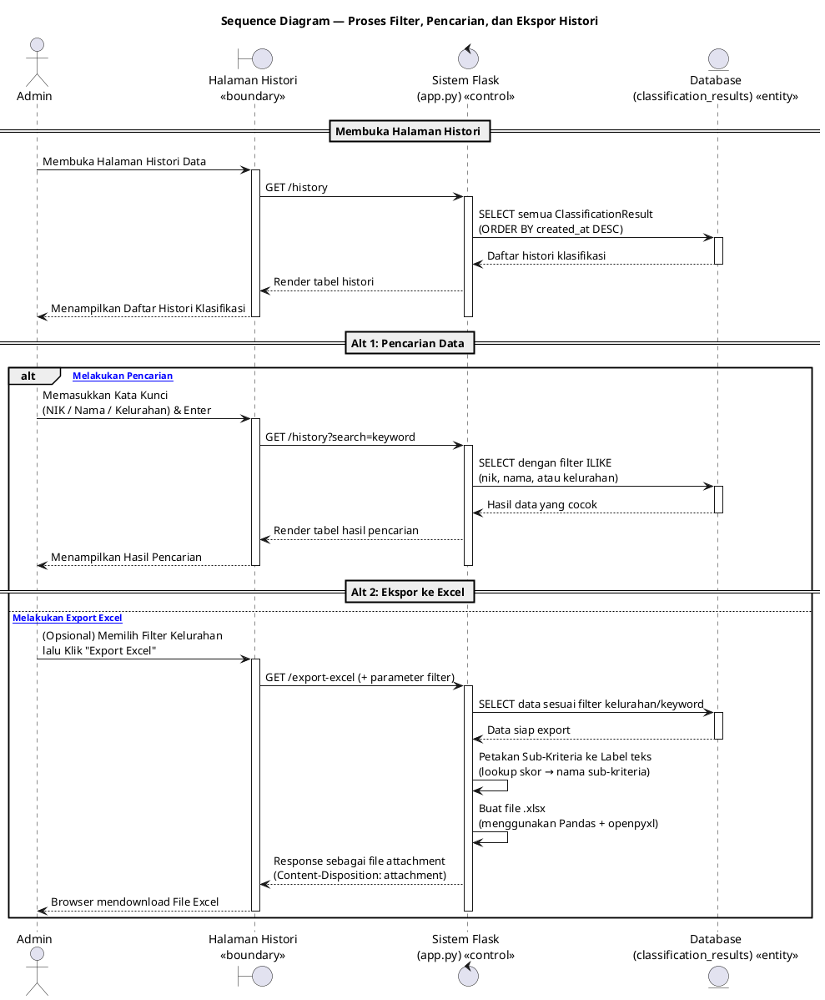
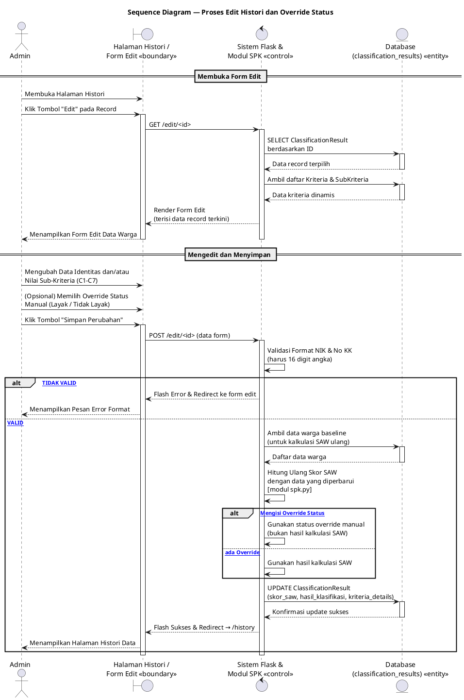
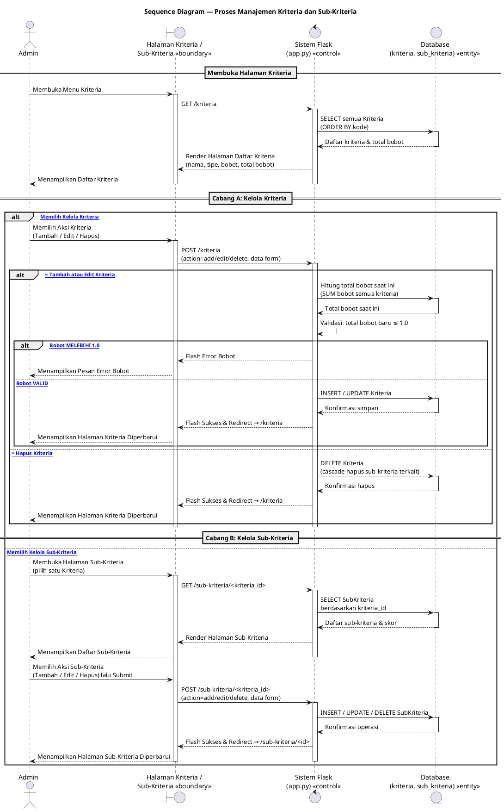

# Sequence Diagrams: Sistem Klasifikasi Bansos (Metode SAW)

Dokumen ini berisi **6 Sequence Diagram** yang identik dengan 6 Activity Diagram yang sudah dibuat,
lengkap dengan pembagian lifeline **BCE (Boundary, Control, Entity)**:

| Stereotipe | Peran | Contoh di Sistem Ini |
|---|---|---|
| **«boundary»** | Antarmuka / UI yang berinteraksi langsung dengan pengguna | Halaman Login, Halaman Klasifikasi, Halaman Histori, dll. |
| **«control»** | Logika pemrosesan, validasi, dan kalkulasi | Sistem Flask (app.py), Modul SPK (spk.py) |
| **«entity»** | Data persisten / model database | Database `users`, `classification_results`, `kriteria`, `sub_kriteria` |

> **Cara Import ke Draw.io:**
> 1. Copy salah satu blok `@startuml ... @enduml` di bawah.
> 2. Buka Draw.io → menu **Arrange → Insert → Advanced → PlantUML...**
> 3. Paste kodenya → klik **Insert**.
> Draw.io akan otomatis menampilkan ikon BCE (boundary = lingkaran+garis, control = lingkaran+panah, entity = lingkaran+garis bawah).

---

## Diagram 1: Proses Login

---

## Diagram 2: Proses Klasifikasi Manual

---

## Diagram 3: Proses Import Massal dan Klasifikasi Batch

---

## Diagram 4: Proses Filter, Pencarian, dan Ekspor Histori

---

## Diagram 5: Proses Edit Histori dan Override Status

---

## Diagram 6: Proses Manajemen Kriteria dan Sub-Kriteria

