# Kumpulan Activity Diagram — Sistem SPK Klasifikasi Bansos (Metode SAW)
### Kecamatan Pondok Aren, Kota Tangerang Selatan

> **Cara Penggunaan:** Salin kode PlantUML di bawah setiap diagram, lalu buka di **[PlantText.com](https://www.planttext.com/)** atau di **Draw.io** melalui `Extras > Edit Diagram > pilih format PlantUML`.

---
---

## 1. Activity Diagram: Login & Logout
**Aktor:** Admin, Staff, Camat
**Rute Sistem:** `/` (GET), `/login` (POST), `/logout` (GET)
**Deskripsi:** Proses autentikasi pengguna untuk masuk dan keluar dari sistem. Aktor Login dan Logout adalah sama (Admin, Staff, Camat), sehingga dijadikan satu diagram.

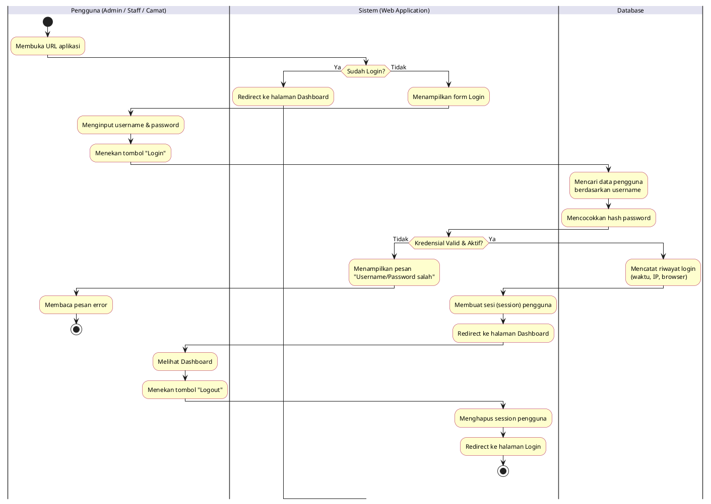

---

## 2. Activity Diagram: Dashboard Statistik
**Aktor:** Admin, Staff, Camat
**Rute Sistem:** `/dashboard` (GET)
**Deskripsi:** Proses menampilkan ringkasan statistik hasil klasifikasi bansos berupa kartu angka, grafik pie distribusi kelayakan, dan grafik bar per kelurahan.

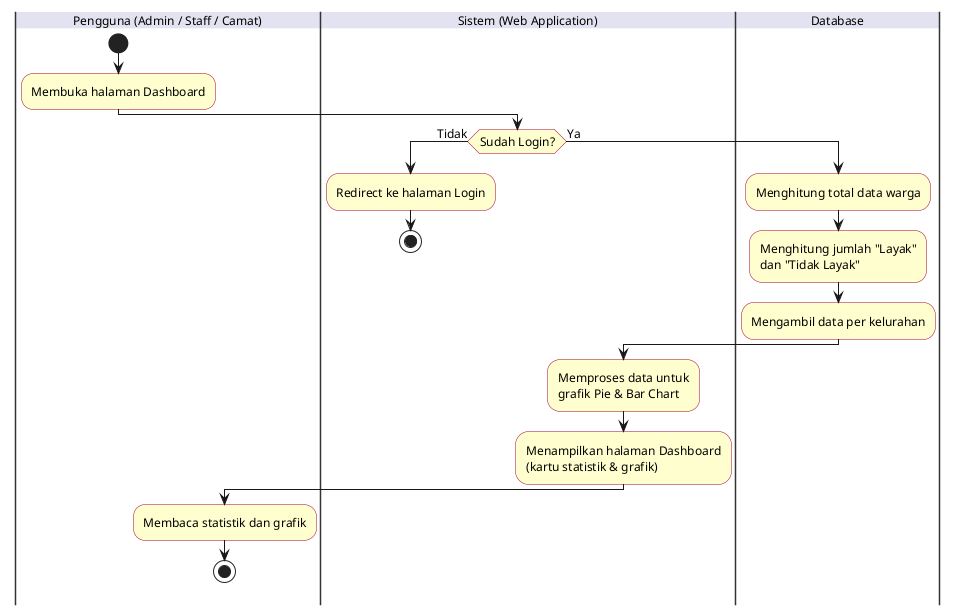

---

## 3. Activity Diagram: Klasifikasi Data Bansos (Input Manual)
**Aktor:** Admin, Staff
**Rute Sistem:** `/classification` (GET, POST)
**Deskripsi:** Proses menginput data warga satu per satu melalui form, menghitung skor SAW, dan menyimpan hasilnya ke database.

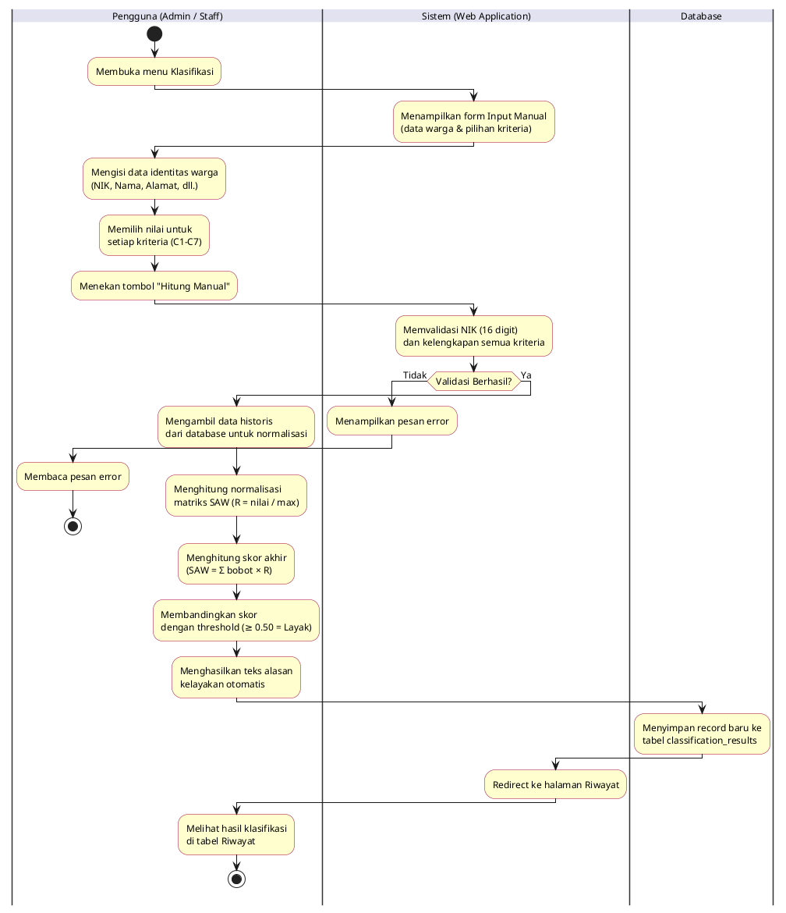

---

## 4. Activity Diagram: Klasifikasi Data Bansos (Import Excel / CSV)
**Aktor:** Admin, Staff
**Rute Sistem:** `/classification` (POST dengan file upload)
**Deskripsi:** Proses mengunggah file Excel atau CSV berisi banyak data warga sekaligus untuk diproses secara massal (batch).

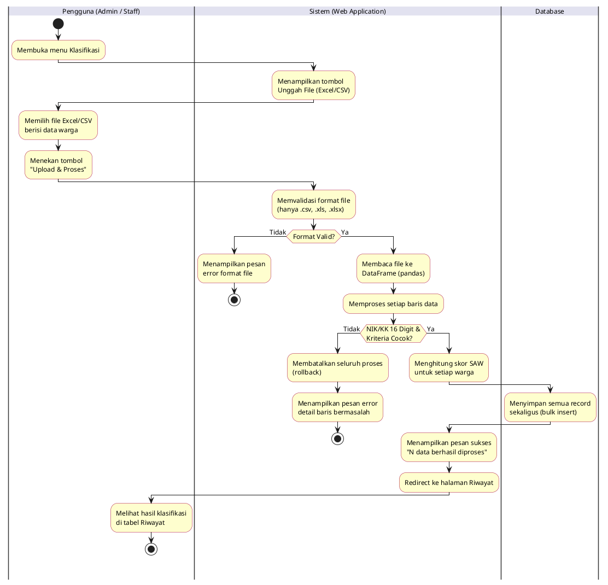

---

## 5. Activity Diagram: Riwayat Klasifikasi (Lihat & Cari)
**Aktor:** Admin, Staff, Camat
**Rute Sistem:** `/history` (GET), `/api/history` (GET, JSON)
**Deskripsi:** Proses melihat daftar seluruh hasil klasifikasi yang telah tersimpan, dengan kemampuan pencarian berdasarkan nama, NIK, atau kelurahan.

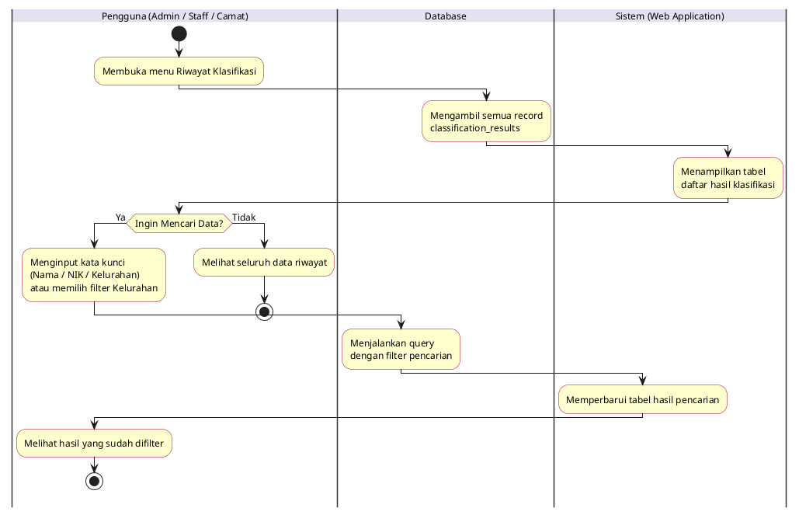

---

## 6. Activity Diagram: Edit Data Riwayat Klasifikasi
**Aktor:** Admin, Staff
**Rute Sistem:** `/edit/<id>` (GET, POST)
**Deskripsi:** Proses mengubah data warga yang sudah tersimpan. Sistem akan otomatis menghitung ulang skor SAW. Admin juga dapat mengganti hasil secara manual (override).

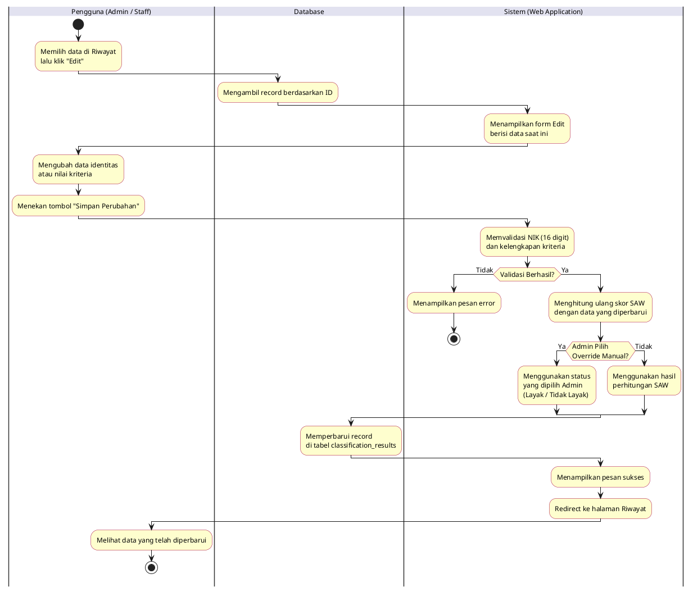

---

## 7. Activity Diagram: Hapus Data Riwayat Klasifikasi
**Aktor:** Admin, Staff
**Rute Sistem:** `/delete/<id>` (POST), `/delete_all` (POST — Admin Only)
**Deskripsi:** Proses menghapus satu record klasifikasi, atau seluruh data sekaligus. Hapus semua hanya bisa dilakukan oleh Admin.

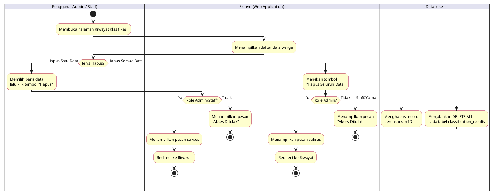

---

## 8. Activity Diagram: Export Data ke Excel
**Aktor:** Admin, Staff, Camat
**Rute Sistem:** `/export/excel` (GET)
**Deskripsi:** Proses mengunduh seluruh data riwayat klasifikasi (atau yang sudah difilter) ke dalam file Excel (.xlsx).

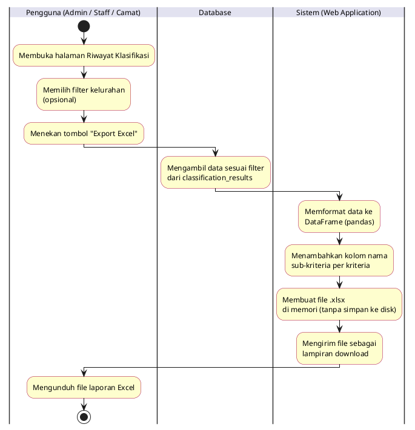

---

## 9. Activity Diagram: Manajemen Kriteria
**Aktor:** Admin
**Rute Sistem:** `/kriteria` (GET, POST)
**Deskripsi:** Proses mengelola kriteria penilaian SPK (tambah, edit, hapus, dan atur bobot). Sistem memastikan total bobot seluruh kriteria selalu tepat 1.0.

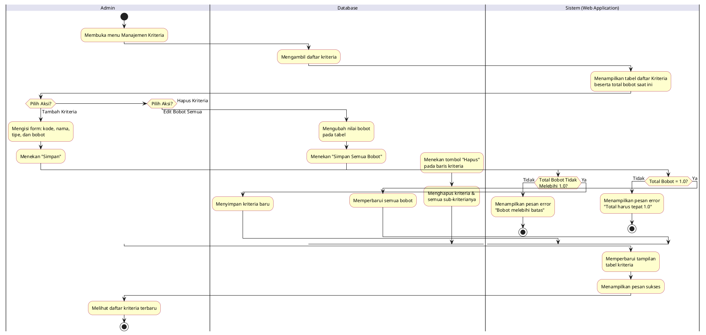

---

## 10. Activity Diagram: Manajemen Sub-Kriteria
**Aktor:** Admin
**Rute Sistem:** `/sub-kriteria/<kriteria_id>` (GET, POST)
**Deskripsi:** Proses mengelola sub-kriteria (opsi jawaban dan skor) untuk setiap kriteria penilaian. Sub-kriteria menentukan nilai skor yang dipakai dalam perhitungan SAW.

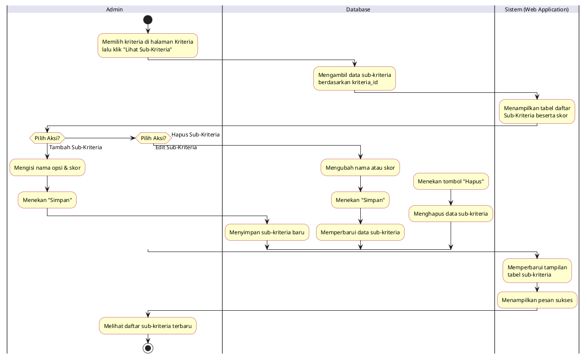

---

## 11. Activity Diagram: Manajemen Pengguna (User Management)
**Aktor:** Admin
**Rute Sistem:** `/users` (GET), `/users/create` (POST), `/users/edit-role/<id>` (POST), `/users/delete/<id>` (POST)
**Deskripsi:** Proses mengelola akun pengguna sistem (Staff dan Camat), termasuk mendaftarkan akun baru, mengubah role, dan menonaktifkan akun.

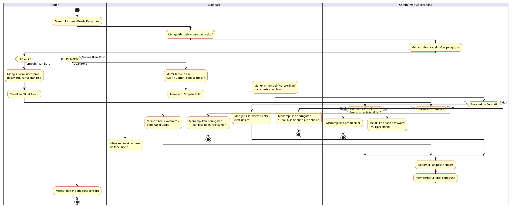

---

## 12. Activity Diagram: Ubah Profil & Foto Profil
**Aktor:** Admin, Staff, Camat
**Rute Sistem:** `/profil` (GET, POST)
**Deskripsi:** Proses memperbarui nama lengkap dan foto profil pengguna yang sedang login.

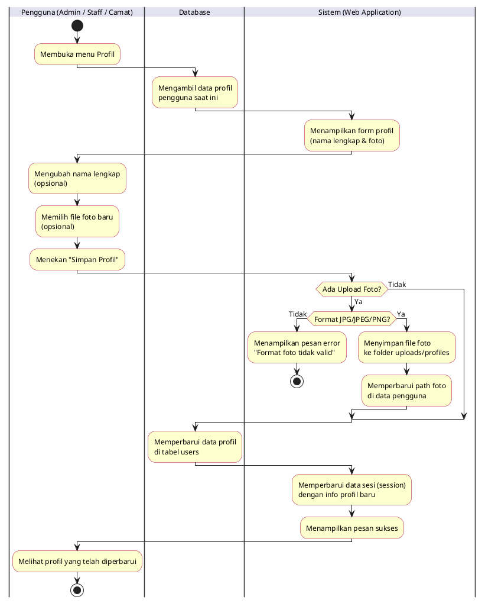

---

## 13. Activity Diagram: Ganti Password
**Aktor:** Admin, Staff, Camat
**Rute Sistem:** `/ganti-password` (GET, POST)
**Deskripsi:** Proses mengganti kata sandi pengguna. Sistem memverifikasi password lama sebelum menyimpan password baru yang sudah di-hash.

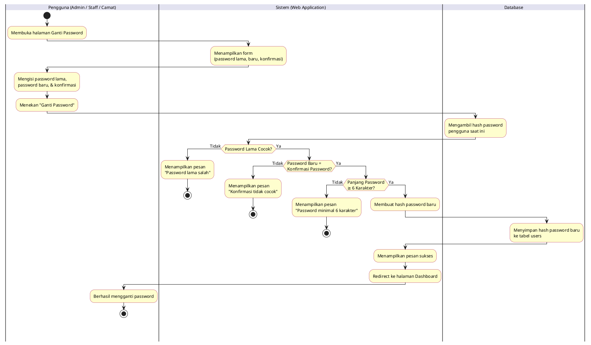

---

## 14. Activity Diagram: Melihat Riwayat Login
**Aktor:** Admin, Staff, Camat
**Rute Sistem:** `/riwayat-login` (GET)
**Deskripsi:** Proses melihat log aktivitas login pribadi pengguna yang sedang aktif, menampilkan 20 riwayat login terakhir beserta waktu, IP address, dan informasi browser.

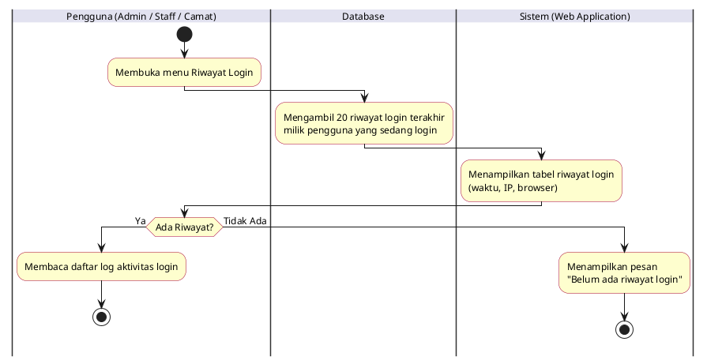

---

## 15. Activity Diagram: Melihat Informasi SPK
**Aktor:** Admin, Staff, Camat
**Rute Sistem:** `/informasi` (GET)
**Deskripsi:** Proses mengakses halaman referensi yang menampilkan penjelasan tentang metode SAW, daftar kriteria beserta bobot, dan ambang batas kelayakan.

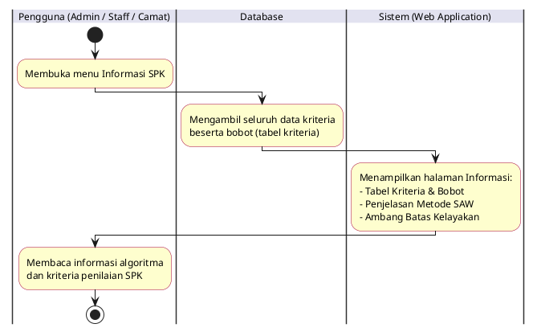
