# Kumpulan Activity Diagram — Sistem SPK Klasifikasi Bansos (Metode SAW)
### Kecamatan Pondok Aren, Kota Tangerang Selatan

> **Cara Penggunaan:** Salin kode PlantUML di bawah setiap diagram, lalu buka di **[PlantText.com](https://www.planttext.com/)** atau di **Draw.io** melalui `Extras > Edit Diagram > pilih format PlantUML`.

---
---

## 1. Activity Diagram: Login
**Aktor:** Admin, Staff, Camat
**Deskripsi:** Proses autentikasi pengguna untuk masuk ke dalam sistem.

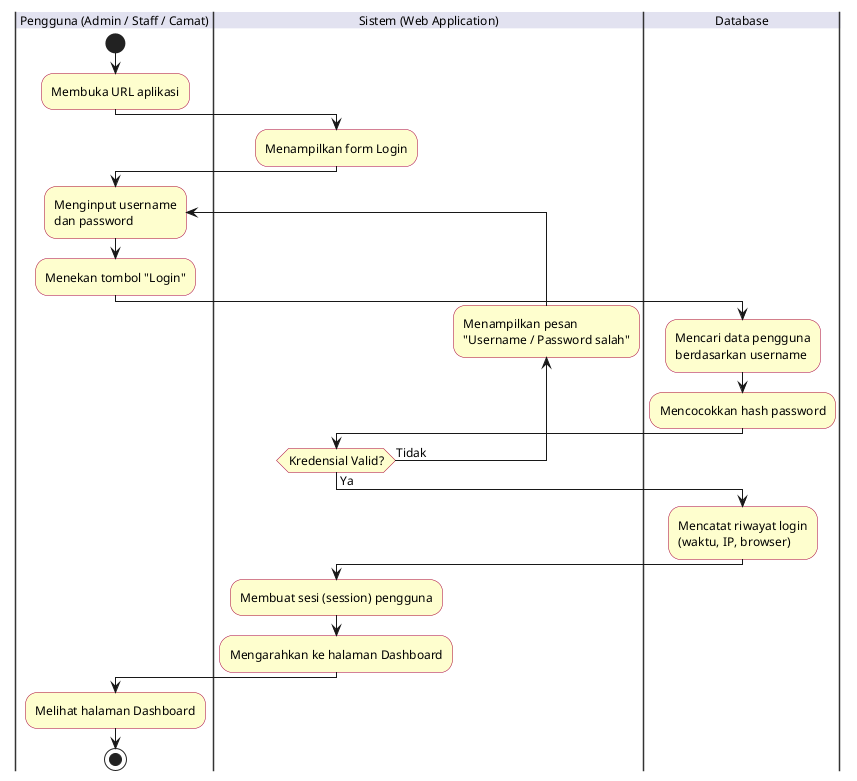

---

## 2. Activity Diagram: Logout
**Aktor:** Admin, Staff, Camat
**Deskripsi:** Proses keluar dari sistem.

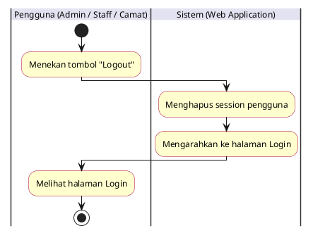

---

## 3. Activity Diagram: Dashboard Statistik
**Aktor:** Admin, Staff, Camat
**Deskripsi:** Proses menampilkan ringkasan statistik hasil klasifikasi bansos.

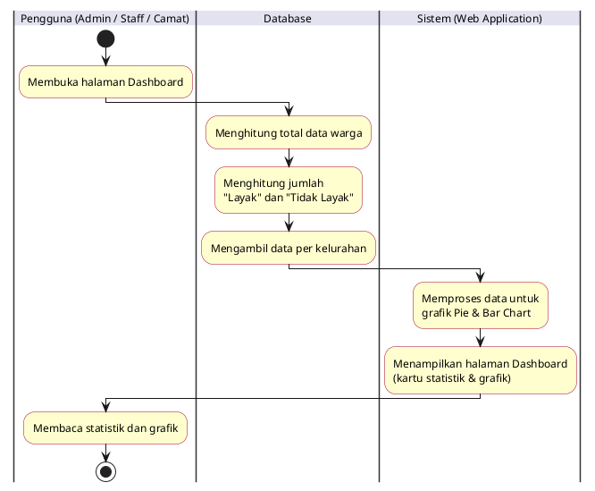

---

## 4. Activity Diagram: Klasifikasi Data Bansos (Input Manual)
**Aktor:** Admin, Staff
**Deskripsi:** Proses menginput data warga satu per satu melalui form, menghitung skor SAW, dan menyimpan hasilnya.

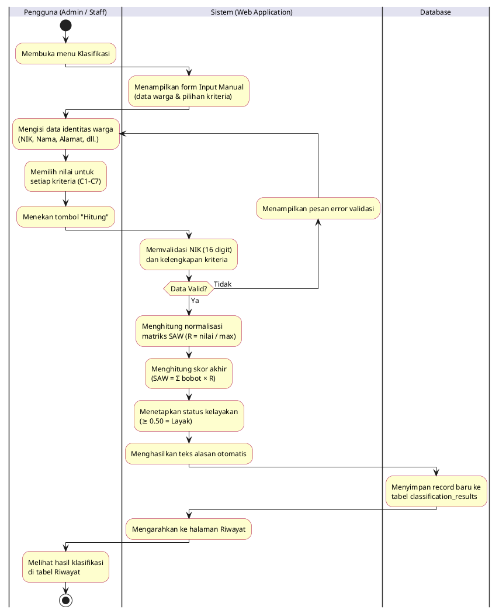

---

## 5. Activity Diagram: Klasifikasi Data Bansos (Import Excel / CSV)
**Aktor:** Admin, Staff
**Deskripsi:** Proses mengunggah file Excel atau CSV berisi banyak data warga sekaligus untuk diproses secara massal (batch).

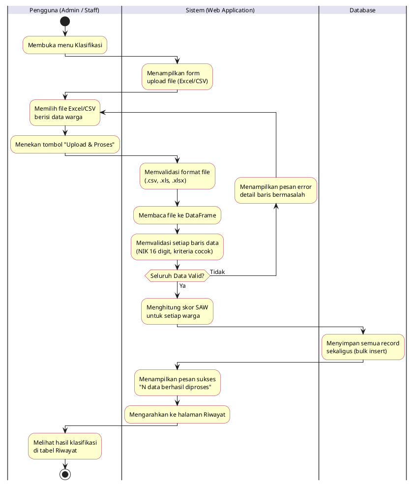

---

## 6. Activity Diagram: Riwayat Klasifikasi (Lihat & Cari)
**Aktor:** Admin, Staff, Camat
**Deskripsi:** Proses melihat daftar seluruh hasil klasifikasi warga, dengan fitur pencarian dan filter kelurahan.

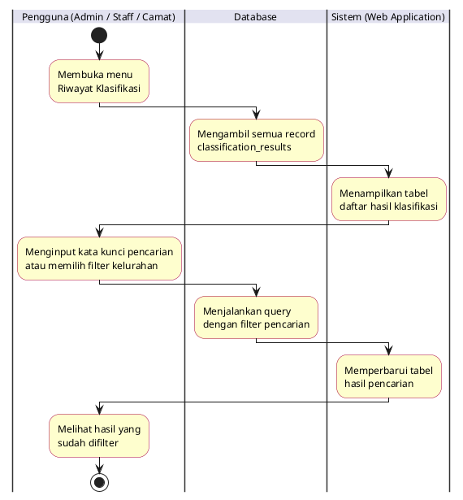

---

## 7. Activity Diagram: Edit Data Riwayat Klasifikasi
**Aktor:** Admin, Staff
**Deskripsi:** Proses mengubah data warga yang sudah tersimpan. Sistem otomatis menghitung ulang skor SAW. Admin dapat mengganti hasil secara manual (override).

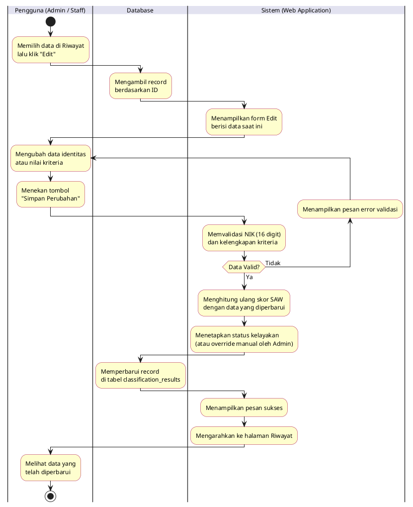

---

## 8. Activity Diagram: Hapus Data Riwayat Klasifikasi
**Aktor:** Admin, Staff
**Deskripsi:** Proses menghapus satu record klasifikasi dari tabel riwayat.

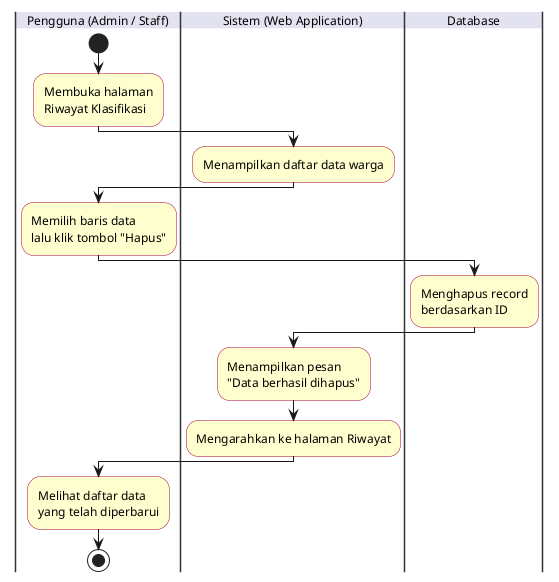

---

## 9. Activity Diagram: Hapus Seluruh Data Riwayat
**Aktor:** Admin
**Deskripsi:** Proses menghapus seluruh record klasifikasi sekaligus. Hanya Admin yang memiliki akses untuk melakukan aksi ini.

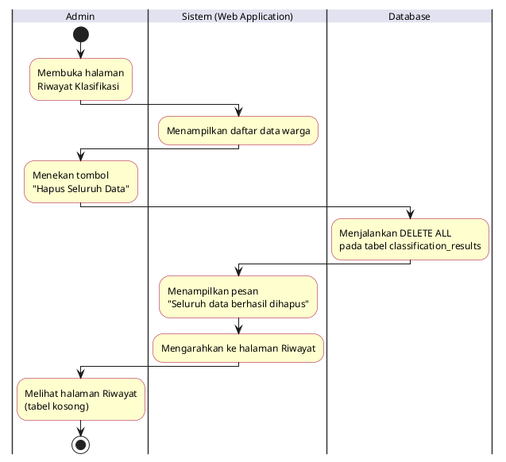

---

## 10. Activity Diagram: Export Data ke Excel
**Aktor:** Admin, Staff, Camat
**Deskripsi:** Proses mengunduh data riwayat klasifikasi ke file Excel (.xlsx).

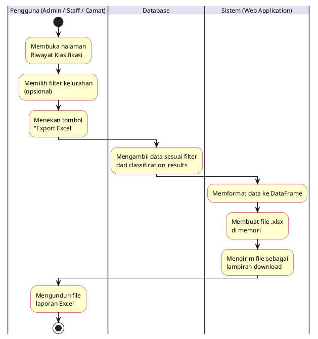

---

## 11. Activity Diagram: Manajemen Kriteria (Tambah)
**Aktor:** Admin
**Deskripsi:** Proses menambahkan kriteria penilaian SPK baru. Sistem memastikan total bobot seluruh kriteria tidak melebihi 1.0.

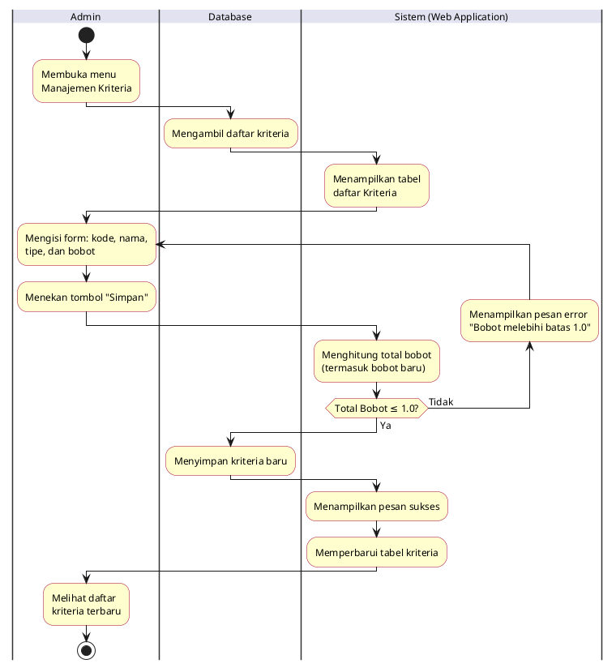

---

## 12. Activity Diagram: Manajemen Kriteria (Edit & Hapus)
**Aktor:** Admin
**Deskripsi:** Proses mengubah data kriteria atau menghapus kriteria dari daftar penilaian.

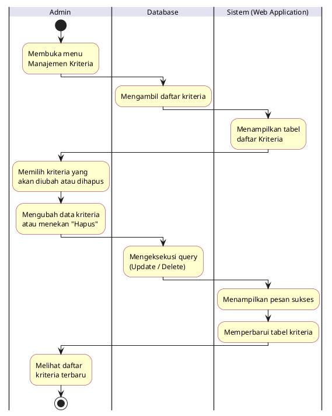

---

## 13. Activity Diagram: Manajemen Sub-Kriteria
**Aktor:** Admin
**Deskripsi:** Proses mengelola sub-kriteria (opsi jawaban dan skor) untuk setiap kriteria penilaian. Sub-kriteria menentukan nilai skor yang dipakai dalam perhitungan SAW.

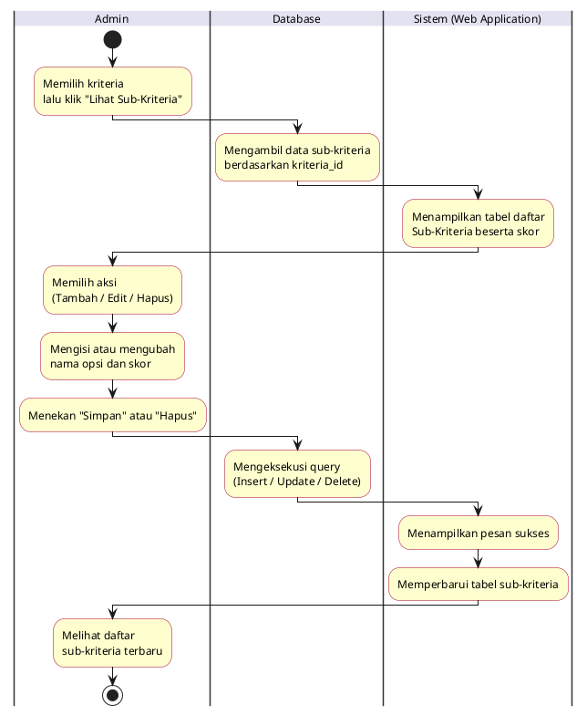

---

## 14. Activity Diagram: Manajemen Pengguna (Tambah Akun)
**Aktor:** Admin
**Deskripsi:** Proses mendaftarkan akun baru untuk Staff atau Camat ke dalam sistem.

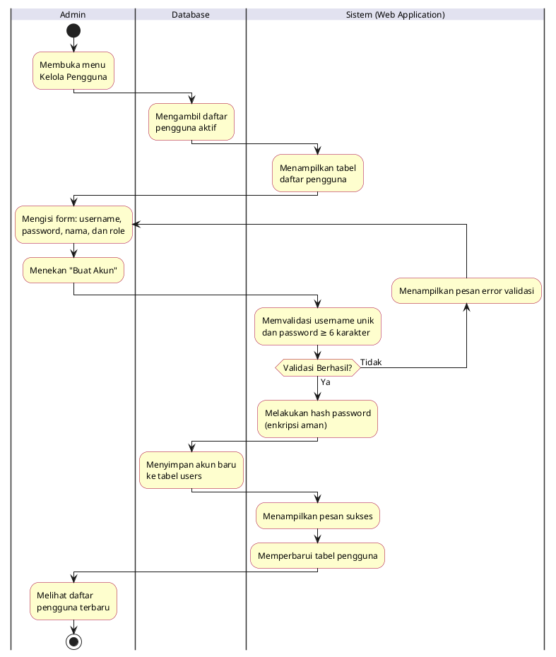

---

## 15. Activity Diagram: Manajemen Pengguna (Ubah Role & Nonaktifkan)
**Aktor:** Admin
**Deskripsi:** Proses mengubah role pengguna atau menonaktifkan akun pengguna lain (soft delete).

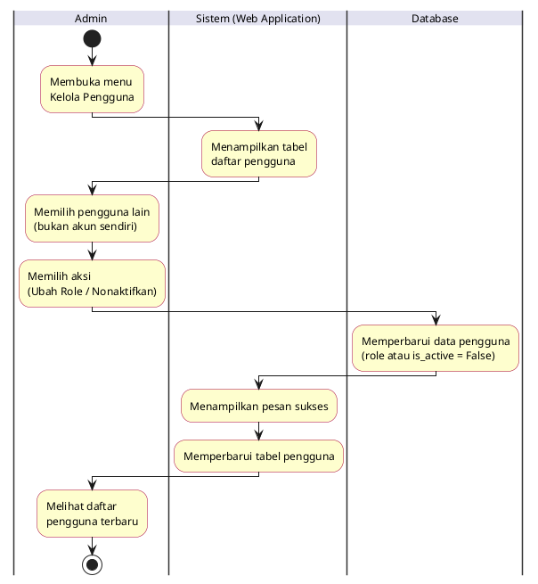

---

## 16. Activity Diagram: Ubah Profil & Foto Profil
**Aktor:** Admin, Staff, Camat
**Deskripsi:** Proses memperbarui nama lengkap dan mengunggah foto profil.

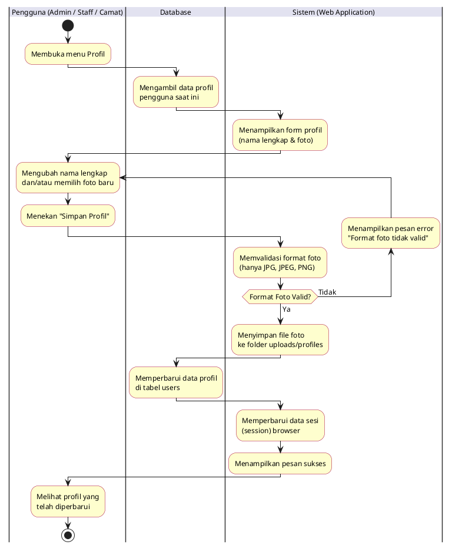

---

## 17. Activity Diagram: Ganti Password
**Aktor:** Admin, Staff, Camat
**Deskripsi:** Proses mengganti kata sandi pengguna. Sistem memverifikasi password lama sebelum menerima password baru.

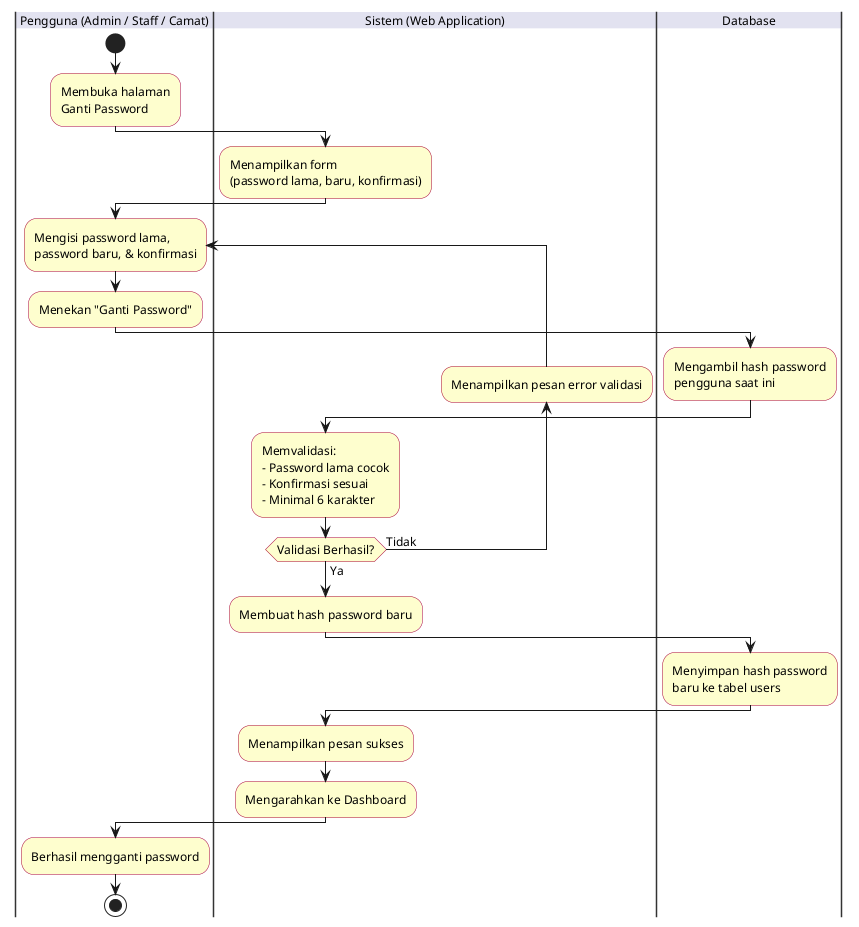

---

## 18. Activity Diagram: Melihat Riwayat Login
**Aktor:** Admin, Staff, Camat
**Deskripsi:** Proses melihat log aktivitas login pribadi pengguna yang sedang aktif, menampilkan 20 riwayat login terakhir.

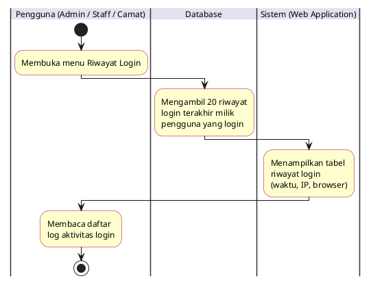

---

## 19. Activity Diagram: Melihat Informasi SPK
**Aktor:** Admin, Staff, Camat
**Deskripsi:** Proses mengakses halaman referensi yang menampilkan penjelasan tentang metode SAW, daftar kriteria beserta bobot, dan ambang batas kelayakan.

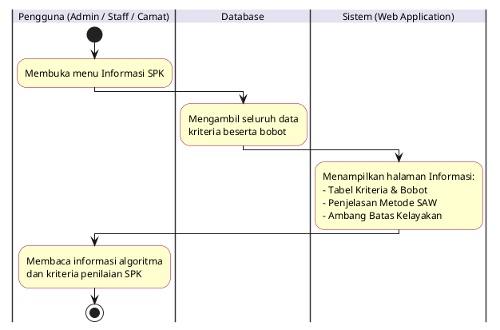
