# Kumpulan Activity Diagram — Sistem SPK Klasifikasi Bansos (Metode SAW)
### Kecamatan Pondok Aren, Kota Tangerang Selatan

> **Cara Penggunaan:** Salin kode PlantUML, lalu buka di **[PlantText.com](https://www.planttext.com/)**.

---
---

## 1. Activity Diagram: Login
**Aktor:** Admin, Staff, Camat
**Deskripsi:** Proses autentikasi pengguna. Jika gagal, pengguna kembali ke form login dan mencoba lagi.

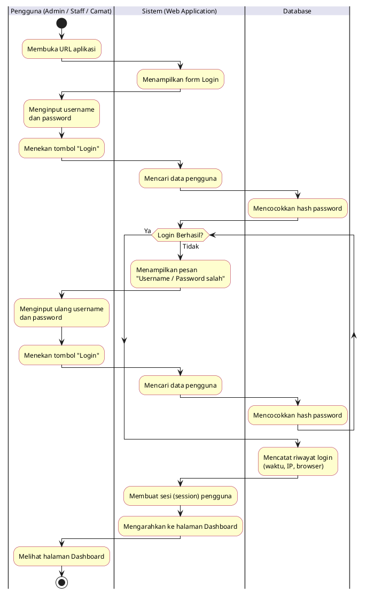

---

## 2. Activity Diagram: Logout
**Aktor:** Admin, Staff, Camat
**Deskripsi:** Proses keluar dari sistem dan mengakhiri sesi.

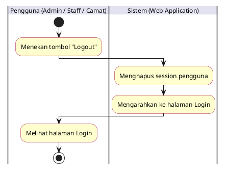

---

## 3. Activity Diagram: Dashboard Statistik
**Aktor:** Admin, Staff, Camat
**Deskripsi:** Proses menampilkan ringkasan statistik hasil klasifikasi bansos berupa kartu angka dan grafik.

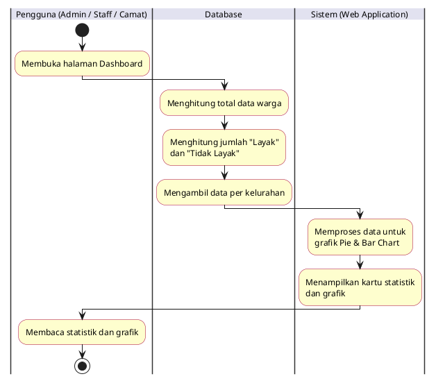

---

## 4. Activity Diagram: Klasifikasi Data Bansos (Input Manual)
**Aktor:** Admin, Staff
**Deskripsi:** Proses menginput data warga satu per satu melalui form. Jika validasi gagal, pengguna memperbaiki dan mengirim ulang form.

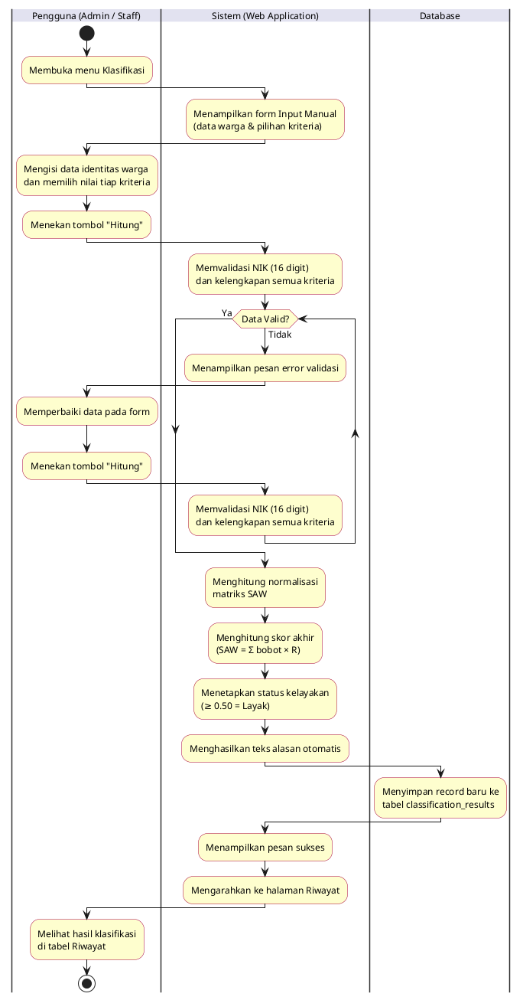

---

## 5. Activity Diagram: Klasifikasi Data Bansos (Import Excel / CSV)
**Aktor:** Admin, Staff
**Deskripsi:** Proses mengunggah file Excel/CSV berisi banyak data warga sekaligus. Jika file atau data baris tidak valid, pengguna mengupload ulang file yang sudah diperbaiki.

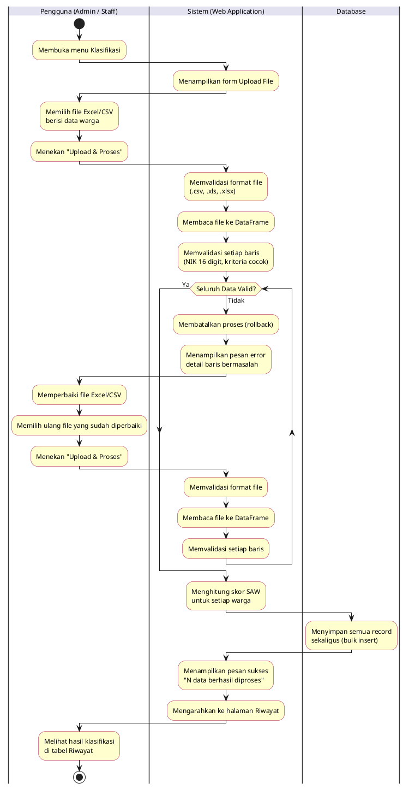

---

## 6. Activity Diagram: Riwayat Klasifikasi (Lihat & Cari)
**Aktor:** Admin, Staff, Camat
**Deskripsi:** Proses melihat seluruh hasil klasifikasi dengan fitur pencarian nama/NIK dan filter kelurahan.

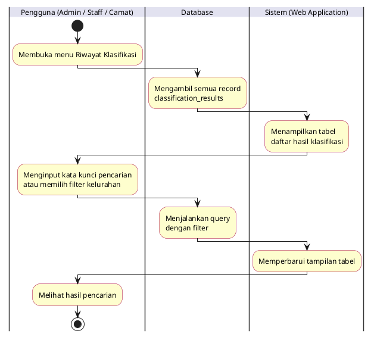

---

## 7. Activity Diagram: Edit Data Riwayat Klasifikasi
**Aktor:** Admin, Staff
**Deskripsi:** Proses mengubah data warga yang sudah tersimpan. Jika validasi gagal, pengguna kembali memperbaiki form edit.

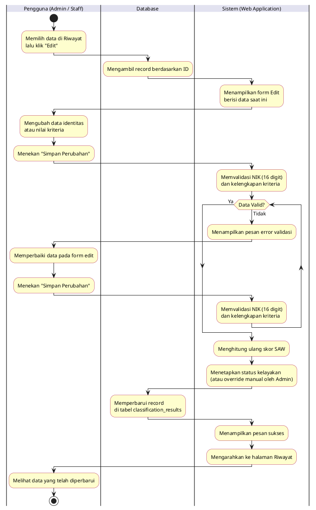

---

## 8. Activity Diagram: Hapus Satu Data Riwayat
**Aktor:** Admin, Staff
**Deskripsi:** Proses menghapus satu record klasifikasi. Jika dibatalkan, pengguna kembali ke halaman Riwayat.

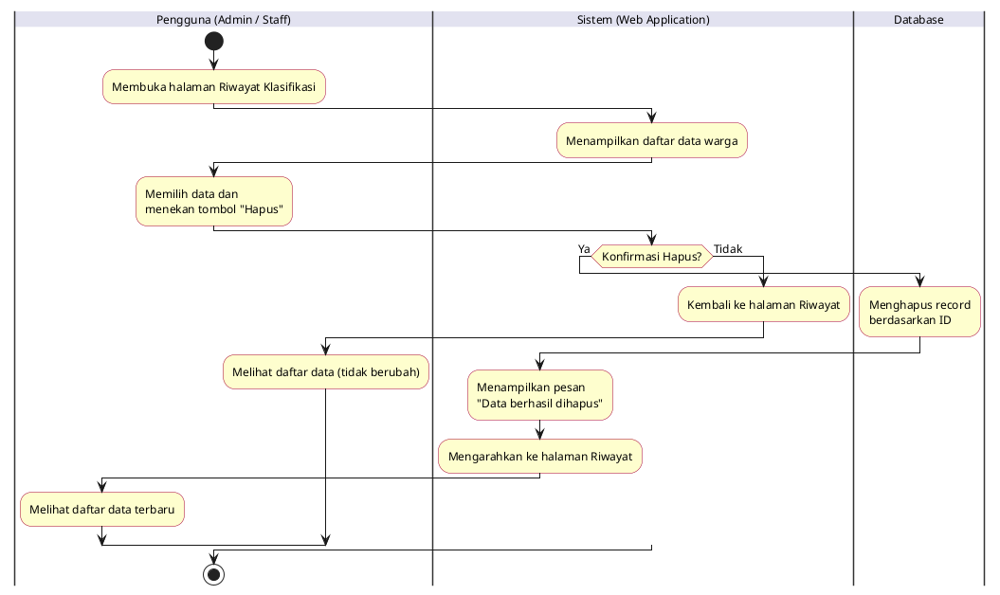

---

## 9. Activity Diagram: Hapus Seluruh Data Riwayat
**Aktor:** Admin
**Deskripsi:** Proses menghapus seluruh record klasifikasi sekaligus. Hanya Admin yang memiliki akses fitur ini.

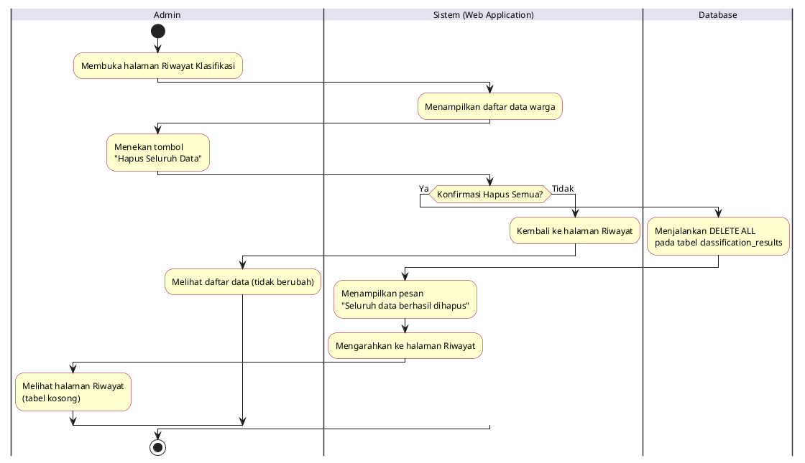

---

## 10. Activity Diagram: Export Data ke Excel
**Aktor:** Admin, Staff, Camat
**Deskripsi:** Proses mengunduh data riwayat klasifikasi ke file Excel (.xlsx). Tidak ada validasi input.

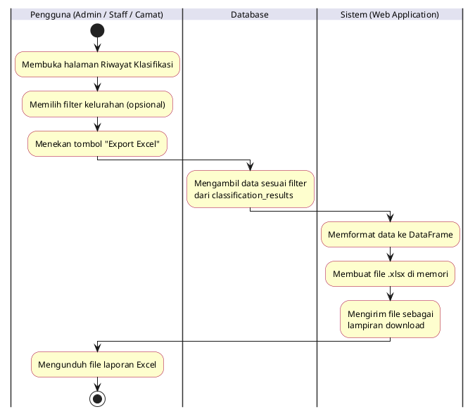

---

## 11. Activity Diagram: Tambah Kriteria
**Aktor:** Admin
**Deskripsi:** Proses menambahkan kriteria penilaian baru. Jika total bobot melebihi 1.0, Admin memperbaiki nilai bobot dan mengirim ulang form.

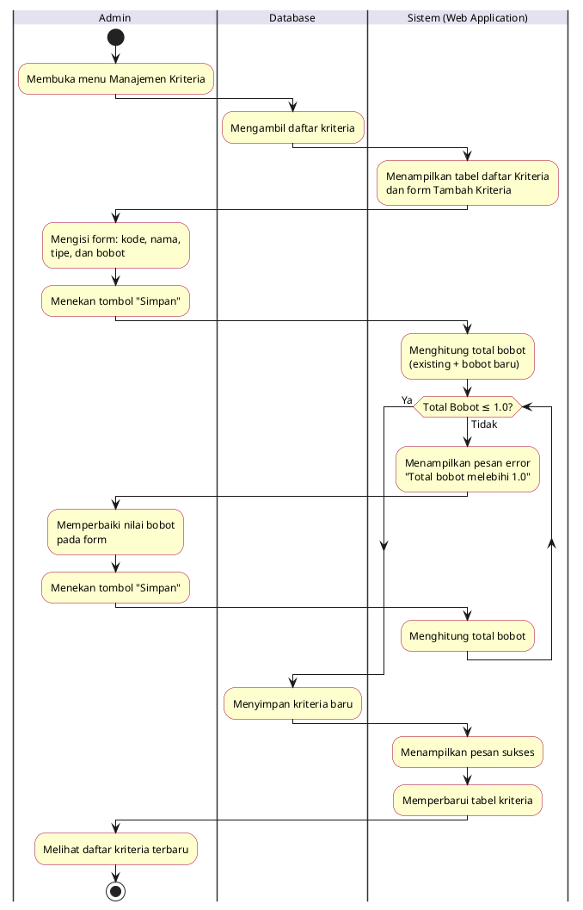

---

## 12. Activity Diagram: Edit & Hapus Kriteria
**Aktor:** Admin
**Deskripsi:** Proses mengubah data kriteria yang ada atau menghapusnya dari daftar penilaian.

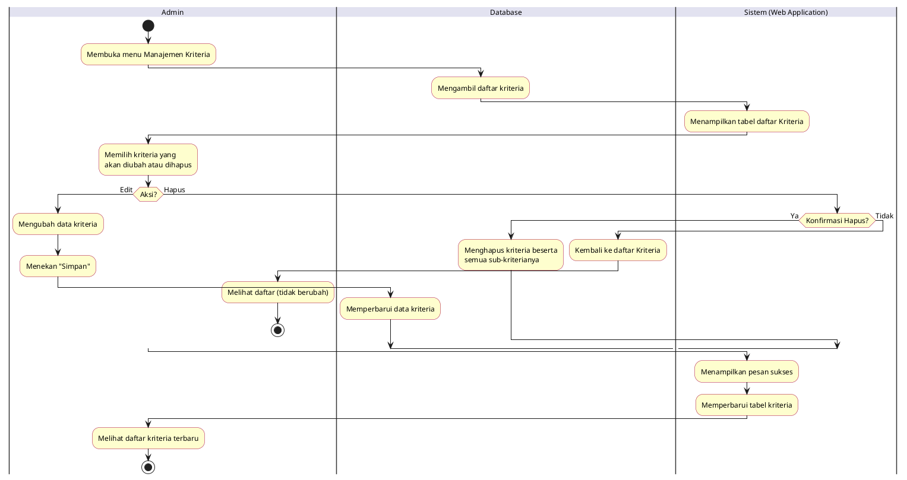

---

## 13. Activity Diagram: Manajemen Sub-Kriteria
**Aktor:** Admin
**Deskripsi:** Proses mengelola sub-kriteria (opsi jawaban beserta skor) untuk setiap kriteria penilaian.

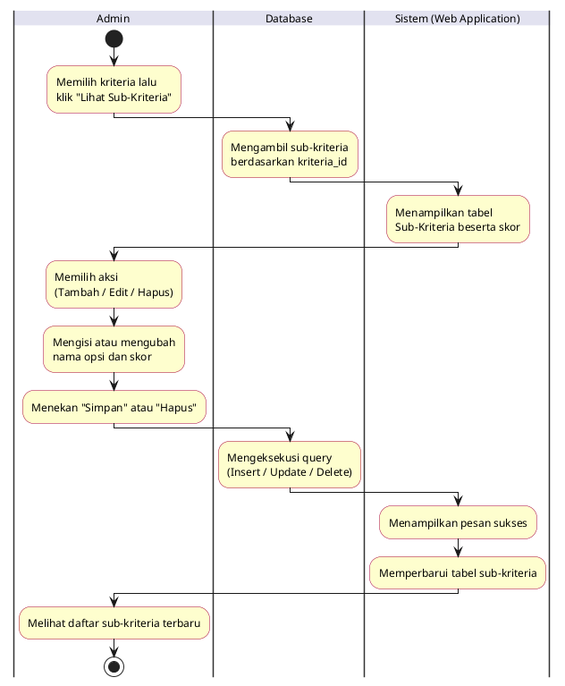

---

## 14. Activity Diagram: Tambah Akun Pengguna
**Aktor:** Admin
**Deskripsi:** Proses mendaftarkan akun baru untuk Staff atau Camat. Jika validasi gagal (username duplikat atau password terlalu pendek), Admin memperbaiki form dan mengirim ulang.

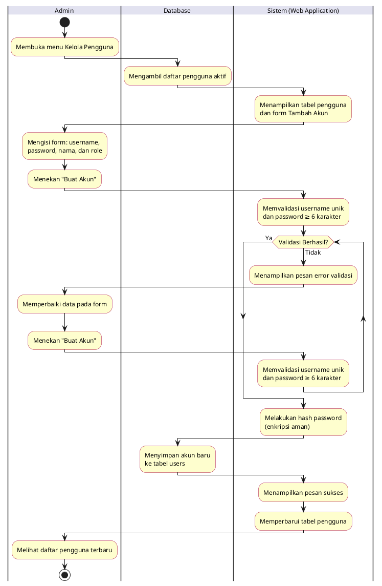

---

## 15. Activity Diagram: Ubah Role & Nonaktifkan Pengguna
**Aktor:** Admin
**Deskripsi:** Proses mengubah role pengguna lain atau menonaktifkan akun mereka (soft delete). Admin tidak dapat mengubah atau menonaktifkan akunnya sendiri.

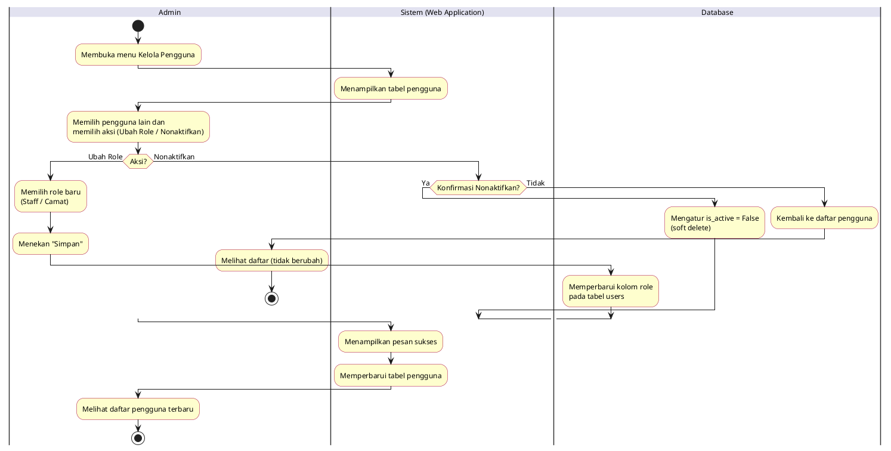

---

## 16. Activity Diagram: Ubah Profil & Foto Profil
**Aktor:** Admin, Staff, Camat
**Deskripsi:** Proses memperbarui nama lengkap dan foto profil. Jika format foto tidak valid, pengguna memilih ulang file foto.

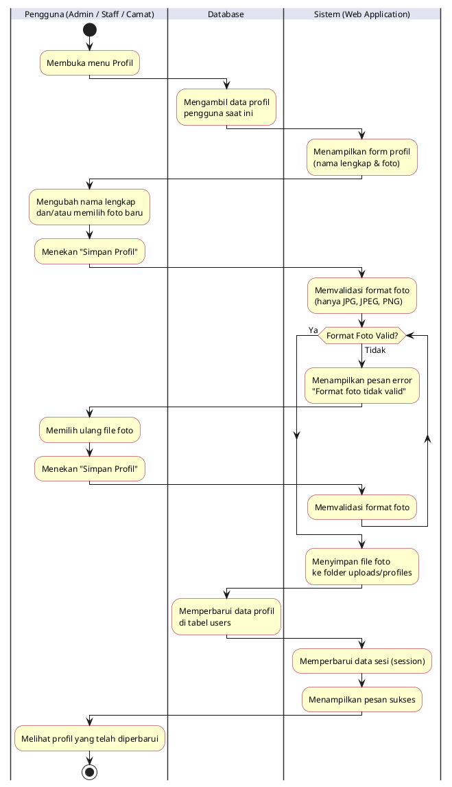

---

## 17. Activity Diagram: Ganti Password
**Aktor:** Admin, Staff, Camat
**Deskripsi:** Proses mengganti kata sandi. Jika validasi gagal (password lama salah, konfirmasi tidak cocok, atau terlalu pendek), pengguna memperbaiki form dan mencoba lagi.

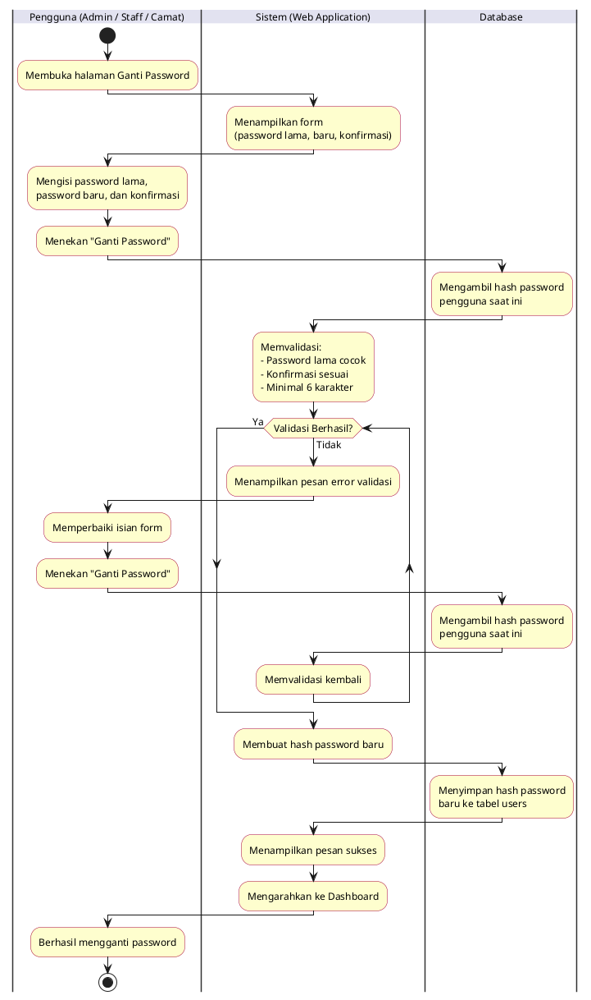

---

## 18. Activity Diagram: Melihat Riwayat Login
**Aktor:** Admin, Staff, Camat
**Deskripsi:** Proses melihat log 20 aktivitas login terakhir milik pengguna yang sedang aktif.

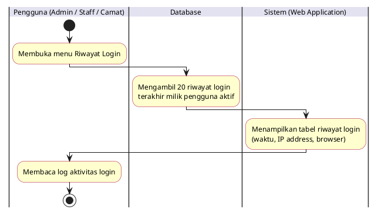

---

## 19. Activity Diagram: Melihat Informasi SPK
**Aktor:** Admin, Staff, Camat
**Deskripsi:** Proses mengakses halaman informasi yang menampilkan penjelasan metode SAW, daftar kriteria, bobot, dan ambang batas kelayakan.

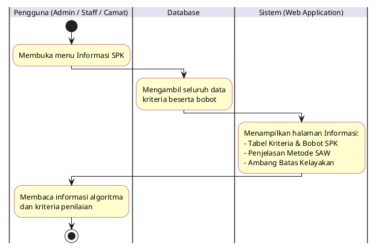
