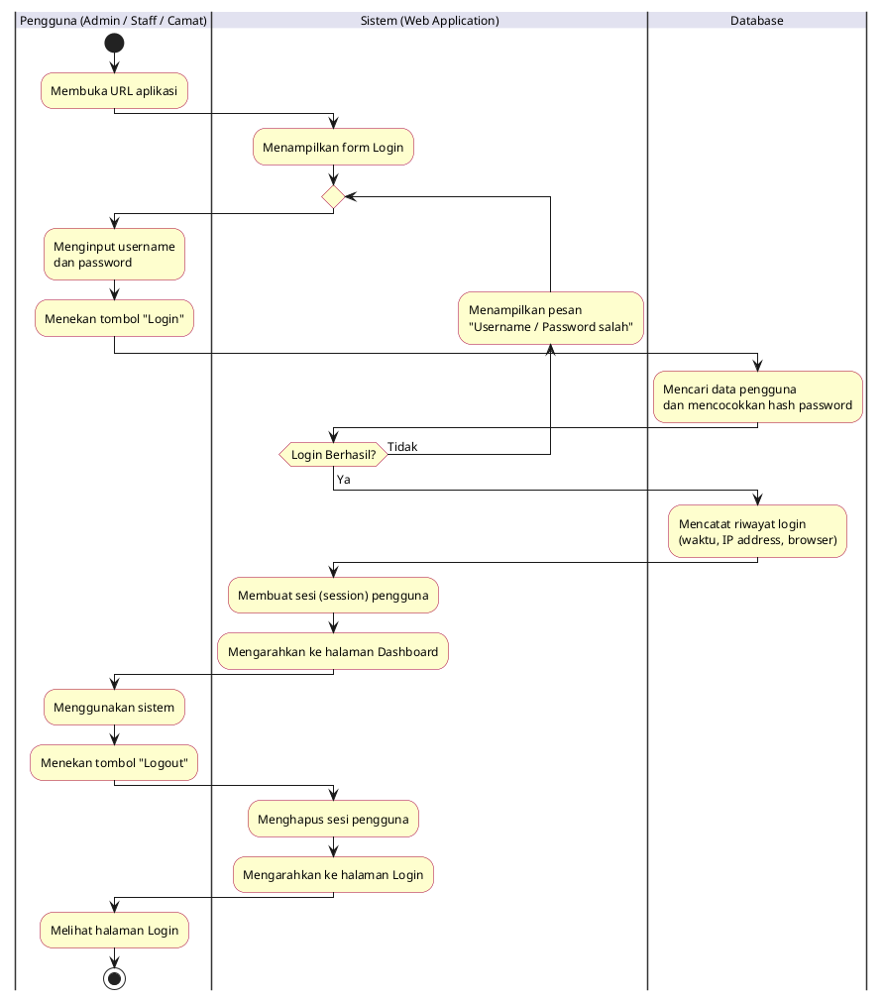
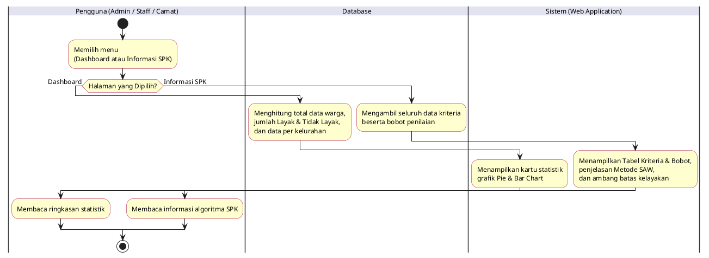
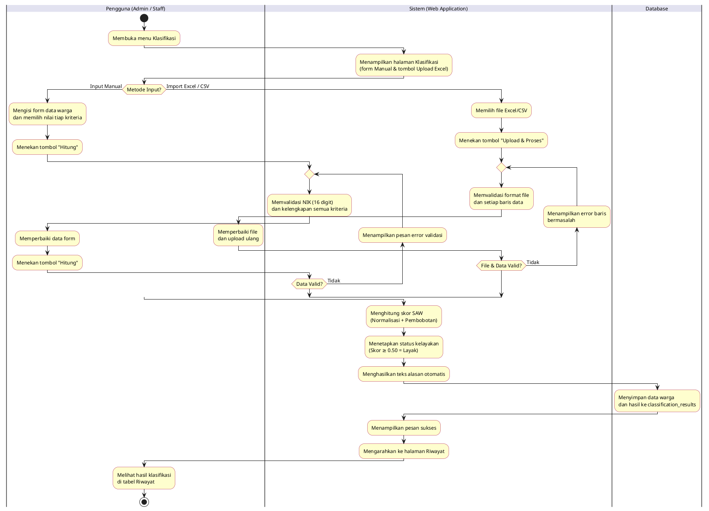
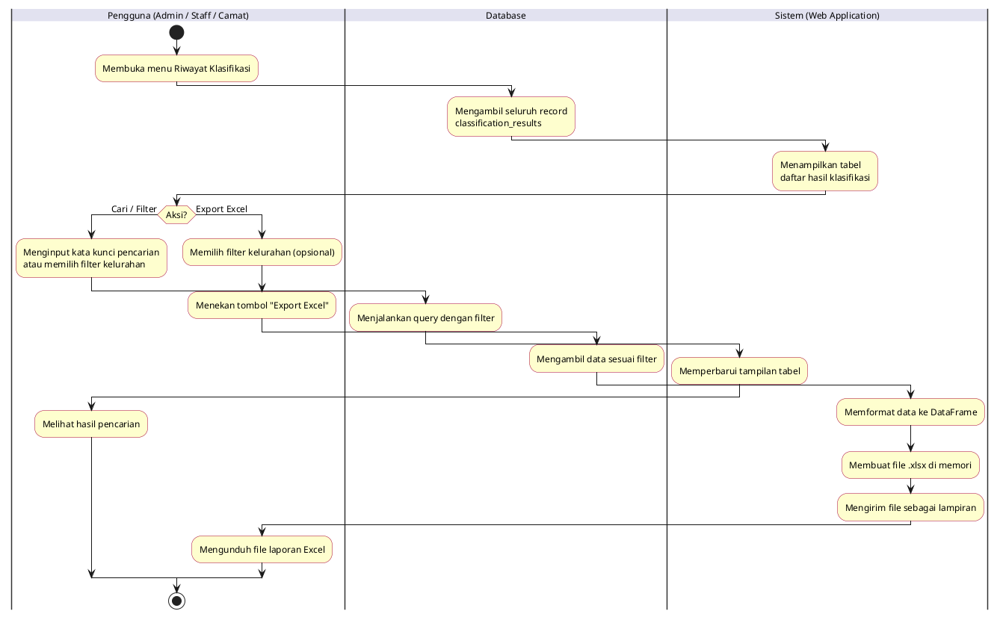
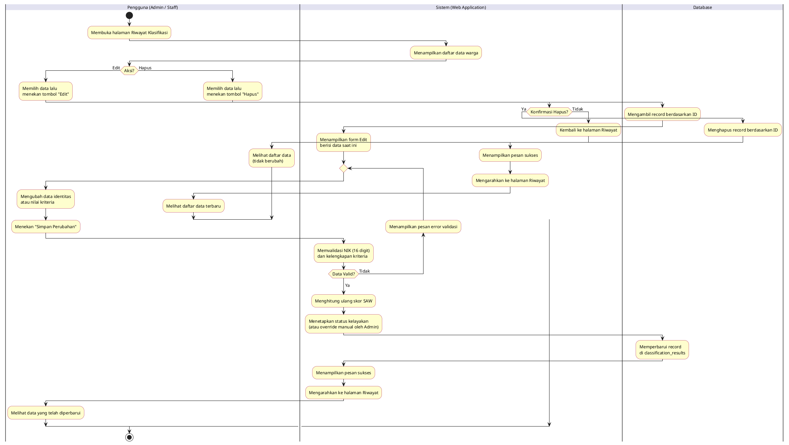
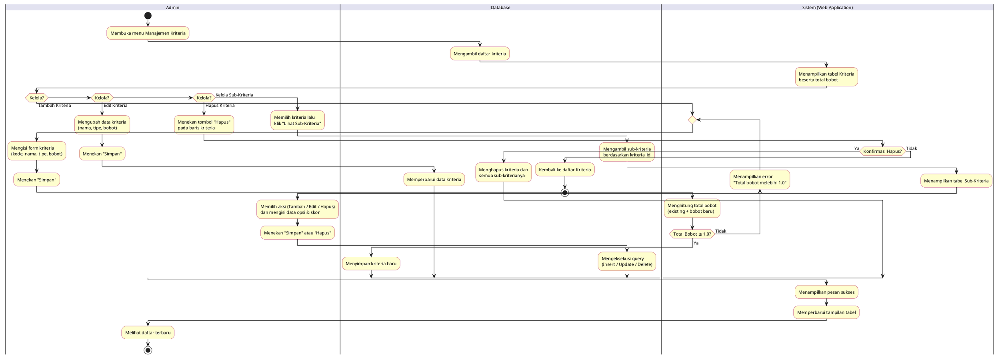
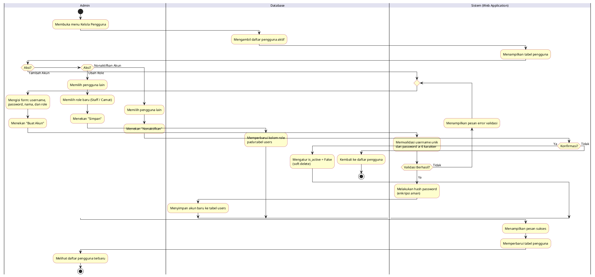
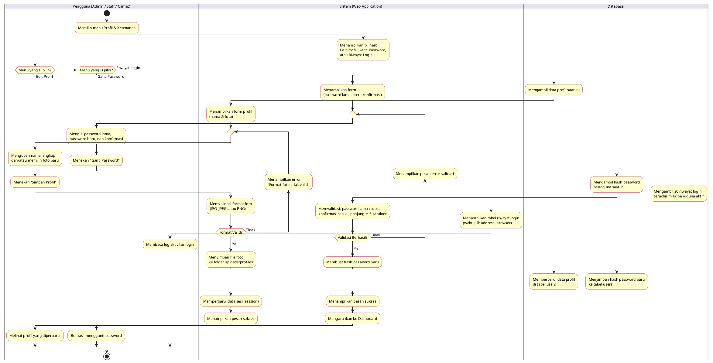

# Kumpulan Activity Diagram — Sistem SPK Klasifikasi Bansos (Metode SAW)
### Kecamatan Pondok Aren, Kota Tangerang Selatan

> **Cara Penggunaan:** Salin kode PlantUML, lalu buka di **[PlantText.com](https://www.planttext.com/)**.
>
> **Catatan teknis:** Seluruh loop validasi (`repeat...repeat while`) diposisikan di lane **Sistem** agar backward arrow tidak menyeberangi swimlane, sehingga garis tetap solid (tidak putus-putus).

---
---

## 1. Activity Diagram: Autentikasi (Login & Logout)
**Aktor:** Admin, Staff, Camat
**Deskripsi:** Proses masuk ke sistem menggunakan username dan password. Jika gagal, pengguna kembali ke form login. Setelah selesai menggunakan sistem, pengguna keluar (logout).

---

## 2. Activity Diagram: Dashboard & Informasi SPK
**Aktor:** Admin, Staff, Camat
**Deskripsi:** Proses mengakses halaman Dashboard (statistik klasifikasi) atau halaman Informasi SPK (penjelasan metode dan kriteria). Keduanya adalah halaman tampilan tanpa proses input.

---

## 3. Activity Diagram: Klasifikasi Data Bansos
**Aktor:** Admin, Staff
**Deskripsi:** Proses menginput data warga dan menghitung kelayakan menggunakan metode SAW. Tersedia dua metode: input manual satu per satu melalui form, atau import massal melalui file Excel/CSV. Jika data tidak valid, pengguna memperbaiki dan mengirim ulang.

---

## 4. Activity Diagram: Riwayat Klasifikasi (Tampil, Cari & Export)
**Aktor:** Admin, Staff, Camat
**Deskripsi:** Proses melihat seluruh hasil klasifikasi yang tersimpan, melakukan pencarian/filter berdasarkan nama, NIK, atau kelurahan, serta mengunduh laporan dalam format Excel.

---

## 5. Activity Diagram: Edit & Hapus Data Riwayat
**Aktor:** Admin, Staff
**Deskripsi:** Proses mengubah data warga yang sudah tersimpan (dengan hitung ulang SAW) atau menghapusnya. Untuk edit, jika validasi gagal pengguna kembali ke form. Untuk hapus, pengguna diminta konfirmasi terlebih dahulu.

---

## 6. Activity Diagram: Manajemen Kriteria & Sub-Kriteria
**Aktor:** Admin
**Deskripsi:** Proses mengelola kriteria penilaian SPK (tambah, edit, hapus) beserta sub-kriteria (opsi jawaban dan skor) masing-masing. Sistem memastikan total bobot semua kriteria selalu tepat 1.0.

---

## 7. Activity Diagram: Manajemen Pengguna
**Aktor:** Admin
**Deskripsi:** Proses mengelola akun pengguna sistem (Staff dan Camat), meliputi: tambah akun baru, ubah role, dan nonaktifkan akun. Admin tidak dapat mengubah atau menonaktifkan akunnya sendiri.

---

## 8. Activity Diagram: Profil & Keamanan
**Aktor:** Admin, Staff, Camat
**Deskripsi:** Proses mengelola akun pribadi pengguna: memperbarui nama dan foto profil, mengganti password, serta melihat log riwayat login. Jika validasi gagal pada form profil atau password, pengguna memperbaiki dan mengirim ulang.

