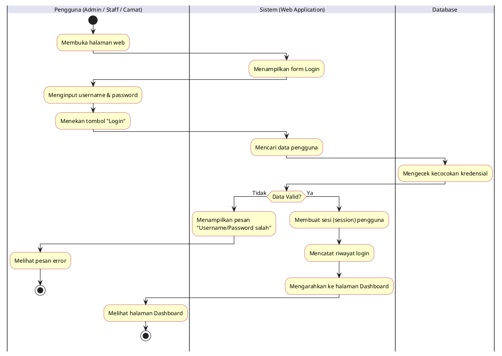
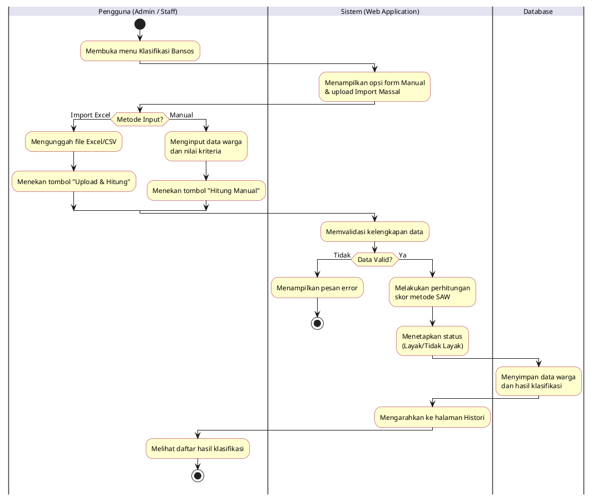
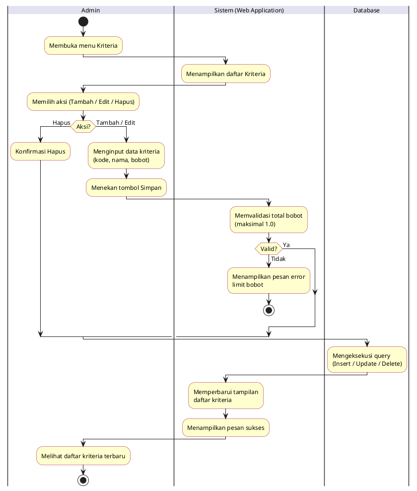
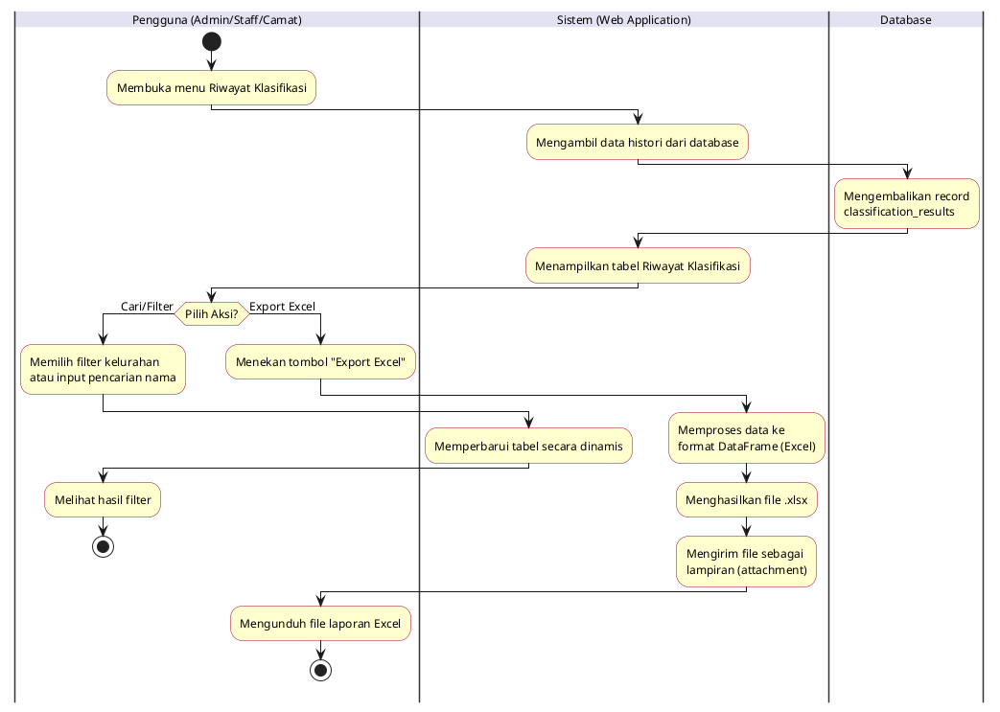
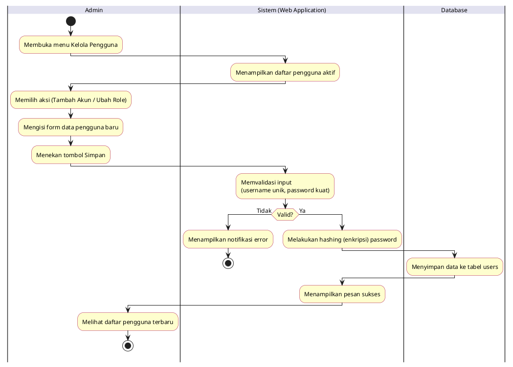
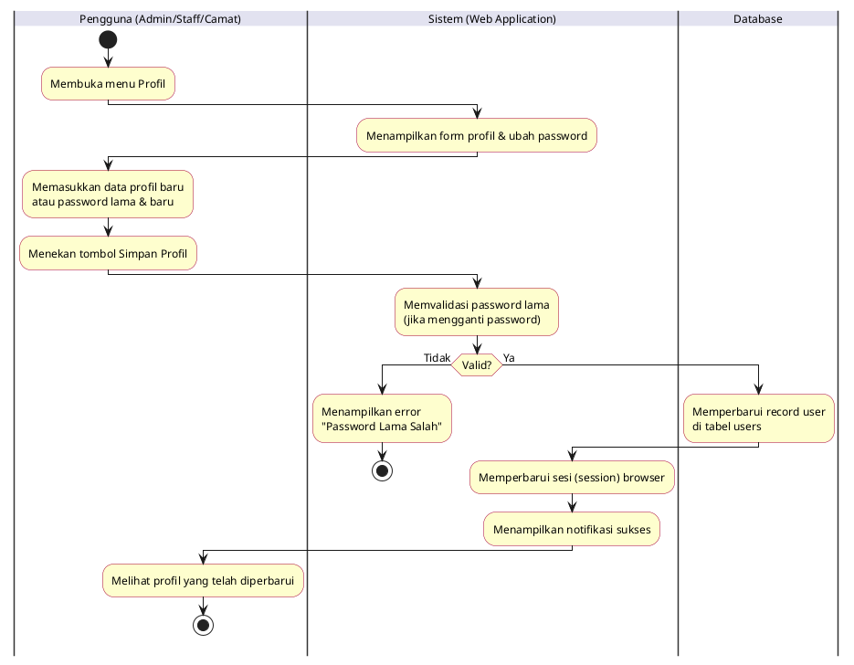

# Kumpulan Activity Diagram - Sistem SPK Klasifikasi Bansos (Metode SAW)

Dokumen ini berisi seluruh *Activity Diagram* dari fitur-fitur di dalam aplikasi. Untuk menghindari redundansi (pembuatan diagram berulang-ulang), *swimlane* Aktor telah digabungkan untuk fitur-fitur yang bisa diakses oleh lebih dari satu aktor secara bersamaan (misalnya: **Admin / Staff / Camat** pada fitur Login).

Anda dapat menyalin kode PlantUML di bawah setiap penjelasan, lalu membukanya di [PlantText.com](https://www.planttext.com/) atau memasukkannya ke **Draw.io** melalui menu `Arrange > Insert > Advanced > PlantUML`.

---

## 1. Activity Diagram: Autentikasi (Login)
**Aktor yang terlibat:** Admin, Staff, Camat
**Deskripsi:** Proses aktor masuk ke dalam sistem dengan memvalidasi username dan password.

---

## 2. Activity Diagram: Klasifikasi Data Bansos (Manual & Import)
**Aktor yang terlibat:** Admin, Staff
**Deskripsi:** Proses menginput data warga (bisa lewat form manual atau import file Excel), menghitung skor SAW, dan menyimpan hasil kelayakan.

---

## 3. Activity Diagram: Manajemen Kriteria & Sub-Kriteria
**Aktor yang terlibat:** Admin
**Deskripsi:** Proses menambah, mengubah, atau menghapus kriteria penilaian beserta bobotnya. Sistem memastikan total bobot selalu 1.0.

---

## 4. Activity Diagram: Riwayat Klasifikasi (Lihat, Filter, & Export Excel)
**Aktor yang terlibat:** Admin, Staff, Camat
**Deskripsi:** Proses melihat daftar seluruh hasil klasifikasi warga, melakukan pencarian/filter kelurahan, dan mengunduh laporan dalam bentuk Excel.

---

## 5. Activity Diagram: Manajemen Pengguna (User Management)
**Aktor yang terlibat:** Admin
**Deskripsi:** Proses mendaftarkan akun baru untuk Staff atau Camat, serta menonaktifkan akun lama.

---

## 6. Activity Diagram: Mengubah Profil & Password
**Aktor yang terlibat:** Admin, Staff, Camat
**Deskripsi:** Proses mengubah detail profil pribadi (nama lengkap, foto profil) dan mengganti kata sandi.

