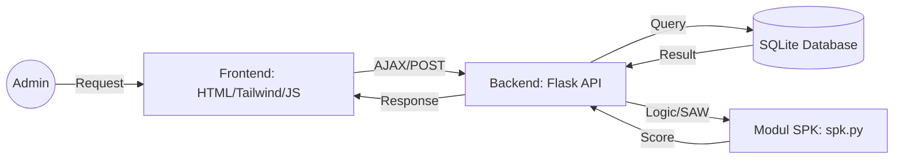
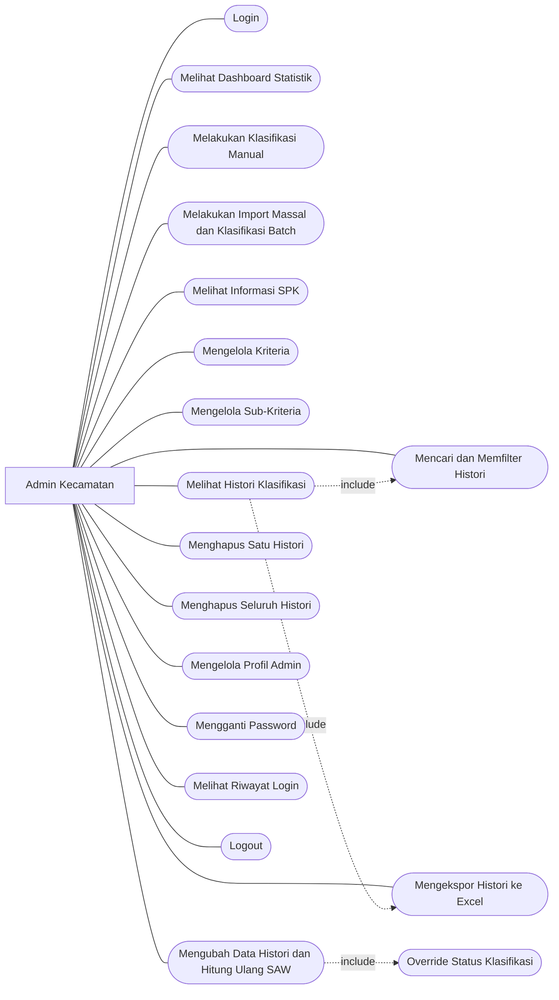
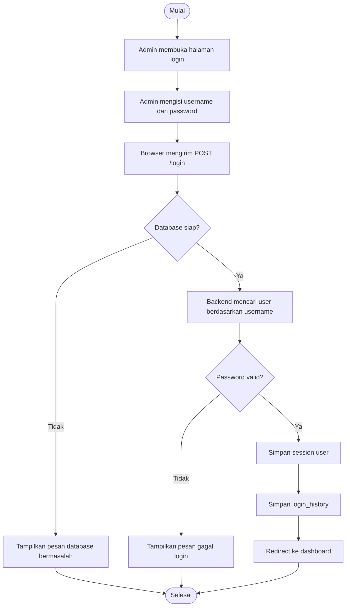
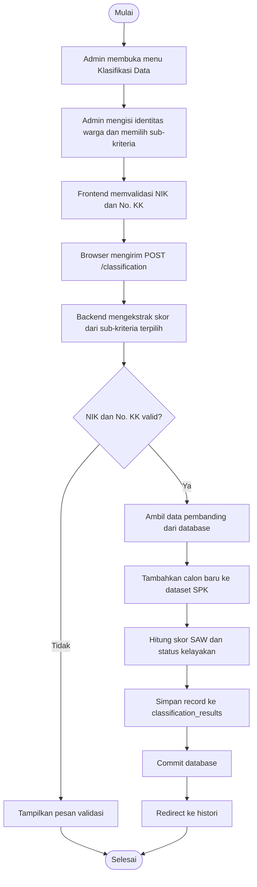
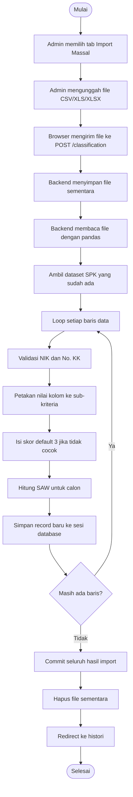
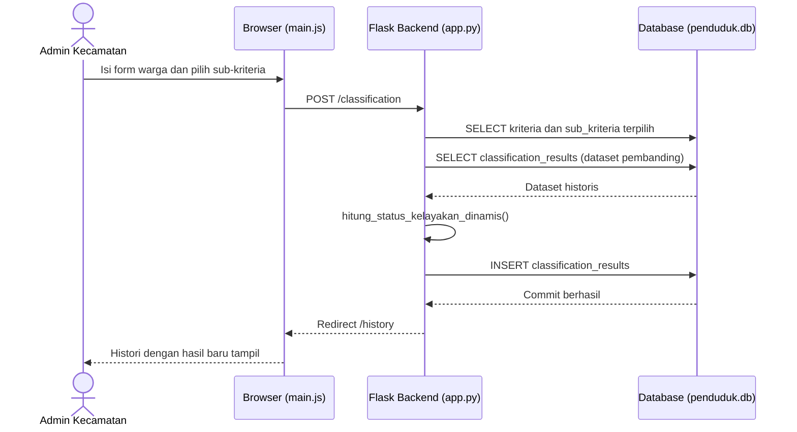
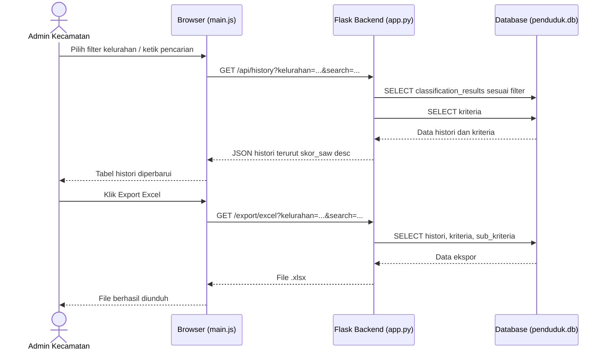
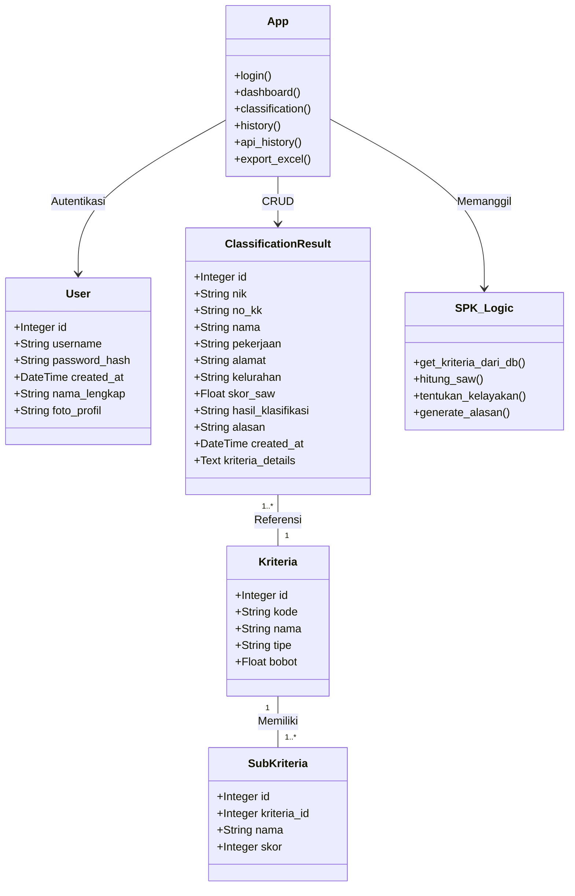
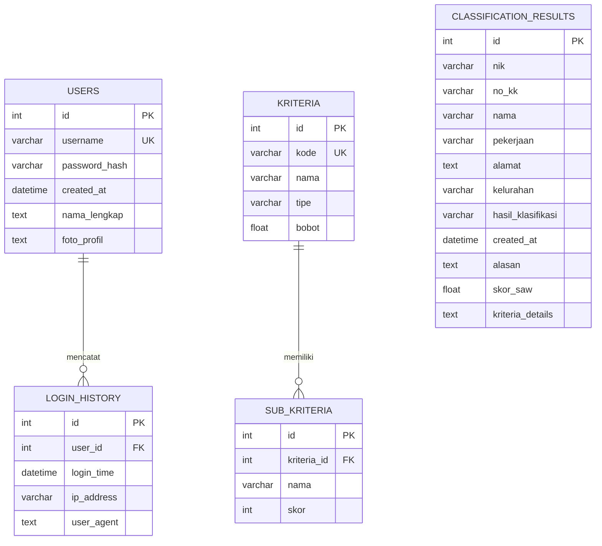

# BAB III
# ANALISIS DAN PERANCANGAN SISTEM

## 3.1 Analisis Sistem Berjalan vs Sistem Usulan
Sebelum merancang sistem, dilakukan analisis perbandingan antara proses yang ada sebelumnya dengan sistem yang diusulkan.

| Aspek | Sistem Berjalan (Manual) | Sistem Usulan (Terkomputerisasi) |
|---|---|---|
| **Objektivitas** | Penilaian subjektif berdasarkan pengamatan petugas. | Penilaian objektif dengan pembobotan SAW yang terukur. |
| **Kecepatan** | Data dihitung satu per satu, memakan waktu lama. | Kalkulasi otomatis (manual maupun massal/batch). |
| **Penyimpanan** | Arsip fisik atau file excel terpisah-pisah. | Database terpusat (SQLite) dengan histori yang rapi. |
| **Pelaporan** | Rekapitulasi dilakukan secara manual. | Fitur ekspor excel instan dengan filter kelurahan. |
| **Pencarian** | Mencari di tumpukan berkas/baris excel secara manual. | Pencarian dinamis berbasis NIK, Nama, dan Kelurahan. |

---

## 3.2 Arsitektur Sistem
Sistem ini menggunakan arsitektur **Monolithic Web Application** dengan alur data sebagai berikut:

---

## 3.3 Use Case Diagram
Use Case Diagram menggambarkan interaksi antara aktor (Admin Kecamatan) dengan fungsi-fungsi utama dalam sistem Pendukung Keputusan Bansos.

---

## 3.4 Activity Diagram

### 3.4.1 Proses Login Admin

### 3.4.2 Proses Klasifikasi Manual

### 3.4.3 Proses Import Massal dan Klasifikasi Batch

---

## 3.5 Sequence Diagram

### 3.5.1 Skenario Klasifikasi Manual

### 3.5.2 Skenario Filter Histori dan Ekspor Excel

---

## 3.6 Class Diagram
Class Diagram memperlihatkan struktur kelas dan modul utama yang berjalan di lingkungan backend Flask dan SQLAlchemy.

---

## 3.7 Perancangan Basis Data

### 3.7.1 Entity Relationship Diagram (ERD)
Sistem menggunakan database SQLite dengan skema relasional antar entitas admin, kriteria, dan hasil klasifikasi.

### 3.7.2 Kamus Data
Kamus data menjelaskan detail teknis dari tabel utama yang digunakan dalam sistem.

#### 1. Tabel `users` (Data Akun Admin)
| Atribut | Tipe Data | Deskripsi |
|---|---|---|
| `id` | Integer | Primary Key, identitas unik admin. |
| `username` | Varchar | Username untuk login (Unique). |
| `password_hash` | Varchar | Password yang telah di-enkripsi. |
| `nama_lengkap` | Text | Nama asli administrator. |

#### 2. Tabel `kriteria` (Master Kriteria)
| Atribut | Tipe Data | Deskripsi |
|---|---|---|
| `id` | Integer | Primary Key. |
| `kode` | Varchar | Kode kriteria (C1, C2, dst). |
| `tipe` | Varchar | Jenis kriteria (Benefit / Cost). |
| `bobot` | Float | Nilai bobot kepentingan (0 - 1). |

#### 3. Tabel `classification_results` (Data Histori)
| Atribut | Tipe Data | Deskripsi |
|---|---|---|
| `nik` | Varchar | Nomor Induk Kependudukan (16 digit). |
| `skor_saw` | Float | Nilai akhir preferensi hasil kalkulasi. |
| `hasil_klasifikasi` | Varchar | Keputusan akhir (Layak / Tidak Layak). |
| `kriteria_details` | Text/JSON | Detail skor tiap kriteria saat diproses. |

---

## 3.8 Implementasi Metode SAW

### 3.8.1 Kriteria dan Bobot
Sistem menggunakan 7 kriteria dengan bobot yang dapat dikonfigurasi secara dinamis:

| Kode | Nama Kriteria | Tipe | Bobot |
|---|---|---|---|
| C1 | Penghasilan | Cost | 0.25 |
| C2 | Jumlah Tanggungan | Benefit | 0.20 |
| C3 | Kepemilikan Aset | Cost | 0.15 |
| C4 | Status Rumah | Cost | 0.10 |
| C5 | Kondisi Bangunan | Cost | 0.10 |
| C6 | Daya Listrik | Cost | 0.10 |
| C7 | Sumber Air | Cost | 0.10 |

### 3.8.2 Rumus Perhitungan
1. **Normalisasi ($r_{ij}$):**
   $$r_{ij} = \frac{x_{ij}}{max(x_{j})}$$
   *(Catatan: Untuk kriteria Cost, skor sub-kriteria telah dibalik pada database sehingga kondisi paling membutuhkan memiliki skor tertinggi).*

2. **Nilai Preferensi ($V_i$):**
   $$V_i = \sum_{j=1}^{n} (w_j \times r_{ij})$$

### 3.8.3 Contoh Perhitungan Manual
Misalkan data alternatif **A1** dengan skor kriteria:
- C1: 5, C2: 4, C3: 4, C4: 3, C5: 4, C6: 4, C7: 3
- Max skor tiap kriteria: 5

**Normalisasi:**
- C1: 5/5 = 1.00
- C2: 4/5 = 0.80
- C3: 4/5 = 0.80
- C4: 3/5 = 0.60
- C5: 4/5 = 0.80
- C6: 4/5 = 0.80
- C7: 3/5 = 0.60

**Skor Akhir ($V_1$):**
$$V_1 = (1.00 \times 0.25) + (0.80 \times 0.20) + (0.80 \times 0.15) + (0.60 \times 0.10) + (0.80 \times 0.10) + (0.80 \times 0.10) + (0.60 \times 0.10)$$
$$V_1 = 0.25 + 0.16 + 0.12 + 0.06 + 0.08 + 0.08 + 0.06 = \mathbf{0.81}$$

**Keputusan:**
Karena $0.81 \geq 0.50$, maka status adalah **Layak**.
